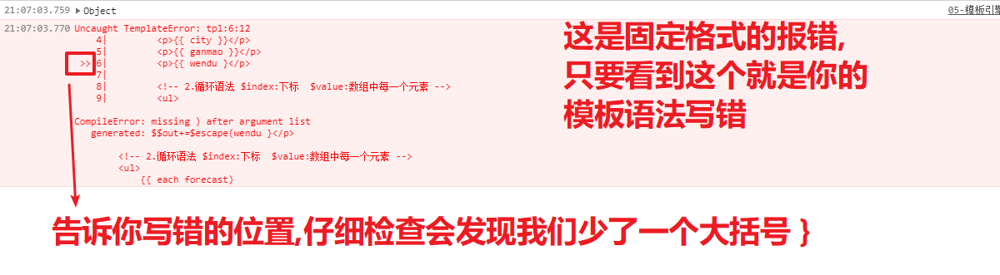
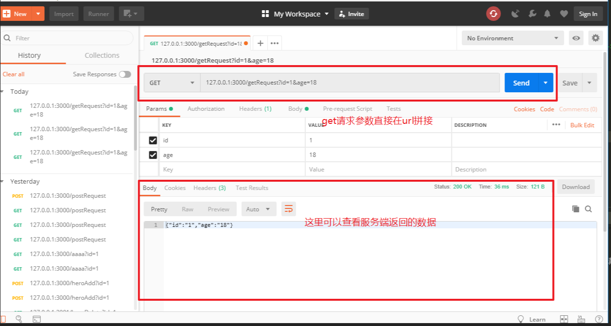
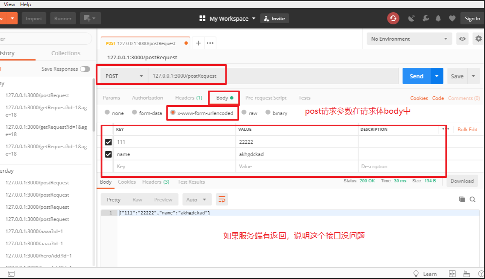

# 今日学习任务


* [ ] 1.XML数据格式解析
  * [ ] a.XML格式接口解析数据
  * [ ] b.案例:天气预报
* [ ] 2.模板引擎art-template
  * [ ] a.模板引擎art-template使用流程
  * [ ] b.模板引擎语法介绍
  * [ ] c.模板引擎易错点总结
  * [ ] d.案例:天气预报
  * [ ] e.案例:笑话plus版本
* [ ] 3.综合案例:英雄查询
* [ ] 4.ajax请求函数封装


# 01-XML数据格式解析


## 1.1-JSON格式数据复习

* 1.JSON作用: 解决数据跨平台问题
  * 由于后台开发语言并不一定使用JavaScript,有可能是PHP或者Python或者Java等,其他语言中的数据类型和JS语言的数据类型不一样,无法直接返回一个js对象. 后来人们为了解决这个问题,就发明了JSON数据,并且几乎所有的编程语言都支持JSON格式,这样就解决了编程语言跨平台的问题
* 2.JSON格式特点
  * 属性名和属性值都是字符串 `{"name":"张三"}`
  * `JSON.parse(JSON)`  ->JSON转JS
  * `JSON.stringify(js对象|数组)`->JS转JSON
* 3.ajax结合JSON
  * 1.实例化小黄人对象
    * `var xhr = new XMLHttpRequest();`
  * 2.设置请求方法和地址
    * `xhr.open('get', '接口文档中的url?value=key');`
  * 3.发送请求
    * `xhr.send()`
  * 4.注册回调函数
    * `JSON.parse( xhr.responseText)`

## 1.2-XML格式数据介绍

* 1.曾经流行的数据格式


* 2.XML格式特点
  * (1)XML数据声明格式固定
    * `<?xml version="1.0" encode="UTF-8"?>`
  * (2)XML的标签可以自定义
    * `<city>城市</city>`
  * (3)必须都是双标签
  * (4)除了顶部的声明之外,所有逇内容必须包裹在一个根标签内部
    * 类似于HTML中所有的网页内容都必须包裹在Body标签中一样
* 3.XML格式弊端
  * (1)数据传输量比较大:冗余
  * (2)解析繁琐
    * jq解析XML格式数据:`$('选择器',xml格式的数据).text()`

```html
<!DOCTYPE html>
<html lang="en">

<head>
    <meta charset="UTF-8">
    <meta name="viewport" content="width=device-width, initial-scale=1.0">
    <meta http-equiv="X-UA-Compatible" content="ie=edge">
    <title>Document</title>
</head>

<body>
    <script src="./libs/jquery-1.12.4.min.js"></script>
    <script>
        /* 接口文档
        请求地址：http://wthrcdn.etouch.cn/WeatherApi
        请求方法：get
        请求参数：city
        示例： http://wthrcdn.etouch.cn/WeatherApi?city=深圳
        */

        /* 
            1.XML格式的数据不能使用 JSON.parse() 解析
            2.jQuery解析XML ： $('选择器',xml格式数据).text()
        */

        //(1).实例化ajax对象
        var xhr = new XMLHttpRequest();
        //(2).设置请求方法和地址
        //get请求的数据直接添加在url的后面 格式是 url?key=value
        xhr.open('get', 'http://wthrcdn.etouch.cn/WeatherApi?city=深圳');
        //(3).发送请求
        xhr.send();
        //(4).注册回调函数
        xhr.onload = function () {
            console.log(xhr.responseText);
            console.log($('city',xhr.responseText).text());//解析城市
            console.log($('shidu',xhr.responseText).text());//解析湿度
        };    
    </script>
</body>

</html>
```


## 1.2-案例:天气预报

* 1.随着JSON格式数据越来越普及,现在XML格式数据的接口已经越来越少
* 2.一般以前是XML格式数据的接口,为了适应市场的发展,现在也基本都提供了对应的JSON格式的接口.例如国家气象台公布的天气预报接口

[效果预览](file:///C:/Users/%E5%BC%A0%E6%99%93%E5%9D%A4/Desktop/%E5%BC%A0%E6%99%93%E5%9D%A4%E5%89%8D%E7%AB%AF%E5%A4%87%E8%AF%BE%E8%B5%84%E6%96%99/AB%E6%A8%A1%E5%BC%8F/06-Ajax/%E8%AF%BE%E7%A8%8B%E8%B5%84%E6%96%99/%E5%A4%87%E8%AF%BE%E4%BB%A3%E7%A0%81/day02/02-%E6%A1%88%E4%BE%8B%EF%BC%9A%E5%A4%A9%E6%B0%94%E9%A2%84%E6%8A%A5.html)


* XML格式天气预报接口文档
  * 请求地址：http://wthrcdn.etouch.cn/WeatherApi
  * 请求方法：get
  * 请求参数：city
  * 示例： http://wthrcdn.etouch.cn/WeatherApi?city=深圳

* JSON格式天气预报接口文档
  * 请求地址：http://wthrcdn.etouch.cn/weather_mini
  * 请求方法：get
  * 请求参数：city
  * 示例： http://wthrcdn.etouch.cn/weather_mini?city=深圳

```html
<!DOCTYPE html>
<html lang="en">

<head>
    <meta charset="UTF-8" />
    <meta name="viewport" content="width=device-width, initial-scale=1.0" />
    <meta http-equiv="X-UA-Compatible" content="ie=edge" />
    <title>Document</title>
</head>

<body>
    <h2>天气查查查--</h2>
    <input type="text" placeholder="请输入查询的城市" class="search" />
    <p class="suggest"></p>
    <ul class="weather"></ul>
</body>

</html>
<script src="./libs/jquery-1.12.4.min.js"></script>
<script>
    /*
      请求地址：http://wthrcdn.etouch.cn/weather_mini
      请求方法：get
      请求参数：city
      示例： http://wthrcdn.etouch.cn/weather_mini?city=深圳
  
      步骤：
      1. 文本框按下事件： enter键 keyCode=13
      2. 获取文本框的内容
      3. ajax获取数据
      4. 数据返回之后渲染到页面  
    */

    $(function () {
        //1.注册键盘按下事件
        $('.search').on('keyup', function (e) {
            if (e.keyCode == 13) {
                //2.获取输入框文本
                var city = $('.search').val();

                //3.ajax获取数据
                //(1).实例化ajax对象
                var xhr = new XMLHttpRequest();
                //(2).设置请求方法和地址
                //get请求的数据直接添加在url的后面 格式是 url?key=value
                xhr.open('get', 'http://wthrcdn.etouch.cn/weather_mini?city=' + city);
                //(3).发送请求
                xhr.send();
                //(4).注册回调函数
                xhr.onload = function () {
                    console.log(xhr.responseText);
                    //4. 返回数据之后渲染到页面
                    //4.1 将json数据转为js对象
                    var obj = JSON.parse(xhr.responseText);
                    console.log(obj);
                    //4.2 渲染提示信息
                    $('.suggest').text(obj.data.ganmao);
                    //4.2 渲染本周天气列表
                    for (var i = 0; i < obj.data.forecast.length; i++) {
                        var weather = obj.data.forecast[i];
                        console.log(weather);

                        $('<li>' +
                            '<span>' + weather.date + '</span>---' +
                            '<span>' + weather.high + '</span>---' +
                            '<span>' + weather.low + '</span>---' +
                            '<span>' + weather.type + '</span>' +
                            '</li>').appendTo($('.weather'));
                    };


                };
            };
        });
    });
</script>
```


# ==02-模板引擎art-template==


## 1.1-模板引擎art-template使用流程

* 学习传送门:<https://aui.github.io/art-template/zh-cn/index.html>

* 1.导入模板引擎`art-template.js`文件
  * `<script src="./libs/template-web.js"></script>`
* 2.写HTML模板
  * `<script id='tpl' type="text/html"></script>`
    * 模板写到script标签中
    * 必须要设置id
    * 必须要设置type(一般为 type="text/html")
* 3.调用art-template的官方API开始解析模板
  * `var htmlStr =  template('tpl', jsonObjc.data);`
    * 第一个参数:你的模板id名
    * 第二个参数:你想要解析的js对象
    * 返回值:解析数据之后的HTML字符串
* 4.将解析好的模板显示到页面
  * `document.body.innerHTML = htmlStr;`

```html
<!DOCTYPE html>
<html lang="en">
<head>
    <meta charset="UTF-8">
    <meta name="viewport" content="width=device-width, initial-scale=1.0">
    <meta http-equiv="X-UA-Compatible" content="ie=edge">
    <title>Document</title>
    <!-- 1.导入art-template.js文件 -->
    <script src="./libs/template-web.js"></script>
</head>
<body>
    <!-- 2.写html模板
    a. id必须设置（后面需要用到）
    b.type属性必须设置（一般为text/html,标签会高亮）
    -->
    <script id='tpl' type="text/html">
        <p>{{ city }}</p>
        <p>{{ ganmao }}</p>
        <p>{{ wendu }}</p>
    </script>
    <script>
        //需求：使用模板引擎解析渲染数据
        var jsonStr = '{"data":{"yesterday":{"date":"2日星期二","high":"高温 32℃","fx":"东南风","low":"低温 26℃","fl":"<![CDATA[3-4级]]>","type":"小雨"},"city":"深圳","forecast":[{"date":"3日星期三","high":"高温 32℃","fengli":"<![CDATA[3-4级]]>","low":"低温 26℃","fengxiang":"东南风","type":"小雨"},{"date":"4日星期四","high":"高温 29℃","fengli":"<![CDATA[3-4级]]>","low":"低温 24℃","fengxiang":"东南风","type":"暴雨"},{"date":"5日星期五","high":"高温 29℃","fengli":"<![CDATA[3-4级]]>","low":"低温 26℃","fengxiang":"南风","type":"大雨"},{"date":"6日星期六","high":"高温 30℃","fengli":"<![CDATA[<3级]]>","low":"低温 27℃","fengxiang":"无持续风向","type":"雷阵雨"},{"date":"7日星期天","high":"高温 31℃","fengli":"<![CDATA[<3级]]>","low":"低温 27℃","fengxiang":"无持续风向","type":"多云"}],"ganmao":"天气转凉，空气湿度较大，较易发生感冒，体质较弱的朋友请注意适当防护。","wendu":"25"},"status":1000,"desc":"OK"}';
        var jsonObjc = JSON.parse(jsonStr);
        console.log(jsonObjc);
        /* 3.调用art-template的官方API
        第一个参数： html模板的id名
        第二个参数： 要渲染的数据
        返回值： 渲染数据之后的html字符串
        */
        var htmlStr =  template('tpl', jsonObjc.data);
        console.log(htmlStr);
        //4. 显示到页面
        document.body.innerHTML = htmlStr;
        
    </script>
</body>
</html>

```


## 1.2-模板引擎语法介绍


```html
<!DOCTYPE html>
<html lang="en">

<head>
    <meta charset="UTF-8">
    <meta name="viewport" content="width=device-width, initial-scale=1.0">
    <meta http-equiv="X-UA-Compatible" content="ie=edge">
    <title>Document</title>
    <!-- 1.导入art-template.js文件 -->
    <script src="./libs/template-web.js"></script>
</head>

<body>
    <!-- 2.写html模板
    a. id必须设置（后面需要用到）
    b.type属性必须设置（一般为text/html,标签会高亮）
    -->
    <script id='tpl' type="text/html">
        <!-- 语法不用刻意的死记硬背，忘记了随时查阅官方文档 -->
        <!-- 1.标准语法：对象的取值操作 -->
        <p>{{ city }}</p>
        <p>{{ ganmao }}</p>
        <p>{{ wendu }}</p>
        
        <!-- 2.循环语法 $index:下标  $value:数组中每一个元素 -->
        <ul>
            {{ each forecast }}
                <li>
                    <span>{{ $index }}</span>--
                    <span>{{ $value.date }}</span>--
                    <span>{{ $value.high }}</span>--
                    <span>{{ $value.low }}</span>--
                    <span>{{ $value.type }}</span>
                </li>
            {{ /each}}
        </ul>
        <!-- 3.分支语法:满足条件就渲染 -->
        {{ if wendu >= 25 }}
        <p>今天好热啊,才{{ wendu }}度</p>
        {{ else }}
        <p>今天好凉快啊,才{{ wendu }}度</p>
        {{ /if }}
       

    </script>
    <script>
        //需求：使用模板引擎解析渲染数据
        var jsonStr = '{"data":{"yesterday":{"date":"2日星期二","high":"高温 32℃","fx":"东南风","low":"低温 26℃","fl":"<![CDATA[3-4级]]>","type":"小雨"},"city":"深圳","forecast":[{"date":"3日星期三","high":"高温 32℃","fengli":"<![CDATA[3-4级]]>","low":"低温 26℃","fengxiang":"东南风","type":"小雨"},{"date":"4日星期四","high":"高温 29℃","fengli":"<![CDATA[3-4级]]>","low":"低温 24℃","fengxiang":"东南风","type":"暴雨"},{"date":"5日星期五","high":"高温 29℃","fengli":"<![CDATA[3-4级]]>","low":"低温 26℃","fengxiang":"南风","type":"大雨"},{"date":"6日星期六","high":"高温 30℃","fengli":"<![CDATA[<3级]]>","low":"低温 27℃","fengxiang":"无持续风向","type":"雷阵雨"},{"date":"7日星期天","high":"高温 31℃","fengli":"<![CDATA[<3级]]>","low":"低温 27℃","fengxiang":"无持续风向","type":"多云"}],"ganmao":"天气转凉，空气湿度较大，较易发生感冒，体质较弱的朋友请注意适当防护。","wendu":"25"},"status":1000,"desc":"OK"}';
        var jsonObjc = JSON.parse(jsonStr);
        console.log(jsonObjc);
        /* 3.调用art-template的官方API
        第一个参数： html模板的id名
        第二个参数： 要渲染的数据
        返回值： 渲染数据之后的html字符串
        */
        var htmlStr = template('tpl', jsonObjc.data);
        console.log(htmlStr);
        //4. 显示到页面
        document.body.innerHTML = htmlStr;

    </script>
</body>

</html>
```


## 1.3-模板引擎易错点总结

```html
!--模板引擎易错点总结
        1.导入js文件
            * a.文件路径写错
        2.写模板
            * a. script标签的id没有设置
            * b. script标签的type属性写错
                * 一般设置为 text/html
                * 不能不写，也不能是 text/javascript，否则浏览器会以为这是js代码来解析
            * c. 模板语法写错
                * 只要模板语法写错，浏览器就会报错（这是一个固定格式的报错提示,会告诉你出错的位置）
            * d. 模板中对象属性名写错，浏览器不会报错但是数据无法渲染
        3.调用api解析渲染模板
            * 参数传错（第一个是模板script标签的id，第二个是要解析的数据js对象）
        4.将解析好的模板显示到页面 

     -->
```



```html
<!DOCTYPE html>
<html lang="en">

<head>
    <meta charset="UTF-8">
    <meta name="viewport" content="width=device-width, initial-scale=1.0">
    <meta http-equiv="X-UA-Compatible" content="ie=edge">
    <title>Document</title>
    <!--模板引擎易错点总结
        1.导入js文件
            * a.文件路径写错
        2.写模板
            * a. script标签的id没有设置
            * b. script标签的type属性写错
                * 一般设置为 text/html
                * 不能不写，也不能是 text/javascript，否则浏览器会以为这是js代码来解析
            * c. 模板语法写错
                * 只要模板语法写错，浏览器就会报错（这是一个固定格式的报错提示,会告诉你出错的位置）
            * d. 模板中对象属性名写错，浏览器不会报错但是数据无法渲染
        3.调用api解析渲染模板
            * 参数传错（第一个是模板script标签的id，第二个是要解析的数据js对象）
        4.将解析好的模板显示到页面 

     -->


    <!-- 1.导入art-template.js文件 -->
    <script src="./libs/template-web.js"></script>
</head>

<body>
    <!-- 2.写html模板
    a. id必须设置（后面需要用到）
    b.type属性必须设置（一般为text/html,标签会高亮）
        * 不能为空，也不能是 text/javascript，否则浏览器会以为这是js代码来解析
    -->
    <script id='tpl' type="text/html">
        <!-- 语法不用刻意的死记硬背，忘记了随时查阅官方文档 -->
        <!-- 1.标准语法：对象的取值操作 -->
        <p>{{ city }}</p>
        <p>{{ ganmao }}</p>
        <p>{{ wendu }}</p>
        
        <!-- 2.循环语法 $index:下标  $value:数组中每一个元素 -->
        <ul>
            {{ each forecast }}
                <li>
                    <span>{{ $index }}</span>--
                    <span>{{ $value.date }}</span>--
                    <span>{{ $value.high }}</span>--
                    <span>{{ $value.low }}</span>--
                    <span>{{ $value.type }}</span>
                </li>
            {{ /each}}
        </ul>
        <!-- 3.分支语法:满足条件就渲染 -->
        {{ if wendu >= 25 }}
        <p>今天好热啊,才{{ wendu }}度</p>
        {{ else }}
        <p>今天好凉快啊,才{{ wendu }}度</p>
        {{ /if }}
       

    </script>
    <script>
        //需求：使用模板引擎解析渲染数据
        var jsonStr = '{"data":{"yesterday":{"date":"2日星期二","high":"高温 32℃","fx":"东南风","low":"低温 26℃","fl":"<![CDATA[3-4级]]>","type":"小雨"},"city":"深圳","forecast":[{"date":"3日星期三","high":"高温 32℃","fengli":"<![CDATA[3-4级]]>","low":"低温 26℃","fengxiang":"东南风","type":"小雨"},{"date":"4日星期四","high":"高温 29℃","fengli":"<![CDATA[3-4级]]>","low":"低温 24℃","fengxiang":"东南风","type":"暴雨"},{"date":"5日星期五","high":"高温 29℃","fengli":"<![CDATA[3-4级]]>","low":"低温 26℃","fengxiang":"南风","type":"大雨"},{"date":"6日星期六","high":"高温 30℃","fengli":"<![CDATA[<3级]]>","low":"低温 27℃","fengxiang":"无持续风向","type":"雷阵雨"},{"date":"7日星期天","high":"高温 31℃","fengli":"<![CDATA[<3级]]>","low":"低温 27℃","fengxiang":"无持续风向","type":"多云"}],"ganmao":"天气转凉，空气湿度较大，较易发生感冒，体质较弱的朋友请注意适当防护。","wendu":"25"},"status":1000,"desc":"OK"}';
        var jsonObjc = JSON.parse(jsonStr);
        console.log(jsonObjc);
        /* 3.调用art-template的官方API
        第一个参数： html模板的id名
        第二个参数： 要渲染的数据
        返回值： 渲染数据之后的html字符串
        */
        var htmlStr = template('tpl', jsonObjc.data);
        console.log(htmlStr);
        //4. 显示到页面
        document.body.innerHTML = htmlStr;

    </script>
</body>

</html>
```


## 1.4-案例:天气预报(模板引擎实现)

[效果预览](file:///C:/Users/%E5%BC%A0%E6%99%93%E5%9D%A4/Desktop/%E5%BC%A0%E6%99%93%E5%9D%A4%E5%89%8D%E7%AB%AF%E5%A4%87%E8%AF%BE%E8%B5%84%E6%96%99/AB%E6%A8%A1%E5%BC%8F/06-Ajax/%E8%AF%BE%E7%A8%8B%E8%B5%84%E6%96%99/%E5%A4%87%E8%AF%BE%E4%BB%A3%E7%A0%81/day02/06-%E6%A1%88%E4%BE%8B%EF%BC%9A%E5%A4%A9%E6%B0%94%E9%A2%84%E6%8A%A5.html)


```javascript
/*
        请求地址：http://wthrcdn.etouch.cn/weather_mini
        请求方法：get
        请求参数：city
        示例： http://wthrcdn.etouch.cn/weather_mini?city=深圳

        思路分析 
        1.页面交互 ： 输入框键盘按下enter键
        2.获取数据 ： 输入框文本
        3.ajax发送请求:http://wthrcdn.etouch.cn/weather_mini?city=深圳
        4.数据返回之后，渲染到页面，模板引擎
            a.导包
            b.写模板
            c.调用api解析渲染数据
            d.将解析后的html字符串显示到页面
        */
```


```html
<!DOCTYPE html>
<html lang="en">

<head>
    <meta charset="UTF-8">
    <meta name="viewport" content="width=device-width, initial-scale=1.0">
    <meta http-equiv="X-UA-Compatible" content="ie=edge">
    <title>Document</title>
    <!-- 导包 -->
    <script src="./libs/jquery-1.12.4.min.js"></script>
    <script src="./libs/template-web.js"></script>
</head>

<body>
    <h2>天气预报</h2>
    <input type="text" placeholder="请输入查询的城市" class="search">
    <p class="suggest"></p>
    <ul class="weather">
        <!-- 写模板 -->
        <script id="tianqi" type="text/html">
            {{ each data.forecast }}
                <li>
                    <span>{{ $value.date }}</span>--
                    <span>{{ $value.high }}</span>--
                    <span>{{ $value.low }}</span>--
                    <span>{{ $value.type }}</span>
                </li>
            {{ /each}}
        </script>
    </ul>

    <script>
        /*
        请求地址：http://wthrcdn.etouch.cn/weather_mini
        请求方法：get
        请求参数：city
        示例： http://wthrcdn.etouch.cn/weather_mini?city=深圳

        思路分析 
        1.页面交互 ： 输入框键盘按下enter键
        2.获取数据 ： 输入框文本
        3.ajax发送请求:http://wthrcdn.etouch.cn/weather_mini?city=深圳
        4.数据返回之后，渲染到页面，模板引擎
            a.导包
            b.写模板
            c.调用api解析渲染数据
            d.将解析后的html字符串显示到页面
        */

        $(function () {
            //1.输入框键盘按下enter键
            $('.search').on('keydown', function (e) {
                if (e.keyCode == 13) {
                    //2.获取文本
                    var city = $(this).val();
                    //3.ajax发送请求
                    //(1).实例化ajax对象
                    var xhr = new XMLHttpRequest();
                    //(2).设置请求方法和地址
                    //get请求的数据直接添加在url的后面 格式是 url?key=value
                    xhr.open('get', 'http://wthrcdn.etouch.cn/weather_mini?city=' + city);
                    //(3).发送请求
                    xhr.send();
                    //(4).注册回调函数
                    xhr.onload = function () {
                        console.log(xhr.responseText);
                        //4.渲染数据
                        var obj = JSON.parse(xhr.responseText);
                        //提示信息
                        $('.suggest').text(obj.data.ganmao);
                        //天气列表
                        var htmlStr = template('tianqi', obj);
                        console.log(htmlStr);
                        $('.weather').html(htmlStr);
                    };
                };
            });
        });
    </script>
</body>

</html>
```


## 1.5-案例:笑话plus(模板引擎实现)

[效果预览](file:///C:/Users/%E5%BC%A0%E6%99%93%E5%9D%A4/Desktop/%E5%BC%A0%E6%99%93%E5%9D%A4%E5%89%8D%E7%AB%AF%E5%A4%87%E8%AF%BE%E8%B5%84%E6%96%99/AB%E6%A8%A1%E5%BC%8F/06-Ajax/%E8%AF%BE%E7%A8%8B%E8%B5%84%E6%96%99/%E5%A4%87%E8%AF%BE%E4%BB%A3%E7%A0%81/day02/07-%E6%A1%88%E4%BE%8B%EF%BC%9A%E7%AC%91%E8%AF%9Dplus.html)


```javascript
		  - 请求地址：https://autumnfish.cn/api/joke/list
          - 请求方法：get
          - 请求参数：num
      
          思路分析
      
          1. 页面交互：文本框键盘按下enter键
          2. 获取输入框文本
          3. ajax请求
          4. 数据回来之后渲染到页面上
              a.导包
              b.写模板
              c.调用api解析渲染数据
              d.将解析后的html字符串显示到页面
```


```html
<!DOCTYPE html>
<html lang="en">

<head>
    <meta charset="UTF-8" />
    <meta name="viewport" content="width=device-width, initial-scale=1.0" />
    <meta http-equiv="X-UA-Compatible" content="ie=edge" />
    <title>Document</title>
    <style>
        body {
            text-align: center;
        }

        input {
            border: 4px solid gray;
            padding: 10px;
            font-size: 25px;
            background-color: skyblue;
            color: white;
            border-radius: 10px;
            cursor: pointer;
            outline: none;
        }

        .items {
            width: 1000px;
            border: 1px solid gray;
            border-radius: 10px;
            display: flex;
            flex-wrap: wrap;
            margin: 0 auto;
            padding: 10px;
        }

        .title {
            background-color: hotpink;
            text-align: center;
            color: white;
            padding-bottom: 5px;
        }

        .item {
            width: 300px;
            height: 200px;
            border: 1px solid skyblue;
            border-radius: 5px;
            text-align: left;
            margin: 10px;
            overflow: auto;
        }
    </style>
</head>

<body>
    <input type="text" placeholder="要看几条笑话呀" class="getJoke" />
    <div class="items">
        <div class="item">
            <div class="title">^_^</div>
            哥们问我：娶老婆最重要看什么？
            我：看她爸藏了多少私房钱！
            哥们：多又如何，少又如何？
            我：很少或者没有，意味着她妈找私房钱有绝技，肯定会传给女儿。所以不能娶！
            哥们：有道理！
        </div>

        <script id="jokeList" type="text/html">
            {{ each jokes }}
                <div class="item">
                    <div class="title">^_^</div>
                    {{ $value }}
                </div>
            {{ /each }}
        </script>
    </div>

    <script src="./libs/jquery-1.12.4.min.js"></script>
    <script src="./libs/template-web.js"></script>
    <script>
        /*
          - 请求地址：https://autumnfish.cn/api/joke/list
          - 请求方法：get
          - 请求参数：num
      
          思路分析
      
          1. 页面交互：文本框键盘按下enter键
          2. 获取输入框文本
          3. ajax请求
          4. 数据回来之后渲染到页面上
              a.导包
              b.写模板
              c.调用api解析渲染数据
              d.将解析后的html字符串显示到页面
        */
        $(function () {
            //1.页面交互：键盘按下enter
            $('.getJoke').keydown(function (e) {
                if (e.keyCode == 13) {
                    //2.获取输入框文本
                    var num = $(this).val();
                    //3.ajax发送请求
                    //(1).实例化ajax对象
                    var xhr = new XMLHttpRequest();
                    //(2).设置请求方法和地址
                    //get请求的数据直接添加在url的后面 格式是 url?key=value
                    xhr.open('get', 'https://autumnfish.cn/api/joke/list?num=' + num);
                    //(3).发送请求
                    xhr.send();
                    //(4).注册回调函数
                    xhr.onload = function () {
                        console.log(xhr.responseText);
                        //4.渲染数据
                        //json字符串转成js对象
                        var obj = JSON.parse(xhr.responseText);
                        console.log(obj);
                        var htmlStr = template('jokeList',obj);
                        $('.items').html(htmlStr);
                    };
                };
            });
        });
    </script>
</body>

</html>
```


# 03-综合案例:英雄查询

[效果预览](file:///C:/Users/%E5%BC%A0%E6%99%93%E5%9D%A4/Desktop/%E5%BC%A0%E6%99%93%E5%9D%A4%E5%89%8D%E7%AB%AF%E5%A4%87%E8%AF%BE%E8%B5%84%E6%96%99/AB%E6%A8%A1%E5%BC%8F/06-Ajax/%E8%AF%BE%E7%A8%8B%E8%B5%84%E6%96%99/%E5%A4%87%E8%AF%BE%E4%BB%A3%E7%A0%81/day02/08-%E6%A1%88%E4%BE%8B%EF%BC%9A%E8%8B%B1%E9%9B%84%E6%9F%A5%E8%AF%A2/index.html)


* 接口文档
  * 请求地址：https://autumnfish.cn/api/cq
  * 请求方法：get
  * 请求参数：query
* 思路分析
  * 1.页面交互： 点击搜索按钮
  * 2.获取输入框文本
  * 3.ajax发送请求
  * 4.数据返回之后渲染到页面--模板引擎 

```html
<!DOCTYPE html>
<html lang="zh-cn">

<head>
  <meta charset="utf-8" />
  <meta http-equiv="X-UA-Compatible" content="IE=edge" />
  <meta name="viewport" content="width=device-width, initial-scale=1" />
  <title>Bootstrap 101 Template</title>

  <!-- 导包 -->
  <script src="./libs/js/jquery-1.12.4.js"></script>
  <script src="./libs/js/bootstrap.min.js"></script>
  <link rel="stylesheet" href="./libs/css/bootstrap.min.css">
  <script src="./libs/js/template-web.js"></script>

  <style>
    /* 如果想要覆盖bootstrap默认样式，只需要自己添加类名覆盖即可 */
    .col-margin{
      margin: 10px auto;
    }
  </style>
</head>

<body>
  <!-- 1.导航条 -->
  <nav class="navbar navbar-default">
    <div class="container-fluid">
      <!-- Brand and toggle get grouped for better mobile display -->
      <div class="navbar-header">
        <button type="button" class="navbar-toggle collapsed" data-toggle="collapse"
          data-target="#bs-example-navbar-collapse-1" aria-expanded="false">
          <span class="sr-only">Toggle navigation</span>
          <span class="icon-bar"></span>
          <span class="icon-bar"></span>
          <span class="icon-bar"></span>
        </button>
        <a class="navbar-brand" href="#">克鲁赛德战记</a>
      </div>
      <!-- Collect the nav links, forms, and other content for toggling -->
      <div class="collapse navbar-collapse" id="bs-example-navbar-collapse-1">
        <form class="navbar-form navbar-left">
          <div class="form-group">
            <input type="text" class="form-control" placeholder="请输入搜索内容">
          </div>
          <button type="submit" class="btn btn-default search">搜索</button>
        </form>
      </div><!-- /.navbar-collapse -->
    </div><!-- /.container-fluid -->
  </nav>
  <!-- 2.内容容器 -->
  <div class="container heroList">
    <!-- 内容 -->
    <div class="row">
      <div class="col-xs-3">
        <div class="media">
          <div class="media-left">
            <a href="#">
              
            </a>
          </div>
          <div class="media-body">
            <h4 class="media-heading">专职打劫犯</h4>
            黑暗制裁
          </div>
        </div>
        <!-- 写模板 -->
        <script id="heroTpl" type="text/html">
        {{each list}}
          <div class="col-xs-3 col-margin ">
            <div class="media">
              <div class="media-left">
              <a href="#">
                
              </a>
              </div>
              <div class="media-body">
                <h4 class="media-heading">{{$value.name}}</h4>
                {{$value.skill}}
              </div>
            </div>
          </div>
        {{/each}}
        </script>
      </div>
    </div>
  </div>
  <script>
    /*
      - 请求地址：https://autumnfish.cn/api/cq
      - 请求方法：get
      - 请求参数：query
      步骤
  
      1. 页面交互： 点击搜索按钮
      2. 获取输入框文本
      3. ajax发送请求
      4. 数据返回之后渲染到页面--模板引擎 
    */

    $(function () {
      //1.页面交互：搜索框点击事件
      $('.search').click(function(e){
        //阻止表单默认提交submit事件
        e.preventDefault();
        //2.获取搜索框文本
        var text = $('.form-group>input').val();
        //3.ajax发送请求
        //(1).实例化ajax对象
        var xhr = new XMLHttpRequest();
        //(2).设置请求方法和地址
        //get请求的数据直接添加在url的后面 格式是 url?key=value
        xhr.open('get', 'https://autumnfish.cn/api/cq?query=' + text);
        //(3).发送请求
        xhr.send();
        //(4).注册回调函数
        xhr.onload = function() {
          console.log(xhr.responseText);
          //4.渲染到页面
          var obj = JSON.parse(xhr.responseText);
          console.log(obj);
          var htmlStr = template('heroTpl',obj);
          $('.row').html(htmlStr);
        };
      });
    });
  </script>
</body>

</html>
```


# 04-ajax请求函数封装

[效果预览](file:///C:/Users/%E5%BC%A0%E6%99%93%E5%9D%A4/Desktop/%E5%BC%A0%E6%99%93%E5%9D%A4%E5%89%8D%E7%AB%AF%E5%A4%87%E8%AF%BE%E8%B5%84%E6%96%99/AB%E6%A8%A1%E5%BC%8F/06-Ajax/%E8%AF%BE%E7%A8%8B%E8%B5%84%E6%96%99/%E5%A4%87%E8%AF%BE%E4%BB%A3%E7%A0%81/day02/09-ajax%E8%AF%B7%E6%B1%82%E5%87%BD%E6%95%B0%E5%B0%81%E8%A3%85/text.html)

* 1.为什么需要封装ajax?  (什么样的情况需要将一段代码放入函数中)
  * a.需要在很多个地方使用
  * b.一个独立的小功能(代码步骤固定)
* 2.封装思路 (ajax请求有几种方式?)
  * (1)get请求
  * (2)post请求


```html
<!DOCTYPE html>
<html lang="en">

<head>
    <meta charset="UTF-8">
    <meta name="viewport" content="width=device-width, initial-scale=1.0">
    <meta http-equiv="X-UA-Compatible" content="ie=edge">
    <title>Document</title>
</head>

<body>
    <button id="get">get请求测试</button>
    <button id="post">post请求测试</button>
    <button id="ajax">ajax请求测试</button>

    <script>
        /* 
        1.get测试接口：
            - 请求地址：https://autumnfish.cn/api/cq
            - 请求方法：get
            - 请求参数：query
        
        2.post测试接口
            - 请求地址：https://autumnfish.cn/api/user/register
            - 请求方法：post
            - 请求参数：username
        */

        /* 闭包实现沙箱模式 */
        (function (w) {
            /**
             * @description: 1.get请求
             * @param {type} url ：请求地址
             * @param {type} data ：请求参数
             * @param {type} success ：请求回调   function(data){ data:服务器返回的数据 }
             * @return: 
             */
            function get(url, data, success) {
                //(1).实例化ajax对象
                var xhr = new XMLHttpRequest();
                //(2).设置请求方法和地址
                //get请求的数据直接添加在url的后面 格式是 url?key=value
                xhr.open('get', url + '?' + data);
                //(3).发送请求
                xhr.send();
                //(4).注册回调函数
                xhr.onload = function () {
                    //获取到数据之后，执行回调函数,将获取的数据通过参数传递给这个回调函数
                    success(xhr.responseText);
                };
            };

            /**
             * @description: 2.post请求
             * @param {type} url ：请求地址
             * @param {type} data ：请求参数
             * @param {type} success ：请求回调   function(data){ data:服务器返回的数据 }
             * @return: 
             */
            function post(url, data, success) {
                //(1).实例化ajax对象
                var xhr = new XMLHttpRequest();
                //(2).设置请求方法和地址
                xhr.open('post', url);
                //(3).设置请求头（post请求才需要设置）
                xhr.setRequestHeader('Content-type', 'application/x-www-form-urlencoded');
                //(4).发送请求 ： 参数格式  'key=value' 
                xhr.send(data);
                //(5).注册回调函数
                xhr.onload = function () {
                    //获取到数据之后，执行回调函数,将获取的数据通过参数传递给这个回调函数
                    success(xhr.responseText);
                };
            };

            /**
             * @description: 3.ajax请求
             * @param {type} 对象的方式传参
                {
                    url:请求地址
                    method:请求方法
                    data:请求参数
                    success：请求回调  function(data){ data:服务器返回的数据 }
                }
             */
            function ajax(obj) {
                //(1).实例化ajax对象
                var xhr = new XMLHttpRequest();
                if (obj.method == 'get') {
                    //(2).设置请求方法和地址
                    xhr.open(obj.method,obj.url + '?' + obj.data);
                    xhr.send();
                } else {
                    //(2).设置请求方法和地址
                    xhr.open(obj.method,obj.url);
                    //(3).设置请求头（post请求才需要设置）
                    xhr.setRequestHeader('Content-type', 'application/x-www-form-urlencoded');
                    //(4).发送请求 ： 参数格式  'key=value' 
                    xhr.send(obj.data);
                };
                //(5).注册回调函数
                xhr.onload = function () {
                    //获取到数据之后，执行回调函数,将获取的数据通过参数传递给这个回调函数
                    obj.success(xhr.responseText);
                };
            };

            //暴露接口
            w.hm = {
                get: get, //左边属性名，右边属性值
                post: post,
                ajax: ajax
            };
        })(window);

        document.getElementById('get').onclick = function () {
            hm.get('https://autumnfish.cn/api/cq', 'query=剑士', function (data) {
                console.log(data);
            });
        };

        document.getElementById('post').onclick = function () {
            hm.post('https://autumnfish.cn/api/user/register', 'username=666', function (data) {
                console.log(data);
            });
        };

        document.getElementById('ajax').onclick = function () {
            /* hm.ajax({
                url:'https://autumnfish.cn/api/cq',
                method:'get',
                data:'query=',
                success:function(data){
                    console.log(data);
                    
                }
            }); */

            hm.ajax({
                url:'https://autumnfish.cn/api/user/register',
                method:'post',
                data:'username=66666',
                success:function(data){
                    console.log(data);  
                }
            });
        };


    </script>
</body>

</html>
```

# 05-[课后拓展]接口调试工具Postman介绍


* Postman是一款不需要写任何代码就可以模拟客户端发送get请求与post请求的软件，它是以后工作中一款接口调试的必备软件
  * 传送门:https://www.getpostman.com/


* get请求调试




* post请求调试



# 第二天学习总结

1.模板引擎使用四个流程

​	a.导包

​	b,写模板

​	c.调用官方api

​	d.渲染数据