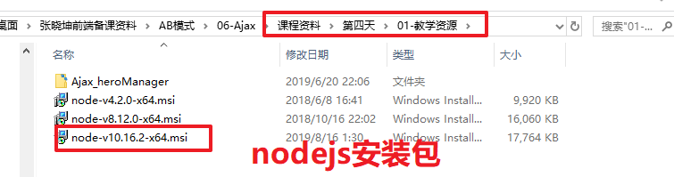
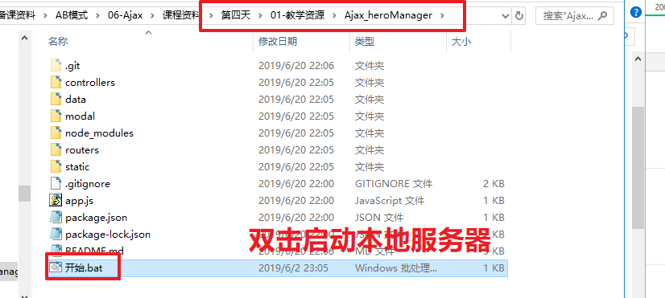
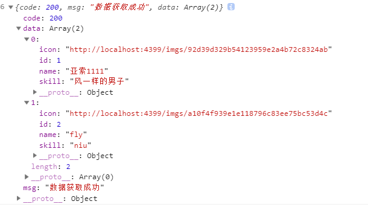
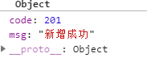
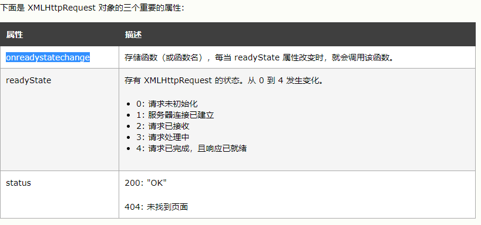
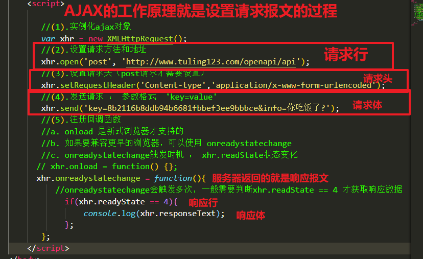
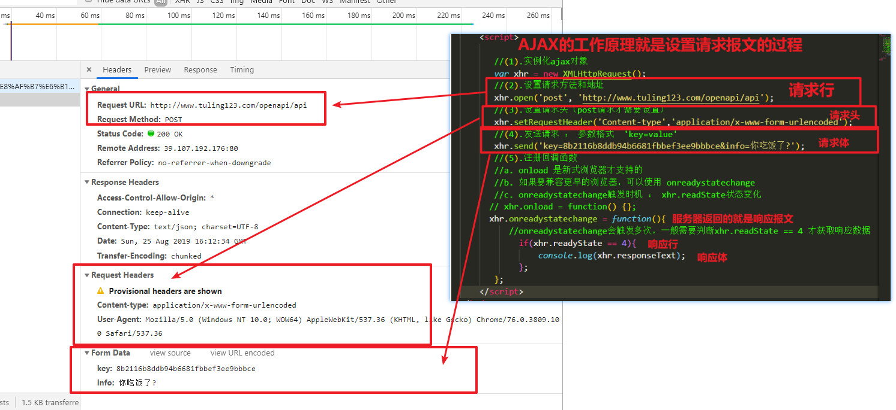
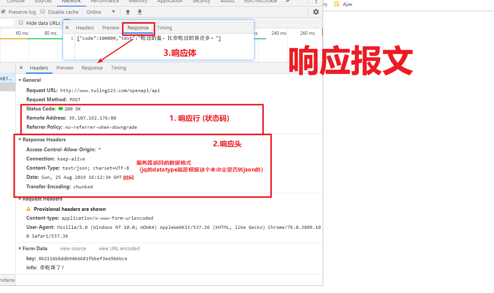

# 今日学习任务


# 01-综合项目-克鲁赛德战记

## 1.1-项目分析


* 布局分析
  * body:背景大图
    * 顶部广告栏：img
    * 中间版本盒子 `cq-wrap`
      * 上面tab栏 `.nav>ul>li>img+span`
      * 下面英雄列表栏 table
    * 遮罩层 `.cover>img`
      * 与body一样大小，半透明效果，中间有个img。默认隐藏，点击英雄头像的时候显示
      * img中是一个gif动图（一般网页加载特效都是gif动图实现）

* 需求分析
  * 1.随机背景图
    * 每隔一段时间，自动刷新背景图
  * 2.顶部tab栏切换
  * 3.点击头像查看酷炫动图效果
  * 4.点击遮罩层隐藏动图


* 完整代码

```html
<!DOCTYPE html>
<html lang="en">

<head>
  <meta charset="UTF-8" />
  <meta name="viewport" content="width=device-width, initial-scale=1.0" />
  <meta http-equiv="X-UA-Compatible" content="ie=edge" />
  <title>Document</title>
  <link rel="stylesheet" href="./css/index.css" />
</head>

<body>
  
  <div class="cq-wrap">
    <!-- 导航 -->
    <div class="nav">
      <ul>
        <li><span>剑士</span></li>
        <li> <span>骑士</span></li>
        <li> <span>弓手</span></li>
        <li> <span>猎人</span></li>
        <li> <span>法师</span></li>
        <li> <span>祭司</span></li>
      </ul>
    </div>
    <!-- table -->
    <table class="cq-list">
      <thead>
        <th>勇士</th>
        <th>技能</th>
        <th>武器</th>
      </thead>
      <tbody>
        <tr>
          <td>
            
            <span>
              涅斯军长官尤莉娅
            </span>
          </td>
          <td>
            
            注射!
          </td>
          <td>
            
            疫苗-G
          </td>
        </tr>
      </tbody>
    </table>
  </div>
  <!-- 遮罩层 -->
  <div class="cover" style="display: none">
    
  </div>


  <script src="./js/jquery-1.12.4.min.js"></script>
  <!-- 模板引擎 -->
  <script src="./js/template-web.js"></script>
  <!-- 模板 -->
  <script id="hero" type="text/html">
  {{each data.heros}}
  <tr>
      <td>
        
        <span>{{$value.heroName}}</span>
      </td>
      <td>
        
        {{$value.skillName}}
      </td>
      <td>
        
        {{$value.weaponName}}
      </td>
    </tr>
    {{/each}}
</script>
  <script>

    //jq入口函数
    $(function () {
      //1.随机背景图
      //不需要事件触发，页面一加载显示背景图
      getRandomImage();
      //开启定时器每隔10s获取一次
      setInterval(function () {
        getRandomImage();
      }, 10000);

      /*2.tab栏切换 
      2.1 排他思想修改样式（类名修改）
      2.2 ajax请求英雄数据（接口参数限制范围）
      2.3 数据响应之后，模板引擎渲染页面
      2.4 页面一加载，主动触发第一个tab栏的点击事件
       */
      $('.nav li').on('click', function () {
        //2.1 排他思想修改样式
        $(this).addClass('active').siblings().removeClass('active');
        //2.2 ajax请求数据
        $.ajax({
          url: 'https://autumnfish.cn/api/cq/category',
          type: 'get',
          dataType: 'json',
          data: {
            type: $(this).find('span').text(),
          },
          success: function (data) {
            console.log(data);
            //2.3 数据返回之后，模板引擎渲染到页面
            var htmlStr = template('hero', data);
            $('.cq-list').children('tbody').html(htmlStr);
          }
        });
      });
      //2.4页面一加载默认点击第一个
      $('.nav li:first').trigger('click');

      /*3.点击头像查看酷炫效果 
      3.1 弹出遮罩层 loading效果动图
      3.2 ajax获取英雄对应的gif动图
      3.3 数据响应之后，使用返回的gif动图替换默认的loading动图
       */
      $(document.body).on('click', '.icon', function () {
        //3.1 弹出遮罩层 loading效果动图
        $('.cover').show();
        //3.2 ajax获取英雄对应的gif动图
        $.ajax({
          url: 'https://autumnfish.cn/api/cq/gif',
          type: 'get',
          dataType: 'json',
          data: {
            name: $(this).next().text()
          },
          success: function (data) {
            console.log(data);
            //3.3 数据响应之后，使用返回的gif动图替换默认的loading动图
            $('.cover>img').attr('src', data.data.skillGif);
          }
        });
      });

      //4.点击关闭遮罩层
      $('.cover').click(function(){
        //动画完成之后需要设置遮罩层的动图为默认gif动图。否则下一次点击会显示之前英雄的动图
        $(this).fadeOut(function(){
          $('.cover>img').attr('src', './img/loading01.gif');
        });
      });

      /**
       * @description: ajax获取随机图片
       * @param {type} 
       * @return: 
       */
      function getRandomImage() {
        $.ajax({
          url: 'http://acg.bakayun.cn/randbg.php?Type=json&t=dfproject',
          type: 'get',
          dataType: 'json',
          success: function (data) {
            console.log(data);
            $(document.body).css('background-image', 'url(' + '"' + data.ImgUrl + '"' + ')');
          }
        });
      }

    });
  </script>
</body>

</html>
```


## 1.2-随机背景图

* 请求地址:<http://acg.bakayun.cn/randbg.php>
* 请求方法：get
* 请求参数：Type,t,https

| 参数名 | 参数说明      | 备注                                                         |
| ------ | ------------- | ------------------------------------------------------------ |
| Type   | 类型          | 301 = 301跳转(301 Moved Permanently) 302 = 302跳转 json = JSON数据 |
| t      | 专辑          | dfproject = 东方16:9壁纸(495张)  dfzh = 东方竖图(6239张)  ecyzh = 二次元综合(1991张) 不填 = 全部图片随机 |
| https  | 是否使用https | true或者为空                                                 |

* 响应内容:根据设置的结果会略有区别
* 比如:<http://acg.bakayun.cn/randbg.php?Type=json&t=dfproject>

```javascript
{
    "ImgUrl": "http://img.badapple.top/东方Project/八坂神奈子/img (11).jpg",
    "Color": "175,133,124"
}
```


* 思路分析
  * 1.将ajax获取随机背景图功能封装到函数中
  * 2.页面一加载默认执行一次函数
  * 3.开启定时器，每隔10s执行一次函数

```javascript
	  
	  //1.随机背景图
      //不需要事件触发，页面一加载显示背景图
      getRandomImage();
      //开启定时器每隔10s获取一次
      setInterval(function () {
        getRandomImage();
      }, 10000);
      /**
       * @description: ajax获取随机图片
       * @param {type} 
       * @return: 
       */
      function getRandomImage() {
        $.ajax({
          url: 'http://acg.bakayun.cn/randbg.php?Type=json&t=dfproject',
          type: 'get',
          dataType: 'json',
          success: function (data) {
            console.log(data);
            $(document.body).css('background-image', 'url(' + '"' + data.ImgUrl + '"' + ')');
          }
        });
      }
```


## 1.3-tab栏切换

> 查询英雄的 详细信息

* 请求地址：<https://autumnfish.cn/api/cq/category>
* 请求方法：get
* 请求参数：type

| 参数名 | 参数说明 | 备注                                                  |
| ------ | -------- | ----------------------------------------------------- |
| type   | 英雄类型 | 不能为空，可选值有:剑士，骑士，弓手，猎人，法师，祭司 |

* 响应内容：JSON

```javascript
{
    "msg": "获取法师英雄数据",
    "code": 200,
    "data": {
        "heros": [
            {
            "heroName": "黑袍魔女桃乐丝",
            "heroIcon": "http://p4.qhimg.com/dr/72__/t015a7af93e23e5c67c.png",
            "skillName": "奥能脉冲",
            "skillIcon": "http://p3.qhimg.com/dr/52__/t01179c3d8588da2733.png",
            "weaponName": "月之女王",
            "weaponIcon": "http://p2.qhimg.com/dr/45__/t01a05a602fe8a972b8.png"
            },
        ]
}
```


* 思路分析
  * 1.点击tab栏，排他思想修改样式
  * 2.获取当前点击的英雄职业，ajax请求数据
  * 3.数据返回之后，使用模板引擎渲染到页面
  * 4.页面一加载，主动触发第一个tab栏的点击事件

```javascript
     /*2.tab栏切换 
      2.1 排他思想修改样式（类名修改）
      2.2 ajax请求英雄数据（接口参数限制范围）
      2.3 数据响应之后，模板引擎渲染页面
      2.4 页面一加载，主动触发第一个tab栏的点击事件
       */
      $('.nav li').on('click', function () {
        //2.1 排他思想修改样式
        $(this).addClass('active').siblings().removeClass('active');
        //2.2 ajax请求数据
        $.ajax({
          url: 'https://autumnfish.cn/api/cq/category',
          type: 'get',
          dataType: 'json',
          data: {
            type: $(this).find('span').text(),
          },
          success: function (data) {
            console.log(data);
            //2.3 数据返回之后，模板引擎渲染到页面
            var htmlStr = template('hero', data);
            $('.cq-list').children('tbody').html(htmlStr);
          }
        });
      });
      //2.4页面一加载默认点击第一个
      $('.nav li:first').trigger('click');
```


* 模板

```html
<!-- 模板 -->
  <script id="hero" type="text/html">
  {{each data.heros}}
  <tr>
      <td>
        
        <span>{{$value.heroName}}</span>
      </td>
      <td>
        
        {{$value.skillName}}
      </td>
      <td>
        
        {{$value.weaponName}}
      </td>
    </tr>
    {{/each}}
</script>
```


## 1.4-点击头像查看动图

> 查询英雄的 详细信息

* 请求地址：<https://autumnfish.cn/api/cq/gif>
* 请求方法：get
* 请求参数：name

| 参数名 | 参数说明 | 备注     |
| ------ | -------- | -------- |
| name   | 英雄名   | 不能为空 |

* 响应内容：JSON

```javascript
{
  "data": {
      "skillGif": "http://p7.qhimg.com/dr/340__/t019779314457e6a37d.gif",
      "heroName": "八神庵"
  },
  "msg": "八神庵的技能图片获取成功",
  "code": 200
}
```

* 思路分析
  * 1.弹出遮罩层 loading效果动图
  * 2.ajax获取英雄对应的gif动图
  * 3.数据响应之后，使用返回的gif动图替换默认的loading动图

```javascript
     /*3.点击头像查看酷炫效果 
      3.1 弹出遮罩层 loading效果动图
      3.2 ajax获取英雄对应的gif动图
      3.3 数据响应之后，使用返回的gif动图替换默认的loading动图
       */
      $(document.body).on('click', '.icon', function () {
        //3.1 弹出遮罩层 loading效果动图
        $('.cover').show();
        //3.2 ajax获取英雄对应的gif动图
        $.ajax({
          url: 'https://autumnfish.cn/api/cq/gif',
          type: 'get',
          dataType: 'json',
          data: {
            name: $(this).next().text()
          },
          success: function (data) {
            console.log(data);
            //3.3 数据响应之后，使用返回的gif动图替换默认的loading动图
            $('.cover>img').attr('src', data.data.skillGif);
          }
        });
      });
```


## 1.5-点击遮罩层隐藏动图

* 思路
  * 动画完成之后需要设置遮罩层的动图为默认gif动图。否则下一次点击会显示之前英雄的动图

```javascript
     //4.点击关闭遮罩层
      $('.cover').click(function(){
        //动画完成之后需要设置遮罩层的动图为默认gif动图。否则下一次点击会显示之前英雄的动图
        $(this).fadeOut(function(){
          $('.cover>img').attr('src', './img/loading01.gif');
        });
      });
```


## ==1.6-项目总结==

* 1.如果背景图中有无法解析的部分（例如空格），则可以将路径使用引号包裹
* 2.jq动态添加的元素，无法直接绑定事件,需要使用事件委托（ajax中非常常见）
* 3.loading动图一般使用gif图片来实现（例如京东的小狗狗）


# 03-综合项目-heroManager


## 1.1-项目分析

* 1.需求分析
  * 首页（查询英雄列表）
    * ajax请求数据
    * 模板引擎渲染
  * 增加英雄
    * 选择文件，实现图片预览功能
    * 点击提交，ajax提交表单数据（包含文件提交）
    * 响应成功之后，跳转首页
  * 编辑英雄
    * 点击编辑按钮，实现页面间传值（要编辑的英雄id）
    * 选择文件，实现图片预览功能
    * 点击提交，ajax提交表单数据（包含文件提交）
    * 响应成功之后，跳转首页
  * 删除英雄
    * 给删除按钮添加自定义属性存储要删除的英雄id
    * 点击删除按钮，ajax发送请求删除数据
    * 响应成功之后，刷新首页
* 2.技术点分析
  * （1）文件预览
  * （2）文件上传服务器
  * （3）页面间传值

`说明`

​	a.本项目使用的是本地服务器，所以我们需要装一个软件nodejs（第一天讲过，服务器其实就是一台装了特殊软件的电脑）

​	b.nodejs官网:<<http://nodejs.cn/>>

​		后面阶段要学习node，提前装好软件方便后面学习

​	c.在第四天->教学资源->三个版本nodejs安装包(4.x , 8.x, 10.x)，随便安装一个版本即可

​		建议安装10.x， 如果你的电脑很旧，10.x装不了可以装另外两个更造的版本

​	d.启动服务器 : 双击运行 `课程资料\第四天\01-教学资源\Ajax_heroManager\开始.bat`








## 1.2-查询英雄列表

接口文档1

* 请求地址:http://127.0.0.1:4399/hero/all

* 请求方法：get

* 请求参数：无

* 返回数据

  


```javascript
/* 1.查询英雄列表
       */
      $.ajax({
        url: 'http://127.0.0.1:4399/hero/all',
        type: 'get',
        dataType: 'json',
        success: function (data) {
          console.log(data);
          //模板引擎渲染页面
          var htmlStr = template('hero_list',data);
          $('tbody').html(htmlStr);
        }
      });
```


* 模板

```html
<!-- 定义模板 -->
  <script id="hero_list" type="text/html">
    {{ each data }}
    <tr>
        <td></td>
        <td>{{ $value.name }}</td>
        <td>{{ $value.skill }}</td>
        <td>
          <button onclick="location.href='./edit.html'" class="btn btn-primary">编辑</button>
          <button onclick="alert('算你狠')" class="btn btn-danger">删除</button>
        </td>
      </tr>
    {{ /each }}
  </script>
```


## 1.3-增加英雄(FormData上传文件+文件预览)


接口文档1

* 请求地址:http://127.0.0.1:4399/hero/add
* 请求方法：post
* 请求参数：name : 名字 ， slikk：技能 ， icon：图像
* 返回数据 ： 状态码201表示添加成功
* 

```javascript
<script>
    // 入口函数
    $(function () {
      /* 1.文件预览功能步骤
      1.1 给file表单设置 onchange事件
      1.2 获取选取的文件 ： this.files[0]
      1.3 创建临时url ： URL.createObjectURL()
      1.4 显示到页面
       */
      //1.1 给file表单设置 onchange事件
      $('#heroIcon').on('change', function () {
        //1.2 获取选取的文件信息 ： this.files[0]
        var fileIcon = this.files[0];
        //1.3 创建临时url ： URL.createObjectURL()
        var url = URL.createObjectURL(fileIcon);
        //1.4 显示到页面
        $(this).next().attr('src', url);
      });

      /*2.添加英雄 （FormData上传文件） 
      //2.1 阻止表单默认提交事件 ： e.preventDefault();
      //2.2 创建FormData对象 ： new FormData(表单form)
      //2.3 ajax发送post请求
      //2.4 成功之后跳转回首页
      */
      $('form').on('submit', function (e) {
        //2.1 阻止表单默认提交事件 ： e.preventDefault();
        e.preventDefault();
        //2.2 创建FormData对象 ： new FormData(表单form)
        var fd = new FormData(this);
        //2.3 ajax发送post请求
        $.ajax({
          type: 'post',
          url: 'http://127.0.0.1:4399/hero/add',
          data: fd,
          contentType: false,
          processData: false,
          success: function (data) {
            //console.log(data);
            if (data.code == 201) {
              //2.4 成功之后跳转回首页
              alert('新增成功!');
              window.location.href = './index.html';
            }
          }
        });
      });
    });
  </script>
```

* 完整代码

```html
<!DOCTYPE html>
<html lang="zh-cn">

<head>
  <meta charset="utf-8" />
  <meta http-equiv="X-UA-Compatible" content="IE=edge" />
  <meta name="viewport" content="width=device-width, initial-scale=1" />
  <title>添加英雄</title>
  <!-- 导包 -->
  <script src="./lib/js/jquery-1.12.4.js"></script>
  <script src="./lib/js/bootstrap.js"></script>
  <link rel="stylesheet" href="./lib/css/bootstrap.min.css">
  <script src="./lib/js/template-web.js"></script>
  <style>
    .wrap {
      position: fixed;
      left: 0;
      top: 0;
      width: 100%;
      height: 100%;
      background: url('images/bg03.jpg') center bottom no-repeat;
      overflow: auto;
    }

    .navbar-brand {
      padding: 10px 15px;
    }

    .page-title {
      font-size: 16px;
      font-weight: bold;
    }

    .file-input {
      outline: none;
      display: inline-block;
      margin-top: 5px;
    }

    .form-group {
      margin-bottom: 20px;
    }

    .form-horizontal {
      margin-top: 10px;
    }

    .logout {
      font-weight: 900;
      font-size: 20px;
      color: #ff0000;
      text-decoration: none;
    }

    .logout:hover {
      text-decoration: none;
      color: yellowgreen;
    }

    .preview {
      width: 100px;
      height: 100px;
    }
  </style>
</head>

<body>
  <div class="wrap">
    <nav class="navbar  navbar-inverse navbar-static-top">
      <div class="container">
        <div class="navbar-header">
          <button type="button" class="navbar-toggle collapsed" data-toggle="collapse" data-target="#mymenu">
            <span class="sr-only">Toggle navigation</span>
            <span class="icon-bar"></span>
            <span class="icon-bar"></span>
            <span class="icon-bar"></span>
          </button>
          <a class="navbar-brand" href="#"></a>
        </div>
      </div>
    </nav>

    <div class="container">
      <div class="row">
        <div class="col-md-12">
          <div class="panel panel-default">
            <div class="panel-heading clearfix">
              <div class="row">
                <div class="col-md-6 page-title">新增英雄</div>
                <div class="col-md-6 text-right">当前位置：首页 &gt; 新增英雄</div>
              </div>
            </div>
            <div class="panel-body">
              <form action="#" method="" class="form-horizontal">
                <div class="form-group">
                  <label for="heroName" class="col-sm-2 control-label">姓名</label>
                  <div class="col-sm-10">
                    <input type="text" class="form-control" id="heroName" name="name" placeholder="请输入姓名" />
                  </div>
                </div>
                <div class="form-group">
                  <label for="skillName" class="col-sm-2 control-label">技能</label>
                  <div class="col-sm-10">
                    <input type="text" class="form-control" id="skillName" name="skill" placeholder="请输入技能" />
                  </div>
                </div>
                <div class="form-group">
                  <label for="heroIcon" class="col-sm-2 control-label">头像</label>
                  <div class="col-sm-10">
                    <!-- img仅仅是用来显示图片的,真正用来选择头像文件的还是input标签 -->
                    <input type="file" class="file-input" id="heroIcon" name="icon" />
                    
                  </div>
                </div>
                <div class="form-group">
                  <div class="col-sm-offset-2 col-sm-10">
                    <button type="submit" class="btn btn-success btn-add">
                      新 增
                    </button>
                  </div>
                </div>
              </form>
            </div>
          </div>
        </div>
      </div>
    </div>
  </div>
  <script>
    // 入口函数
    $(function () {
      /* 1.文件预览功能步骤
      1.1 给file表单设置 onchange事件
      1.2 获取选取的文件 ： this.files[0]
      1.3 创建临时url ： URL.createObjectURL()
      1.4 显示到页面
       */
      //1.1 给file表单设置 onchange事件
      $('#heroIcon').on('change', function () {
        //1.2 获取选取的文件信息 ： this.files[0]
        var fileIcon = this.files[0];
        //1.3 创建临时url ： URL.createObjectURL()
        var url = URL.createObjectURL(fileIcon);
        //1.4 显示到页面
        $(this).next().attr('src', url);
      });

      /*2.添加英雄 （FormData上传文件） 
      //2.1 阻止表单默认提交事件 ： e.preventDefault();
      //2.2 创建FormData对象 ： new FormData(表单form)
      //2.3 ajax发送post请求
      //2.4 成功之后跳转回首页
      */
      $('form').on('submit', function (e) {
        //2.1 阻止表单默认提交事件 ： e.preventDefault();
        e.preventDefault();
        //2.2 创建FormData对象 ： new FormData(表单form)
        var fd = new FormData(this);
        //2.3 ajax发送post请求
        $.ajax({
          type: 'post',
          url: 'http://127.0.0.1:4399/hero/add',
          data: fd,
           /* jquery独有属性，会自动对表单数据序列化。文件上传不需要 */
          processData: false, 
          /*默认情况下jquery设置请求头的数据类型是application/x-www-form-urlencoded; charset=UTF-8，
          而文件上传的数据类型是表单默认的multipart/form-data*/
          contentType: false,
          success: function (data) {
            //console.log(data);
            if (data.code == 201) {
              //2.4 成功之后跳转回首页
              alert('新增成功!');
              window.location.href = './index.html';
            }
          }
        });
      });
    });
  </script>
</body>

</html>
```


* 课后了解

```javascript
//需求:完成新增(原生js版本)
    //1.给新增按钮设置一个点击事件.
    document.querySelector('.btn-add').onclick = function (e) {
      e.preventDefault();
      //2.新创建一个formData对象.
      //(注意form表单里面获取数据的标签都应该有name属性)
      //name属性的值应该和接口参数保持一致.
      var fd = new FormData(document.querySelector('form')); //from表单的dom对象
      //3.发送ajax请求,完成新增
      //3.1.创建xhr对象
      var xhr = new XMLHttpRequest();
      //3.2.设置请求方式和请求地址.
      xhr.open('post', 'http://localhost:4399/hero/add');
      //注意: 参数是formData,不需要设置请求头
      //3.4.注册响应成功后的回调函数.
      xhr.onload = function () {
        console.log(xhr.response);
      }
      //5.发送请求
      xhr.send(fd);
    }
    //4.提示一下新增成功了,刷新一下这个页面
```


## 1.4-编辑英雄(页面间传值)


接口文档1 ： 查询单个英雄详情

* 请求地址:http://127.0.0.1:4399/hero/id
* 请求方法：get
* 请求参数：id : 英雄id
* 返回数据 ： 

接口文档2 ： 修改英雄

* 请求地址:http://127.0.0.1:4399/hero/update
* 请求方法：post
* 请求参数：id : 英雄id,name : 名字 ， slikk：技能 ， icon：图像
* 返回数据 ： 202 状态码表示修改成功


* 在index.html中，通过`window.location.href` 传递英雄的id给edit.html
  * `<button onclick="location.href='./edit.html?id={{ $value.id }}'" class="btn btn-primary">编辑</button>`
* 在edit.html中获取当前`window.location.href`
* 在edit.html中给表单添加一个隐藏的input来存储英雄的id
  * `<!-- 隐藏input ： 用户看不见，但是formdata可以获取到 -->`
  * `<input type="hidden" id="heroId" name="id" />`

```html
 <script>
	//入口函数
    $(function () {
      /*1.显示英雄详情
      1.1 获取window.location.href属性中 id=后面的值
      1.2 ajax发送请求
      1.3 响应数据之后显示到页面
      */
      //1.1 获取window.location.href属性中 id=后面的值
      var id = window.location.search.split('=')[1];
      //1.2 ajax发送请求
      $.ajax({
        type: 'get',
        url: 'http://127.0.0.1:4399/hero/id',
        data: {
          id: id
        },
        success: function (data) {
          if (data.code == 200) {
            //1.3 响应数据之后显示到页面
            //由于英雄详情只有一个数据，这里没有必要使用模板引擎
            $('#heroId').val(data.data.id);
            $('#heroName').val(data.data.name);
            $('#skillName').val(data.data.skill);
            $('.preview').attr('src', data.data.icon);;
          }
        }
      });

      /* 2.文件预览功能步骤
      2.1 给file表单设置 onchange事件
      2.2 获取选取的文件 ： this.files[0]
      2.3 创建临时url ： URL.createObjectURL()
      2.4 显示到页面
       */
      //2.1 给file表单设置 onchange事件
      $('#heroIcon').on('change', function () {
        //2.2 获取选取的文件信息 ： this.files[0]
        var fileIcon = this.files[0];
        //2.3 创建临时url ： URL.createObjectURL()
        var url = URL.createObjectURL(fileIcon);
        //2.4 显示到页面
        $(this).next().attr('src', url);
      });


      /* 3.编辑英雄
      //3.1 阻止表单默认提交事件 ： e.preventDefault();
      //3.2 创建FormData对象 ： new FormData(表单form)
      //3.3 ajax发送post请求
      //3.4 成功之后跳转回首页
      */
      $('#form').on('submit', function (e) {
        //3.1 禁用表单默认提交事件
        e.preventDefault();
        //3.2 创建FormData对象 ： new FormData(表单form)
        var fd = new FormData(this);
        //3.2 ajax发送post请求
        $.ajax({
          url: 'http://127.0.0.1:4399/hero/update',
          type: 'post',
          dataType: 'json',
          data: fd,
          contentType: false,
          processData: false,
          success: function (data) {
            if (data.code == 202) {
              //4.跳回到首页.
              alert('修改成功');
              window.location.href = './index.html';
            }
          }
        });
      });
    });
  </script>
```


* 完整代码

```html
<!DOCTYPE html>
<html lang="zh-cn">

<head>
  <meta charset="utf-8" />
  <meta http-equiv="X-UA-Compatible" content="IE=edge" />
  <meta name="viewport" content="width=device-width, initial-scale=1" />
  <title>编辑英雄</title>
  <!-- 导包 -->
  <script src="./lib/js/jquery-1.12.4.js"></script>
  <script src="./lib/js/bootstrap.js"></script>
  <link rel="stylesheet" href="./lib/css/bootstrap.min.css">
  <script src="./lib/js/template-web.js"></script>
  <style>
    .wrap {
      position: fixed;
      left: 0;
      top: 0;
      width: 100%;
      height: 100%;
      background: url('images/bg03.jpg') center bottom no-repeat;
      overflow: auto;
    }

    .navbar-brand {
      padding: 10px 15px;
    }

    .page-title {
      font-size: 16px;
      font-weight: bold;
    }

    .file-input {
      outline: none;
      display: inline-block;
      margin-top: 5px;
    }

    .form-group {
      margin-bottom: 20px;
    }

    .form-horizontal {
      margin-top: 10px;
    }

    .logout {
      font-weight: 900;
      font-size: 20px;
      color: #ff000d;
      text-decoration: none;
    }

    .logout:hover {
      text-decoration: none;
      color: yellowgreen;
    }

    .preview {
      width: 100px;
      height: 100px;
    }
  </style>
</head>

<body>
  <div class="wrap">
    <nav class="navbar  navbar-inverse navbar-static-top">
      <div class="container">
        <div class="navbar-header">
          <button type="button" class="navbar-toggle collapsed" data-toggle="collapse" data-target="#mymenu">
            <span class="sr-only">Toggle navigation</span>
            <span class="icon-bar"></span>
            <span class="icon-bar"></span>
            <span class="icon-bar"></span>
          </button>
          <a class="navbar-brand" href="#"></a>
        </div>
      </div>
    </nav>


    <div class="container">
      <div class="row">
        <div class="col-md-12">
          <div class="panel panel-default">
            <div class="panel-heading clearfix">
              <div class="row">
                <div class="col-md-6 page-title">英雄信息修改</div>
                <div class="col-md-6 text-right">当前位置：首页 &gt; 英雄信息修改</div>
              </div>
            </div>
            <div class="panel-body">
              <form action="#" method="" class="form-horizontal" id="form">
                <!-- 隐藏input ： 用户看不见，但是formdata可以获取到 -->
                <input type="hidden" id="heroId" name="id" />
                <div class="form-group">
                  <label for="heroName" class="col-sm-2 control-label">姓名</label>
                  <div class="col-sm-10">
                    <input required type="text" class="form-control" id="heroName" name="name" placeholder="请输入姓名"
                      value="盖伦" />
                  </div>
                </div>
                <div class="form-group">
                  <label for="skillName" class="col-sm-2 control-label">技能</label>
                  <div class="col-sm-10">
                    <input required type="text" class="form-control" id="skillName" name="skill" placeholder="请输入技能"
                      value="躲草丛" />
                  </div>
                </div>
                <div class="form-group">
                  <label for="heroIcon" class="col-sm-2 control-label">头像</label>
                  <div class="col-sm-10">
                    <input required type="file" class="file-input" id="heroIcon" name="icon" />
                    <!-- 预览的标签 -->
                    
                  </div>
                </div>
                <div class="form-group">
                  <div class="col-sm-offset-2 col-sm-10">
                    <button type="submit" class="btn btn-primary btn-save">
                      保存
                    </button>
                    <button type="submit" class="btn btn-cancel">取消</button>
                  </div>
                </div>
              </form>
            </div>
          </div>
        </div>
      </div>
    </div>
  </div>
  <script>
    //入口函数
    $(function () {
      /*1.显示英雄详情
      1.1 获取window.location.href属性中 id=后面的值
      1.2 ajax发送请求
      1.3 响应数据之后显示到页面
      */
      //1.1 获取window.location.href属性中 id=后面的值
      var id = window.location.search.split('=')[1];
      //1.2 ajax发送请求
      $.ajax({
        type: 'get',
        url: 'http://127.0.0.1:4399/hero/id',
        data: {
          id: id
        },
        success: function (data) {
          if (data.code == 200) {
            //1.3 响应数据之后显示到页面
            //由于英雄详情只有一个数据，这里没有必要使用模板引擎
            $('#heroId').val(data.data.id);
            $('#heroName').val(data.data.name);
            $('#skillName').val(data.data.skill);
            $('.preview').attr('src', data.data.icon);;
          }
        }
      });

      /* 2.文件预览功能步骤
      2.1 给file表单设置 onchange事件
      2.2 获取选取的文件 ： this.files[0]
      2.3 创建临时url ： URL.createObjectURL()
      2.4 显示到页面
       */
      //2.1 给file表单设置 onchange事件
      $('#heroIcon').on('change', function () {
        //2.2 获取选取的文件信息 ： this.files[0]
        var fileIcon = this.files[0];
        //2.3 创建临时url ： URL.createObjectURL()
        var url = URL.createObjectURL(fileIcon);
        //2.4 显示到页面
        $(this).next().attr('src', url);
      });


      /* 3.编辑英雄
      //3.1 阻止表单默认提交事件 ： e.preventDefault();
      //3.2 创建FormData对象 ： new FormData(表单form)
      //3.3 ajax发送post请求
      //3.4 成功之后跳转回首页
      */
      $('#form').on('submit', function (e) {
        //3.1 禁用表单默认提交事件
        e.preventDefault();
        //3.2 创建FormData对象 ： new FormData(表单form)
        var fd = new FormData(this);
        //3.2 ajax发送post请求
        $.ajax({
          url: 'http://127.0.0.1:4399/hero/update',
          type: 'post',
          dataType: 'json',
          data: fd,
          contentType: false,
          processData: false,
          success: function (data) {
            if (data.code == 202) {
              //4.跳回到首页.
              alert('修改成功');
              window.location.href = './index.html';
            }
          }
        });
      });
    });
  </script>
</body>

</html>
```


## 1.5-删除英雄(动态注册事件)

接口文档1 ： 删除英雄

* 请求地址:http://127.0.0.1:4399/hero/delete
* 请求方法：get
* 请求参数：id : 英雄id
* 返回数据 ： 

* `注意点：由于删除按钮是模板引擎动态添加的，所以需要动态注册事件（事件委托）`

* 给编辑按钮添加自定义属性`data-id`来存储该按钮对应的英雄id

```html
<button onclick="alert('算你狠')" data-id="{{ $value.id }}" class="btn btn-danger btn-delete" >删除</button>
```

* ```javascript
  /*2.删除英雄
        2.1 给删除按钮注册委托事件（由于删除按钮是模板引擎动态生成，所以需要动态注册事件） 
        2.2 弹出确认框
        2.3 获取当前删除按钮的自定义属性data-id拿到要删除的英雄id
        2.4 ajax发送请求
        2.5 响应数据之后，刷新当前页面
         */
  
        //2.1 给删除按钮注册委托事件
        $('tbody').on('click', 'button.btn-delete', function () {
          // 2.2 弹出确认框
          if (confirm("你确定要删除吗?")) {
            // 2.3 获取当前删除按钮的自定义属性data-id拿到要删除的英雄id
            var id = $(this).attr('data-id');
            //console.log(id);
            // 2.4 ajax发送请求
            $.ajax({
              type: 'get',
              url: 'http://localhost:4399/hero/delete',
              data: {
                id: id
              },
              success: function (data) {
                if (data.code == 204) {
                  alert('删除成功!');
                  //2.5 响应数据之后，刷新当前页面
                  window.location.reload();
                }
              }
            });
          }
        });
  ```

* 首页完整代码

```html
<!DOCTYPE html>
<html lang="zh-cn">

<head>
  <meta charset="utf-8" />
  <meta http-equiv="X-UA-Compatible" content="IE=edge" />
  <meta name="viewport" content="width=device-width, initial-scale=1" />
  <!-- 导包 -->
  <script src="./lib/js/jquery-1.12.4.js"></script>
  <script src="./lib/js/bootstrap.js"></script>
  <link rel="stylesheet" href="./lib/css/bootstrap.min.css">
  <script src="./lib/js/template-web.js"></script>
  <title>首页</title>
  <style>
    .wrap {
      position: fixed;
      left: 0;
      top: 0;
      width: 100%;
      height: 100%;
      background: url('images/bg03.jpg') center bottom no-repeat;
      overflow: auto;
    }

    .navbar-brand {
      padding: 10px 15px;
    }

    .logout {
      font-weight: 900;
      font-size: 20px;
      color: #ff0000;
      text-decoration: none;
    }

    .logout:hover {
      text-decoration: none;
      color: yellowgreen;
    }

    #my-table th {
      text-align: center;
    }

    #my-table td {
      text-align: center;
      line-height: 80px;
      padding: 0;
      padding: 10px;
    }

    td img {
      width: 80px;
      height: 80px;
    }

    .username {
      font-weight: 900;
      color: hotpink;
      background-color: yellowgreen;
    }

    .pagination {
      margin: 0px;
      padding: 0px;
      font-size: 0;
      line-height: 1;
    }

    .pagination li {
      display: inline-block;
      font-size: 14px;
    }

    .mp15 {
      margin-top: 15px;
    }

    .table {
      margin-bottom: 0;
    }

    .table-bordered>thead>tr>td,
    .table-bordered>thead>tr>th {
      border-bottom-width: 1px;
    }

    .page-title {
      font-size: 16px;
      font-weight: bold;
    }
  </style>
</head>

<body>
  <div class="wrap">
    <nav class="navbar  navbar-inverse navbar-static-top">
      <div class="container">
        <div class="navbar-header">
          <button type="button" class="navbar-toggle collapsed" data-toggle="collapse" data-target="#mymenu">
            <span class="sr-only">Toggle navigation</span>
            <span class="icon-bar"></span>
            <span class="icon-bar"></span>
            <span class="icon-bar"></span>
          </button>
          <a class="navbar-brand" href="#"></a>
        </div>
      </div>
    </nav>

    <div class="container">
      <div class="row">
        <div class="col-md-12">
          <div class="panel panel-default">
            <div class="panel-heading clearfix">
              <div class="row">
                <div class="col-md-6 page-title">英雄列表</div>
                <div class="col-md-6 text-right">当前位置：首页</div>
              </div>
            </div>
            <div class="panel-body">
              <div class="row">
                <div class="col-md-8">
                </div>
                <div class="col-md-3">
                  <a href="./add.html" class="btn btn-success pull-right">新增</a>
                </div>
              </div>

              <table id="my-table" class="table table-bordered mp15">
                <thead>
                  <tr>
                    <th width="25%">头像</th>
                    <th width="25%">姓名</th>
                    <th width="25%">技能</th>
                    <th width="25%">操作</th>
                  </tr>
                </thead>
                <tbody>
                  <tr>
                    <td></td>
                    <td>盖伦</td>
                    <td>躲草丛</td>
                    <td>
                      <button onclick="location.href='./edit.html'" class="btn btn-primary">编辑</button>
                      <button onclick="alert('算你狠')" class="btn btn-danger">删除</button>
                    </td>
                  </tr>
                </tbody>
              </table>
            </div>
          </div>
        </div>
      </div>
    </div>
  </div>

  <!-- 定义模板 -->
  <script id="hero_list" type="text/html">
    {{ each data }}
    <tr>
        <td></td>
        <td>{{ $value.name }}</td>
        <td>{{ $value.skill }}</td>
        <td>
          <button onclick="location.href='./edit.html?id={{ $value.id }}'" class="btn btn-primary">编辑</button>
          <button onclick="alert('算你狠')" data-id="{{ $value.id }}" class="btn btn-danger btn-delete" >删除</button>
        </td>
      </tr>
    {{ /each }}
  </script>
  <script>
    //入口函数
    $(function () {
      /* 1.查询英雄列表
       */
      $.ajax({
        url: 'http://127.0.0.1:4399/hero/all',
        type: 'get',
        dataType: 'json',
        success: function (data) {
          console.log(data);
          //模板引擎渲染页面
          var htmlStr = template('hero_list',data);
          $('tbody').html(htmlStr);
        }
      });


      /*2.删除英雄
      2.1 给删除按钮注册委托事件（由于删除按钮是模板引擎动态生成，所以需要动态注册事件） 
      2.2 弹出确认框
      2.3 获取当前删除按钮的自定义属性data-id拿到要删除的英雄id
      2.4 ajax发送请求
      2.5 响应数据之后，刷新当前页面
       */

      //2.1 给删除按钮注册委托事件
      $('tbody').on('click', 'button.btn-delete', function () {
        // 2.2 弹出确认框
        if (confirm("你确定要删除吗?")) {
          // 2.3 获取当前删除按钮的自定义属性data-id拿到要删除的英雄id
          var id = $(this).attr('data-id');
          //console.log(id);
          // 2.4 ajax发送请求
          $.ajax({
            type: 'get',
            url: 'http://localhost:4399/hero/delete',
            data: {
              id: id
            },
            success: function (data) {
              if (data.code == 204) {
                alert('删除成功!');
                //2.5 响应数据之后，刷新当前页面
                window.location.reload();
              }
            }
          });
        }
      });
    });
  </script>
</body>
</html>
```


## ==1.6-项目总结==


* 1.文件预览功能思路
  * 1.1 给file表单设置 onchange事件
  * 1.2 获取选取的文件 ： this.files[0]
  * 1.3 创建临时url ： URL.createObjectURL()
  * 1.4 显示到页面
* 2.文件上传功能思路
  * 2.1 阻止表单默认提交事件 ： e.preventDefault();
  * 2.2 创建FormData对象 ： new FormData(表单form)
  * 2.3 ajax发送post请求
  * 2.4 成功之后跳转回首页
* 3.页面间传值思路
  * （1）sessionStorage：以前学习的，用起来比较麻烦，适合传递多个键值对
  * （2）window.location.href : 适合传递少量简单的数据

# 02-Ajax补充知识点(工作原理)


## 1.1-onreadystatechange（了解）

* 传送门：<https://www.w3school.com.cn/ajax/ajax_xmlhttprequest_onreadystatechange.asp>
* 1. onload 是新式浏览器才支持的
  2. 如果要兼容更早的浏览器，可以使用 onreadystatechange
  3. onreadystatechange触发时机 ： xhr.readState状态变化



```html
<!DOCTYPE html>
<html lang="en">
<head>
    <meta charset="UTF-8">
    <meta name="viewport" content="width=device-width, initial-scale=1.0">
    <meta http-equiv="X-UA-Compatible" content="ie=edge">
    <title>Document</title>
</head>
<body>
    <script>
          
       //(1).实例化ajax对象
       var xhr = new XMLHttpRequest();
       //(2).设置请求方法和地址
       xhr.open('post', 'http://www.tuling123.com/openapi/api');
       //(3).设置请求头（post请求才需要设置）
       xhr.setRequestHeader('Content-type','application/x-www-form-urlencoded');
       //(4).发送请求 ： 参数格式  'key=value' 
       xhr.send('key=8b2116b8ddb94b6681fbbef3ee9bbbce&info=你吃饭了?');
       //(5).注册回调函数
       //a. onload 是新式浏览器才支持的
       //b. 如果要兼容更早的浏览器，可以使用 onreadystatechange
       //c. onreadystatechange触发时机 ： xhr.readState状态变化
      // xhr.onload = function() {};  
      xhr.onreadystatechange = function(){
          //onreadystatechange会触发多次，一般需要判断xhr.readState == 4 才获取响应数据
            if(xhr.readyState == 4){
                console.log(xhr.responseText);
            };
       };
       
        
    </script>
</body>
</html>
```


## 1.2-Ajax工作原理


* 课后学习传送门（一个网站从输入网址到呈现页面完整流程）

  * <https://www.jianshu.com/p/c93d47c26a81>

* 1.什么HTTP协议

  * 协议指的是规定浏览器跟服务器交互的数据格式

* 2.浏览器请求 必须是：`请求报文`

* 3.服务器响应 必须是：`响应报文`

* 4.请求报文与响应报文的数据格式如下

  * a.请求报文

    * (1)请求行 ： 包含请求方法, URL, 协议版本
    * (2)请求头：包含请求的附加信息, 由关键字/值对组成
    * (3)请求体：浏览器发送给服务器的数据(`参数`)

  * b.响应报文

    * (1)响应行：包含协议版本, 状态码, 状态码描述
      * 1xx, 指示信息, 表示请求已接收, 继续处理
      * `2xx, 成功, 表示请求已被成功接收和处理.`
      * 3xx, 重定向, 表示要完成请求必须进行更进一步操作
      * `4xx, 客户端错误, 表示有语法错误或请求无法实现`
      * `5xx, 服务器端错误, 表示服务器未能实现合法的请求`
    * (2)响应头:content-type 返回的数据格式，jQuery自动转JSON就是根据他来判断的
    * (3)响应体：服务器响应给浏览器的数据 （`xhr.responseText`）

    

    

