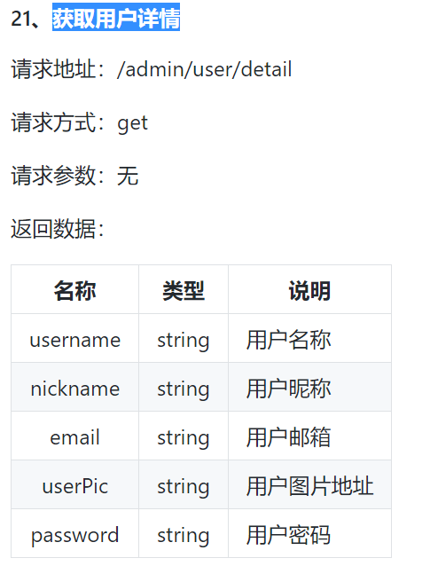

# 回顾

### git分支

git仓库创建会有一个默认的master主分支,那这个分支不要写开发代码,

新开一个分支,在这里写代码,这里写的代码没有问题,再把它合并到主分支.

步骤:

​    新建分支: git branch 分支名

​    切换分支: git checkout 分支名

​    编码- add - commit

​    切回到主分支: git checkout  master

​    合并分支:   git merger 分支名

​    删除分支: git branch -d  分支名

​     查看分支: git branch    当前分支前面带有一颗星.

注意: 如果在小紫猫中新建分支, 推送到远程仓库,远程仓库才会有新的分支

# git pull(拉)

从远程仓库拉到本地. 和克隆不同. 克隆是把整个克隆到本地, pull是把最新的拉到本地.

 

# iframe（了解） 

+ inner frame (内嵌框架 - 内嵌窗口)

1.iframe嵌套其他的网页 ,  src属性指向一个网页地址

​	

2.iframe嵌套多个网页,注意的是,a标签的target属性,指向iframe的name属性的值.

​	

3.避免 浏览器对 本地文件 window.parent 跨域报错

# 大事件

### 获取用户信息

步骤:

1. 一进到首页,就应该发送ajax请求,获取用户信息(个人图片和昵称)

    

   

   

2. 把这个图片和昵称显示在首页对应的标签的.

   注意的是span标签不要设置text, 应该设置html,因为他设置的内容里面包含了标签. &nbsp

   

## 个人中心（user.html）

### 用户头像预览

1.给input:file标签设置一个change事件.

2.用files获取到这个标签选中的文件.

3.创建一个这个图片文件的路径

4.把这个路径交给img的是src属性

### formData

### 进到个人中心-显示个人信息

进到个人中心,发送ajax请求,获取到个人信息.

  

把个人信息显示在对应的标签中.

​	可以一个标签一个标签的赋值

​		

​     也可以看规律用forin

​	

### 保存修改

1.个人头像图片预览

2.点击修改按钮,发送ajax请求.

​	注意:jQuery结合FormData

### 优化文件上传效果

一般工作中,是不会使用默认的input标签来上传文件,因为真的很丑.

解决问题:

​      搞一个漂亮的按钮(让美工做一个好看的 图片)

​      把默认的input标签给隐藏.

​      搞一个label标签包含住那个漂亮的按钮图片, label属性for指向隐藏的那个input的id.

​              点击label相当于点击input标签.

## 文章分类（article_category.html）

### 获取文章分类信息

1.一进到文章分类页面,发送ajax请求, 获取所有的文章分类信息.

2.把这些文章分类信息, 通过模板引擎渲染到页面上.

​       把id也保存起来了

### 新增文章分类

1.找到模态框中的 新增按钮 , 给他设置一个点击事件.

​    我们发现新增按钮之前有点击事件. 那我们应该把它删掉.我们自己来写

2.发送ajax请求,完成新增

### 文章分类删除

1.把模板引擎中的删除按钮自带的点击事件给删除,因为我们要自己来写.

2.删除按钮是动态生成的,所以要委托注册.

3.通过点击的当前删除按钮的自定义属性data-id,获取你要删除的文章类型的id

4.发送ajax请求完成删除

​      4.1重新渲染数据

​      4.2直接操作dom树

​    

