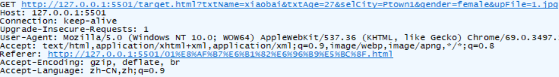
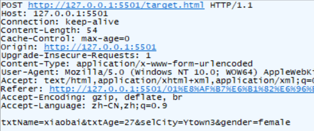
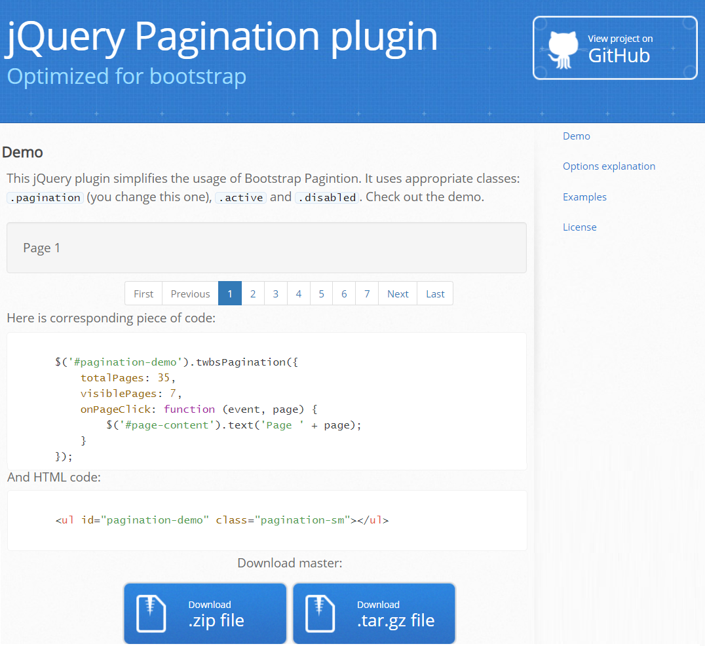
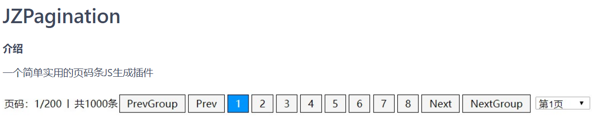
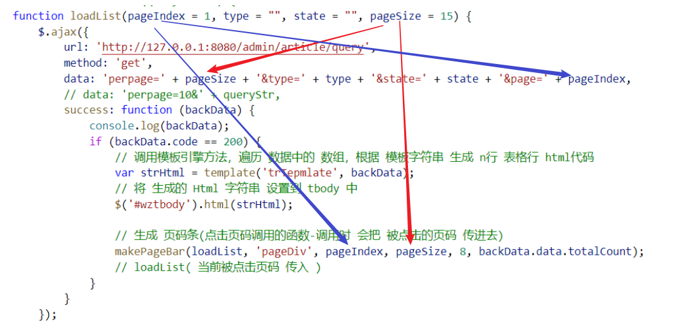

## 复习

### 1. 知识点

+ iframe ： 页面中 "内嵌 窗口(框架)"

  + 作用：在页面中 可以 通过 iframe 来查看 另一个页面
  + 操作：
    + 默认显示页面：通过 iframe src ="指定的页面.html"
    + 通过超链接 操作 iframe 
      + iframe 必须有 name = 'iframe名字'
      + <a href="目标页面.html" target="iframe名字"> \</a>
  + 包含 iframe  的页面 可以 叫做 “父页面”
  + 在 iframe 里面的页面 可以  叫做 "子页面"
  + **在 子页面 如何 访问 父页面内容**
    + 在 `子页面中` 可以通过 `window.parent` 可以 获取 `父页面的 window对象`
    + 所以 可以通过 `window.parent.父页面上的全局成员` 访问

+ 数据提交方式

  + method : get /post 

    + get请求：把数据 直接放到 url?k1=v1&k2=v2..

    

    + post请求：将数据 设置到 请求报文体 中 k1=v1&k2=v2..

    

  + enctype： 只针对 post 请求 有效

    + application/x-www-form-urlencoded  - k1=v1&k2=v2..
    + multipart/form-data - 数据包格式

```js
// multipart/form-data - 数据包格式
------WebKitFormBoundarywbfKtMSXsRGGBWu6
Content-Disposition: form-data; name="txtName"

xiaobai
------WebKitFormBoundarywbfKtMSXsRGGBWu6
Content-Disposition: form-data; name="txtAge"

27
------WebKitFormBoundarywbfKtMSXsRGGBWu6
```


### 2. 完成的功能

+ 登录
+ 在 index.html 显示 登录用户信息
+ 文章分类操作
  + 新增
  + 列表
  + 删除
  + 修改 *
+ 文章操作 *
  + 列表 (分页) *
  + 新增
  + 删除
  + 修改


## 1.知识点

### 1.0 git 强制拉取远程库

```js
$ git fetch --all // 获取远程库所有信息
$ git reset --hard origin/master   // 设置 强制要求 远程最新的仓库 来覆盖本地库
$ git pull // 拉取 远程最新仓库
```

### 1.1 jQ的serialize方法

作用: 也是可以把form表单里面带有name属性的标签的值取出来,组成key=value&key2=value2这种格式的字符串.

和FormData的区别:

​	1.FormData是原生js就有的,jQuery他也封装了,可以用 ;  serialize()是jQuery提供的方法.

​	2.FormData对象需要创建,传入是form表单dom对象,      serialize()直接是form表单jQuery对象调用.

​	3.FormData不需要设置请求头.

​	4.FormData传递过去的是一个formData对象,  而serialize()传过去的是一个字符串.

​	5.FormData可以传递文件, 但是serialize()不行.

### 1.2 $.ajax()/$.get()/$.post()补充

+ 复习：传递参数有几种方式:

​	 1.key1=value1&key2=value2&key3=value3;

​	 2.FormData对象

 	3.serialize()方法序列化后的值.

​     4.我们自己写的对象

​            data: {

​                   id:9,

​                   name:'鹏鹏',

​                   slug:'pengpengsba'

​            }

### 1.3 input type=hidden (隐藏域)

就是input标签的type属性为hidden,  默认就是影藏的.

他一般是用来传递 不想给普通用户看到的数据.

### 1.4 分页插件

+ twbs-pagination

  

+ JZPagination

  


### 1.5 select下拉菜单value的值

如果option项有value属性,那value值就是value属性的值; 

如果option项没有value属性,那value值就是显示的那个文本.

## 2. 大事件

### 3.1 文章分类

#### 3.1.1 分类新增

1.给新增按钮设置一个点击事件.

​         注意: 以前写静态模板的时候默认有一个点击事件.要么删掉,要么自己改改.

2.获取用户输入的类别名称和别名

3.发送ajax请求

4.新增成功后,再重新获取一次文章类别

​	注意:页面一进来要获取,  新增成功后也要获取, 所以可以搞成一个函数调用.

#### 3.1.2 分类删除

1.给删除按钮们注册事件.  使用委托的方式.

2.删除逻辑里面如何知道删除的是哪一个数据呢? 通过id区分.

​	搞一个自定义属性data-id来保存id

3.根据id删除文章类别的接口通过验证没有问题

4.删除成功后,重新的再渲染一次数据

​        数据是确定删除成功了的, 那现在呢需求是不要看到删除的这一行,

​        我们现在的做法是重新渲染,那如果数据量很大的话, 重新渲染就消耗时间.

​        所以我们可以搞一个障眼法, 把直接把这一行 从 dom树中移除 就ok.

#### 3.1.3 文章分类编辑

##### a.实现步骤

+ 在表格行 模板中 为 编辑按钮 添加 data-id 属性
+ 为编辑按钮 添加 点击事件
  + 显示模态框
  + 修改模态框 title -> 修改分类
  + 删除 确认按钮的 class 类名 add
  + 将 编辑按钮 所在行 的 第一个和第二个单元格 的内容 设置给 两个文本框
  + 将 编辑按钮 的 data-id 属性值 设置给 id隐藏域
+ 为新增按钮 添加 点击事件
  + 显示模态框 - 通过 特殊标签属性完成
  + 修改模态框 title -> 新增分类
  + 添加 确认按钮的 class 类名 add
+ 在模态框 中的 确认按钮的点击事件 中 进行 判断，调用 新增 或 编辑 接口
  + 判断 确认按钮 class 中是否有 类名 add
    + 如果有，调用新增接口
      + 获取 表单中所有元素的 数据，提交到服务器 新增接口
      + 新增成功后，重新请求列表数据，关闭模态框
    + 如果没有，调用编辑接口
      + 获取 表单中所有元素的 数据，提交到服务器 编辑接口
      + 编辑成功后，重新请求列表数据，关闭模态框

##### b.注意步骤

1. 编辑按钮也是动态生成的, 所以给他注册事件也要委托的方式注册.

2. 在编辑逻辑里面,要传过来id,要告诉编辑逻辑编辑的是哪一个文章类别.

3. 编辑操作分为2步, 一步是显示修改之前的信息, 一步是把修改后的数据获取后发送ajax请求去修改.\

4. 新增和编辑使用的是同一个模态框, 所以模态框显示信息,或者某些按钮要做一些修改

5. 新增和编辑弹出的是同一个模态框, 那模态框里面的新增(保存)按钮要处理2套逻辑.

### 3.2 文章列表(article_list.html)

#### 3.2.1 获取所有文章

> 页面打开时，立即请求所有文章数据，并显示到列表中

##### a. 实现思路

+ 准备 模板（导入模板js文件，编写 模板 script标签，在模板标签中 写模板内容）
+ 调用 文章列表接口，获取 文章列表数据
  + 准备参数：  页面加载时，都可以不传
    + 文章关键字（搜索时使用-文章标题）
    + 文章类型（可以为空代表 所有文章）
    + 文章状态（可以为空 代表所有状态的文章）
    + 当前要请求的页码（第几页，为空，默认第一页）
    + 页容量（每页显示几行数据，默认是 6 行）
  + 获取接口返回的数据，交给 模板引擎方法 去执行 并生成 表格行 html字符串
  + 将 字符串 设置 给 表格 的 tbody.innerHTML

#### 3.2.2 文章筛选

> 页面加载时，要在分类下拉框中显示最新数据；点击筛选按钮时，要能根据 两个下拉框的 选中值 筛选文章列表。

#####  a.实现思路

+ 获取 所有分类数据，生成 文章分类下拉框
  + 请求 服务器接口 获取 所有分类数据
  + 使用分类下拉框 模板 生成 下拉框 选项
  + 注意：修改两个 下拉框 和 表单 的html代码 （id,name...）
+ 修改 加载 文章列表数据方法
  + 添加两个形参，设置默认值为 ""：type - 文章分类id   , state - 发布状态(已发布/草稿)
  + 将 两个 数据 添加到 ajax 请求参数数据中
+ 为 筛选按钮 添加点击事件
  + 获取 两个 下拉框的 选中value值
  + 调用 加载 文章列表数据方法，传入 两个值

##### b.注意步骤

1. 给筛选按钮设置一个点击事件.

2. 获取文章类别的id, 注意是id,不是类别名字 ;  获取状态, 状态是草稿还是已发布.

3. 发送ajax请求,获取满足 条件的所有文章.

4. 把获取到的满足条件的数据,通过模板引擎给渲染到页面上.


#### 3.2.3 文章分页

> 因为 数据表 中 数据太多了，无法 一次在页面中显示出来，所以 就采用分页显示的方式

##### a.实现思路

+ 准备 两个 变量： 要请求的页的  页码 ( page ) ， 页容量（perpage）
+ 生成静态 页码条控件
  + 下载：JZPagination https://gitee.com/uptocoding/JZPagination
  + 导入 js 文件
  + 创建 一个 div 作为 页码条的 容器
  + 准备 **翻页函数** - 使用 loadList 方法就可以了，不需要重新写
    + 当 页码 被点击时 会 调用 这个 翻页函数
    + 被 调用时，会 将 **被点击的 页码** 作为实参 传入
  + 创建页码条：调用 **makePageBar 函数**，传入 各种参数
    + **参数（方法对象 , 页码条容器 ， 当前页码 ， 页容量 ， 页码组容量 ， 总行数）**
      + 方法对象：当页码 被点击时 会调用 传入的方法对象，并 为它传入页码
    + 调用时机：当页面 从个服务器 获取了 数据成功后 再调用
  + 添加 页码条样式
+ 生成动态 页码条控件
  + 修改 **翻页函数** loadList 方法
    + 添加一个 形参 pageIndex 注意：务必 添加为 第一个形参
      + ajax 请求 服务器接口时，指定参数 page
    + 在 方法 最后 添加一个 形参：页容量 pageSize (每页显示的行数)
      + ajax 请求 服务器接口时，指定 pageSize  
      + 同时 也设置到 **生成页码条函数**的 参数中



#### 3.3 文章删除


#### 文章新增


