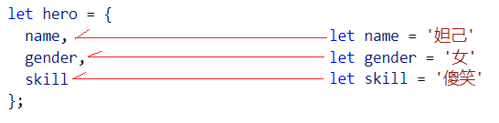

# 一.核心内容

## 阶段目标：

+ 通过 对 nodejs  在服务器端 编写并且 运行 代码 的过程，了解 服务器执行
+ 趋势：大前端 -> **浏览器端技术 + 后端技术**
+ 竞争力 ： 后端学生 都学前端框架
+ 美国 开始 印钞，国外资本 率先流入 新兴技术领域（5G，AI）

### 阶段核心知识点：

+ NODEJS 本身使用
+ 习惯使用 第三方模块 （别人写好的成熟的 JS代码）
+ express 模块 的基本使用 (用 Nodejs 实现的 web服务器程序)
+ MYSQL数据的 基本 操作 和 语句

## 1. Node.js是什么

+ NodeJS 就是一个 没有界面的 可以 运行 JS代码的 软件
  + 内置了 谷歌 的 V8引擎 -- 高效率的 执行 JS代码
  + 内置 模块 - 就是 写好的 JS代码 --类似于 jquery.js


## 2. 学习Node.js的目的

+ 争做 大前端攻城狮（前端全栈攻城狮） -》 浏览器端 的编程 + 服务器端 的编程(NodeJS) + 数据库 + 微服务(Docker)
+ 能够 增加 学习体验，理解后端程序员工作

+ 爆栈攻城狮：产品设计、UI做好页面图， 切图，做html页面，设计数据库，写动态页面，写服务端代码，搭建服务器集群，测试，运维

## 3. Node.js环境安装

+ 安装软件 http://nodejs.cn/download/


+ 安装目录中会有 node.exe 程序


+ 验证成功与否：是否能运行 nodejs
  + 打开终端(小黑窗)
    + `window + r`  输入`cmd` 回车
    + 输入`node -v`: **node** 的版本
    + 输入`npm -v`：**node包管理工具** 的版本


+ 小黑窗 与 Node.exe 关系


## 4. 服务端.js&客户端.js


### 4.1 客户端.js（浏览器中的js）

+ **浏览器端** JS分 三个部分：
  + ECMAScript ：语法 -- 声明变量，条件语句，循环语句，函数，对象，数组，自定义类型
  + DOM：操作页面上的 元素(标签对象)  document.getElementById('div1');
  + BOM：操作 浏览器  window.open('')     window.close();.....

### 4.2 服务端.js（Node.js）

+ **服务端** JS 只有 ECMAScript (ES5 , ES6)

## 5. Node.js 程序运行

>  执行方式 有两种： REPL环境 （很少使用）  和  直接执行JS文件

### 5.1 REPL( 了解 )

+ REPL 全称：Read Eval Print Loop

+ 读取 解析  打印 循环

1. 打开小黑窗 window + r -> cmd

2. 输入命令：node

3. 编写js代码  回车运行

4. 退出小黑窗：
   
   + ctrl+c两次退出
   
   + 可以关闭终端

### 5.2 Node执行JS文件

+ `E:\nodejs\firstnode.js`

```js
console.log('hello,node ~~');
```

#### 5.2 1三种方式

+ a、通过 cmd 命令行运行
  
  + 打开小黑窗   window + r  ->  cmd 
  
  + 使用 控制台 切换到 目标JS文件 所在 的目录 ：cd 文件所在目录
  
    ```cmake
    cd E:\nodejs\firstnode.js
    ```
  ```
    **注意：**如果 盘符不一样，需要 切换盘符，如：切换到E盘   命令 ->  `e:`
  
  ```
- 使用 **命令：node 文件名.js** 调用 node.exe 程序 执行 js 文件
  
    ```html
    node firstnode.js
    ```
    
    > 小技巧：直接 在 window资源管理器 进入要执行的 文件目录。在地址来 敲 cmd ，会 自动 打一个 终端，并已经设置好了 当前目录

+ b、使用 gitbash 打开运行
  + 在跟js文件平级的目录下打开 小黑窗
  + 按住shift+右键 `打开命令行窗口，gitbash here`
  + 输入 `node 文件名` 回车

+ c、在VSCode终端运行

  + 在左侧 要运行的 文件上 右键  `在终端打开 `

  

  + 输入 `node 文件名` 回车

#### 5.2.2 易错点

1. 语法错误 --  不能使用 dom和bom，因为 他们是浏览器支持执行的，和 nodejs无关
2. 文件名使用了关键字`node`
3. 后缀名不对 `.js`即可
4. 输入的命令不对
5. `node 文件名`

#### 5.2.3 终端操作技巧

+ 自动补全文件名
  + 文件名开头 + tab键
  + 如果 有多个 文件名 开头 一样，可以 多次  敲击 tab键 自动切换文件
  
+ 操作历史命令
  + 上 下


### 小结：

+ Nodejs 安装：注意 最好安装在 D盘，别直接安装在 C盘
  + C盘一般作为 系统盘，就是装系统的
  + D盘一般可以作为 软件安装盘，所有软件都安装到 D盘
+ 安装成功检测：
  + window + r，输入 cmd  打开小黑窗
  + 在小黑窗中输入： 
    + node -v
    + npm -v
+ Nodejs运行JS代码方式
  + NEPL环境：不推荐
  + node运行 js 文件
    + 小黑窗 切换到 js文件所在 目录 
      + cd js文件所在 目录 -> `cd 目录路径`
      + 注意：如果在不同 盘，需要 切换盘符 ->  `盘符:`
  + 注意：NodeJS 只支持 JS语法，不支持 dom 和 bom 语法


## 6. ES6

> ECMAScript 的一个颠覆性版本更新  - 面向对象编程（类、对象-- 封装、继承、多态）

### 6.1 let&const

#### 6.1.1 let

+  let 声明变量

+ 特点：

  + 无法变量提升
  + 无法重复声明
  +  有块级作用域  { }


#### 6.1.2 const 常量

+ const 声明 常量 -- 主要用来 保存一些 程序的初始信息，程序启动后 不允许修改

+ 特点：
  + 常量无法重新赋值 -- 一旦声明并设置好初始值，之后就不能够被改动
  + 常量只能也必须在 创建时赋值（常量初始化）
  + 无法变量提升
  + 有块级作用域
  + 必须声明时就要赋值

#### 6.1.3 注意

+ 不使用 var ，取而代之的 使用 let 来声明变量
+ const 使用场景并不多：保存初始化数据  && 导入模块时

### 6.2 解构

+ 概念：一种 **方便获取** 对象 和 数组 中值 的方式

> 不管 是 解构 数组 还是 对象，都是 将 数组或对象 里的值 设置给 变量

#### 6.2.1 对象解构(掌握)

+ 概念：使用 对象解构 自动 将 对象同名属性 赋值 给 同名变量

> 需求：想把 hero对象 中的 属性 依次取出 放入  同名变量

```js
let hero = {
  name: '孙悟空',
  skill: '隐身',
  voice: '老孙来也~~~'
}
```

+ 方式一（旧语法）：将对象中的属性 逐一取出 设置给 同名变量

```js
let name = hero.name;
let skill = hero.skill;
let voice = hero.voice;
```

+ 方式二（新语法）：使用解构的方式 快速赋值

+ 语法 ： let { 变量名1,变量名2,变量名n } = 对象;

  解释 ： 相当于 创建 n 个变量，并且 从 对象中 取出 与变量同名的属性的 值 设置给变量（相当于 方式一）

```js
let { name, skill, voice} = hero;
console.log(name,skill,voice);
```


+ 特殊情况01：变量多余对象属性 --> 对象中没有的属性 会变为 `undefined`

```js
// 变量多余对象属性
let { name, skill, voice, color } = hero; // color -> undefined
```


+ 特殊情况02：变量少于对象属性：正常赋值

```js
// 变量少于对象属性
let { name } = hero; // name -> '孙悟空'
```


#### 6.2 2 数组的解构(了解)

+ 语法 ： let [ 变量名1,变量名2,变量名n ] = 数组对象;

  解释 ： 相当于 创建 n 个变量，并且 从 数组中 【按顺序】 取出 元素 设置给变量（相当于 方式一）
  
  + 注意：按顺序 将元素 设置给 变量

```js
// 数组
const cityList = ['P城', 'Y城', '军事基地', '学校'];

// 逐一取出
const city1 = cityList[0];
const city2 = cityList[1];
const city3 = cityList[2];
const city4 = cityList[3];

// 数组解构取出
const [city01, city02, city03,city04] = cityList;
console.log(city01, city02, city03, city04); // 'P城', 'Y城', '军事基地', '学校'

```


### 6.3 实际应用

> 有些函数 有多个形参，但实际使用时，需要指定传入任意位置的参数，传统语法无法实现


> 现在，我们可以 通过 对象解构语法 的方式来设置参数，并指定传参


### 6.4 小结

+ 对象解构规则：名字 -> 同名属性 设置给 同名变量
  +  语法：let { 变量名1,变量名2,变量名n } = 对象;
+ 数组解构规则：下标 -> 按顺序 将元素 设置给 变量
  + 语法：let [变量名1,变量名2,变量名n ] = 数组;

## 7. 箭头函数

> 箭头函数（Arrow Function），相当于匿名函数，并且简化了函数定义。

+ 快速体验

```js
// a.普通匿名函数
let justShow1 = function (name) {
  return name + '，匿名函数在此~~！';
}
var n1 = justShow1('小白'); // '小白，匿名函数在此~~！'

// b.箭头函数 
let justShow2 = name => name + '，箭头函数在此~~！';
let n2 = justShow2('小白'); // '小白，箭头函数在此~~！';
```

+ 箭头符号：function 变为  =>

+ 参数：

  + 参数只有1个 省略小括号

  + 参数0个或多个，无法省略小括号

+ 大括号{ }
  + 如果 函数体 代码 只有一行 可以省略 {}
  + 函数体多行 无法省略 {}

+ 返回值
  
+ 函数体一行 有返回值 省略{} 的 同时 【必须省略 return】
  
    
  
+ 坑：**this** 跟之前的不一样哦！！！

## 8. 属性赋值简写

> 思考：将 以下变量值 封装到 一个 拥有同名属性的 对象中

```js
let name = '妲己'
let gender = '女'
let skill = '傻笑'
```

+ 方式一：手动 将 同名 的变量的 值 设置给 对象中的 同名属性

```js
//方式一：手动 将 同名 的变量的 值 设置给 对象中的 同名属性
let hero = {
  name: name,
  gender: gender,
  skill: skill
};
```


+ 方式二：对象属性赋值简写
  + 将变量 设置给 对象的属性时，可以自动 将 同名的变量 值 赋给 对象的 同名属性
  + 注意：属性名和值相同可以简写，否则不要这么做

```js
//   注意：es6 语法 为 对象中 未赋值的 属性 设置 同名变量的值
let hero2 = {
  name,
  gender,
  skill
};
```



+ 补充：对象中的 方法可以省略掉 : function

```js
const name = '阿珂'
const male = '女'
const skill = '背刺'

const person = {
  name, // 等同于 name: name
  male,
  skill,
  //sayHi: function() {
  //  console.log('Hi~~~')
  //}
  // 可以省略  ：function ，就像 声明一个正常函数一样
  sayHi() {
    console.log('Hi~~~')
  }
}

person.sayHi()

```


## 9. 展开运算符 ...

#### 9.1 对象展开

+ 概念：将对象 中的 成员 自动 添加到 另个对象中

2. 同名属性 后面的会把 前面的覆盖
3. 可以展开多个 对象

```js
// 展开运算符 ...
//           完成 对象 与 数组 的 自动展开
let gf = {
  name: '小白',
  gender: false,
  age: 28
};

let gfTD = {
  skin: '白，非常白~~~白的很自然',
  finger: '倩倩琢玉手'
};

// 1.对象 展开
//        将对象 中的 成员 自动 添加到 另个对象中

let obj = {
  ...gf,
  loverName: 'James',
  ...gfTD
};

console.log(obj);
```

#### 9.2 数组展开

+ 概念：将数组 中的 元素 自动 添加到 另个数组中

1. 不会覆盖
2. 可以展开多个

```js
// 1.数组 展开
//        将数组 中的 元素 自动 添加到 另个数组中

// 思考：将 以下两个数组 添加 到 新的数组中
let cityList = ['P城', 'Y城', '军事基地', '学校'];
let foodList = ['猪肉', '牛肉', '羊肉', '兔肉'];

// let newList = cityList.concat(foodList);
// console.log(newList);

let newList = [
  ...cityList,
  ...foodList
];

console.log(newList);
```


## 10.模板字符串

1. 定义的符号  反引号` `` `    数字1键的左边  ，tab键上边

2. 注意：这个不是单引号 '  而是反引号，是 数字1键 左边的 符号  `

3. 本质：就是一个字符串

4. 特点：

   + 可以  换行

   + 挖坑  `${表达式}` ，用变量值填充

```js
let loverName = '小可爱~~~'

var loverWords = `亲爱的'${loverName}'，
我是一个"爱慕"你已久的 
真心男子~~~`;

console.log(loverWords);
```


## 11. Node模块

### 11.1 NodeJS 的核心组成


### 11.2 内置模块使用方式

+ 因为 模块 是 内置模块，在安装 Nodejs 时 就已经 装在了硬盘中
+ 直接 可以 在安装了 nodejs 的电脑中使用，不需要下载
+ 务必 注意 养成 查阅 在线手册 的习惯，按照手册中的 指导 使用
+ 在js文件中 使用模块：
  + 导包 ： `consot fs = require('fs');`

> 类似于之前的插件

1. 下包（第三方才需要）
2. 导包
3. 用包

### 11.3 内置模块（包）

> 自带的 装了node就可以用

1. 官网
   1. [英文](https://nodejs.org/dist/latest-v10.x/docs/api/)
   2. 中文 nodejs.cn
2. 找到要用的包(模块)
3. 根据文档的实例代码 
   1. c+v+r
   2. c 复制
   3. v 粘贴
   4. r run 运行

+ fs模块

  + 入门 步骤
  + 找到模块
  + 看顶部的实例
  + c+v+r

继续阅读文档

+ 读取文件

1. 英文写法
   1. 百度搜 node.js 读取文件
   2. 可能不是最新的，可能不是对的
2. 检索 readFile
3. 点开文档 尝试调用方法 结合示例代码

+ 保存文件

1. 英文
2. 检索方法
3. 点开文档 ，尝试编码


+ 注意

浏览器是否可以读写文件？

1. 不可以
   1. 不允许的

Node.js可以 但是自己不去执行恶意代码，运行来历不明的软件就不需要担心

### 11.4 第三方模块


+ 找包 ： [npmjs.com](npmjs.com) 去找 ，如果被墙，就去 淘宝镜像 [npm.taobao.org]()
+ 下载包：
  + 下载包之前 务必 找到 要使用 第三方模块的 项目文件夹 ，使用终端 切入 本文件夹路径
  + 再执行 npm 的安装包的命令：`npm install 第三方模块名称`

+ 导包
  + 使用 require('包名') 导入 已经下载的 模块包
  + 使用 const 常量保存 导入的对象，常量名 一般保持 和 包名一致
+ 用包
  + 使用 导入的包 中提供的方法，执行我方业务

## 12. 同步&异步

### 12.1 同步

- 代码中 ：代码从上往下执行
- 现实中 ：排队

### 12.2 异步

- 代码中：多段代码一起执行（调用的顺序和预料的不同）
  - 定时器，回调函数
- 现实中：多件事同时干，互不影响

### 12.3 注意点

1. 绝大多数的代码都是同步的

2. NodeJS中有大量的异步方法，判断依据：如果有回调函数 大部分情况都是异步

   - 定时器

   - fs读写文件

   - ajax （浏览器）

   - jQuery动画回调函数（浏览器）

     `$('div').animte({height:100},function(){})` 

## 13.路径

### 13.0 相对路径和绝对路径


+ 绝对路径 ：
  + 从 盘符 一致 到 目标文件 的 路径 ： `e:\abc\a.txt`
+ 相对路径
  + 相对于正在执行的 文件 而言 ： `./a.txt`

+ 但是，nodejs 中不一样，nodejs 中的相对路径，不是相对于正在执行的 文件而言，
  + 而是 相对于 小黑窗 的执行路径而言

### 13.1 node路径问题

> 思考：Node.js中的相对路径 相对的是谁？

- Nodejs中的 **相对路径** 是 针对于 **正在运行的 终端** 而言，**不是** 针对于 **正在运行的 js 文件**
- 用Node操纵路径时用 相对路径 可能出错
- 绝对路径 写死不通用？不同用户的电脑盘符信息不同，写死之后无法智能生成 

### 13.2 两个全局变量

`__dirname`：获取执行的js文件所处的文件夹的 **绝对路径**

`__filename`：获取执行的js文件自己的 **绝对路径**

可以用`__dirname`拼接一个完成的绝对路径

```js
console.log(__dirname);
console.log(__filename);

// 文件读取问题
const fs = require('fs');

// 生成路径
const fullPath = __dirname + '\\web\\index.html'
fs.readFile(fullPath, 'utf8', (err, data) => {
  if (err == null) {
    console.log(data);
  } else {
    console.log(err);
  }
});
```

- 小结：
  - 1.nodeJS 不要使用相对路径，而要使用绝对路径
  - 2.绝对路径的 安全的 获取方式：__dirname + '针对于当前执行的js文件 的 目标文件相对路径';

### 13.3 Path模块

+ 负责：拼接生成路径

+ 语法：`path.join(路径1，路径2，。。。。。)`

  一般使用：path.join( __dirname , ' ./web/index.html' ) 

## 14.http模块

+ node内置的服务器模块，可以让程序员方便的开发web服务器程序

### 14.1 端口

+ 物理端口
  - 电脑上的接口 usb网线
+ 虚拟端口 1-65535 之间
  - 用来 在网络中标识  一个 通信软件用的
  - 一台电脑，同一端口号，只能由一个 软件使用 
  - 比较靠前的是知名端口，基本都被用了，靠后的基本没有使用
  - 建议用靠后一点的端口 10000+

### 14.2 静态资源服务器

#### 14.2.1 静态资源服务器的实现步骤

1. 导入模块
   1. http 开启服务：创建 server 并 启动 监听 listen
   2. fs 文件读取
   3. path 路径生成
2. 创建服务器
   1. 回调函数 请求过来之后会执行
      1. 获取用户请求的文件（url）`request.url`
      2. 弄一个绝对路径
      3. 通过绝对路径去读取文件
         1. 存在 返回
         2. 不存在 返回 Not Found 
            1. 使用phpstudy的内容返回
3. 开启服务器


# 二、补充

### 1.小技巧

+ VSCode关闭不要的区域
  + ctrl+shift+p
  + 输入toggle 选择需要关闭的内容 即可
  + ctrl+b 左侧资源管理器隐藏  显示
  + ctrl+` 终端 打开隐藏 1的左边

### 2. es6阮一峰

+ 前端牛人，写了很多前端技术文章：http://es6.ruanyifeng.com

### 3.ES6的兼容问题

1. 新式浏览器 基本都支持 
2. 高版本的js转化为地版本的js
   1. babel
      1. c+v高级代码 自动转化
      2. 框架中进行配置


