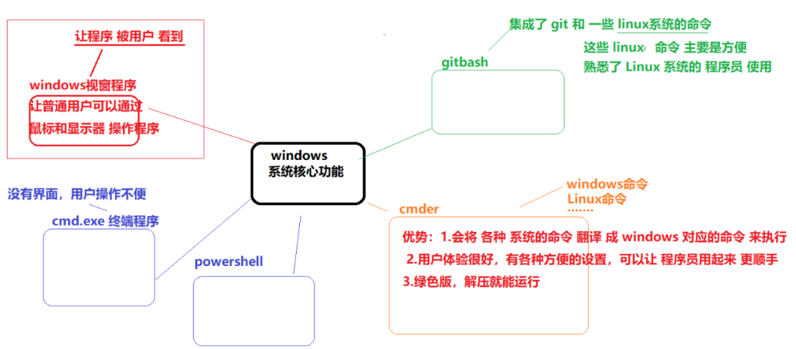
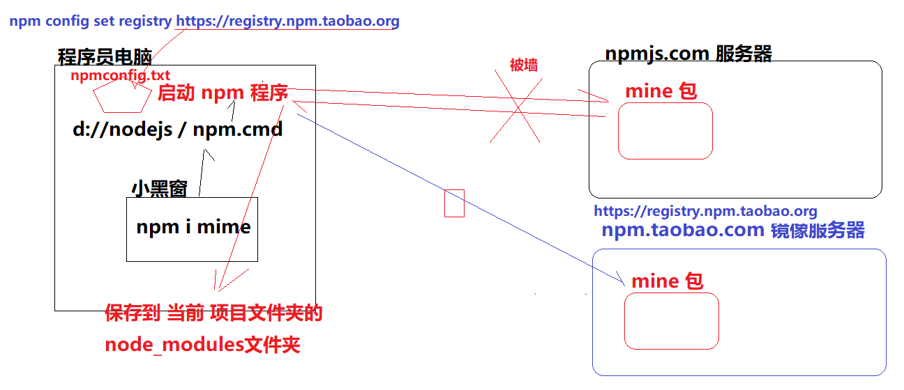

## 终端

+ 终端和系统的关系



+ 直接使用 vscode 自带的终端 比较多

  

## npm详解

+ npm 含义
  + 一般指  npm 包管理器程序 (nodejs 实现的一个程序)
  + 包 （用nodejs 编写的一个 项目）
  + npm 官网 （包含众多 第三方 模块包的网站）
+ npm 原理图



+ package.json
  + npm init -y 创建出来 -- 一般在项目刚创建时 做初始化使用
  + 保存 当前项目的 相关信息
+ package-lock.json
  + npm i 模块名称   -- 下载 模块时 创建  的！
  + 保存 当前项目 所有依赖的 模块包的 信息
  + 可以 方便 批量 下载 依赖的 模块包，提高 下载速度
+ `npm i`  根据 package-lock.json 重新批量 下载 所有的 依赖包

## http报文

+ http协议：浏览器 和 服务器 数据交互的 规范
+ 请求报文
+ 响应报文

+ 一定要 熟悉 使用 报文查看器 ，没事 多看看报文！！！
+ 一旦编码 时出现 一些问题：
  + f12 看控制台
  + 看报文
  + 最后看 nodejs 服务端 代码


## express 第三方服务器模块

+ 比 express 更大的一个 服务器模块 kora
+ 下载包： npm i express
+ 导包
+ 使用包

```js
const express = require('express');
const app =  express();

// 公开 一个 静态 资源文件夹
app.use(express.static('./web')); // index.html

// 注册路由： 请求方式 + url
app.get('/showlove',(req,res)=>{});
app.post('/showlove',(req,res)=>{});


app.get('/index.html',(req,res)=>{});

app.listen(3747);
```

+ 思考：当 服务器 静态资源和 路由 url冲突时，服务器 会 返回 哪个数据？


