# Node

+ 复习
  + es6
    + let / const
    + () => {  }
    + 对象解构   ->    let {a,b,c} = o;
    + 对象属性 快速复制  ->  let o1 = {  a , b, c  }
  + nodejs
    + 路径 
      + NodeJs 相对路径： 相对于 终端(小黑窗) 的执行路径
      + Nodejs 最好使用 绝对路径
        + **__dirname** ： 当前执行的js 文件所在的 文件夹 绝对路径
        + __filename ： 当前执行的js 文件本身的 绝对路径
    + 导入和使用模块（内置模块 和 第三方模块）
      + nodejs 的组成： v8 ，内置模块包，第三方模块包 (npmjs.com / npm.taobao.org)
      + 内置包使用：
        + 导包      const fs = require('fs')   
        + 用包      fs.readFile....
          + 百度 搜索 "nodejs 读取文件"
          + node.cn 中文官网 api
      + 第三方包使用：
        + 下载包： npm  install  包名
          + 细节：下载的 第三方包 默认 都安装在 项目文件夹的 node_modules 文件夹中
        + 导包
        + 用包
    + http 模块 实现 基本服务器交互功能
      + 实现 web 服务器，和 浏览器 直接 交互

+ 核心知识点
  + 终端 扩展 cmder
  + 路径 path 模块
  + http模块实现 静态资源服务器
  + npm详解
  + **http协议**
  + express 实现 静态资源服务器

## 1. 终端

###  1.1 常见终端

> 终端程序：没有操作界面，通过 命令 来控制 系统工作。

+ cmd  和 powershell

​	都是微软出的，都有自己的独特语法 --- windows

+ git bash

​	比较不错的终端，支持很多通用的命令

​	linux系统  中的 很多命令这里都可以用

+ **cmder（推荐）**

​	集成了很多中终端，功能是通用的

​	内部写的很多命令 在linux mac os上面都可以写

+ vscode中打开黑窗缩小 代码面积太少有点不便

### 1.2 终端软件推荐

cmder安装方法 

1. 解压
2. cmder.exe 生成快捷方式
3. 拖到你希望用的地方
4. 双击打开即可
5. 修改设置

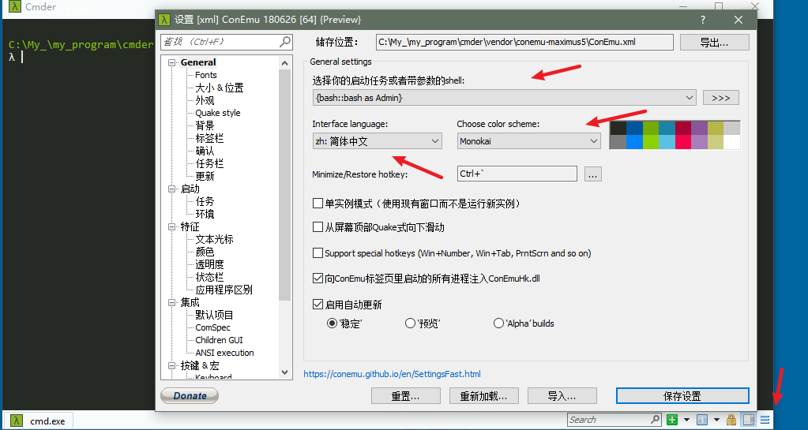


### 1.3 终端常用命令

+ 路径切换 - cd 路径 --- 注意 有必要的情况 需要 切换盘符

+ 显示文件 - ls

+ 显示当前路径 - pwd

+ 清屏 - clear

+ 删除文件(慎用) -  rm -rf 文件名/文件夹/*

+ 新建文件 - touch 文件名

+ 使用vscode打开 -- code 文件名/文件夹

+ 创建文件夹 -- mkdir 文件夹名

### 1.4 易错点

1. 路径的切换 `cd 空格 路径`

2. touch出不了东西：检查一下路径

3. code 无法打开 vscode

   1. 安装vscode的时候对于勾选框 取消了
   2. 重装vscode  勾选的时候 稍微看看


## 2. 路径

### 2.1 路径问题

>  思考：Node.js中的相对路径 相对的是谁？

+ Nodejs中的相对路径 是 针对于 **正在运行的 终端 而言**，不是 针对于 正在运行的 js 文件

+ 用Node操纵路径时用相对路径可能出错

+ 绝对路径 写死不通用？不同用户的电脑盘符信息不同，写死之后无法智能生成 

### 2.2 两个全局变量

`__dirname`：获取 **执行的js文件** 所处的 **文件夹** 的 **绝对路径**

`__filename`：获取执行的js文件自己的绝对路径

可以用`__dirname`拼接一个完成的绝对路径

```js
console.log(__dirname)
console.log(__filename)

// 文件读取问题
const fs = require('fs')
// 生成路径
const fullPath = __dirname + '\\web\\index.html'
fs.readFile(fullPath, 'utf8', (err, data) => {
  if (err == null) {
    console.log(data)
  } else {
    console.log(err)
  }
})
```

+ 小结：
  + 1.nodeJS 不要使用相对路径，而要使用绝对路径
  + 2.绝对路径的 安全的 获取方式：__dirname + '针对于当前执行的js文件 的 目标文件相对路径';

### 2.3 Path模块

1. 文档
2. 从上往下看
3. 检索关键字
4. 生成路径

路径生成

path.join(__dirname, ' ./web/index.html' ) 

`path.join(路径1，路径2，。。。。。)`

## 3. http静态资源服务器

### 3.1 读取网页并返回

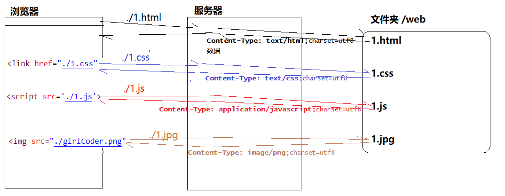

+ mime 第三方模块，可以 帮我们 根据 文件后缀 生成 对应的 mime 值

### 3.2 静态资源服务器的工作流程

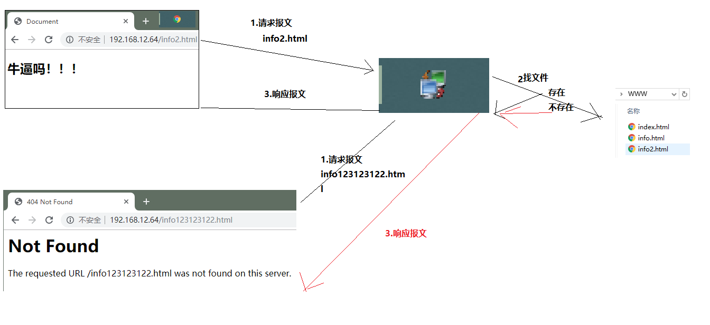

### 3.3 静态资源服务器的实现步骤

1. 导入模块
   1. http 开启服务：创建 server 并 启动 监听 listen
   2. fs 文件读取
   3. path 路径生成
2. 创建服务器
   1. 回调函数 请求过来之后会执行
      1. 获取用户请求的文件（url）`request.url`
      2. 弄一个绝对路径
      3. 通过绝对路径去读取文件
         1. 存在 返回
         2. 不存在 返回 Not Found 
            1. 使用phpstudy的内容返回
3. 开启服务器

+ 重点

1. 获取用户请求的url地址（文件名）`request.url`
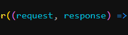

## 4. NPM 详解

- NPM - Node Package Manager - node 包(模块)管理器
- NPM 
  - NPM官方的 包管理器
  - NPM官方网站 **npmjs.com** - 囊括了 大量的 第三方 模块(包)
- npm (node package manger) ： node 的 包管理器
  - node 模块 ：一个 nodejs 文件就可以看成是一个 模块
  - node 包：是一个 nodejs 项目，里面可以包含 很多 js 文件和其他资源
- npm的作用
  - 相当于 一个 在线的 node 包  的 免费商店，而已直接 拿别人写好的 包 在自己的项目中使用
  - npm 还可以 帮我们 管理 我们在项目中 引入的 第三方包，如果 别人更新了，我们可以通过 npm一起更新

### 0. 设置淘宝npm服务器

> 由于 npm 服务器 访问不稳定（国内有大墙），可以 设置 从 淘宝的 npm镜像服务器下载

- 设置命令 ： `npm config set registry https://registry.npm.taobao.org`

- 检查设置 ： `npm config list`

  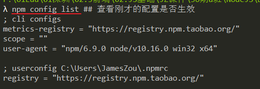

### 1. 回顾使用流程

```js
初始化一个项目
   npm init -y  (项目文件夹名字 不能为中文！)  创建了一个 文件： package.json
知道模块的名字
   百度 谷歌
   npmjs.cn 网站上搜索
在项目中安装第三方模块
   npm i 模块名       创建 一个 文件夹(nodeModule) 和 json文件(package-lock.json)
根据第三方模块的提示导入，并使用第三方模块
    文档中 c+v
```


### 2. 初始化 npm init -y

- 创建一个 package.json 文件，保存了当前项目(包/模块)的一些信息：

```
{
  name - 包名(项目名/模块名) - 必写
  version - 包的版本号 - 必写
  description - 描述
  homepage - 官网地址
  author - 作者，最好是 npmjs.org 的账户名(邮箱)
  contributors - 包的其他贡献者
  dependencies / devDependencies - 生产/开发环境依赖包列表
  repository - 包代码的Repo信息，包括type和URL，type可以是git或svn，URL则是包的Repo地址。
  main - main 字段指定了程序的主入口文件，require('moduleName') 就会加载这个文件
              这个字段的默认值是模块根目录下面的 index.js。
  keywords - 关键字
}
```


### 3. 安装模块

- 命令：`npm i 模块名`

- 第一次安装 会新增 ==package-lock.json== 文件及 ==node_modules== 文件夹

  - 记录了下载的模块和它们依赖的其它模块关系
  - 锁定安装时的包的版本号，并且需要上传到git，以保证其他人在npm install时大家的依赖能保证一致。

- 第 N 次安装

  - 把模块的信息保存到 **package-lock.json** 中

  - 模块的信息 在 **package.json** 中也会保存一份，但不详细

  - **node_modules 文件夹** 中会保存下载的第三方模块

    PS：上述操作都是自动的，不需要人为的操作，知道干了什么事即可

### 4. 两个JSON文件


- **package.json**

  - 命令：`npm init -y `  生成
  - 保存了当前项目(包/模块)的一些信息
  - 特点：dependencies 只保存了 当前包 直接依赖的其他模块

  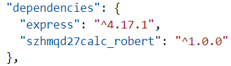

- **package-lock.json**

  - 命令：`npm i 模块名` ，安装第三方模块时生成
  - 保存了 第三方模块 详细信息 和 它所依赖的 其它模块信息
  - 特点：dependencies 保存了所有模块和简介依赖的其他模块信息
    - PS：依赖太多了，不截图了，直接看查看吧。。。。

- 好处：

  - 有了 package-lock.json 后，可以使得下载模块速度 加快很多！
  - 因为已经知道了所有模块，可以**并行**下载

### 5.下载所有依赖模块

> 当我们拷贝 项目 给别人时，不需要 拷贝 node_modules 文件夹里的内容，可以根据 json 自己下载

- 命令：`npm i`
- 根据 package-lock.json 中的直接或间接依赖的所有模块信息，并行下载
  - PS：以后我们拷贝项目，不需要把庞大的 node_modules 文件夹 一起发送了.....

### 6. 第三方模块的使用步骤

1. 新建一个文件夹（不要中文）
3. 找到你要用的第三方模块
   1. [npm](https://www.npmjs.com/)找 （npmjs.com）
   2. 输入命令 `npm i 模块的名字` 下载
   3. 代码中 导入模块(导包)
   4. 代码中 使用模块(用包)
      1. 文档
      2. c+v+r

>  请大家 重视 示例代码

## 5. 浏览器与服务器交互* 

- 浏览器服务器交互图

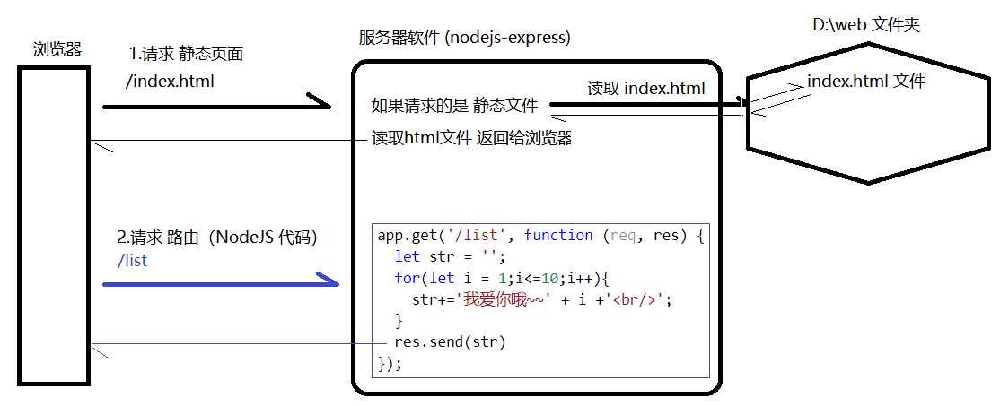

### 1.浏览器端代码

- 浏览器 获取服务端 发来的代码（HTML/CSS/JS）后，可以进行解析执行。

### 2.服务器端代码

> 服务端 收到浏览器 的请求后，会按照业务要求执行对应代码。

- **静态代码**
  - 在服务器中不会被执行，只是作为数据保存。
  - 浏览器如果请求这些资源，服务器会将它们读取并发送给浏览器。 flutter
  - 如：保存在服务器硬盘中的 HTML、CSS、JS、图片、视频等资源
- **动态代码**
  - 在服务器中实现某些功能的代码 比如：业务逻辑、操作文件、操作数据库、与其他服务器电脑交互等
  - 如：NodeJS，Java，C#，Python，PHP等

### 3.HTTP协议

> 思考：中国人和俄国人通电话时，使用什么语言呢？
> 同理：浏览器和服务器通信时，怎么理解对方发送来的内容呢？

- HTTP：一个基于应用层的通信规范（浏览器和服务器 发送和接收 数据 的 数据格式）

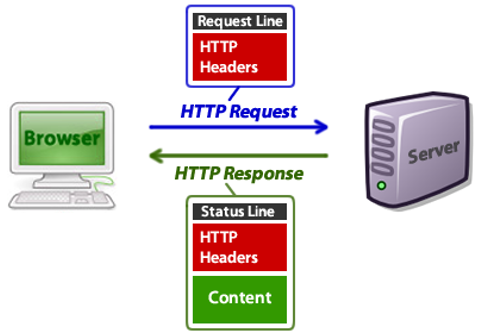

#### 3.1 查看 报文方式

> Web开发人员 可以通过各种工具 打开 浏览器服务器 交互的大门

- 3.1.1 使用浏览器 自带 功能

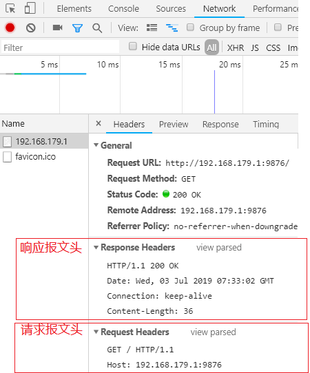

- 3.1 2 使用 Fiddler 专用工具

  - 设置布局

  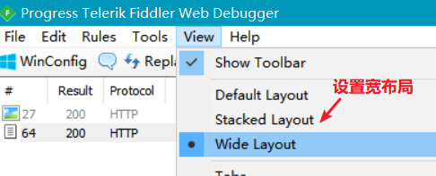

  - 设置需要监控的 域名

  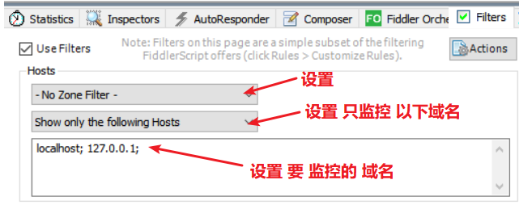

  - V8引擎的浏览器需要设置 IE代理

  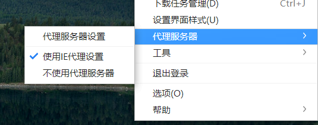

  - 查看原始 请求报文

  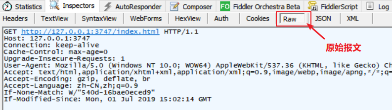

  - 查看原始 响应报文

  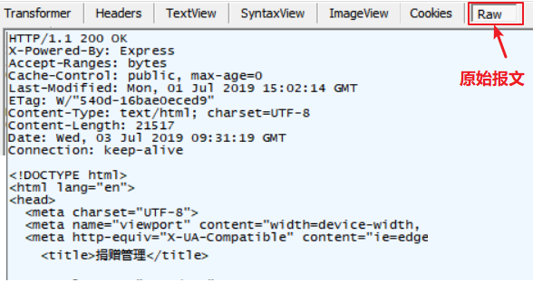


#### 3.2 HTTP报文格式

- 请求报文格式 ( HTTP Request )

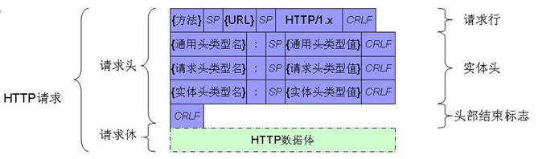

- 响应报文格式 ( HTTP Response )

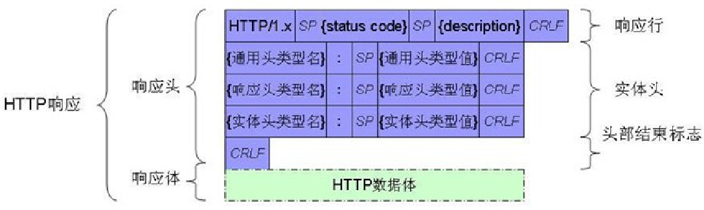

#### 3.3 HTTP状态码

> 状态码（status code） 是服务器 返回的 响应报文 第1行 第2个字段，属于 **HTTP协议** 的一部分。
>        用来 告诉浏览器 本次请求的响应状态。

- HTTP响应状态码分类（服务器发给浏览器的）

| 状态码 | 说明                                                         |
| ------ | ------------------------------------------------------------ |
| 1**    | 信息，服务器收到请求，需要请求者继续执行操作                 |
| 2**    | 成功，操作被成功接收并处理                                   |
| 3**    | 重定向，需要进一步的操作以完成请求                           |
| 4**    | 客户端错误，请求包含语法错误或无法完成请求（服务器告诉浏览器） |
| 5**    | 服务器错误，服务器在处理请求的过程中发生了错误               |

- 下面是常见的HTTP状态码：
  - 200 - 请求成功
  - 302 - 资源（网页等）被永久转移到其它URL
    - 需要在 响应报文头 添加 一行： location : 浏览器要跳转的地址
  - 404 - 请求的资源（网页等）不存在
  - 500 - 内部服务器错误

## 6. express 实现静态资源服务器

### 6.1 基本使用

> express 模块 是一个 服务器框架，用来快速搭建 一台网站服务器。

1. 装包` npm i express`
2. 导包 
3. 设置静态资源文件夹  `app.use(express.static('web'))`

```js
// 导入express
const express = require('express')

// 创建服务器对象
const app = express()

// 注册中间件：暴露 web 文件夹 让外部访问
app.use(express.static('web'))

// 注册路由
app.get('/login',()=>{
    
});

// 开启服务器
app.listen(3747, (err) => {
  console.log('success')
})
```

- 关于 `app.use(express.static('web'))`
  - 一旦设置 好 一个 提供给浏览器 直接 访问的 静态资源文件夹
  - 浏览器一旦 请求 这些 静态资源，express 模块会 自动 读取 硬盘中的文件数据，并 发送 给浏览器
- 注意：启动服务时，要检查 端口是否 已经被占用了！

### 6.2 exress 路由

> **路由：请求方式(method) + 请求路径(url)**

- **Get 路由**

  - 匹配条件：浏览器 请求方式 为 **GET 且 路径为 /foodInfo** 时才被调用

  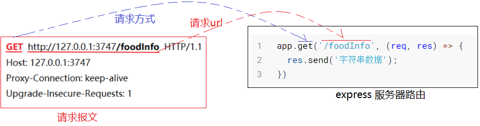

  

- **Post 路由**

  + 匹配条件：浏览器 请求方式 为 **POST 且 路径为 /foodAdd** 时才被调用

  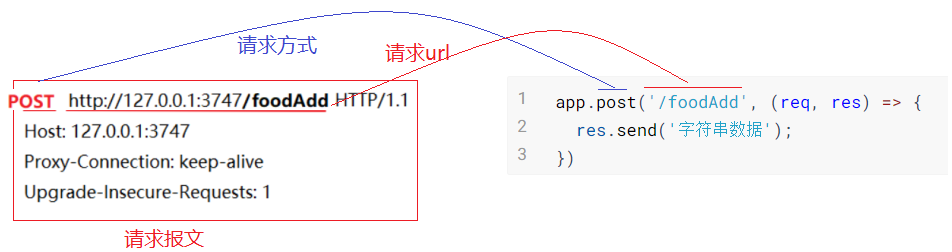


### 6.3 express 返回数据

+ **res.send( 数据 ) 方法**

  在 express 路由方法中，可以使用 响应报文对象 res 来发送数据到浏览器

#### 6.3.1 返回 字符串

```js
app.get('/foodInfo', (req, res) => {
  res.send('讨厌,死鬼~~~！')
})
```

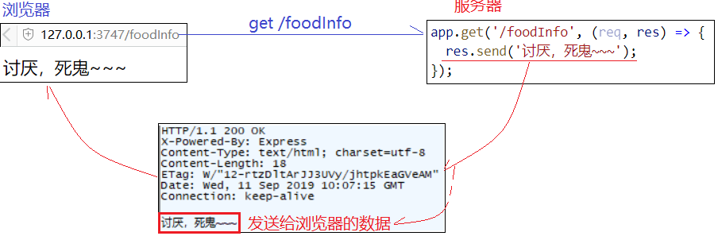

#### 6.3.2 返回 JSON

- 返回一个对象即可，不需要 如 http 模块中 JSON.stringify(对象) 转 JSON字符串
- res.send 方法内部 会 自动将 **对象** 转成 **JSON字符串**

```js
app.get('/foodInfo', (req, res) => {
  res.send({
    name: '泰拳王子播求',
    color: '褐色',
    effect:'鞭腿'
  })
})
```

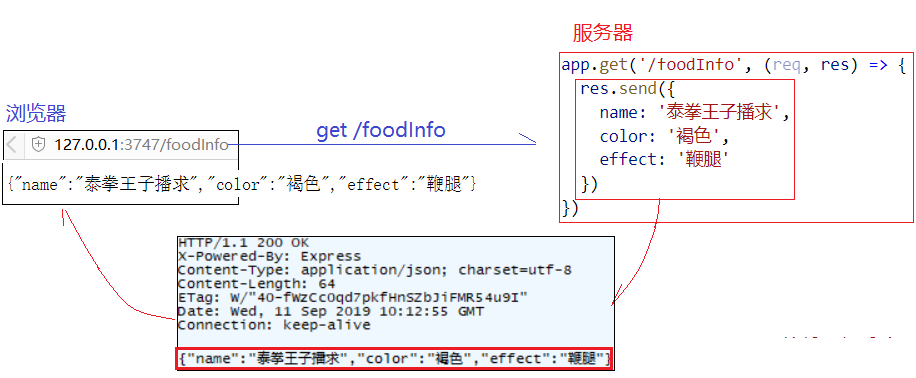

## 二.补充

### 1. 箭头函数里的this

+ 回顾 函数中 的 this
  + 对象.方法()   -> 方法里的 this 就是 . 前面的 对象
  + 全局函数()   ->  方法里的 this 就是 window 对象
+ 箭头 函数中 的 this  
  + 箭头函数中的 this 不是 调用时 绑定的，而是 创建 箭头函数时 绑定的
  + 箭头函数中的 this  就是当前 作用域 本身

### 1. Nodemon全局模块 

> 不建议现在使用

1. 安装`npm i nodemon -g`
2. `nodemon` 文件名即可
3. 自动监视文件的修改，自动重新运行

### 2. vscode 快捷键

1. ctrl+d 选择相同的下一个
2. ctrl+左右 按单词跳转光标
3. ctrl+enter  光标另起一行
