>  第04阶段.NodeJS  - from JamesZou

## 一.核心内容

### 今日目标

+ express 接收 get 和 post 参数
+ express 上传功能
+ express 中间件 - 面向过程 -> 面向对象 -> 面向切面
+ WebHero 接口文档了解

## 1. 自己实现静态资源服务器补充

### 1.1 网站图标（了解）

> ico 图标 用来显示在 浏览器标签的 tab 上，由浏览器自动请求 favicon.ico

+ 准备 ico 图标  
  + 生成 ico图标 ：比特虫 (http://www.bitbug.net/)
  + 将图标保存到 **静态资源根文件夹**
+ 为什么浏览器可以显示图片？
  + 浏览器自动的推断绝大多数的文件类型，用对应的方式展示
+ 虽然浏览器 会自动 请求 ico 图标，但 是 服务端 必须要根据请求 读取，再返回给 浏览器

## 2.Express 操作

### 2.1 exress 路由

> 路由：**对应关系** 就是 指 服务器 端 为 浏览器端 请求的 url 准备好的 方法
>
> 路由 =  请求方式 +  url     , 浏览器 只要请求 某个路由，服务器端 就会执行 对应的 路由方法
>
> **后台地址** 和 **后台逻辑**的对应关系
>
> **后台地址** 和 **回调函数**的对应关系

- Get 路由

  - 匹配条件：浏览器 请求方式 为 **GET 且 路径为 /foodInfo** 时才被调用

  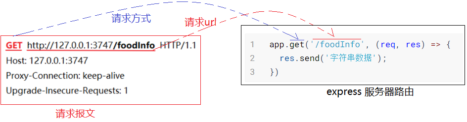


- Post 路由
  - 匹配条件：浏览器 请求方式 为 **POST 且 路径为 /foodAdd** 时才被调用

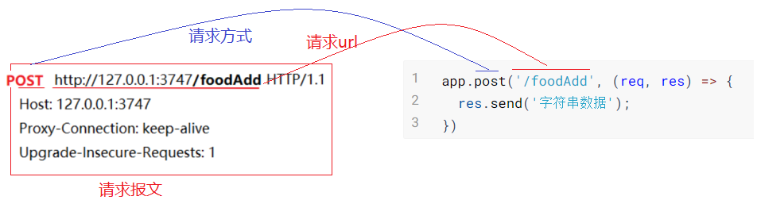


### 2.2 express 返回数据

#### 2.2.1 返回 字符串

```js
app.get('/foodInfo', (req, res) => {
  res.send('字符串');
});
```

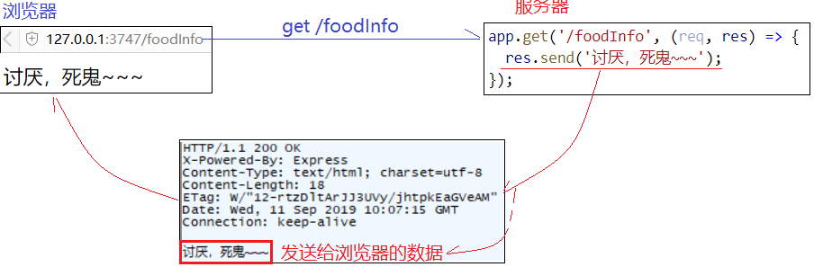

#### 2.2.2 返回 JSON

- 返回一个对象即可，不需要 如 http 模块中 JSON.stringify(对象) 转 JSON字符串
- res.send 方法内部 会 自动将 **对象** 转成 **JSON字符串**

```js
app.get('/foodInfo', (req, res) => {
  let obj = {
    name: '泰拳王子播求',
    color: '褐色',
    effect:'鞭腿'
  };
  res.send(obj); // let str = JSON.stringify(obj);
})
```


## 3. GET 和 POST区别

> 我们看到 请求报文 第一行的 第一个字段 就是 **请求方法**，常用的有 GET 和 POST
> 两种 方法 的区别在哪呢？

+ 简单的说：就是 提交的数据 在 请求报文中 所处的位置和格式 不同
  + 普通情况下：只要是 通过 浏览器地址栏的 修改 访问 服务器，那么 浏览器发出的 都是 **get请求**
  + 普通情况下：只有 通过 表单 method='post' 的情况下，才会 发送 **post请求**

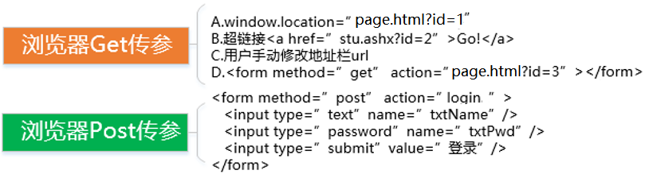

+ 注意：现在  大多数情况 都是直接 通过 异步 发送请求
  + get： 直接 通过 设置 ajax 参数 来 决定是否使用 get 请求
  + post：直接 通过 设置 ajax 参数 来 决定是否使用 post 请求

### 3.1 GET 请求

+ 数据 被 添加到 了 url 中

  如：/login.html?un=james&upwd=123

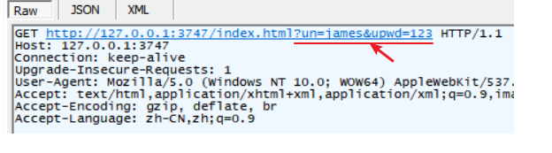

### 3.2 POST 请求

+ 在表单中设置 action 和 method

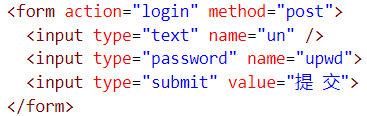

+ 数据 被 放在了 请求报文 体 中

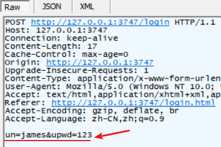

+ Post 提交的数据两种格式
  
  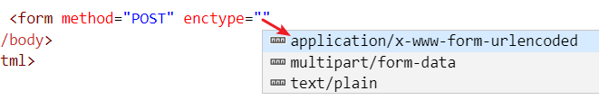
  
  + x-www-form-urlencoded ：一般用在提交表单时使用
  + form-data ：一般用在表单中有需要上传的文件时使用

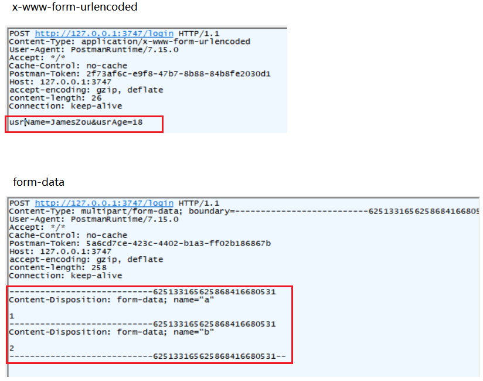

+ 应用场景：

  + 使用 GET 方式传参 - 将数据 放在 url？后传递

    + 当 浏览器 传递参数 是为了 **获取 服务器的数据**，一般使用 GET~~~

    + 比如：页码  **/list.html?pageIndex=3**

      ​				获取指定的文章  **/details.html?id=2**

      

  + 使用 POST 方式传参 - 将数据 放在 请求报文体 中传递

    + 当 浏览器 **要将 数据 发送给 服务器 保存时**，一般使用 POST ~~~ (浏览器发送数据的目的是为了对服务器端的数据做改正或新增，这种情况 就是用 POST)

    + 比如：注册用户 -- 将 用户名 和 密码 保存到 服务器端

      ​             修改/删除 -- 将数据 更新到 服务器端

      ​              上传 -- 将浏览器端的文件数据 保存到 服务器端

### 3.3 小结

+ GET ，数据 是 放在 url 后面。用于 获取 服务端的数据。
+ POST，数据 是 放在 请求报文体中 。 用于 添加或修改 服务端的数据。
  + 两种编码格式：urlencode(key=value&key1=value1) / formdata (数据包)

## 4.请求报文和响应报文对象

> 既然，浏览器可以通过 **get 和 post** 方式向 服务器发送数据，在 **express** 中如何接收 呢？

+ 服务器端 有**两个对象** 来 封装 **请求和响应报文** 的数据和设置方式。

```js
const express = require('express');

// 创建服务器程序
let app = express();

app.use(express.static('./web/'));

// req - 请求报文对象 ，包含了 浏览器发来的数据
// res - 响应报文对象，包含了和准备了 要发送到浏览器的数据
app.get('/showlove', (req, res) => {
  res.send('讨厌，死鬼~~~get');
});

app.listen(3747, (err) => {
  if (err == null) {
    console.log('开启服务器成功：3747');
  } else {
    console.log('开启失败：' + err.message);
  }
});
```

### 4.1.2 express模块的request对象

>  **request** 对象，包含了 浏览器 发来的 **请求报文** 数据。

+ 常用属性

| 属性名              | 属性说明                                                 |
| ------------------- | -------------------------------------------------------- |
| request.originalUrl | 返回 请求的 url                                          |
| request.ip          | 返回浏览器端的ip地址 , 通过套接字获取的ip                |
| **request.method**  | 返回一个字符串：GET / POST                               |
| **request.query**   | 返回浏览器 url? 后的数据                                 |
| **request.body**    | 返回浏览器通过post提交的数据, 一定要使用 body-parser模块 |
| request.cookies     | 返回浏览器发送来的 cookie 键值对                         |


### 4.1.3 express模块的response对象

> **response** 对象，在服务端用来 准备 **响应报文** 并发送会浏览器。

+ 常用属性和方法

| 属性方法名            | 属性说明                                                     |
| --------------------- | ------------------------------------------------------------ |
| res.append('键','值') | 设置响应报文头键值对：append('Content-Type','text/plain;charset=utf-8') |
| **res.send('数据')**  | 向缓存中写入要输出到浏览器的 数据                            |
| res.status()          | 设置 http响应 状态码 : res.status(404).send('Not Found')     |
| res.type()            | 获取 mime 值：res.type('1.html') ->  返回 'text/html'        |
| res.redirect()        | 向浏览器发送重定向命令：res.redirect('./other.html')         |

## 5.express 获取浏览器数据

### 5.1 获取 GET 数据

> 浏览器通过 url 发送来 的 **get参数**，在 express 中应该如何获取呢？

+ 服务器获取方式：**GET参数对象 -> req.query** ，是一个保存了 url? 后参数的 对象
+ 浏览器请求 url ： /searchWaihaoByName?lovername=Linda&age=27

```js
app.get('/showL',(request,response)=>{
  console.log(request.query); // '{lovername:"Linda" , age:27}'
  console.log(request.query.lovername);// 'Linda'
  console.log(request.query.age);// 27

  response.send('你的好心我心领了：你是个好人~~！');
});
```

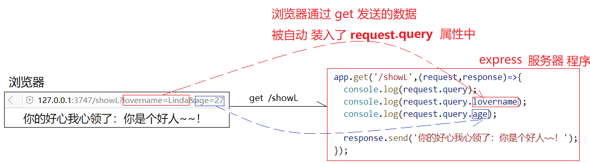

### 5.2 获取 POST 数据

#### 5.2.1 获取两种post数据

+ 回顾：Post 提交的数据两种格式
  + **x-www-form-urlencoded** ：一般用在提交表单时使用
  + **form-data** ：一般用在表单中有需要上传的文件时使用
+ 所以得分两种方式 获取数据
  + 使用 `body-parser模块` 获取 **x-www-form-urlencoded**  方式提交的 POST 数据
  + 使用 `multer模块` 获取 **form-data** 方式提交的 POST 数据
    + 不论 是否 上传文件 ，只要 用 formdata格式提交数据，就可以使用 multer 接收

#### 5.2.1 获取 **urlencoded** 格式数据

+ 需要使用 `body-parser模块` ，POST数据 会解析成对象 存入 **request.body**　属性中

+ 整合步骤

  + 下载`body-parser`

  + 导入

  + 添加 body-parser中间件

  + 在备请求的 路由函数中 通过 **req.body** 获取 POST 提交的数据

  + `body-parser` 的作用

    把请求报文体中的 POST数据 放到  **req.body** 属性中 

```js
const express = require('express');
//1.1 导入 body-parser 包
const bodyParser = require('body-parser');

const app = express();

//2.2 注册 body-parser 中间件：自动 帮我们把 浏览器 发送来的 post 数据 封装到 request.body 中
app.use(bodyParser.urlencoded({ extended: false }));
app.use(bodyParser.json());

// 3.3 获取 浏览器 发送来的 post 参数，并打印
app.post('/reg',function (req,res) {
  console.log(req.body);
  console.log(req.body.txtName);
  console.log(req.body.txtPwd);
})
```


#### 5.2.3 获取 form-data 格式数据

+ 获取 form data 方式 发送的数据 -上传文件

+ 需要使用 `multer模块` 
+ **上传到服务器的三种数据：**
  + POST 文本数据  存入 **request.body** 属性中 ，因为上传表单中可能又其它文本框
  + 上传的文件信息 存入 **request.file** 属性中
  + 上传的文件 存入 **指定的文件夹**，并且会生成随机文件名
+ 整合步骤
  + npm 查
  + 装包
  + 导包
  + 用包

```js
var express = require('express')
var multer = require('multer')
// 创建一个上传文件夹
var upload = multer({ dest: 'uploads/' })

var app = express();

app.post('/uploadFile', upload.single('myUpFile'), function(req, res, next) {
  // req.file 是 `myUpFile` 文件的信息
  console.log(req.file)
  // req.body 将具有文本域数据，如果存在的话
  console.log(req.body) //  { usrName: '泰拳王子播求', skill: '鞭腿' }

  // 响应内容
  res.send('上传成功~~！')
})
```

## 6.express 中间件

### 6.1 中间件的注册

> 中间件：express服务器程序中 一种 面向切面 编程，会在 浏览器 请求任意 路由 之前 调用所有的 中间件函数，然后才去调用 被请求的 路由。

+ 语法：app.use( 中间件函数( req,res,next){   next();   })
+ 中间件函数 和 路由函数 的 对象共享
  + request对象
  + response对象
+ 应用场景：整站权限验证、初始数据准备.....

```js
const express = require('express');
const app = express();

app.use(function (req, res, next) {
  console.log(req.query.id);
  console.log('不管你请求哪个路由，我中间件 都会 先执行哦~~~');
  // 中间件中的 next 函数，指向 后面的 中间件 或者 路由，所以一般都要调用！
  next();
});

app.get('/login', (req, res) => {
  // 在路由中 访问 请求报文对象中的 属性 mylovername
  console.log(req.mylovername); // Ruiky

  res.send(req.mylovername);
})


app.listen(3747, (err) => {
  if (err == null) {
    console.log('开启服务器成功：3747');
  } else {
    console.log('开启失败：' + err.message);
  }
});
```


## 7.项目WebHeroJSON

### 7.1 项目准备

+ 初始化项目 HeroWebJSON
  + `npm init -y` 生成 项目 json文件
  + 注意：项目文件夹 不能有中文
+ 拷贝 静态资源 和 utils 文件夹
  + 将 utils 文件夹 拷贝 项目的 根目录
  + 将 静态资源 拷贝 项目文件夹/web 中

+ 新建 webApp.js 作为 服务器程序
+ 在项目文件夹中 安装 三个 模块： express / body-parser / multer
  + `npm i express body-parser multer`
+ 在 webApp.js 中开始编写 服务器程序
  + 暴露 静态资源文件夹 给浏览器访问

```js
const express = require('express');
const app = express();

//1. 中间件 --------------
//1.1 暴露 静态文件夹
app.use(express.static('web'));

//2. 路由-----------------


// 启动服务器
const PORT = 3747;
app.listen(PORT, (err) => {
  if (err == null) {
    console.log('启动 【英雄项目】服务器成功：' + PORT);
  } else {
    console.log('启动失败:' + err.message);
  }
});
```

### 7.2 功能实现

#### 7.2.1 登录功能

+ 登录接口

  ```js
  // 2.1 注册 登录 路由
  app.post('/login', (req, res) => {
    //a.准备 响应消息对象
    let msgObj = {
      code: 200,
      msg: '登录成功~~！'
    };
    
    //b.判断，如果 登录失败，就 修改 消息对象里的 内容
    if (req.body.username != 'james' || req.body.password != '123456') {
      msgObj.code = 400;
      msgObj.msg = '用户名或密码错误~~！'
    }
  
    //c.向浏览器 发送 消息对象
    res.send(msgObj);
  });
  ```

+ 登录页面   - login.html 

```js
$(function () {
    $('.btn-success').click(login);
  })

  function login() {
    //1.先获取 两个 文本框的值
    let usrName = $('#username').val();
    let usrPwd = $('#password').val();
    //2.简单判断验证 文本框的值 是否符合基本要求（不能为空）

    //3.使用 ajax 异步 发送请求 到 接口 /login
    $.ajax({
      url: '/login',
      method: 'post',
      data: 'username=' + usrName + '&password=' + usrPwd,
      success: function (backData) {
        alert(backData.msg);

        if(backData.code == 200){
          //跳转到 index.html
          window.location = './index.html'
        }
      }
    });
  }
```


## 二.扩展内容

## 1.接口

### 1. 1 接口文档格式

```js
url:地址 - 路由
method:方法 - get/post
参数：可选
返回的数据格式
```

### 1.2 express实现简单接口

+ 笑话接口

```js
url:/joke
method:get
参数:无
返回值: '笑话'
```

#### 注意

1. `/joke` 不是固定的，建议有意义 
2. get,post
   1. get：数据的获取
   2. post：数据的提交，文件的上传
3. 有问题，及时沟通

```js
app.get('/joke',(req,res)=>{ res.send('笑就对了') })
```

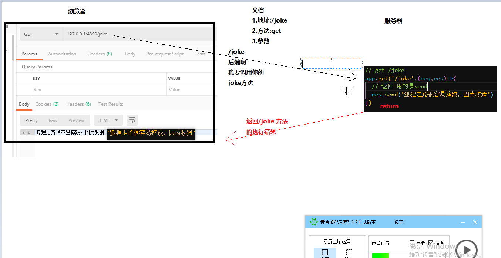

## 2. 工作分工

基于文档开发（主流）

1. （开会讨论，后端..）  先确认所有接口文档

2. 分工干活

   1. 前端:写静态页面->调用接口 

   2. 后端:写接口

      

前端先行（趋势）

1. 原型图
2. 设计图
3. 前端
   1. 写布局
   2. 根据页面，根据需求文档
   3. 推断需要的接口
4. 写接口文档（前端）
5. 使用一些模拟接口的技术，实现接口 
   1. mock.js
   2. node.js简单实现
6. 调优接口文档
7. 后端拿着你写好的文档，去实现接口

## 3. 环境变量

1. 找到你要快捷打开的那个目录 比如cmder的安装目录
2. 右键你的电脑
3. 高级设置 
4. 环境变量
5. path
6. 把复制的地址 新增进去

新增的时候不要乱删 

## 4. 前端开发电脑配置

1. 自己买
   1. 经济不太宽裕：入门级别的游戏本
   2. 不差钱
      1. 写代码：
         1. macbook pro （很多开发环境用macbook ）配置 起来方便很多
         2. 商务本：thinkpad，elitebook(hp)，latitude(dell)
      2. 台式机
         1. 带动4k的显示器
      3. 极致游戏体验
         1. 游戏主机：ps pro版本
2. 公司配
   1. 配置（硬件配置）
      1. cpu：i3,i5,i7, i9, 至强（服务器cpu）
      2. 内存: 8g打底，上不封顶
      3. 硬盘:1t打底，上不封顶
         1. 必须是 固态硬盘
            1. ssd:256打底 
            2. 机械1t打底
      4. 显示器:最好2个  1080居多 1920*1080
      5. 显卡：核显即可
      6. 键盘：
         1. 机械键盘自备，
         2. 不要青轴
      7. 鼠标：
         1. 高级的自备

##  5. 访问自己

127.0.0.1

localhost


