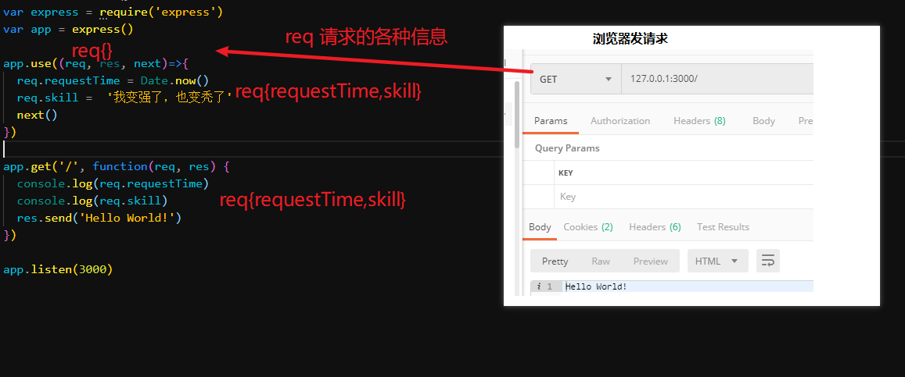

# 英雄管理文档

## 接口 文档

### 状态说明

| *状态码* | *含义*      | *说明*                               |
| -------- | ----------- | ------------------------------------ |
| 200      | OK          | 请求成功                             |
| 201      | CREATED     | 创建成功                             |
| 202      | DELETED     | 删除成功                             |
| 203      | UPDATE      | 更新成功                             |
| 400      | BAD REQUEST | 请求的地址不存在或者包含不支持的参数 |

工作中，不一定状态码一样，

### 准备工作


### 用户登录

请求地址：/login

请求方式：post

请求参数：

| 名称     | 类型   | 说明                     |
| -------- | ------ | ------------------------ |
| username | string | 用户名（正确的是:admin） |
| password | string | 密码(正确的是:123456)    |

返回数据：

| 名称 |  类型  | 说明                                      |
| :--: | :----: | ----------------------------------------- |
| msg  | string | 文字信息  ‘登录成功’   ‘用户名或密码出错’ |

```js
{
    msg:"登录成功 或者  用户名或密码错误",
    code:200 或者 400,
}
```

#### 实现步骤

1. 整合body-parser的代码
2. 注册路由 `app.post(/login)`
3. 回调 函数
   1. 接收数据 用户名 密码
   2. 判断
      1. 对 200 成功
      2. 错 400 用户名 或密码错误

#### 重点

1. post文本的获取 `req.body` 对象
2. 登录失败的提示信息`用户名或密码错误`
   1. 不精确提示的目的是防止恶意的登录
3. 标准的用户名或密码判断
   1. 一个用户的列表中，判断 用户名和密码是否存在

### 英雄列表

请求地址：/list

请求方式：get

请求参数：无

返回数据：

| 名称  |  类型  | 说明     |
| :---: | :----: | -------- |
|  id   | number | 英雄id   |
| name  | string | 英雄姓名 |
| skill | string | 英雄技能 |
| icon  |  file  | 英雄头像 |

```js
{
    msg:"获取成功",
    code:200,
    data:[
        {
            id:1,
            name:"盖伦",
            skill:"草丛伦",
            icon:"/imgs/盖伦.png"
        },
        {
            id:2,
            name:"赵信",
            skill:"枪出如龙",
            icon:"/imgs/赵信.png"
        }
    ]
}
```

####  实现步骤

1. 注册路由 `app.get(/list)`
2. 回调函数中
   1. 获取英雄的列表数据 `db.getHeros()`
   2. 返回获取到的列表数据
      1. msg:’
      2. code:200
      3. data

#### 注意点

1. 是不是所有的接口都有参数？
   1. 不一定
2. 返回的提示消息是不是固定的？
   1. 接口文档不是写好就固定了，如果有必要可以讨论并修改
   2. 有问题，要找人沟通


### 英雄新增

请求地址：/add

请求方式：post

请求参数：请使用formData的方式提交

| 名称  |  类型  | 说明     |
| :---: | :----: | -------- |
| name  | string | 英雄姓名 |
| skill | string | 英雄技能 |
| icon  |  file  | 英雄头像 |

返回数据：

| 名称 |  类型  | 说明                              |
| :--: | :----: | --------------------------------- |
| msg  | string | 文字信息  ‘新增成功’ 或‘参数错误’ |

```js
{
    msg:"新增成功" 或 "参数错误",
    code:201 或 400,
}
```

#### 实现步骤

1. `multer`代码整合
2. 注册路由`app.post(/add)`
3. 回调函数中
   1. 文件 req.file
   2. 文本 req.body
   3. 保存数据`db.addHero({name:'jack',skill:'hashake',icon:"/imgs/盖伦.png"})`
      1. true :成功 201
      2. false:失败  400

##### 注意点

1. ajax中文件的上传一定要用 formData吗?
   1. 图片转为base64,转为base64
2. 文件上传`multer`
   1. req.file 文件
   2. req.body 文本

### 英雄删除

请求地址：/delete

请求方式：post

请求参数：

| 名称 |  类型  | 说明   |
| :--: | :----: | ------ |
|  id  | number | 英雄id |

返回数据：

| 名称 |  类型  | 说明                                  |
| :--: | :----: | ------------------------------------- |
| msg  | string | 文字信息  ‘删除成功’  或者 ‘参数错误’ |

```js
{
    msg:"删除成功" 或 "参数错误",
    code:202 或400,
}
```

#### 实现步骤 

1.  注册路由`app.get(/delete)`
2. 回调函数
   1. 获取数据  req.body 对象 `body-parser`
   2. 删除数据`db.deleteHeroById(2)`
      1. true:  202 成功 
      2. false: 400  失败


#### 注意点

1. 删除一般会传递一些数据的标示去服务器一般 是id 
   1. id 理解为身份证
2. es6新语法 要用
3. 网站的数据被删掉了，是不是真的没有了？
   1. 不是，数据始终都在
4. 数据为什么保留？
   1. 数据是有价值的，数据量足够大之后，可以用来分析一些内容  （大数据）
   2. 都会保存起来

### 英雄查询

请求地址：/search

请求方式：get

请求参数：

| 名称 |  类型  | 说明   |
| :--: | :----: | ------ |
|  id  | number | 英雄id |

返回数据：

| 名称 |  类型  | 说明                              |
| :--: | :----: | --------------------------------- |
| msg  | string | 文字信息  ‘查询成功’   ‘参数错误’ |

```js
{
    msg:"查询成功" 或 "参数错误",
    code:200 或 400,
    data:{
		id:1,
         name:"盖伦",
         skill:"草丛蹲",
         icon:"/imgs/赵信.png"
    }
}
```

#### 实现步骤

1. 注册路由`app.get(/search)`
2. 回调函数
   1. 获取数据 req.query id
   2. 调用方法 获取数据 `db.getHeroById(1)`
      1. 有数据：200 成功
      2. false: 400 失败

#### 重点

1. 接口套路

   1.  获取数据（如果有的话）
   2.  操纵数据
   3.  返回结果

   

   2.获取数据时唯一标记 id

   

   ​    

### 英雄编辑

请求地址：/edit

请求方式：post

请求参数：请使用formData的方式提交

| 名称  |  类型  | 说明     |
| :---: | :----: | -------- |
|  id   | number | 英雄id   |
| name  | string | 英雄姓名 |
| skill | string | 英雄技能 |
| icon  |  file  | 英雄头像 |

返回数据：

| 名称 |  类型  | 说明                              |
| :--: | :----: | --------------------------------- |
| msg  | string | 文字信息  ‘修改成功’   ‘参数错误’ |

```js
{
    msg:"修改成功" 或 "参数错误",
    code:203 或 400,
}
```

#### 实现步骤

1. 注册路由`app.post(/edit)`
2. 回调 函数 
   1. 获取文件 req.file icon->filname
   2. 获取文本 req.body id,name,skill
   3. 修改数据`db.editHero({ id: 1, name: '提莫', skill: '种蘑菇', icon: '/imgs/盖伦.png' })`
      1. true:203 成功
      2. false:400 失败

#### 重点

1. 修改 除了修改的数据之外，一般还需要一个数据的标记
   1. id
2. 任何一个技能的使用 从0到1 最难，从1到n会越来越简单


#### 练习

接口写好之后，可以用其他资料中的 demo 进行调用

自己写接口，自己调接口 

明天上午把写好的代码发到微信群

## 中间件

### 基本概念

中间件是，请求   和   响应  之间 额外注册的**回调函数**！！！

 	1. 服务器接收请求的时候 会执行注册的回调函数
 	2. 执行的顺序，按照编写的顺序执行
 	3. next（）执行下一个回调函数，如果不写？
      	1. 卡在某个回调函数


### 自定义中间件

1. 中间件中的 **req对象 是 共享的**
2. 上面添加的属性 后面 可以用



### 第三方中间件

1. body-parser的本质
   1. 往 **req上面加 body属性**
   2. 内部 把post请求的数据  解析出来 并且 添加到了body属性中
2. multer
   1. **req上面加了 body属性**
   2. **req上面加了 file属性**


## 补充

### 软删除

数据真的被删了？

修改了一个 标记

这种通过修改标记的方式 让数据看起来被删除的形式 称之为 软删除

软删除 的本质 是 修改

### 接口允许  跨域   访问

使用`cors`这个模块即可

### 我的输入法

1. 输入法 
   1. 全拼
   2. 双拼
   3. 五笔
2. 双拼
   1. 所有字分成2个按钮
   2. 第一个字母 拼音的左边
   3. 第二个字母 拼音 的右边
3. 欢迎
   1. 全拼：huanying
   2. 双拼:hryk
4. 冥想
   1. 全拼:mingxiang
   2. 双拼:冥想 mkxl
5. 小鹤双拼
   1. 很多输入法自带了


