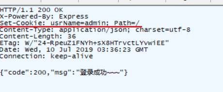
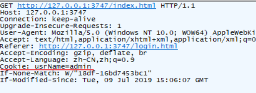
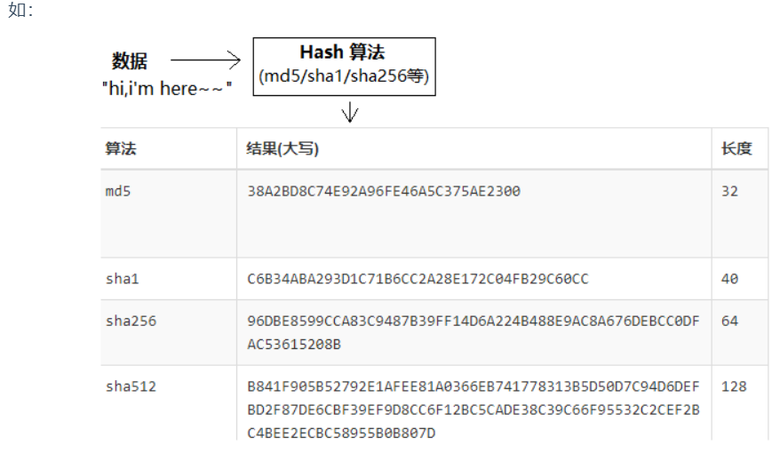

## Day05 完成项目

### 1.复习

### 2.功能完善

+ 服务器端判断

### 3.功能完成

+ 新增
  + 获取数据并验证
    + 前端验证：js 验证
    + 后端验证：服务器端 验证
  + 提交数据并保存
    + 前端提交：使用 ajax 提交到 服务器对应 接口
    + 后端提交：
+ 修改
  + 找 服务器 获取 修改页面的 html 页面，并且在 url 后加入 要修改的英雄id
  + 在修改页面中
    + 通过 js 获取 url 中的 id 值
    + 发送 异步请求 服务器端的 查询接口 获取 英雄信息
    + 将返回的 要修改的英雄信息 显示到 表达元素中(文本框、图片)
    + 保存按钮被点击时，将 修改后的数据 提交到服务器的 修改接口


### 4.cookie

#### 4.1 作用

- cookie 是在浏览器端 保存少量数据的一种技术
- 通常用来 保存一些 不敏感的 数据

#### 4.2 报文中的cookie

- 在服务器端 

  通过 `response.cookie('键','值')` 就可以 向响应报文中  写入 一个 cookie



- 在浏览器端

  一旦 接收到了 cookie，就会保存在浏览器缓存或者硬盘中（取决于是否设置了失效时间）

  之后 访问 这个 网站 页面时，浏览器会 自动 **将 cookie 夹在请求报文中** 发给服务器




#### 4.3 Cookie 保存的方式

- 【缓存 Cookie】 

  - 服务器端 发送cookie时 **未指定失效时间**，浏览器就会将 这个 cookie存入浏览器缓存
  - 特点：浏览器 一关闭，cookie就会销毁  

  ```js
  response.cookie('usrName', 'jameszou');
  ```

  

- 【硬盘Cookie】

  - 服务器端 发送cookie时 **设置了失效时间** ，浏览器就会将这个Cookie存如浏览器客硬盘

  - 特点： 浏览器关闭，cookie不会销毁

    ​              一旦到期，就会从硬盘中 销毁

  ```js
  response.cookie('usrName', 'linda', { maxAge: 30000 });
  ```

  

#### 4.4 cookie使用思路

+ 下载 cookie-parser 模块
+ 导入 模块
+ 注册 cookie-parser 中间件
+ 服务器 向 浏览器 发送 cookie   `res.cookie('key','value')`
+ 服务器 接收 浏览器 发来的 cookie `req.cookie.key`

### 5.使用Cookie实现登录验证

#### 5.1 登录成功发送cookie

```js
serverApp.post('/login', (request, response) => {
  let { username, password } = request.body;
  if (username == 'admin' && password == '123456') {
    // 3.向 浏览器 端 发送 一个 cookie 数据（userName = 'admin'）
    response.cookie('usrName', username, { maxAge: 30000 });

    response.send({
      code: 200,
      msg: '登录成功~~~'
    });
  } else {
    response.send({
      code: 400,
      msg: '登录失败啦~~~~'
    });
  }
})
```


- 注意：由于服务器 在验证 登录成功后，向 浏览器 发送了一个 cookie数据
  - 之后 浏览器 访问 服务器 都会  自动 把 cookie数据 加入到 请求报文中
- 服务器 就可以 通过 检查 请求报文中 是否 包含 这个 cookie数据 来验证 该浏览器是否 登录成功过！！！

#### 5.2 路由中验证cookie

- 服务端判断cookie 
  - 使用 cookie-parser 模块
  - 注册 cookie-parser  中间件
  - 通过 `request.cookie.属性名` 验证

```js
// 1. 导入 cookiePaser 组件：用来 将 请求报文中的 cookie数据　存入 requset.cookie 属性
const cookieParser = require('cookie-parser');

// 2. 将 cookiePaser 注册到 中间件中
serverApp.use(cookieParser());

serverApp.get('/list', (request, response) => {
  // 4 验证 浏览器端是否 发送来的 cookie 数据
  if (request.cookies.usrName == undefined) {
    response.send({
      code: 501,
      msg: '对不起，您的身份未登录，请重新登录~~！',
      backUrl: '/login.html'
    });
  } else {
    response.send({
      code: 200,
      msg: '获取数据成功',
      data: [
        { id: 22, name: '魔裟斗', skill: '勾拳', icon: '3.jpg' }
      ]
    });
  }
});
```

### 6.Session

+ Session 是一种在服务器端保存数据的技术


```js
var cookieSession = require('cookie-session')
var express = require('express')
 
var app = express()
 
//1.注册 session 中间件 ，并设置 sessionid 名字，同时设置 盐值
app.use(cookieSession({
  name: 'session',
  keys: ['James', 'Linda']
}))

//2.使用自定义中间件 设置 session 失效时间
app.use(function (req, res, next) {
  req.sessionOptions.maxAge = req.session.maxAge || req.sessionOptions.maxAge
})
 
app.listen(3000)
```

## 二、扩展内容

### 1.保存密码 hash

#### 1.1 hash介绍

- 摘要算法：世界上没有两片完全相同的叶子，提取叶子的特点就是摘要

- hash算法：可以将任意数据 生成 固定长度 的 16进制 字符串 【[在线工具](http://tool.oschina.net/encrypt?type=2)】

  并且，只要数据一样，那么不管计算多少次都会获得同一个 16进制 字符串

- 常见hash算法：**md5，sha1，sha256，sha512 等，都是摘要算法(Message Digest)**

  他们的**区别**：除了内部算法之外，最大的区别就是 生成的 hash值长度不一样



#### 1.2 nodejs 使用hash

- hash 算法，下载 `hash.js` 模块

```js
const hash = require('hash.js');

let password = 123456;
//将 密码 转成 sha256 的hash值字符串 64位
password = hash.sha256().update(password).digest('hex');
// 结果：‘8d969eef6ecad3c29a3a629280e686cf0c3f5d5a86aff3ca12020c923adc6c92’
```

- md5 算法，下载 `md5.js` 模块

```js
var MD5 = require('md5.js')
console.log(new MD5().update(123456).digest('hex'));
```

- 注意：数据库中 `密码字段` 要根据使用的 hash 算法修改字段的字符容量

### 2. Cookie加强

> express 中的 Cookie 技术可以设置很多参数，以实现不同功能

#### 2.1 domain:域名

- 设置子域名（二级域名）是否可以访问cookie。

- 例：domain:'.主域名'  name=value：键值对，可以设置要保存的 Key/Value，注意这里的 name 不能和其他属性项的名字一样

  ```js
  response.cookie('usrName', 'Linda', { domain:'ditu.baidu.com'});
  ```

#### 2.2 expires:过期时间

- 单位：毫秒
- 浏览器会 将 设置了 过期时间的 cookie存在 浏览器端的硬盘中
- 在设置的某个时间点后该 Cookie 就会失效

#### 2.3 maxAge:失效时间

- 单位：毫秒

- 设置在多少毫秒后失效 -- 会自动计算 转换为 expires

  ```js
  response.cookie('usrName', 'Linda', { maxAge: 5 * 60 * 1000 });
  ```

#### 2.4 secure

- 当 secure 值为 true 时， cookie 在 **HTTP** 中是无效，在 **HTTPS** 中才有效

#### 2.5 path

- 表示 cookie 影响到的路由，如 path=/。如果路径不能匹配时，浏览器则不发送这个 Cookie

- 如果 服务端 发送 cookie 给 浏览器时设置了 path　如：

  ```js
  response.cookie('usrName', 'Linda', { path:'/usr', maxAge: 5 * 60 * 1000 });
  ```

  

- 所以：当浏览器　再次　请求　该服务器时，会先检查　URL中是否 包含 `/usr`

  - 如果 包含，就会把 这个 cookie  随请求报文 发到 服务器

  

  - 如果 不包含，就不会把 这个 cookie 发到服务器

  


#### 2.6 httpOnly

- 默认为false,建议设置为true, 客户端将无法通过document.cookie读取到 COOKIE 信息，可防止 XSS 攻击产生

#### 2.7 signed

- 表示是否签名（加密） cookie，需要设置cookieParser中间件设置盐值

  - 设为 false 不会对这各 cookie签名，用 res.cookies 访问

  - 设为 true 会对这个 cookie 签名，   用 res.signedCookies 访问

    注意：被篡改的签名 cookie 会被服务器拒绝，并且 cookie值会重置为它的原始值

- 步骤：

  - 1.设置 cookie 参数对象的 signed = true

  - 2.需要 设置 签名 标识，用来对cookie数据 做签名使用

    serverApp.use(cookieParser('签名用的 标识数据字符串'));

  - 3.服务器端 获取 签了名的cookie 需要使用 `request.signedCookies`

```js
app.use(cookieParser('gofront2577')); // 传入 cookie签名 '盐值' -- 增加签名生成的复杂度

app.post('/login', (req, res) => {
    // ...
    // 向浏览器发送 cookie 时，可以设置 使用签名
	res.cookie('usrName', 'JamesZou', { signed: true, maxAge: 5 * 60 * 1000 });
}
```


### 3.数组高级扩展函数

#### 3.1 filter方法

#### 3.2 map 方法