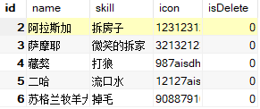

> 第04阶段.NodeJS  - from JamesZou

## Day06 MYSQL_跨域

+ 今日目标
  + 跨域
  + MySql数据库的安装与使用
  + 使用SQL语句完成增删改查
  + 使用node第三方mysql模块操作数据库

### 1.跨域

+ 同源：浏览器访问的页面和页面上使用的资源 来自于 同一台服务器
+ 跨域：浏览器访问的页面和页面上使用的资源 来自于 不同的服务器
+ 跨域检查：
  + 浏览器在检查
  + 检查的目标：只检查 异步对象 是否跨域请求
  + 检查的手段：查看 异步对象 的 响应报文头 中 是否 包含 `'Access-Control-Allow-Origin'`
    + 如果包含，说明 服务器 允许 异步对象跨域请求
    + 如果不包含，说明 服务器 不允许，所以会导致 浏览器 报错！

+ 解决 跨域异步对象检查 的方案
  + 服务端方案：再响应报文头中加入 状态行 `Access-Control-Allow-Origin:*`
    + 如果 你很懒，可以使用 `cors` 模块，帮你 添加 这行 状态 行
  + 浏览器端方案：JsonP - 本质上 使用 scirpt标签 来完成 跨域请求

### 2.JSONP

+ 原理：基于 浏览器 对 script 标签的 跨域请求 不做任何检查限制

+ 思路：

  + 浏览器端 通过 js  动态 创建 script 标签，设置 跨域 路径 给 src属性

    + 两个url参数： 
      + 随机数：防止 使用  浏览器端缓存
      + callback：将 页面上 准备好的 js 方法 的名字 传给 服务器

  + 浏览器 将 创建好的 script 添加到 dom树中，浏览器 会 自动 根据 script标签 发送请求 到服务器

  + 服务器

    + 接收 callback 参数中的  js方法名 `let mName = req.query.callback`

    + 将 要发给 浏览器的 数据 准备好 ：一般 是 使用 json格式的字符串

    + 将 js方法名 与 json格式数据字符串 拼接成 js方法调用语法，发给浏览器

      `res.send('mylove("json格式的数据字符串")')`

      


- 跨域：不同源访问 -- 浏览器 访问 服务器A，获得页面上 通过 请求 服务器B 的资源(页面、图片...)

  具体的说：协议+IP+端口 有一个 不一样，就算是跨域

- 浏览器并不是禁止所有的 跨域，因为并不是所有的跨域请求都有安全风险

- 浏览器禁止跨域：不允许使用 Ajax请求 跨域 (XMLHttpRquest)

- 浏览器 不会 禁止 标签跨域请求：

  - img
  - script
  - link

### 2.MYSQL数据库

#### 2.1 怎么保存数据呢？

+ 自己建文件保存
  + 特点：
    + 将数据保存在硬盘文件中
    + 读写文件操作权限控制
    + 数据增删改查(CRUD)操作
    + 数据存储格式和顺序
    + 数据查找的速度和准确度
    + .......
+ 使用 专业数据库软件 来保存
  + 特点：
    + 本质也是将数据保存在硬盘文件中
    + 数据压缩和加密
    + 数据库权限控制（管理员、操作员...）
    + 数据查找的速度和准确度
    + 分布式数据库的部署
    + .....
  + 简而言之：海量存储、查找速度快、并发性问题控制、安全性、数据完整性(保存在数据库中的数据是正确，真实)。
  + 常见数据库：**mysql** ， orcle , sqlserver , nosql ,mongdb.....

#### 2.2 MySQL数据库

+ 概念：数据库就是存放数据的仓库
+ 功能特点：中型数据库，开源，免费，速度很快，分布式...

##### 1.2.1 安装数据库

> 单独安装 mysql 数据库比较麻烦，卸载很难卸干净，所以使用 一款叫做 phpstudy 全家桶 的软件

+ 使用 phpstudy 全家桶
  + 装一个软件，内部已经帮你整合一堆，开发需要的软件


+ 安装方式
  + 解压
  + 点击 phpxxx.exe
  + 选择一个非中文目录
  + 点击安装 稍等片刻即可
  + 所有对话框都选择  `同意`

+ 使用方式


##### 1.2.2 数据库运作关系


##### 1.2.3 库/表/列


### 2.3 SQL语句(命令)



#### 2.3.1 查询命令

+ 用来查询 数据库 中的 指定表 的 行列信息

+ 语法：`select * from 表名`

```sql
--查询 所有行 所有 列
select * from heroinfo
--查询 所有行 指定的 列
select name,skill from heroinfo

--查询 指定行 所有列
select * from heroinfo where id = 2
--查询 指定行(多条件) 所有列    or || / and &&
select * from heroinfo where id=1 or id = 2

-- 查询 技能列 以 拆字 开头的 所有行
select * from heroinfo where skill like '拆%'
-- 查询 技能列 包含 拆字 的 所有行
select * from heroinfo where skill like '%拆%'
```

#### 2.3.2 删除命令

+ 用来删除表中的 行

+ 语法：`delete from 表名 where id=1`

```sql
-- 删除 id = 1 的行
delete from heroinfo where id = 1
-- 删除 id = 1 和 id = 2 的行
delete from heroinfo where id = 1 or id = 2
```

#### 2.3.3 更新命令

+ 修改行中的列的值

+ 语法： `update 表名 set 列名1=新值1 , 列名2=新值2 ..... where id = 1`

```sql
--修改 单行 某列 的值
update heroinfo set skill = '卖萌' where id = 5
--修改 单行 多列 的值
update heroinfo set skill='拆家' where id =1
-- 修改 所有行 多列的值
update heroinfo set skill='流口水' , isdelete=1
-- 修改 多行 单列 的值
update heroinfo set skill='睡觉和卖萌' where id = 5 or id = 6
```

#### 2.3.4 新增命令

+ 语法：`insert into 表名 (列名1,列名2,列名3.....) values( 值1, 值2 , 值3 .....)`

```sql
-- 新增 3列，表中的 id列 自动生成，isdelete列有默认值
insert into heroinfo (name,skill,icon) values ('二哈','流口水','12127aisdhfausdfhp')
-- 新增 4列（isdelete列带默认值，但如果新增，就会使用指定值 ）
insert into heroinfo (name,skill,icon,isdelete) values ('苏格兰牧羊犬','掉毛','9088791028a379ha',1)
```


### 4.使用mysql模块操作数据库

#### 4.1 使用 mysql 查询数据库

+ 过程：
  + 下载包 mysql
  + 导入包 mysql
  + 创建连接通道 （需要指定参数：ip，用户名，用户密码，要操作的数据库名称）
  + 打开连接通道 `连接通道.connect();`
  + 执行 sql 语句，调用 `连接通道.query( sql语句，回调函数( 错误对象，查询结果 ， 字段信息 ){  } )`
    + **注意：查询结果** 
      + 如果 查到了，返回的 是一个 数组
      + 如果没查到，返回 的 是一个 空数组 , 不是 null / undefined
  + 关闭连接通道 `连接通道.end();`
+ 参考代码

```js
// 0.导入 mysql 模块
const mysql = require('mysql');

// 1.创建 连接通道 对象
var connection = mysql.createConnection({
    host: 'localhost', // 数据库所在的 电脑 ip
    user: 'root', // 数据库 登录名
    password: 'root', // 数据库 登录密码
    database: 'hero' // 要操作的 数据库名称
});

// 2.打开连接 （拨通电话）
connection.connect();

// 3.通过 连接通道 发送 sql 命令
// 回调函数的 3个参数： 错误对象，查询结果(用的很多)， 字段信息(用的不多)
connection.query('select * from heroinfo', (err, result, fieldinfo) => {
    if (err == null) {
        // console.log('查询结果：');
        // console.log(result); // 返回的是 查询到 的 表格行 转成的 数组，数组中保存的 是 对象
        console.log('查询到的行数：' + result.length);
        
        // 遍历  查询结果 数组（数组中每个元素 就是一个 行对象，里面包含 所有字段）
        for (let i = 0; i < result.length; i++) {
            // 取出 数组中 一个 行对象
            let heroObj = result[i];
            // 依次打印 对象中的 每个 字段
            console.log(heroObj.id);
            console.log(heroObj.name);
            console.log(heroObj.skill);
            console.log(heroObj.icon);
            console.log(heroObj.isDelete); // 注意1：js 中 区分 大小写
            // console.log(Boolean(heroObj.isDelete)); // 注意2：Boolean方法 无法直接对 二进制数据 做 正确转换
        }

        // console.log('字段信息:');
        // console.log(fieldinfo);
    } else {
        console.log(err.message);
    }

    //4.关闭 连接通道（挂电话）
    connection.end();
})
```

#### 4.2 使用 mysql 新增

+ 思路：

  + 和 查询思路步骤一致

  + 不同之处：

    + 自行后的 结果  - result 不是一个数组，而是 一个 对象

    ```js
    {
        fieldCount: 0,   
        affectedRows: 1,  -- 受影响行数
        insertId: 8,      -- 如果 是 新增语句，此处 返回的 数据库生成的 id 号 
        serverStatus: 2, 
        warningCount: 0, 
        message: '',     
        protocol41: true,
        changedRows: 0   
    }
    ```

#### 4.3 使用mysql 修改

+ 思路

  + 和 查询思路步骤一致
  + 不同之处：
    + 执行后的结果 - reuslt

  ```js
  {
      fieldCount: 0,   
      affectedRows: 1,  -- 受影响行数
      insertId: 0,
      serverStatus: 2, 
      warningCount: 0, 
      message: '',     
      protocol41: true,
      changedRows: 1   -- 真正在数据库完成修改的行数
  }
  ```

#### 4.4 使用mysql 删除

+ 思路
  + 和 查询思路步骤一致
  + 不同之处：
    + 执行后的结果 - reuslt

  ```js
  {
      fieldCount: 0,   
      affectedRows: 1,  -- 受影响行数 (真正在数据库完成修改的行数)
      insertId: 0,
      serverStatus: 2, 
      warningCount: 0, 
      message: '',     
      protocol41: true,
      changedRows: 0  
  }
  ```

  

## 扩展内容

+ 查询

```js
var mysql  = require('mysql');  
 
var connection = mysql.createConnection({     
  host     : 'localhost',       
  user     : 'root',              
  password : 'root',       
  port: '3306',                   
  database: 'test' 
}); 
 
connection.connect();
 
var  sql = 'SELECT * FROM websites';
//查
connection.query(sql,function (err, result) {
        if(err){
          console.log('[SELECT ERROR] - ',err.message);
          return;
        }
 
       console.log('--------------------------SELECT----------------------------');
       console.log(result);
       console.log('------------------------------------------------------------\n\n');  
});
 
connection.end();
```

+ 新增

```js
var mysql  = require('mysql');  
 
var connection = mysql.createConnection({     
  host     : 'localhost',       
  user     : 'root',              
  password : 'root',       
  port: '3306',                   
  database: 'test' 
}); 
 
connection.connect();
 
var  addSql = 'INSERT INTO websites(Id,name,url,alexa,country) VALUES(0,?,?,?,?)';
var  addSqlParams = ['菜鸟工具', 'https://c.runoob.com','23453', 'CN'];
//增
connection.query(addSql,addSqlParams,function (err, result) {
        if(err){
         console.log('[INSERT ERROR] - ',err.message);
         return;
        }        
 
       console.log('--------------------------INSERT----------------------------');
       //console.log('INSERT ID:',result.insertId);        
       console.log('INSERT ID:',result);        
       console.log('-----------------------------------------------------------------\n\n');  
});
```

+ 更新

```js
var mysql  = require('mysql');  
 
var connection = mysql.createConnection({     
  host     : 'localhost',       
  user     : 'root',              
  password : 'root',       
  port: '3306',                   
  database: 'test' 
}); 
 
connection.connect();
 
var modSql = 'UPDATE websites SET name = ?,url = ? WHERE Id = ?';
var modSqlParams = ['菜鸟移动站', 'https://m.runoob.com',6];
//改
connection.query(modSql,modSqlParams,function (err, result) {
   if(err){
         console.log('[UPDATE ERROR] - ',err.message);
         return;
   }        
  console.log('--------------------------UPDATE----------------------------');
  console.log('UPDATE affectedRows',result.affectedRows);
  console.log('-----------------------------------------------------------------\n\n');
});
 
connection.end();
```

+ 删除

```js
var mysql  = require('mysql');  
 
var connection = mysql.createConnection({     
  host     : 'localhost',       
  user     : 'root',              
  password : 'root',       
  port: '3306',                   
  database: 'test' 
}); 
 
connection.connect();
 
var delSql = 'DELETE FROM websites where id=6';
//删
connection.query(delSql,function (err, result) {
        if(err){
          console.log('[DELETE ERROR] - ',err.message);
          return;
        }        
 
       console.log('--------------------------DELETE----------------------------');
       console.log('DELETE affectedRows',result.affectedRows);
       console.log('-----------------------------------------------------------------\n\n');  
});
 
connection.end();
```


