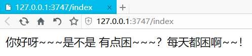

> 第04阶段.NodeJS  - from JamesZou

## 自定义模块 与 路由

NodeJS 七天课 核心目标：

+ hero项目改造 - Mysql版
+ 自定义模块
+ 自定义路由
+ hash值
+ cookie与session
+ 验证码图片
+ 微服务 docker *
+ 具体知识点：**vue框架（基础好的可以研究源码），vue项目，微信小程序**，react，TypeScript(自学)，不要求 死记硬背，但是 要 知道，看到之后能理解，业务(增删改查、各种框架的灵活应用)需要时能想到！

### 0.复习

+ ES6：let , const , 箭头函数 - this 是在函数声明时确定（箭头函数中没有 this，是从上下文中获取的 this）

+ NodeJs ：V8引擎负责执行js代码、内置模块、第三方模块(express 第三方web服务模块)

+ request,response  - `app.get('/list',function(request,response ){`    })

+ express模块 接收浏览器数据：

  + get -  url?id=1  -> req.query.id
  + post
    + urlencode - `body-parser` - 封装请求报文体数据 装入 req.body
    + formdata - 接收浏览器数据    第三方模块：`multer` 上传文件

+ express 模块：继续更新网站功能，跨域（cors模块）

  + 浏览器端解决方案 - jsonp (script标签)

  + 服务器端解决方案 - 响应报文头中 添加 状态行： 

    `Access-Control-Allow-Origin:*`


### 1.JSONP（开发中基本不用）

+ 跨域：不同源访问 -- 浏览器 访问 服务器A，获得页面上 通过 请求 服务器B 的资源(页面、图片...)

  具体的说：协议+IP+端口 有一个 不一样，就算是跨域

+ 浏览器并不是禁止所有的 跨域，因为并不是所有的跨域请求都有安全风险
+ 浏览器禁止跨域：不允许使用 Ajax请求 跨域 (XMLHttpRquest)
+ 浏览器 不会 禁止 标签跨域请求：
  + img
  + script
  + link
  + iframe

### 2.自定义模块

+ 功能：在 nodejs 中，要让 1.js 文件中的内容 能被 其他 js 文件使用，则 需要 使用 导出语法
+ 两种导出方式：
  + **module.exports**
    + 可以 直接 设置 数据  `module.exports = 123`
    + 可以 直接 设置 对象 `module.exports = { name:'James' , age:18 }`
  + **exports**
    + 只能 设置 对象 `exports = { name:'James' , age:18 }`
    + exports.新属性 = 新的值
+ 在另一个文件中 导入
  + `require` 方法   `let a = require('./1.js');`

> NodeJS 支持自定义模块

#### 2.1 模块类别

+ NodeJs 内置模块 - 安装 NodeJS 就已经装好了 的 模块
+ 第三方模块 - 需要在 npm 下载的 模块
+ 自定义模块 - 自己写的模块，项目中自己使用

#### 2.2 自定义模块作用

+ 当项目中的业务多起来时，一个js 文件 写的代码太多，不容易维护，可以使用自定义模块来划分代码
+ 想将自己的一些有重用价值的代码打包好，供其他项目使用，可以使用自定义模块来打包代码

#### 2.2 使用外部 js 文件

> 单纯的 通过 require 引入 另一个 js 文件，代码 都会执行

+ 01myModule.js

```js
let usrName = '小白白';
console.log(usrName);
```

+ 02useMyModule.js

```js
const myModule = require('./01myModule.js');
console.log('我是02页面~~~');
```

#### 2.3 自定义模块

+ 关键语法：
  + module.export  用来在 js 文件中导出对象

    module.export 是 nodejs 中的 一个 特殊 属性，用来 在js之间 传递 数据

  + require

    在一个 js 文件中 可以 通过 require 关键字 把 另一个 js文件中 引入 module.exports 的内容 给 获取到


### 3.自定义路由

> 问题：当服务器程序 webapp.js 中 有 1000个路由，管理使用很麻烦，所以 可以 使用 自定义路由 来 为这些路由函数 做 分类！拆到 不同的 路由js 文件中。 /add  /list  /delete  /update  

#### 3.1 自定义路由作用

+ 当我们 一个项目中 注册了很多路由时，放在一个 js 文件中 会不便于管理
   所以，我们可以 把 不同业务类别的 路由 注册到 专门的 js文件中，这种技术，就叫 **自定义路由**

#### 3.2 例子


+ **01myRouter.js**

```js
const express = require('express');

// 1.获取 路由对象 （获取路由表）
const router = express.Router();

// 2.1 可以 通过 路由对象 注册中间件
router.use(function(request,response,next){
  next();
});

// 2.2 可以 通过 路由对象 注册路由
router.get('/list',(request,response)=>{
  response.send('我是自定义路由里的数据~~~~~');
});

// 3.导出 路由对象
module.exports = router;
```

+ **02UseRouter.js**

> 导入 自定义路由 并 使用

```js
const express = require('express');
// 1.导入 自定义 路由模块
const myRouter = require('./01myRouter.js')

const app = express();

// 2.注册 自定义 路由
//    将 导入的 自定义 路由模块 注册 到 当前网站 中
app.use(myRouter);
//app.use('/stu',myRouter); // 也可以针对这个路由对象中的 url 设置二级目录

// 3.通过 网站程序 直接 注册 路由
app.get('/index',(request,response)=>{
  response.send('你好呀~~~是不是 有点困~~~？每天都困啊~~！');
});

const PORT = 3747;
app.listen(PORT,(err)=>{
  if(err==null){
    console.log('服务器启动成功：' + PORT);
  }else{
    console.log('服务器启动失败：' + err.message);
  }
});
```

+ 启动服务后 ，浏览器访问 **请注意 URL**

  + 访问 通过 app 直接注册的路由

  

  + 访问自定义路由

    + 将自定义路由 注册到 根目录 `app.use(myRouter)`

    

    + 将自定义路由 注册到 二级目录 `app.use('/stu',myRouter);`


### 4.cookie

#### 4.1 作用

+ cookie 是在 **浏览器端** 保存少量数据的一种技术

+ 通常用来 保存一些 不敏感的 数据

#### 4.2 报文中的cookei

+ 在服务器端 

  通过 `response.cookie('键','值')` 就可以 向响应报文中  写入 一个 cookie


+ 在浏览器端

   一旦 接收到了 cookie，就会保存在浏览器缓存或者硬盘中（取决于是否设置了失效时间）

  之后 访问 这个 网站 页面时，浏览器会 自动 **将 cookie 夹在请求报文中** 发给服务器


#### 4.3 Cookie 保存的方式

+ 【缓存 Cookie】 

  + 服务器端 发送cookie时 **未指定失效时间**，浏览器就会将 这个 cookie存入**浏览器缓存**
  + 特点：浏览器 一关闭，cookie就会销毁  

+ 【硬盘Cookie】
  
  + 服务器端 发送cookie时 **设置了失效时间** ，浏览器就会将这个Cookie存入**浏览器硬盘**
    
  + 特点： 浏览器关闭，cookie不会销毁
    
    ​              一旦到期，就会从硬盘中 销毁
    
    

### 4.使用Cookie实现登录验证

+ 需要导入 第三方模块： `cookie-parser`
+ 服务器端 向浏览器 端 发送 cookie命令： `res.cookie('key','value' , option );`
  + option 是 cookie 参数对象： domain/ path/expires/ maxAge(失效毫秒数)/signed....
+ 服务器 接收 浏览器 带过来的 浏览器cookie： `req.cookie.key`

#### 4.1 登录成功发送cookie

```js
serverApp.post('/login', (request, response) => {
  let { username, password } = request.body;
  if (username == 'admin' && password == '123456') {
    // 3.向 浏览器 端 发送 一个 cookie 数据（userName = 'admin'）
    response.cookie('usrName', username, { maxAge: 30000 }); // Date.now()

    response.send({
      code: 200,
      msg: '登录成功~~~'
    });
  } else {
    response.send({
      code: 400,
      msg: '登录失败啦~~~~'
    });
  }
})
```


+ 注意：由于服务器 在验证 登录成功后，向 浏览器 发送了一个 cookie数据
  + 之后 浏览器 访问 服务器 都会  自动 把 cookie数据 加入到 请求报文中
+ 服务器 就可以 通过 检查 请求报文中 是否 包含 这个 cookie数据 来验证 该浏览器是否 登录成功过！！！

#### 4.2 路由中验证cookie

+ 服务端判断cookie 
  + 使用 cookie-parser 模块
  + 注册 cookie-parser  中间件
  + 通过 `request.cookie.属性名` 验证

```js
// 1. 导入 cookiePaser 组件：用来 将 请求报文中的 cookie数据　存入 requset.cookie 属性
const cookieParser = require('cookie-parser');

// 2. 将 cookiePaser 注册到 中间件中
serverApp.use(cookieParser());

serverApp.get('/list', (request, response) => {
  // 4 验证 浏览器端是否 发送来的 cookie 数据
  if (request.cookies.usrName == undefined) {
    response.send({
      code: 501,
      msg: '对不起，您的身份未登录，请重新登录~~！',
      backUrl: '/login.html'
    });
  } else {
    response.send({
      code: 200,
      msg: '获取数据成功',
      data: [
        { id: 22, name: '魔裟斗', skill: '勾拳', icon: '3.jpg' }
      ]
    });
  }
});
```


### 5.Session

+ session 是在服务器端 `内存中` 保存 少量敏感数据 的一种机制
  + 关于 服务器端 session池 保存的位置
    + 默认 在 服务器端 缓存中
    + 也可以 保存在 服务器端 的 文件中
    + 保存在 服务器端的 数据库中 。。。。

+ 需要使用 `cookie-session` 模块
+ 使用session
  + 设置 session - `req.session.usrName = 'Linda';`
  + 访问 session - `let uName = req.session.usrName;` 

```js
var cookieSession = require('cookie-session');
var express = require('express');
 
var app = express();
 
// 注册 session 中间件
app.use(cookieSession({
  name: 'session',
  keys: ['key1', 'key2']
}));
 
app.post('/login',function (req, res) {
  // 设置 session 
  req.session.usrName = 'Linda';
  // 访问 session
  let uName = req.session.usrName; 
  res.send( uName + ', Hi~~');
})
 
app.listen(3000);
```

+ 销毁session
  + 语法：`req.session = null;`
  + 作用：
    + a.将 服务器端 session池中 属于 当前浏览器的 session键值对 删除
    + b.将 浏览器端 保存了 sessionid 的 cookie 删除

```js
req.session = null;
```

+ 设置失效时间

  + 服务器端 session池中的 session对象 是有时间限制
  + 不同用户 在不同浏览器登录成功后，服务器端 会为 每个 浏览器 都 在session池中创建一条记录（sessionid=session对象）
    + 从 某浏览器 最后一次 访问 服务器开始 重新计时，默认 20分钟后  自动删除 对应的 session对象
  
  **maxAge**：从当前时间开始 `Date.now()` 到失效时间的毫秒数

```js
app.use(function (req, res, next) {
  req.sessionOptions.maxAge = 20 * 60 * 1000;
  next();
});
```


### 6. 验证码图片

> 为什么要有 验证码图片呢？
>
> 防止 暴力破解  和  恶意访问服务器消耗服务器资源


+ 使用第三方模块：svg-captcha

```js
//1. 导入 验证码图片 模块
var svgCaptcha = require('svg-captcha');

//2. 验证码图片路由
app.get('/vcodeimg', (req, res) => {
  //a.创建 验证码组件
  var captcha = svgCaptcha.create({
    noise: 3 // 设置干扰线 数量
  });

  // 2.将 生成的 验证码字符串 存入 session 的 vcode 属性中
  req.session.vcode = captcha.text.toLowerCase();
  console.log('生成的 验证码：' + captcha.text.toLowerCase());

  // 3.设置 响应报文 的 mime 值 ，告诉浏览器 响应报文体的内容 的 数据类型
  res.type('svg');
  // 4.将 生成的 图片 发送回 浏览器
  res.status(200).send(captcha.data);
})
```


### 7.hash值

- 两个问题：隐私 和 快速对账

- 指纹摘要算法：世界上没有两片完全相同的叶子，提取叶子的特点就是摘要

- hash算法：可以将任意数据 生成 固定长度 的 16进制 字符串 【[在线工具](http://tool.oschina.net/encrypt?type=2)】

  并且，只要数据一样，那么不管计算多少次都会获得同一个 16进制 字符串

- 常见hash算法：**md5，sha1，sha256，sha512 等，都是摘要算法(Message Digest)**

  如：

  

  > **注意：比特币使用的是 sha256 算法**


- hash碰撞：不同的 两个 原数据，经过 相同的 hash算法 算出 的 结果 一样！

- 碰撞可能性：不同内容生成同一个hash值的可能性

  比特币用sha256算法：

  2的256次方 ->  1.157920892373162e+77  -> 比宇宙中原子的数量还多

  > 转成 二进制 就是 256位的数值  **(1个十六进制数 得用 4个二进制数 表示) **

  **64个十六进制数**
  96DBE8599CCA83C9487B39FF14D6A224B488E9AC8A676DEBCC0DFAC53615208B
  ​	   |

  **256个二位数**
  1001011011011011  1110100001011001
  1001110011001010  1000001111001001
  0100100001111011  0011100111111111
  0001010011010110  1010001000100100
  1011010010001000  1110100110101100
  1000101001100111  0110110111101011
  1100110000001101  1111101011000101
  0011011000010101  0010000010001011

- 不可逆

  

- 暴力穷举 【[在线工具](http://cmd5.com/)】

  

- 小结：

  - hash算法 ： 指纹摘要算法，是从原文中 提取 算数特征，然后再运算得出，所以 无法 推出 原文
  - 破解 hash 算法：一般的方式 就是 暴力破解（穷举）
  - 为了安全起见，现在一般使用 sha256 算法


## 二、扩展内容

### 1.完善英雄项目

#### 1.1 拆分子路由

+ 新建 routers 文件夹
+ 新建 usrRouter.js 封装 登录注册退出 路由
+ 新建 heroRouter.js 封装 英雄增删改查 路由
+ 在 webapp.js 中导入 两个子路由

#### 1.2 切换到mysql

+ 完成 dbsql.js
+ 修改 webapp.js 中操作数据过程

#### 1.3 登录验证

+ 加入图片验证码

#### 1.4 全站权限验证

+ 登录使用session保存状态
+ 在 heroRouter.js 中注册 中间件 验证权限


### 4.bodyParser不支持formdata

+ body-parser 并不支持 contentType: multipart/form-data 的格式类型，也就是不支持formData格式
+  connect-multiparty 模块支持

```js
const multipart = require('connect-multiparty');
const multipartyMiddleware = multipart();

router.post('/showlove', multipartyMiddleware, (req, res) => {
    console.log(req.body); //{ name: 'ruikey'}
});
```

