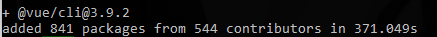
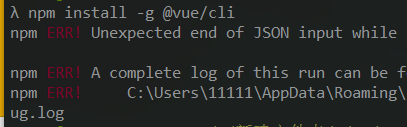
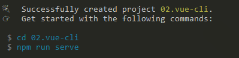
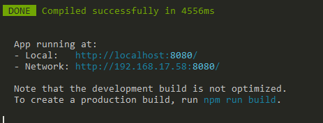

# Vue框架学习 - 第6天


## 知识回顾

> 1. 昨天在Vue路由中，咱们学习了：**声明式导航、编程式导航、动态路由匹配**这三个叫起来比较高大上的名词，其实理解和使用起来都非常简单
>    1. 声明式导航，就是使用 router-link to=”地址“ 直接写在页面中，类似于a标签调用，最终也会被解析为a标签进行使用
>    2. 编程式导航，就是使用 router.push("地址") 写在js逻辑中，类似于使用window.location.href="地址"，在跳转的同时还有其他逻辑需要执行
>    3. 动态路由匹配，就是给路由传参数，让路由携带参数传递，满足业务需要
>       1. 定义规则： `/user`修改为`/user/:key`
>       2. 访问使用：`/user`修改为`/user/数据`
>       3. 获取参数：this.$route.params.key
> 3. 截止到目前为止，vue的基础使用我们基本上已经学习完毕了，我们来总结一下vue基础实例对象和组件实例对象的相关声明参数

```js
  // 基础实例对象
  const app = new Vue({
    // 选择器
    el: '#app',
    // 数据
    data: {
      info: '',
      arr: [],
      obj: {}
    },
    // 方法
    methods: {
      sayHi() {
        alert('你好')
      }
    },
    // 计算属性
    computed: {
      // 计算属性一般会使用data中的数据
      // data中的数据改变时，重新执行
      infoLength() {
        // 获取info的长度
        return this.info.length
      }
    },
    // 过滤器
    filters: {
      // 格式化对象
      formatObj(val) {
        // 处理对象数据，然后返回处理完毕的数据
        return '数据'
      }
    },
    // 生命周期钩子(函数)
    // vue实例创建完毕，传入的数据设置给了这个vue实例，初始化获取数据一般写在这里
    created() {},
    // vue实例和dom关联起来，执行一次最早获取dom写在这里
    mounted() {},
    // 数据改变，同步到了页面上，页面更新完毕之后要添加逻辑，就可以写在这里
    updated() {}
  })
  
  // 路由组件定义
  Vue.component('fly', {
    template: '<div>{{msg}}</div>',
    data() {
      return {
          msg:"学好vue"
      }
    },
    props:{
       username:{
           type:String,
           default:()=>{
               return "蜡笔小新"
           }
       } 
    }
    methods: {
      sayHi() {}
    },
    computed: {},
    filters: {},
    created() {},
    mounted() {},
    updated() {}
  })
```


## 今日课程目标

- 能够掌握.vue单文件组件的基本写法
- 理解vue-cli生成的项目结构
- 能够使用scoped限制css的作用范围
- 能够配置项目中的单文件组件和路由
- 会使用PostMan测试接口


## 单文件组件

> 1. 同学们，昨天咱们使用组件路由的方式实现了黑云播放器，感觉还不错！但是，咱们把所有的代码都放在一个文件里面，是不是维护和阅读都非常困难？所以，咱们还是得把代码拆开比较好一些。
> 2. 同学们想说，一开始咱们代码就是拆开的，后面咱们好不容易合起来，现在咱们又要去拆开，是不是多此一举啊？不是！一开始，合并前，咱们的每一个文件都是一个完整的html文件，其中没有任何复用处理等，不便于维护管理；后面，咱们使用路由组件进行组合后，虽说可以复用了，但是所有的页面耦合在一起，非常难受。天下大势，分久必合，合久必分啊！
> 3. 到底有没有一个解决方案能够即保持每个文件的相对独立性便于管理？又能够保证其复用性便于开发？有！今天咱们就来学习一个新的概念：**单文件组件**
> 4. 单文件组件，这5个字，大家应该认识后面两个字**组件**，对吧？什么是单文件组件呢？通俗的讲就是：用一个组件能够包含单文件的所有内容，也就是将样式、结构、逻辑整合到一个组件里面
> 5. 复杂一点的项目都会使用单文件组件来开发，更加利于编码，利于后期维护，一个文件包含了所有的内容
> 6. 定义起来非常方便，直接使用 .vue 后缀定义文件即可，需要设置3个结构，直接输入 <vue>+tab即可自动生成

```vue
<template>
  <!-- 模板 结构 -->
</template>

<script>
// 逻辑
export default {
  // 组件的属性
  methods: {
    
  },
  data(){}
  // 。。。
}
</script>

<style>
/* 样式 */

</style>

```


## Vue-cli 简介

> 1. 咱们前面定义的单文件组件是不是无法直接运行？那么，这些单文件在什么地方使用呢？
> 2. 接下来咱们学习一个新的工具vue-cli，也叫做vue脚手架，它集成了很多牛逼的功能，主要包括：
>    1. 把.vue翻译成浏览器可以识别的内容
>    2. 自动刷新浏览器
>    3. 自动压缩代码
>    4. 自动的把js翻译为低版本的js
>    5. 作为代理服务器
>    6. ....
> 3. 接下来，咱们第一步是不是要进行安装工作？


##Vue-cli 安装

[官网](https://cli.vuejs.org/zh/)   [安装](https://cli.vuejs.org/zh/guide/installation.html)

> 1. 首先打开 cmd 小黑窗，在小黑窗中输入`npm install -g @vue/cli`, 在任意的路径都可以
> 2. 安装注意事项
>    1. 第一次安装成功提示
>    2. 已经安装过，重新安装成功提示
>    3. 如果安装失败，会有对应的err报错
>    4. 安装失败的常见解决方案
>       1. 更换网络环境：有线，换无线，无线换4G
>       2. 更换安装的工具
>          1. `cnpm` ：`cnpm install -g @vue/cli`
>          2. `yarn` :`yarn global add @vue/cli`
>          3. **修改npm下载源配置**
>             1. npm config list 查看npm下载配置
>             2. npm config set registry https://registry.npm.taobao.org
>       3. 清除npm缓存之后，重新安装
>          1. `npm cache clean -f`
>          2. 重新执行安装的命令
>       4. 使用管理员身份进行安装
>    5. 使用 vue --version  vue -V 命令查看是否安装成功


## Vue-cli创建项目

[官方文档](https://cli.vuejs.org/zh/guide/creating-a-project.html)

> 1. 打开cmd小黑窗，cd到代码需要存的目标路径下面，创建后会多一个文件夹，这个路径最好是有意义的地址
> 2. 项目名不要有中文，不要有大写字母，尽可能有意义 : vue create 项目名
> 3. 弹出的对话框先选择默认的选项
> 4. 稍等一会，等进度条走完 提示如下画面说明成功了
> 5. cd 项目名进入项目文件夹
> 6. 使用npm run serve 运行项目
> 7. 稍等片刻 ，出现如下效果说明成功了
>
> 


##Vue-cli创建项目常见报错原因

> 1. 创建的命令输入错误，将`create`输入成了`creat`
> 2. 项目创建过程失败
>    1. 一般情况下会出现一大堆报错的提示信息
>    2. 网络问题，有线换无线，无线换4G
>    3. 终端的权限问题；新建管理员模式的终端
>    4. 当前这个文件夹，这个文件被其他软件占用：关闭所有可能影响的软件（重启）
>    5. npm包管理工具的问题:
>       1. 用yarn来安装
>       2. 执行``npm cache clean -f`` 在重新创建项目


##Vue-cli创建项目失败的解决方案（重要）

> 1. vue-cli创建项目的本质是：
>    1. 创建文件夹
>    2. 下载第三方模块
>    3. 创建项目的基本结构
>    4. 设置各个文件之间的关系
>    5. 创建git仓库
> 2. 找一个可以创建项目的人，创建一个项目
>    1. 删除`node_modules`
>    2. 发给你
>    3. 你使用`npm i `安装项目中用到的第三方模块
>    4. `npm run serve`


## Vue-cli项目结构


## Vue-cli项目编码位置

> 1. 组件的逻辑直接写在`xx.vue`
>
> 2. 常见的静态资源，图片、音视频、字体、css等等，都是放到`assets`文件夹下面，直接使用对应路径即可引入
>
> 3. css文件的两种引入方式
>
>    1. `style标签中引入`
>
>    ```css
>      /* 使用css支持的语法导入 */
>      /* @import url('./assets/base.css'); */
>    ```
>
>    2. `main.js`中引入
>
>    ```js
>    // 导入 样式
>    import './assets/base.css'
>    ```


## Vue-cli src文件夹代码结构

> 1. 第一个文件就是main.js文件，这个文件就是以前咱们写的根实例部分
>    1. 创建了最外层的Vue实例
>    2. 把App.vue这个组件，当做Vue实例内部的最顶级组件并渲染出来
>    3. 和public/index.html 中的那个id为`app`的div关联起来
> 2. App.vue 最顶级的那个组件，仅次于`Vue实例`，这里一般写导航等
> 3. `assets`静态资源文件夹
> 4. `components`组件文件夹，除了`APp.vue`之外的组件，都写到这个文件夹中即可
> 5. 我们也可以在这里创建自己的文件夹，比如：pages保存相应的页面


## Vue-cli 全局注册和导入组件

> 1. 现在，我们已经了解了vue-cli的文件目录和基础使用规则，下面咱们就来声明和调用组件，我们也叫做注册组件，注册组件一般有两种方法，第一种是全局组件注册，第二种是局部组件注册，我们首先来学习全局组件注册。
> 2. 在component文件夹下面新建一个单文件组件
> 3. 在main.js中使用`import 组件 from '地址'`引用组件
> 4. 使用`Vue.component('名字',组件)`即可完成全局组件注册
> 5. 可以在任意的地方使用，用名字作为标签即可
> 6. 希望一次注册，在任意地方都可以使用的组件，使用全局组件注册


## Vue-cli 局部注册和导入组件

> 1. 我们定义完成组件后，在需要用到这个组件的地方导入组件
>
> 2. 导入方法很简单是： `import 组件 from '地址'`
>
> 3. 导入组件之后，设置给当前组件`components`这个属性，即可在当前组件中使用导入的组件


## Vue-cli 组件的name属性

> 1. 直接在组件的内部写`name:值`属性即可
> 2. 建议不要用中文
> 3. 写了之后，chrome的vue插件中可以看到这个名字，更加利于检索，利于编码


## Vue-cli组件中使用scoped限制css的作用范围

> 直接在style标签上，添加一个scoped属性即可实现这个目标，vue会在实例化编译过程中为每一个css添加一个随机后缀，就可以防止其他地方的css互相干扰了，非常强大的一个封装并且使用起来很简单


## Vue-cli项目的路由整合

> 现在，我们已经初步掌握了vue-cli如何定义组件和使用组件的方法，但是，要整合页面是不是单纯的组件无法实现？我们需要使用到前面学到的知识 vue-router 路由，那么vue-cli是如何进行路由整合的呢？
>
> 1. 准备工作
>    1. 创建项目`vue create 项目名`
>    2. 进入项目文件夹`cd 项目名`
>    3. 运行项目`npm run serve`
>    4. 稍等片刻，通过提示的地址 在浏览器中 打开
>    5. 删除多余的组件`components/`内部的文件
>    6. 删除`app.vue`中的内容
> 2. 整合路由
>    1. 下包  `npm i vue-router`
>    2. 导包  `import VueRouter from 'vue-router'` 
>    3. 引入 `const VueRouter = require('vue-router‘)`
>    4. 用包
>       1. 创建路由规则
>          1. 创建一个组件`xxx.vue`
>          2. routes=[ {path:"/xx",component:组件} ]
>       2. 创建路由对象
>          1. router
>       3. 设置给Vue实例
>          1. new Vue({ router })
> 3. 编码位置
>    1. 导入 注册路由 `main.js`
>    2. router-link router-view `app.vue`
>    3. 添加组件`components/`


##Vue-cli项目整合黑云播放器

> 前面咱们已经学习了vue-cli脚手架工具的相关基础知识，已经具备了开发初级项目的能力，其实，同学们需要认识到的是：在脚手架中使用的知识点，都是前面咱们学习过的基础知识，vue-cli只是一个脚手架工具，帮助我们来进行开发。好，现在我们来使用这个脚手架工具对黑云音乐播放器进行一个项目整合
>
> 1. vue-cli脚手架项目安装
>    1. 除了`node_modules`复制其他文件
>    2. 使用 cnpm i 下载相关的依赖包
>    3. 使用npm run serve运行项目
> 2. 基础文件创建
>    1. 下载vue-router依赖包，并整合进 `main.js`
>       1. 下包 `npm i vue-router`
>       2. 导包 `import VueRouter from'vue-router'`
>       3. 用包 
>          1. Vue.use(VueRouter )[出处](https://router.vuejs.org/zh/installation.html)
>          2. 路由规则，创建对应的组件xxx.vue
>          3. 创建路由对象 传入规则
>          4. 路由对象设置给Vue实例
>    2. 在 App.vue 文件中设置导航栏和内容
>    3. 在 `components/` 文件夹下面，使用xxx.vue创建单文件组件 
> 3. 导航区域整合
>    1. player中的index.html 结构拷贝到app.vue的结构中
>    2. 用到的`index.css`和`iconfont.css`拷贝到`assets`中，在`app.vue`导入
> 4. 注意事项
>    1. vue-cli开发项目文件的数量 多一些
>    2. `main.js`定义路由，这个文件中可以访问到Vue实例
>    3. `app.vue`页面中顶级的组件（最顶级的盒子）
>    4. `components/`声明组件`xxx.vue`
>    5. `assets/`存放静态资源


## 知识总结

> 1. 单文件组件的组成
>    1. 结构
>    2. 逻辑
>    3. 样式
> 2. vue-cli(脚手架)
>    1. 把很多开发中需要用到的功能整合到了一起
>    2. 让vue的开发人员直接专注于逻辑代码即可
>    3. webpack配置出来的
> 3. 创建项目
>    1. `vue created 项目名`项目名不能中文，不能大写
>    2. 项目创建不好用别人创建好的，自己npm i
> 4. 运行项目
>    1. 小黑窗进入项目文件夹
>    2. `npm run serve`
> 5. vue-cli创建的项目
>    1. 下包怎么下`npm i 模块名`
>    2. 如何导包`import 名字 from '模块名'`
> 6. 整合路由
>    1. 组件新建一个文件
>    2. 路由的设置`main.js`
>    3. App.vue router-link router-view
> 7. 项目运行
>    1. `npm run serve`
>    2. 根据小黑窗中提示的路径 ，在浏览器中打开即可


## 今日目标回望

- 能够掌握.vue单文件组件的基本写法
- 理解vue-cli生成的项目结构
- 能够使用scoped限制css的作用范围
- 能够配置项目中的单文件组件和路由
- 会使用PostMan测试接口