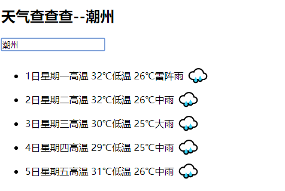
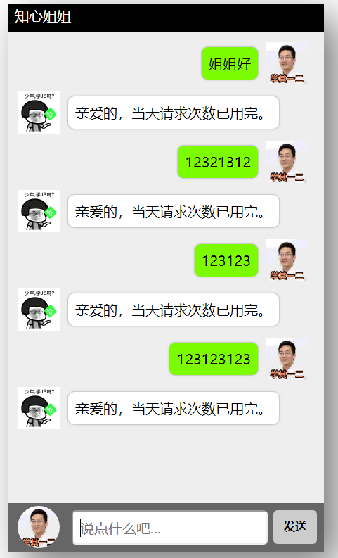
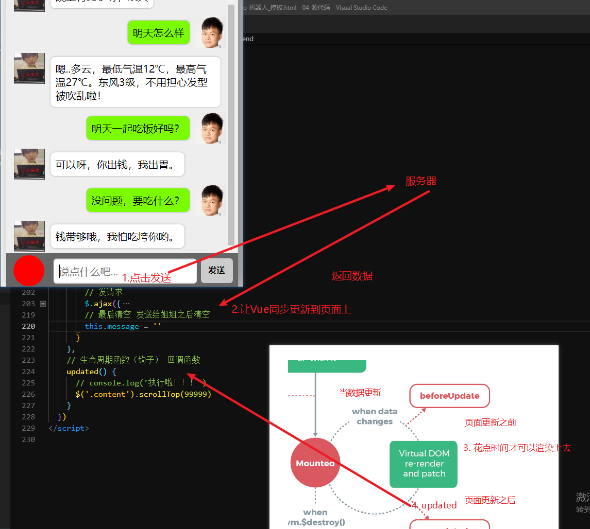
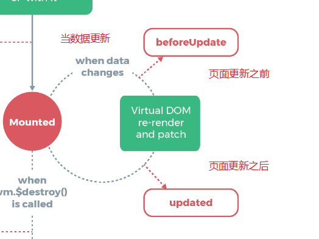

# Vue.js - day02

## 反馈

1. 绕圈圈
2. 新的知识 有点模糊 感觉抢救不过来了
3. 天气有点晕
4. 老师 为什么你的结婚戒指是戴在中指的
5. 你的电脑我50帮你回血,保证你血赚不亏.
6. 一天学下来 Vue也不过如此 ╭(╯^╰)╮
7. 浩哥，这两天没看到你秀媳妇撒狗粮，是不是后院又着火了
8. 过去的伤心事就不提了,忘了那个他, Vue第一天,信心满满
9. 老师: 1. 谈谈你对模块化的理解?这个该怎么回答
   1. 把代码进行抽取，避免重复编码
   2. 模块化的方式，比如Node.js中的CommonJS
      1. require
      2. module.exports
10. 什么时候用v-bind,有什么用,还不是很清楚
    1. v-bind绑定属性
    2. 让data中的数据和标签的属性相关联
       1. 按钮disabled，class,style...
11. 从前有一只**衣服的青蛙
12. 零花钱200,得预支8年的零花钱才能买两万的电脑
13. 我同桌天天犯傻,天天搞事情怎么办,打一顿能解决嘛
14. 老师,给我们讲解一下最后的那两道题可以么,题目里头在发送ajax的时候箭头函数this的指向不太清楚
    1. 箭头函数中this是谁？
    2. 上一级作用域中的this
15. 同桌看着我写反馈，我好害怕
16. 花姐不要爱你媳妇了,爱我们吧
17. 花姐姐 嘿嘿嘿
18. 没意见!
19. 老师,xss攻击是什么?
    1. 用户A，隐藏了一份代码提交到服务器
    2. 用户B，打开了有这份代码的网页，代码运行
    3. 偷偷的窃取了用户B的一些信息，发给了用户A
20. 看看你宝宝呗
21. 老师 又是一天没看到我们班主任了,我还偶尔想起你问我们班主任吃口香糖不吃的场景,然后班主任不吃,
22. 老师 ,前端代码不是强调html , css , js分离吗 ? 使用vue框架在html标签中写了那么多额外的东西 ,会不会影响后续代码的维护和阅读
    1. 脚手架之后，拆开来写
23. 感觉会了,又感觉没会,有点懵
24. 花姐可以每天下课前大概说一下明天要讲的内容...这样预习有个大概针对性,感觉能更加跟得上脚步
25. 老师老师,单标签后面要加个 "/"斜杠吗?
26. vue官网的包下载不下来,难道是网速慢的原因吗,试下老师的千兆网速吧,不然只能用CDN去引入

## 回顾

1. vue基本使用

2. Vue指令

   

## v-cloak指令(了解)

[传送门](https://cn.vuejs.org/v2/api/#v-cloak)

### 基本使用

1. 官方解释:这个指令保持在元素上直到关联实例结束编译。和 CSS 规则如 `[v-cloak] { display: none }`一起用时，这个指令可以隐藏未编译的 Mustache 标签直到实例准备完毕。
2. 添加上这个指令之后，会在Vue解析完毕时，自动移除`v-cloak`，可以css的属性选择器让一些元素在最开始时，隐藏
3. [v-clock]{样式} 内部的值，不是一定要写隐藏，也可以写一些别的内容，比如背景色，字体等..

## v-once指令(了解)

[传送门](https://cn.vuejs.org/v2/api/#v-once)

1. 指令只解析一次，后续的操纵，不会再次触发，性能高
2. 添加了v-once之后，数据的改变不会触发该指令添加的元素更新，节省性能
3. 页面加载完成之后解析一次的地方，比如标题，背景，logo...

## v-pre指令(了解)

[传送门](https://cn.vuejs.org/v2/api/#v-pre)

1. 不解析添加的标签及只标签中的 指令，提升加载速度
2. 比如网页中写一些笔记,直接展示vue指令的写法，但是不希望被解析，就可以使用v-pre

## Demo-天气预报



### 实现步骤

1. 输入内容，点击回车，查询数据
   1. v-model: city
   2. @keyup.13 或@keyup.enter
   3. ajax接口调用
      1. 原生
      2. $.ajax
2. 天气查询到了之后，渲染到页面上，不同的天气显示的图标不同
   1. success回调函数 weatherList
   2. data:weatherList
   3. v-for
      1. 判断天气决定显示的图片 v-if v-else-if v-else

### 注意点

1. 箭头函数中的this，上一级作用域的this
2. $.ajax中的回调函数，如果不用箭头函数this是谁！ ajax
3. 按下回车@keyup.13或者enter
4. emoji[表情在线制作](https://emojipedia.org/)
5. `v-else-if`只要命中后续的，不再匹配
6. `indexOf()`判断内容是否在字符串中存在，存在就是索引，不存在就是-1

```
'我是一头来自北方的哈士奇'.indexOf('狼')
-1
'我是一头来自北方的哈士奇'.indexOf('奇')
11
'我是一头来自北方的哈士奇'.indexOf('我')
0
```


## Demo-聊天机器人



### 实现步骤

1. 点击回车，获取内容，调用接口
   1. @keyup.enter
   2. v-model:  message
   3. $.ajax
2. 非空判断
   1. @keyup.enter
   2. message.trim()是否为空
3. 渲染到页面上
   1. v-for:结合数组 messageList
      1. 判断 isSister==true:渲染姐姐的结构
         1. else：渲染 我的结构
   2. 点击发送时：自己写的渲染
      1. push({"message":"我的信息"，"isSister":false})
   3. 数据回来之后：姐姐的信息 渲染上去
      1. push({"message":"姐姐的信息"，"isSister":true})

### 注意点

1. v-model可以自动去空格`v-model.trim ` [传送门](https://cn.vuejs.org/v2/api/#v-model)

   1. **修饰符**：

   - [`.lazy`](https://cn.vuejs.org/v2/guide/forms.html#lazy) - 取代 `input` 监听 `change` 事件
   - [`.number`](https://cn.vuejs.org/v2/guide/forms.html#number) - 输入字符串转为有效的数字
   - [`.trim`](https://cn.vuejs.org/v2/guide/forms.html#trim) - 输入首尾空格过滤

2. 点击发送时，无论姐姐是否回我们，都要添加自己的内容

3. 输入内容之后，清空

4. vue生成结构时，如果要添加判断可以和这个案例一样

   1. 头像动态设置  `v-bind:src`->:src
   2. 类名动态设置：`v-bind:class`->:class

5. isSister的目的是？

   1. 区分自己和姐姐的信息
   2. isSIster的名字不是固定的，类型
      1. isMe:是、不是
      2. 对于只有2种选择，建议布尔

### 自动滚动



1. 数据更新，页面更新完毕之后执行updated

## Vue生命周期钩子

[传送门](https://cn.vuejs.org/v2/guide/instance.html#%E5%AE%9E%E4%BE%8B%E7%94%9F%E5%91%BD%E5%91%A8%E6%9C%9F%E9%92%A9%E5%AD%90)



1. 钩子函数，提供给软件开发者，让我们可以在特定的时候添加自定义的逻辑
2. 本质就是一个回调函数
3. 只要添加了就会执行
4. 执行的时机看你使用的是哪个钩子函数（回调函数）
5. 比如Vue中有这么一个钩子函数（回调函数），他会在数据更新，页面同步更新完毕之后触发
   1. update
   2. 可以在他内部执行一些逻辑，这些逻辑必须在页面更新之后触发
   3. 聊天机器人的滚到底部

## Demo-品牌管理

### 实现步骤

1. 列表数据生成

   1. v-for:数组 goodsList :[]
      1. 商品名：name
      2. 添加时间：time

2. 弹框显示及隐藏

   1. v-show：isShow:false
   2. 点击添加-显示 isShow=true
   3. 点击取消或添加-消失  isShow=false

3. 点击添加

   1. 非空判断，为空直接不执行逻辑
   2. 有数据：添加到数组中
      1. 获取文本框的value值 v-model：inputValue
      2. 时间, Date.now() 当前的毫秒数 一会处理

4. 删除

   1. 点击事件 获取当前这一行的索引
   2. 根据索引删除数据

   5.搜索

   1. 获取搜索框中的值,v-model: search
   2. 根据search的值动态的修改页面中结构，修改数组
   3. vue计算属性
   4. 


### 注意点

1. 逻辑简单直接写行内。逻辑较多，抽取为方法
2. 添加时，序号用索引生成，索引从0开始，+1
3. confirm 弹出提示框，确认返回true取消返回false
4. **moment.js** 可以帮助我们格式化时间
5. 利用计算属性，动态的生成循环的数组
   1. 当搜索条件和总数组发生改变时
   2. 计算属性重新出发，重新生成数组
   3. 页面同步更新


## 日期格式化库

[moment.js](https://cn.vuejs.org/v2/guide/instance.html#%E5%AE%9E%E4%BE%8B%E7%94%9F%E5%91%BD%E5%91%A8%E6%9C%9F%E9%92%A9%E5%AD%90)

[文档地址](http://momentjs.cn/docs/#/parsing/)

非常流行的日期格式化js库，十分便捷的格式化时间

用法

1. 下包
2. 导包
3. `moment(时间).format(格式)`

## 计算属性

[计算属性](https://cn.vuejs.org/v2/guide/computed.html)

1. 计算属性可以在内部写一些复杂的逻辑处理数据
2. 执行的时机，内部用到的数据改变，才会触发
3. 如果计算属性内部没有使用到数据，只会在最开始的时候执行一次
4. 计算属性的使用
   1. vue实例中定义位置和data，methods并列的 reutrn的方式返回内容，一般内部会用到数据
   2. 页面中使用计算属性 和普通的data属性基本一致，只不过值 计算属性方法执行的结果`return`


## 提神

1. 咖啡 不要多喝
2. 吃苹果
3. 风油精
4. 槟榔（不建议）
   1. 会恍惚
   2. 不健康
   3. 国字脸
5. 好好睡觉
   1. 辅佐一些运动


## 预习

axios 另外一个ajax请求库

过滤器

vue动画

音乐播放器

