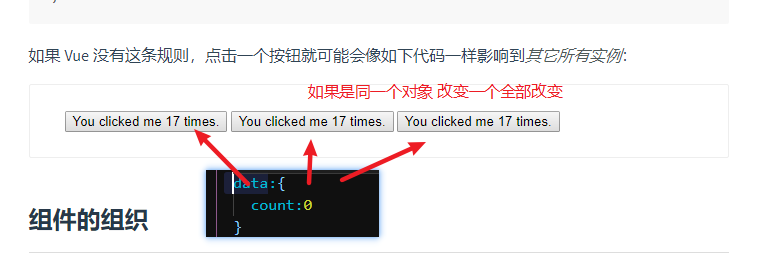
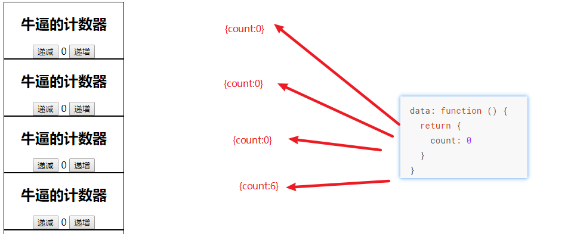
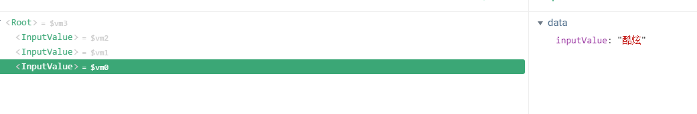
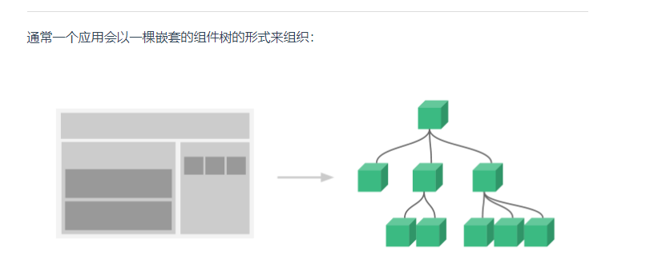

# Vue.js - day04

## 反馈

1. 学了一上午,才两个反馈,这是说懂了呢,还是不懂呢
2. 钩子不太懂 播放器这个案例写的很乱- -
   1. 回调函数
3. 你好骚啊
4. 你的戒指又戴回中间了
5. 老师 你的Windows没有激活 我的也没有 那么怎么激活呢
   1. 激活工具-kms
   2. 淘宝买个激活码 10元
   3. 买正版 399元
6. 今天的课后面讲的有些快 比如说player...大体都还好吧......呃.......老师你今天没有备课么....
7. 没什么好说的，不开心，想打同桌。哈哈哈哈
8. 花姐,为什么元素动画播放完毕，显示出来之后，要移除延迟的样式????前面不是重新搜索新的城市,就把天气数组清空了吗,清空了延迟的样式不就也没了吗???有点理解不了....
   1. 希望一起消失
   2. 清空了数据，
   3. 样式还在dom元素上
9. 列表的进入/离开过渡 文档里<span v-for="item in items" v-bind:key="item" class="list-item"> --------v-bind:key="item是用item,但是老师用的是item的index,到底是用item还是inxex?我用index会报错而且动画会卡顿
   1. key：类型 string/number
10. 好烦,不想敲代码,咋办,有救吗?
    1. 写了老报错
    2. 身体不适
    3. 身体想敲代码，思想不想敲
11. 老师 钩子会细讲吗
12. 老师你每天安利西兰花,感觉给了我一种心里暗示,今天我看到西兰花,本能的觉得想吃
13. 完了完了,Vue又学不会了,找不到工作了,要回去搬砖种田了..........
14. 花姐 每次都是思路有大概知道怎么做 但是代码敲不出来要么就是有语法上的错误怎么破我枯了
15. 老师,你那些出去那些学员里的公司,有没有哪些是适合我们这些菜鸟的~
16. 1.Ajax请求和axios请求有哪些具体的区别? 2.vue用的时候,那些钩子函数的有些细节地方感觉好模糊! 3.还是下午上课的精神好些 4.怀疑工作使用vue会用得不够6666,时间太短了
    1. axios在浏览器内部的本质还是ajax
17. axios的还是有点不懂。。。。。。
18. 老师,天知道案例中,那个动画钩子afterenter里面,能不设置transitionDelay=0,直接把这个类移除吗
    1. 设置style为空也可以
19. 老师,key的主要作用是什么?仔细讲讲?
    1. 让Vue高效的重用dom元素 vue虚拟dom
20. 天知道案例, this.weatherList = res.data.data.forecast 这段代码没有放在定时器里面, 导致切换城市查询时, 看不到数据消失的动画, 这是为什么呢
21. 老师VScode 那个程序员鼓励师,怎么把自己的图片放进去的
22. 头疼,啊啊啊啊啊 啊 啊啊啊啊 啊 ,疯了 ,
23. 重金求QQ音乐接口
24. 上课听会了 下午就懵逼 bug一大堆
25. 网易云接口跨域问题好麻烦,就算把接口贴到浏览器上报错也是好频繁

## 回顾

1. 天知道，定时器中设置数据的目的
   1. 接口的数据返回太快了，如果不延迟设置，那么就看不到数据的消失动画了
2. 清空li标签的延迟效果
   1. el.style = ''
   2. 如果不清空，消失的动画，也是有间隔的
3. axios 
   1. 在浏览器中就是发送ajax的`Make [XMLHttpRequests](https://developer.mozilla.org/en-US/docs/Web/API/XMLHttpRequest) from the browser`
   2. 本质也是对ajax的封装
   3. $.ajax({success() {}})
      1. 回调函数的嵌套
   4. axios.get().then()
      1. 链式调用
      2. Promise

## Demo-播放器

### 实现步骤

1. 双击放歌时
   1. 查询封面：<https://autumnfish.cn/song/detail?ids=347230> 
      1. 渲染给封面：coverUrl
      2. 绑定路径 v-bind:src=coverUrl
   2. 查询评论：<https://autumnfish.cn/comment/hot?id=444267215&type=0> 
      1. 渲染到右侧的评论区域：commentList:[]
      2. 右侧，v-for commentList
2. 播放和暂停时启动和关闭动画
   1. audio有2个钩子（回调函数）
   2. data中加一个字段:isPlaying
      1. true:添加
      2. false:移除
   3. onplay 播放时
      1. 添加playing类名
   4. onpause 暂停时
      1. 移除playing类名
3. 播放MV
   1. 双击播放歌曲的时候，获取mv地址不自动播放
      1. 双击放歌时，额外的传递一个 mvid过来
   2. 找到mv的接口 <https://autumnfish.cn/mv/url?id=10732128> 
      1. id 是mvid
   3. 添加一个video标签
      1. v-bind:src="mvUrl"
4. 整合滚动条
   1. 左侧歌曲搜索结果滚动条
      1. ref属性 musicScroll
      2. mounted:初始化IScroll(new)
      3. updated 刷新IScroll 数据改变了滚动尺寸 更新
         1. data中添加 musicScroll
   2. 右侧歌曲评论滚动条
      1. ref属性 commentScroll
      2. mounted:初始化IScroll(new)
      3. updated 刷新IScroll 数据改变了滚动尺寸 更新
         1. data中添加 commentScroll

### 注意点

1. 数据的获取就是根据接口来，接口要什么参数就给什么参数，只要是正确的就可以获取到数据
2. 基本上所有特定的时机，都会有对应的钩子函数（回调函数），虽然你不知道，但是你要相信有
3. 动画用的是c3中的 animation 
4. 不是所有的歌都有mv，有的才可以播放，
5. vue中操纵dom元素建议用 ref，结合`vue实例.$refs`即可获取元素
6. data中的数据在哪个生命周期钩子中才渲染到页面上`mounted`
   1. 获取dom元素再自行逻辑，最起码要写在`mounted`
7. 数据更新，页面页更新之后会触发`updated`,页面更新之后要执行的逻辑，可以写在``updated``

## iScroll

[传送门](https://github.com/cubiq/iscroll)

[中文文档传送门](http://caibaojian.com/iscroll-5/)

1. 快速滚动
2. 使用方式
   1. 下包
   2. 导包
   3. 用包
   4. 准备一个类似于这样的结构

```html
< div  id = “ wrapper ” >
    < ul >
        < li > ... </ li >
        < li > ... </ li >
        ...
    </ ul >
</ div >
```

5. 初始化iScroll

```js
  const myScroll = new IScroll('#wrapper', {
    // 鼠标滚轮滚动
    mouseWheel: true,
    // 滚动条
    scrollbars: true
  })
```

6. 样式设置
   1. 如果要用滚动条最外层的容器需要添加`position:relation`
   2. 最外层的容器需要约束高度
7. 内容发生改变之后，需要重新调用方法 才可以正常滚动
   1. [传送门](https://github.com/cubiq/iscroll#mastering-the-refresh-method)

```js
    // 重新计算尺寸 必须要调用刷新的方法
    myScroll.refresh()
```


## Vue生命周期钩子 - mounted

### mounted 

数据渲染到到页面上之后会触发的一个回调函数

如果要操纵dom元素的代码可以写在这个钩子函数（回调函数）的内部

比如IScroll的初始化

执行的次数只有一次

如果要在数据更新之后执行逻辑用的`updated`

## $refs属性

1. 让我们更加便捷的获取页面中的元素
2. 使用步骤
   1. 为元素添加一个`ref`属性 给有意义的值即可
   2. `vue实例.$refs.ref属性名`即可获取对应的元素
   3. 也是vue中推荐的获取元素的方式
   4. 不要再去用`document.querySelector`，虽然可以用，不在建议使用

## Vue组件基本使用

1. Vue.component()注册一个组件
2. 组件中的结构必须有一个根节点包裹所有内容
3. 页面中使用时，直接使用注册的组件名即可`button-counter`
4. template是组件的结构，可以字符串，也可以定义一个模板的标签通过id设置进去
5. 用组件的时候内部会把结构直接 把模板中的内容替换到页面上
6. 实现了 结构的复用

```html
<script type="text/html" id="tem">
  <div class='computer'>
    <h2>牛逼的计数器</h2>
    <input type="button" value='递减' @click="count--">
    <span>{{count}}</span>
    <input type="button" value='递增' @click="count++">
  </div>
</script>
<script>
  // 注册vue组件
  Vue.component('button-counter', {
    data: function() {
      return {
        count: 0
      }
    },
    // 模板 组件的结构
    // 组件的结构 可以写字符串，必须有一个根节点
    // 抽取到标签中更加利于编码
    // template: `<div><button v-on:click="count++">You clicked me {{ count }} times.</button><button v-on:click="count--">You clicked me {{ count }} times.</button></div>`
    template: '#tem'
  })
```

### 组件的数据不能是相同的对象，用的是函数





1. 组件的作用是功能的重复利用
2. 如果共用一份数据，出现互相干扰的情况
3. 定义组件是，data是一个函数内部返回了一个对象
4. **没使用一次组件时，就回调用一次 data函数**
5. 返回一个新的数据对象
6. 这个数据对象是当前这个组件 独有的，和其他的 互不干扰
7. 这样就可以实现，点击组件A,组件B不会受到任何影响

### 多个组件组成页面



当我们的页面中使用的组件越来越多之后，就会变成一个类似于截图上的树形结构

内部嵌套着各种各样的组件

当组件的结构越来越复杂之后，就会形成一个类似于  dom树的**树形结构**

组件树



### 抽取天知道为组件

1. Vue.component('名字',{})
2. 把天知道的结构抽取到script type='text/html'中
   1. 必须有一个 根节点
3. data必须是函数
4. methods直接c+v到组件内容
5. 页面中直接通过组件名字即可使用
   1. `sky-know`

## Vue路由基本使用

[传送门](https://router.vuejs.org/zh/)

1. 前端路由
2. url和组件的对应关系
3. 十分便捷的让我们维护多个组件的显示隐藏，及数据传递 等高级效果
4. 和tab切换很像
5. 切换显示的是不同的组件
6. 路由的功能非常多，今天就先把他当做一个`tab栏切换`即可

## 补充

web开发助手 chrome插件

[传送门](https://www.baidufe.com/fehelper/feedback.html)