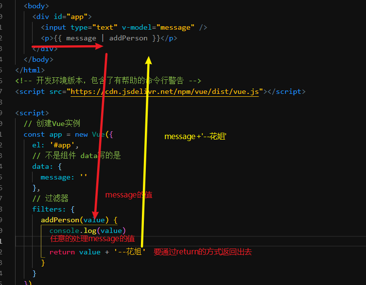

# Vue.js - day05

## 反馈

1. 学婊:好难啊老师 今天的东西好难理解啊怎么办!学不会啦!!-------学渣:今天讲了啥??好像会了??算了也不知道反馈啥好,直接提交吧!!
2. 三个反馈题都有些模糊
3. 老师你代码是终极版的吗?好多不太一样 看的难受 还是发课上版本吧
4. 这是一寂寞的天，说好的台风都放了我抛弃了我，跑去了越南；热得你走出半生，归来全熟，身上还挂着椒盐；晒得你走出半生，归来仍是花姐。。。嘿嘿嘿
5. 反正都不懂
6. 我的同桌说在做的各位都是垃圾,完全藐视.他说他可以碾压一切不服...
7. 语法是真的很菜鸡了 濒临死亡
8. 晕晕晕~~~难难难~~~学了后面忘了前面,当天的知识掌握过后,一段时间就忘了,还有得救麽,我选择狗带
9. 我边上两位同桌都说，在坐的各位都是垃圾！！！
10. 我同桌说在座的各位都是垃圾，看不起大家，包括花姐
11. 路由听得莫名其妙,不懂!!!!老师仔细讲讲,不要刷得太快了,我要哭了
12. 大家做（坐）好,我们要上课了,首先大家看看共屏能看到吗?我这边刚打开, 老师下回换个台词吧,
13. 路由确实有点难了,希望讲慢点的
14. 老师,使用一个陌生的第三方库时,怎么样比较准确的发现它的一些注意点呢? 比如使用iScroll, 需要加相对定位, 数据改变时需要刷新滚动条
    1. 相对定位，添加了滚动条之后发现效果不对
    2. 尝试添加数据，发现内容多了无法滚动
    3. 再去看文档
15. 老师能介绍一下目前主流的Javascript库么?以后遇到要用到这些没学过的库,我们要怎么自学?
16. 花姐.你好胖啊,真的胖胖的.
17. 花姐, 过滤器和自定义属性是在后面才详细讲吗。 感觉这两个现在都不太理解
18. 歌词渲染上去之后,怎么让它们自动对齐还有自动滚动和用鼠标向上向下拉?
19. 老师 这个Vuex用的头晕啊 这全家桶吃不下去了 = =
20. 好烦啊,英语单词记不住啊!!!!!!!!!!
21. 组件使用还是不怎么熟悉

## 回顾

1. 组件基本使用
   1. 对于结构的封装，用一个别名，替换一整个结构
   2. 数据写的是一个function 返回一个对象 让组件有自己独有的数据
   3. 注意点：
      1. 先注册组件
      2. 在实例化Vue
      3. 如果顺序调换会无法实现组件
      4. 原因是,注册是吧组件添加给构造函数，再new就可以识别了，如果先new 在注册，之前实例化的对象是无法识别后面添加的组件的
2. vue-router:路由

## Vue-过滤器基本使用

1. filter(过滤)
2. 在不修改原始数据的情况下，修改数据的显示效果
3. 页面中`|过滤器名`
4. filters中定义过滤器：
   1. 是一个对象，内部定义函数
   2. 通过返回值的方式 返回处理的结果
   3. 形参获取到的是 过滤器处理的数据 
5. 管道符听过没：  |  竖线的别名
6. 过滤器的适用场景
   1. 双括号{{}} v-text
   2. v-bind 
   3. 只有这2个地方可以用

## Demo-高级播放器

### 实现步骤

1. 项目路由整合
   1. 导入vue
   2. 导入vue-router
   3. 顶部设置为 router-link(tab-nav)
   4. 底部设置为 router-view(tab-content)
   5. js代码中需要写一些路由的相关内容
      1. 设置组件
      2. 设置地址
      3. 实例化路由对象
      4. 把路由对象和Vue实例 关联起来（挂载）
2. 点击tab-bar(router-link)切换class
   1. 设置`router-link active="active"`
   2. 让你点击的那个导航 动态的增删`active`
   3. 默认值是：`router-link-active `
3. 点击顶部的搜索，把搜索结果传入到第一个`result`组件中
   1. v-model:search
   2. 规则的定义不能只是`/result` 变为能够携带数据的`/result/:search`
   3. 点击事件，以及按下回车时，通过编程式导航切换 tab（路由跳转）
4. result组件 中，获取传递的数据，调用接口，获取数据
   1. 在生命周期钩子(回调函数) created中
   2. 通过data中自动帮我们添加的一个`$route.params.search`
   3. 调用接口`axios`
      1. 导入axios
      2. axios.get('https://autumnfish.cn/search?keywords=')
      3. .then中获取数据
      4. result组件中要定义一个数组
      5. v-for循环
5. retult组件中，歌手的显示
   1. 不修改数据的情况下，修改数据的显示
   2. 过滤器
      1. 定义过滤器 filters:{ formatSInger（value）{ 逻辑 return } }
      2. 页面中使用`{{item.artist | formatSInger}}`
      3. slice[方法](http://www.w3school.com.cn/jsref/jsref_slice_array.asp)
      4. `字符串.slice(0,-1)`从0开始截取，截取到 倒数第二个为止
         1. -1 从后往前算下标
6. result组件中，时间的显示
   1. 过滤器
      1. 定义过滤器 filters:{ formatTime（time）{ 逻辑 return } }
      2. 页面中使用`{{item.duration| formatTime}}`
7. 点击results中的播放按钮，携带id去 `player组件`，`player`获取并查询数据
   1. results中为播放按钮绑定点击事件`编程式导航 ` router.push('/playser/id')
   2. 修改路由规则`/player`=>`/player/:id`
   3. ``player`获取id 在created中获取
      1. 根据id查询 
         1. 封面 ：src  ->coverUrl
         2. 歌词:  lyric 
         3. 地址：:url->musicUrl
      2. 设置到页面上

### 注意点

1. 一个复杂一点的组件 一般包含的内容有
   1. 样式
   2. 结构
   3. 逻辑（js）
2. 路由的整合，第一次需要准备的工作比较，后续添加组件，只需要重复固定的步骤即可
   1. 模板
   2. 路由规则 /xxx:组件
   3. router-link 
3. 样式如果较为复杂，一般会单独的抽取为一个文件 （css,less）
4. 如果要通过路由（动态路由匹配）传递数据
   1. 定义规则的时候`/result`-> `/result/:search`
5. 代码的方式跳转：编程式导航
   1. `router.push('地址/数据')`
6. 组件内部的逻辑和之前类似，结构在模板中，数据写成函数
7. 时间计算
   1. 186s ->分秒
   2. 分: 186 / 60 = 3多了6  要的只有3 
   3. 秒 186 % 60  余 6

## 编程式导航

1. 声明式导航`router-link`标签，写好的导航链接，称之为 声明式导航
   1. 写了之后，点击就回立刻跳转 类似a标签
2. 编程式导航`router.push` ，代码中调用这个方法就可以跳转
   1. 如果跳转没有任何的逻辑，点击立刻跳转，用声明式
   2. 如果跳转时，还需要执行一些逻辑，用编程式

## 路由高亮样式

[设置传送门](https://router.vuejs.org/zh/api/#active-class)

1. vue-router 切换tab(路由)时会自动的添加移除一个class 但是默认的类名叫做`router-link-active `
2. 要修改通过设置`active-class`这个属性即可
3. 注意
   1. `:active-class='active'`: 把data中的active 解析出来
   2. `active-class='active'`:直接把`active`这个值设置给`active-class`

## Vue生命周期钩子-beforeCreate&Created

1. beforeCreate：无法获取data中的数据
   1. 会在我们newVue之后 立刻执行，但是这个时候
   2. 传入的参数中的，data，methods..等属性还没有设置给这个Vue实例
2. created:可以获取到data中的数据
   1. vue实例被创建完毕，同时传入的参数中的那些数据，属性全部已经 设置给这个Vue实例了
   2. 我们才可以获取到data中的值，methods中的方法
3. 如果我们的逻辑需要涉及到data中的数据，最起码写在created中

## 动态路由匹配

1. 路由规则定义时，不再是简单的`/xxx` 而是`/xxx/:key`
2. 组件获取数据的时候直接`$route.params.key`
3. 跳转时，地址`/xxx`需要变为`/xxx/值`

## 预习

[脚手架](https://cli.vuejs.org/zh/)

