# Vue.js - day06

## 反馈

1. 做路由，组件一复杂起来，上上下下，上上下下查代码，晕死我了
2. 悔不该杀那华佗----------- ~~~~(>_<)~~~~ ~~~~(>_<)~~~~ ---------------头疼的要紧
3. 🐕🐕🐕🐕🐕🐕🐕🐕🐕🐕🐕🐕🐕🐕🐕
4. 路由还是有些模糊,可能是代码多了,有点懵逼
5. 每一块分开写就还好 凑一起又要配合挖坑就有点混乱 过滤器老师再讲一下 用的不习惯
6. 做得好乱呀
7. 网易云的接口数据好多 一层套一层 密密麻麻. 工作中后端给我们的也是这样的接口吗?
8. 麻烦老师细讲一下怎样区分--什么样的方法写在组件的methods中--什么样的方法是写在vue的methods中的
9. 黑色星期六，这是一个非常难受的日子，感觉脑袋一直都在转圈圈，请明天花姐带给我快乐 阿门
10. 唉.....
11. 老师 axios的post请求怎么写？
12. 花姐,我发现一个问题: 文本框第一次输入内容搜索的时候,页面可以读取到数据,也会渲染到页面上..不过再次输入内容,点击搜索,页面数据不会更新,只有刷新页面,数据才会更新,求解?????
    1. create只执行了一次
13. 编程式的导航,动态路由,好模糊.........................啊~~~~~~~~~~~~~~~~~~~~~~~~~~~~~~~~~~~~~~~~~~~~~~
14. 感觉我是废了     嘤嘤嘤
15. 为什么在搜索结果里直接搜歌,搜不出来,切到播放页面,回来搜索页面又成了空白
16. 花姐,像这种长的案例可以按步骤分几个文件写麽,这样看文档的时候可以清楚的知道对应的代码
17. 就很头大
18. 1.还是要早点睡觉,上课吸收就好很多! 2.老师动态路由匹配后,组件里面就自动把路径参数添加到data的$route的params里面了,为什么呢?
    1. vue-router 解析url 把url后面的值 设置给$route中的params
19. 速度太快,跟不上节奏
20. 老师,路由组件和全局组件有啥不一样吗? 为什么路由里面定义组件可以不用Vue.component来注册的? 歌词用正则改掉去掉时间好像好像可以这样写/\[\d{2}\:\d{2}\.\d{2,3}\]/
21. 老师，那个页面只要搜了一首歌之后，在当前页面再搜第二首歌回车后就得手动刷新一遍才能发请求显示，怎么解决------老师，能否每写一个大功能，就复制一遍文件夹标注一下，写新的功能在另一个文件夹里写，只有一个文件，一起看代码，有点懵
    1. watch
    2. git 
22. 
    1. 动态路由匹配不是很明白
    2. 时不时报一些跨域的错误 代码里发现2个bug : 
       1. 接口 多个人查询同一个数据
    3. bug1标题: 刷新页面歌曲列表没有清空 重现步骤:
       1.  a 打开页面, 输入"神话";
       2.  b 按下enter键
       3.  c 待页面加载出结果后, 按F5刷新页面 结果: 页面歌曲列表没有清空 期望: 刷新后清空歌曲列表
    4.  bug2标题 : 页面无法进行多次歌曲搜索 重现步骤: 
       1. a 打开页面,在输入框输入"神话" 
       2. b 按下enter键搜索歌曲列表 
       3. c 待加载出歌曲列表后,搜索"我相信"歌曲 结果: 搜索歌曲"我相信", 页面没有列出对应的歌曲列表 期望: 搜索歌曲"我相信", 页面列出对应的歌曲列表
          1. watch（侦听器）实现
23. 难啊难,难于上青天
24. 花姐 过滤器的主要作用是什么 他的适用场景是什么地方
25. 啥时候开始讲大项目呀
26. 苍天啊,大地啊,迷茫啊~~~~
27. 代码冗余 我需要多看看
28. 建议老师写代码的时候，用不到的代码全删掉，注释也是，特别是复制上一份代码的时候，本来这个要讲的内容只需要用到一部分代码，那些复制过来的代码多，看起来很乱...
29. 一直报错,好烦啊,怎么做啊
30. 从歌曲播放切换到搜索结果,列表就被清空了,是进行了空搜索嘛?
    1. 动态路由匹配，router-link中没有数据

## 回顾

1. 过滤器

   1. 不修改 原始数据的情况下，修改数据的显示形式
   2. filters :和data，methods平级，属性名是固定的
   3. 过滤器添加在filters属性的内部

   ```
   filters:{
       formatStr(value){   拼接，截取 return 数据 },
       formatTime(value){   返回固定值 return 数据}
   }
   ```

   

2. Vue实例属性

   1. data是对象

3. Vue组件属性

   1. data是函数
   2. template是模板，结构
   3. 其他部分和Vue实例一样

4. 格式化的好习惯

   1. 自己好
   2. 对其他接手你工作的人也好
   3. 跟利于后期维护
   4. 格式化不了，有可能代码的语法有问题


## 单文件组件

1. 后缀名是`.vue`
2. 快速生成内部三个结构 代码是`scaffold `
3. 结构
4. 一个文件包含所有组件内容，更利于代码的拆分编码和维护
5. 今天开始写这个！！

```vue
<template>
  <!-- 结构 -->
</template>

<script>
// 逻辑代码
export default {

}
</script>

<style>
/* 样式 */

</style>

```


## Vue-cli 安装

作用

1. Vue-cli 也叫 官方脚手架
2. 把xxx.vue翻译为 浏览器可以识别的内容
3. 自动浏览器刷新
4. 自动打包代码
5. 自动压缩代码
6. js高版本翻译为低版本
7. ....

安装

1. [下载](https://cli.vuejs.org/zh/guide/installation.html)
2. 打开小黑窗，执行命令`npm install -g @vue/cli`
3. 小黑窗的路径无所谓


### 注意点

1. 第一次安装 最终提示的是add 

   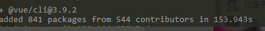

2. 安装过，重新安装 会提示updated 

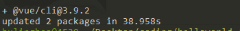

3. 查看版本 `vue --version ` 最新版本是 3.9.2

   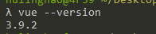

## Vue-cli项目创建

[创建项目](https://cli.vuejs.org/zh/guide/creating-a-project.html)

项目名不要用中文

不要有大写字母

```
vue create 项目名
```

执行命令之后，用默认的设置即可

 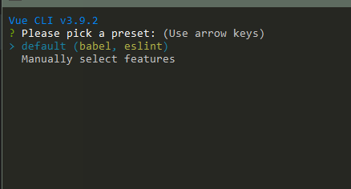

等待安装成功之后 

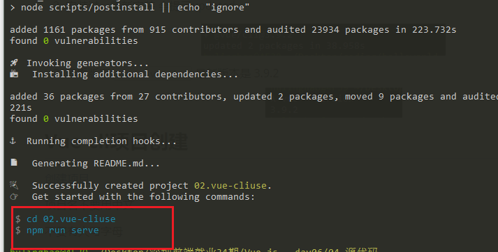

说明搞定了


### 运行项目

1. 终端中进入项目文件夹 `cd 项目名`
2. 执行命令运行项目 `npm run serve`
3. 如下提示，说明成功了

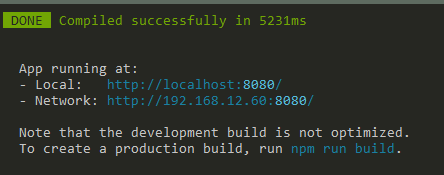

4. 通过提示的地址访问项目


### 注意点

1. 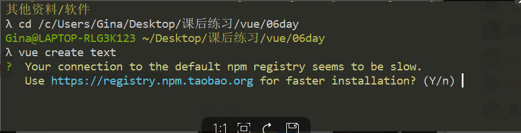
2. 提示你速度较慢，要不要切换为一个更快的地址下载 可以输入`y`回车


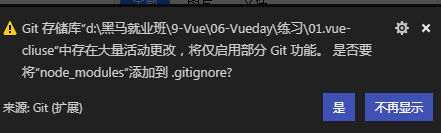

创建的项目中有大量的第三方模块，git如果托管会比较消耗性能，选择`不在显示`，项目完全创建完毕之后，会忽略node的模块的，


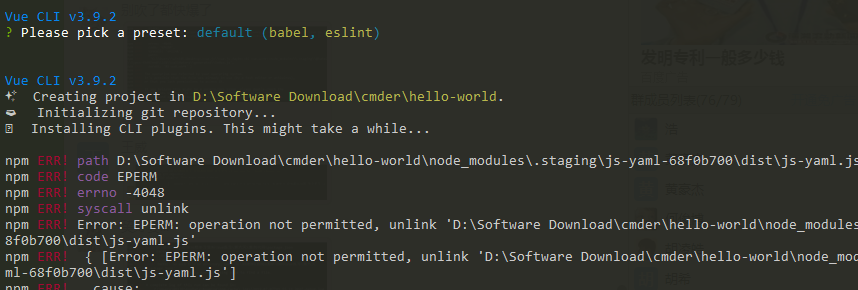

1. 网络问题导致安装失败：
   1. 换个网络环境：比如手机wifi
2. npm缓存导致安装失败
   1. `npm cache clean -f ` 先执行这个命令
   2. 在重新创建项目
3. 电脑权限导致安装失败
   1. 打开小黑窗的时候，使用管理员模式
   2. 根据图中进行选择
   3. 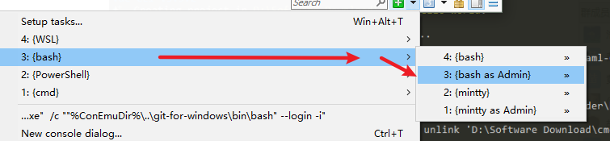

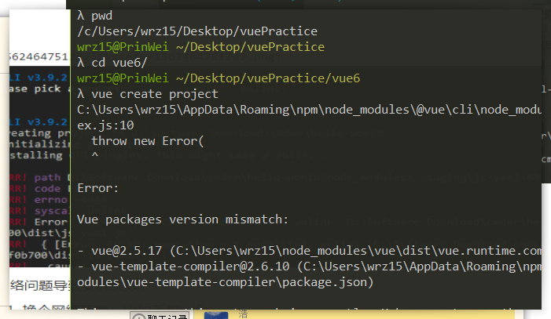

1. 尝试重新创建项目 换个名字试试


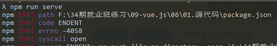

1. 要先cd到项目的目录下
2. 在执行`npm run serve`

## Vue-cli项目结构

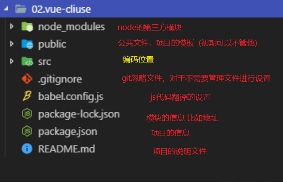

1. 项目创建好之后，自动生成这个结构
2. 自动下载模块
3. 无需自己设置

## Vue-cli项目编码位置

**src文件夹中**

1. xxx.vue中：单文件`组件`
   1. template中 结构：一个根节点
   2. script中：逻辑 `export default{}` 写在这个对象中 
      1. data是方法
   3. style:样式
2. 每次写完保存，浏览器自动刷新

### 注意点

1. 如果开启了自动保存，代码没有写完，自动保存了，报错
2. 电脑在这个阶段开始会越来越烫！
   1. 可以关闭自动保存缓解一点点
   2. 步骤1没用，清灰
   3. 步骤2没用，拆机加散热硅脂
   4. 步骤3没用，换风扇
   5. 步骤4没用，搞个支架，加个散热器
   6. 步骤5没用，就当一个暖宝宝！！


## Vue-cli创建项目注意

1. 执行`vue create 项目名`会创建一个和项目名同名的文件夹
2. 运行项目必须先进入文件夹`cd 项目名`
3. 运行项目的命令是`npm run serve`
4. 下载失败，项目文件夹还是存在的，重新创建项目
   1. 删除文件夹，再创建
   2. 根据提示进行覆盖
   3. 换个名字创建（再多一个文件夹）
5. 提示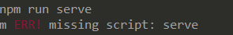
   1. 没有 cd 进入项目中
6. 无论如何下载都成功不了
   1. 可以使用别人创建好的项目
   2. 装包运行，一样的！
   3. `npm i`成功不了
      1.  `cnpm i` 
      2.  `yarn` 

## Vue-cli 代码结构

1. main.js 

```js
// es6中的导包的语法 
// 等同于 const Vue = require('vue')
import Vue from 'vue'
// 等同于 const App = require('./App.vue')
import App from './App.vue'

// 是否打印终端的开发提示
// 提示少一些
// Vue.config.productionTip = false
// true 提示多一些
// Vue.config.productionTip = true

// 创建Vue实例
new Vue({
  // 命中id为#app的标签
  // 在 和src平级的 public下面的index.html
  el:"#app",
  // 把App这个组件渲染到#app这个vue的内部
  render: h => h(App),
})
// .$mount('#app') 等同于el:#app

```

2. App.vue

```vue
<template>
  <div id="app">
    <h2 @click="sayHello">你好吗！！</h2>
    <p v-for="item in arr">{{item}}</p>
    <input type="text" v-model="food" />
    <h3>{{food}}</h3>
  </div>
</template>

<script>

export default {
  // 组件的名称，给组件起别名
  // 用name命中组件
  // vuechrome插件中 可以看到这个名字
  // 可以不给，建议设置一下
  name: "iamapp",
  // .vue都是组件
  data() {
    return {
      arr: ["西兰花超多辣椒", "好好吃", "美味", "完美"],
      food: ""
    };
  },
  // 方法
  methods: {
    sayHello() {
      alert("阿你很阿瑟哟，欧巴！！！");
    }
  }
};
</script>

<style>
h2 {
  background-color: hotpink;
  color: skyblue;
  border: 1px solid orange;
  box-shadow: 0 0 10px red;
}
</style>

```

3. 编码位置,全部写到单文件组件中

## 全局组件的注册

1. main.js中使用
2. `Vue.component('组件名',值)`
3. 所有的地方都可以用

```js
// 导入自己写的组件
import number from './components/number.vue'

// 全局注册组件
Vue.component('number',number)
```

### 注意

1. 这种用法，设置一次之后，所有的页面都可以使用，作用范围大

## 局部组件的注册

1. 哪里用，哪里倒入
2. 导入之后，注册到内部`components`属性中

```js
// 导入 number组件
import number from './components/number.vue'


export default {
  name: "iamapp",
  // 注册给当前组件组件 让他在app.vue内部可以使用
  components:{
    number // number:number
  },
```


### 注意

1. 不是全局使用的组件建议用局部注册，作用范围就小

## 路由组件的注册

1. 装包
2. 导包
3. 用包即可
4. 路由可以使用单文件组件来实现

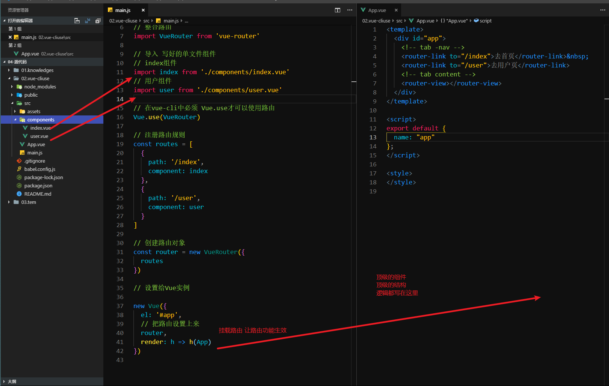

## Vue-cli项目的路由整合

1. 项目创建` vue create 项目名`
2. 运行项目` cd 项目名` `npm run serve`
3. 删除不必要的代码
   1. `components/Helloworld.vue`
   2. `app.vue`的所有内容
   3. 页面所有内容都没有了
4. 整合路由了
   1. 安装`vue-router`:`npm i vue-router`
   2. main.js中导入路由
   3. 必须执行`Vue.use(VueRouter)`
   4. 写路由规则
      1. 有组件
   5. 实例化路由对象
   6. 设置给顶级的Vue实例
5. 写组件
   1. `components/`创建单文件组件
      1. tempalte
      2. script
      3. style
   2. 用的地方 import 即可
6. 添加路由的tab-nav和内容
   1. `app.vue`的template里面
7. 添加路由规则，和导航栏
   1. 规则:`main.js`中
      1. routes：[] 添加对象即可
      2. 同步的创建新的组件
   2. 导航栏:
      1. `app.vue`中 添加router-link

## Vue-cli静态资源使用

1. 静态资源直接丢到`assets/`文件夹下方即可

2. 样式导入

   1. style标签中导入

      ​	css原生就支持的样式导入语法

   ```css
   /* 导入样式 */
   @import url('./assets/reset.css');
   ```

   2. main.js中导入样式

   ```js
   // 导入样式 全局导入
   // 只导入不适用变量保存
   // import './assets/reset.css'
   // 导入 保存到 reset中
   import reset from './assets/reset.css'
   ```

   

## Vue-cli版本的播放器

1. 项目创建
2. cd进入文件夹
3. 运行项目
4. 删除`helloworld.vue`
5. 删除`app.vue`中的代码
6. 整合路由
   1. 安装
   2. 导入
   3. use一下
   4. 路由规则
      1. 写组件
   5. 实例化路由对象
   6. 设置给Vue实例
7. 写tab-nav和tab-content
   1. `app.vue`的template中
   2. router-link
   3. rotuer-view

### 结构样式整合

1. 顶级结构添加到`app.vue`中
2. 样式 拷贝到`assets`文件夹中
3. 导入样式
   1. main.js中导入
   2. style中导入

## 预习

黑马买买买 黑买

准备好了静态页面及接口文档的项目

axios的抽取

​	原型抽取

​	基地址抽取`baseURL`

​	axiospost请求

演示地址   <http://111.230.232.110/> 


