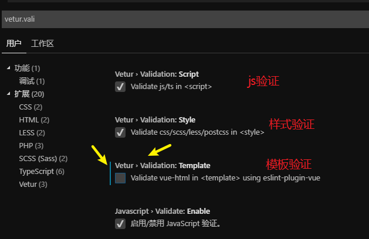
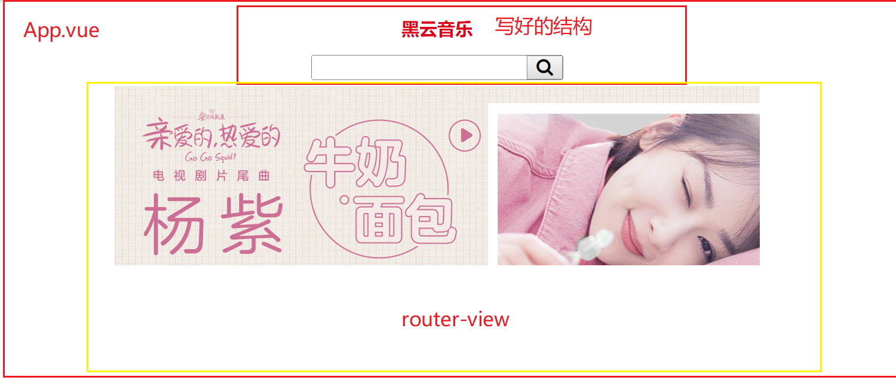

# Vue.js - day07

## 反馈

1. 老师，你写的黑云音乐案例好多bug啊，难道是在考验我们发现bug的能力吗？
2. 真怕找不到工作
3. 今儿讲的好绕...还得继续敲熟 用路由管理组件,这些组件会被变成类似 全局组件吗? 挤!!!泥!!!抬!!!梅!!!
   1. Vue.component
4. 我对面的那位真的是学婊,嘴上说不会,敲代码六得飞起,我写反馈的时候,学神还在旁边偷偷笑.....
5. 不想多说了 头痛...
6. 编码位置 还是懵逼
7. 今天晚上听到琼改的感慨 第六天了 光阴似箭 这是在说岁月是一把杀猪刀，。。。此处省略N行代码（怕被打）
8. /捂脸 老师,讲慢点,讲慢点,讲慢点......重要的事情说三遍...
9. 我旁边的是个学婊,天天喊不会,每天都是用记事本敲代码!!!!!
10. 能不能别把最后一节课时间留那么长
11. 为什么一直报错，垃圾vscode
12. 老师能不能讲慢一点啊，跟不上啊，你这慢一点不够啊，在慢一点慢一点慢一点，就好了
13. 用框架真的脑壳疼,不过这样的编码逼格感觉很高哦!
14. 哎~, 凉凉
15. 有生之年遇见你,竟花光了我所有的运气.
16. 老师, 以后工作每个组件对应的html文件也要分开来写吗
17. 快崩溃了;1.老师在APP.vue里写v-for的时候下面没有红色的波浪线,自己写的时候有,看了半天没报错,查了下要加个:key="item",但老师的怎么没有,有毒;2.写路由管理组件的时候,丢包了,要删掉重新下;3.老师写代码太顺利了,一点bug都没有,自己写的时候一大堆,老师你能出点bug给我一点信心么;4.本来想在vue抢救一下的,现在发现走上了一条不归路.
18. 好难啊
19. 皓哥 我们不学webpack吗
20. 好难啊,靠,一堆错误,错误一堆,全都看不懂,头大,脑细胞都shi光了.葛优瘫.jpg
21. 还是不会 老师重新来温习一遍
22. 老师今天最后一节课太棒了，整个早上都是懵逼的状态，直到最后一节课，希望以后老师能够像今天这样，把我们当成一年级的小白，把案例从无到有完整的演示了一遍...
23. <router-link to="/user">去用户页</router-link> to的前面什么时候要加冒号,什么时候不用加 render:h=> h(App) 这个写法是什么意思? 是因为creatElement函数起作用还是render内部封装? import b from "./App.vue"; 这里的./为什么不能省?不是表示路径查询吗 老师,Vue内部封装的很多东西,用的时候会觉得很不清楚,整个Vue学下来都会这样吗?
    1. :to='xxx'    v-bind:to="xxx"
    2. render函数，把传入的结构 渲染到页面上
    3. ./ 当前路径，
24. 迷迷糊糊的,感觉要一脚踏进毕业即失业的深坑

## 回顾

1. vue-cli项目创建	
   1. vue create 项目名
      1. 下包，创建文件基本结构
   2. cd 项目名
   3. npm run serve
   4. 项目就跑起来了！！
2. vue-cli文件组成
   1. main.js 所有和顶级Vue实例有关系的部分写在这，导包，路由
   2. App.vue 最顶级的页面结构
   3. components 新创建的组件都放在这里
   4. assets/ 静态资源
3. vscode 红色波浪警告关闭&禁用
   1. 红色波浪，`vetur`这个插件的一个有情提示，不一定真的是语法错误，只是可能不太规范
   2. 如果不喜欢波浪，可以关闭
   3. 

## player-项目创建

1. vue create 02player
2. cd 02player
3. npm run serve

## player-界面分析



## player-搜索组件整合

### 实现步骤

1. 把实例的样式整合
2. 整合搜索结构去App.vue中
3. 把顶部的区域拷贝到一个新建的组件中`01.searchBar.vue`
4. App.vue中局部注册 搜索区域组件即可

### 注意点

1. 组件抽取较为简单，结构，逻辑写到单文件组件中即可
2. 组件的注册，
   1. 全局：所有地方都要用
   2. 局部：单个地方使用
   3. 路由：如果要实现，url改变，页面中某些区域切换，就可以使用路由的方式来整合

## player-路由整合

### 实现步骤

1. 下包
2. 导包
3. 用包
   1. Vue.use一下
   2. 写路由规则
      1. 组件和地址的关系
   3. 实例化路由对象
   4. 挂在到Vue实例上（当做参数传入）
   5. `app.vue`搜索区域的下面，设置`router-view`

### 注意点

1. 路由的整合套路类似，下包，导包，用包
2. router-view 不要忘记，忘记了无法显示对应的组件，因为没有内容区域

## player-轮播图

### 01 - 饿了么ui 介绍

[传送门](https://element.eleme.cn/#/zh-CN)

1. 饿了么前端团队开发的pc端的组件库
2. 用的人非常多，
3. `vue全家桶中的一员`:vue,vue-router,axios,饿了么ui，vuex

#### 用法

1. 下包`npm i element-ui -S `
2. 导包
3. 找到轮播图组件,c+v即可使用

### 02 - 轮播图组件使用 

[传送门](https://element.eleme.cn/#/zh-CN/component/carousel)

### 03 - 轮播图组件抽取

### 实现步骤

1. 创建轮播图组件，内部使用的还是饿了吗ui的轮播图`02.slider.vue`
2. 内部使用ele吗的跑马灯组件
3. 路由的方式去整合
   1. main.js中导入
   2. 使用路由规则进行关联
      1. path:"/slider",component:slider
4. 使用axios 获取数据 渲染到页面上
   1. 下包 `npm i axios `
   2. 导包
      1.  import axios from 'axios'
      2. 随用随导
   3. 用包
      1. 轮播图的created钩子中 在这里才可以获取到data的数据
      2. banners:[]

### 注意点

1. 整合了路由规则之后，可以使用router-link进行跳转，也可以直接修改url地址
2. 饿了吗ui的轮播图，更改样式时，不能直接使用标签名作为选择器,会被解析为普通标签，建议添加自定义的类名
3. axios请求数据，在vue中，如果是希望一解析完毕就去请求，可以写在`created`钩子中
4. axios的使用，需要安装，需要导入才可以使用

### 04 - 路由重定向

### 实现步骤

1. 使用路由重定向实现，从`基地址`，去`/slider`
2. [文档传送门](https://router.vuejs.org/zh/guide/essentials/redirect-and-alias.html)
3. main.js中添加一个重定向的规则即可

```js
// 路由规则
const routes = [
  // 添加重定向规则 什么不输入就是/ 
  // 匹配到了/ 去轮播图 地址即可
  {
    path:"/",
    redirect:'/slider'
  },
  {
    path: '/slider',
    component: slider
  }
]

```

#### 注意点

1. 如果希望用户打开基础地址时，自动跳转可以使用重定向
2. 基础地址是`/`

## player-歌曲搜索

### 01 - 搜索路由整合

### 实现步骤

1. 创建一个组件，用来展示搜索结果 `03.results.vue`
2. main.js中添加路由规则 `动态路由匹配`
   1. path:'/results/:search'
3. main.js中导入组件 和规则关联

#### 注意点

1. 搜索需要获取数据，使用的是动态路由匹配
2. 当你没有router-link时，直接url中输入地址也是可以匹配的

### 02 - 搜索路由切换

#### 实现步骤

1. `01.searchBar.vue`中进行编码时
2. 在我们的搜索栏中，输入内容，点击回车，或者点击放大镜
3. 携带输入的内容取到搜索的路由 
   1. this.$router.push('/results/内容')

#### 注意

1. 组件用编程式导航，语法是`this.$router.push`
2. [传送门](https://router.vuejs.org/zh/guide/essentials/navigation.html)

### 03 - 饿了么ui 弹框

饿了吗提供了很多的功能，其中就有弹框,在希望的时候，调用如下方法即可弹出 警告框

```js
this.$message({
      message: '警告哦，这是一条警告消息',
      type: 'warning'
    });
```

### 04 - 搜索结果非空判断

#### 实现步骤

1. 01.searchBar 的去搜索结果方法中 增加非空的判断 
2. 如果输入的内容为空
3. 使用eleme的弹框

#### 注意点

1. 为了阻断代码执行，return,也可以用if else
2. 代码嵌套的层级越少，看起来 跟舒服一些
3. 如果公司要求编码风格，如果公司有规范，一般这个公司比较大，或者技术还算不错

### 05 - 渲染搜索结果

#### 实现步骤

1. 03.results中获取传递的数据
2. 自动发送请求， created
3. 数据获取到之后渲染到页面上

### 06 - 过滤器歌手处理

​	过滤器

### 07 - 过滤器时间处理

​	过滤器

#### 注意点

过滤器名字可以随便起，尽可能又有意义`format`是格式化的意思

过滤器内部的逻辑需要根据需求来调整，

### 08 - 侦听器（zhentingqi）

观察数据的改变，执行自定义逻辑

```js
  // 侦听器
  watch: {
    // 要观察哪个数据改变，就用那个数据作为方法的名字即可
    '$route.params.search'(){
      console.log('search变了')
    }
  },
```

1. watch是vue提供属性不能乱写
2. 内部写的是方法，要观察那个数据改变，就写那个数据的名字即可
3. 如果数据的名字设置到不支持的语法，比如.可以用 引号包裹起来

### 09 - 重复搜索功能实现

在侦听器`watch` 数据改变之后，重新发送请求即可

这部分逻辑created中执行了

​	c+v

​	抽取为方法，调用两次即可

#### 注意点

1. 当有 某个数据改变之后，执行逻辑的需求出现时，就可以使用侦听器
2. updated,不用的原因是，触发的频率太高了

### 10 - 刷新去首页功能

## player - 播放歌曲

### 03 - 点击去播放器

#### 实现步骤

1. `03.results.vue`的播放按钮绑定点击事件 传入歌曲id
2. 方法中使用编程式导航跳转`/player/998`
3. 添加规则`main.js`
   1. 创建并导入04.player.vue组件
   2. path:"/player/:id"
   3. component:player

### 04-axios抽取 基地址设置

1. 设置在main.js中
2. 给Vue的构造函数添加原型属性即可`prototype.$axios=axios`
3. 在所有的组件中就都可以通过 `实例.$axios`来访问axios
4. 而每一个组件都是一个vue实例

#### 注意点

1. 设置给原型的属性所有的实例都可以共享
2. Vue中为了所有组件共享一般也是设置给原型，命名建议加上`$`作为开头，目的是和自己的数据区分开来
3. 组件中如何使用原型上的属性，方法  `this.设置的值`
4. 每个项目的借口，基础地址基本上是一样的，没有必要每次都写上，`axios.defaults.baseURL = 'https://api.example.com';` 可以用这个方式进行抽取
5. 后续请求时，直接写后面的内容即可
6. 设置了基础地址，
   1. 如果请求的URL`/search` 不完整，会自动拼接剩余部分
   2. 请求的url是`https://www.xxx.play/search`完整地址，就不会拼接基础地址

### 05 - 歌曲信息显示

### 06 - 歌曲url获取

### 07 - 歌词显示

## player - mv播放

### 01 - mv路由设置 

### 02-点击携带mvid去mv组件

### 03 - 获取mv信息 

### 04 - 播放最高清的mv

## player - 歌曲评论

### 01 - 歌曲评论路由设置

### 02-点击携带歌曲id去评论组件

### 03 - 获取评论信息

### 04 - 格式化评论时间

##  补充

### 应用程序开发

pc端:electron

移动端:<http://www.dcloud.io/> 


## 总结

watch：某个数据改变执行逻辑 比update的触发频率 低

axios的抽取，原型，命名$axios用 this.$axios，基地址 baseURL

饿了吗UI


