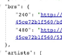
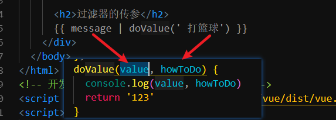
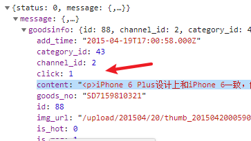
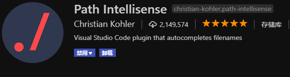
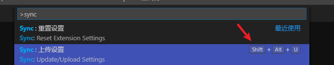
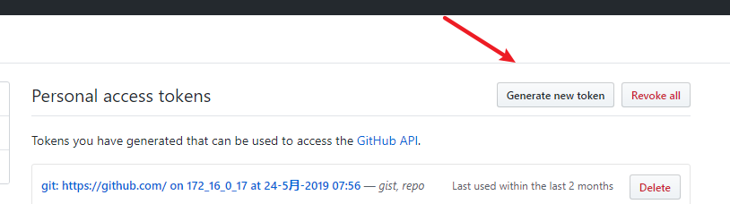
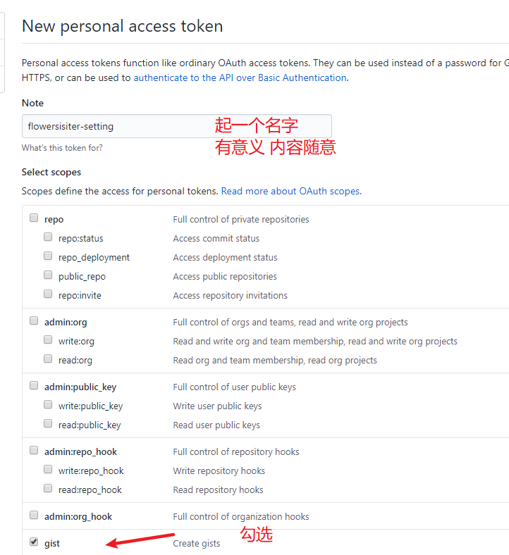
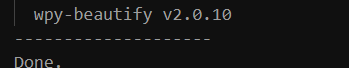

# Vue.js - day08

## 反馈

1. 花姐,vue学到什么程度才能算掌握良好?
2. 懵懵懵懵
3. 我隔壁的学神好嚣张啊
4. 我的声音将穿透你的耳膜 直达你的思维 :bugbugbugbugbugbugbugbugbugbugbugbugbugbugbugbugbugbugbugbugbugbugbugbugbugbugbugbugbugbugbugbugbugbugbugbugbugbugbugbugbugbugbugbugbugbugbugbugbugbugbugbugbugbugbugbugbugbugbugbugbugbugbugbugbugbugbugbugbugbugbugbugbugbugbugbugbugbugbugbugbugbugbugbugbugbugbugbugbugbugbugbugbugbugbugbugbugbugbugbugbugbugbugbugbugbugbugbugbugbugbugbugbugbugbugbugbugbugbugbugbugbugbugbugbugbugbugbugbugbugbugbugbugbugbugbugbugbugbugbugbugbugbugbugbugbugbugbugbugbugbugbugbugbugbugbugbugbugbugbugbugbugbugbugbugbugbugbugbugbugbugbugbugbugbugbugbugbugbugbugbugbugbugbugbugbugbugbugbugbugbugbugbugbugbugbugbugbugbugbugbugbugbugbugbugbugbugbugbugbugbugbugbugbugbugbugbugbugbugbugbugbugbugbugbugbugbugbugbugbugbugbugbugbugbugbugbugbugbugbugbugbugbug
5. 真棒
6. 新的课程,新的懵逼!!!!
7. 不能用全局注册axios吗,只能添加到原型使用?
   1. 脚手架开发时，每个文件的作用域是独立的，为了共享，需要设置给原型
8. 大家坐好,我们开始上课了
9. 唉...毕业即失业 只能回去继承家业....种田养猪 养鸡养鸭了 绝望!!!
10. 代码感觉敲不完 熬夜敲第二天没精神 每天陷入死循环了花姐
    1. 出bug，有问题及时问，搜索
       1. 找到bug之后，看看哪里出的bug
    2. 没思路
       1. 照着笔记
       2. 根据视频的标题
11. 侦听器还是不太懂...
12. 东西太多,学得似懂非懂,文档也不怎么会看...英语太渣,口音太烂,被单词搞死,试想一个月后,面试官听了我的散装口音是不是有种想把我按在地上摩擦的冲动,天啊,地啊,什么时候代码可以普及成中文
    1. 发音不是问题
    2. 易语言
13. 黑马买买买页面是真的@#%&#&@%*丑！！！
14. 今天讲的速度可以，老师保持。
15. 太慢了 将快点
16. 好像理解的差不多,还是要多敲代码,难道编程真是个熟练活????? 我们这个vue框架适合开发所有的页面吗?我看到有的招聘写的差不多是掌握流行框架中的1个就可以了
    1. 编程就是熟练活，
    2. 基本上都可以用vue来做
       1. 国外，很多独立开发者，就是用vue 替代jQ操纵dom
17. 老师,1.在音乐播放的那个页面,要获取很多的数据,就需要预先在data中设置对应的变量来保存,很麻烦,如果我只用一个对象来接收,然后在插值表达式中直接去对应的点出来,又会报错,因为页面一开始的时候没有数据不能点两次,他会说不能给undefined设置属性.那有没有简单一点的操作呢? 2.我把moment引入main.js然后把moment加到vue的原型中,在result页面的私有过滤器中使用this.$moment的时候,报错说this是undefined,所以说过滤器中的this是啥?window吗?为啥不是this.我在私有过滤器中需要使用添加到原型中的方法的时候怎么操作呢? 3.我的style加了scoped之后,就没有办法修改轮播图的高度,加了权重也不行,讲一下scoped吧? 4.为什么组件中的watch在监听路由的时候,$route.params不需要用this点出来?
    1. 访问不存在的属性
    2. 过滤器中无法通过this访问vue实例
18. 终有一天你会跨国静谧无声的洗墨江,离开群山环抱的旧桃源,来到无边阴霾的夜空之下.你要记得,命运选在刀尖上,而刀尖必须的永远向前.愿你在冷铁卷刃前,得以窥见天光.
19. 老师,怎么加强解决buff的能力,有些buff是可以解决的,比如单词写错,但是有些buff真的恶心,甚至有些buff压根就不显示.但是就是会出问题,还有明明有思路,代码就是不会敲,咋办,还有救吗??我什么时候才可以像你一样敲代码敲得那么爽,像不经过脑子一样一拍就来,闭眼在键盘上胡乱的敲都能敲出一个功能.......
    1. bug，
    2. 代码不会写，看笔记，看视频，问同学
    3. 大量的练习
20. 什么时候把代码写钩子里 什么时候上哪种钩子还有些混乱
    1. 具体情况，
21. 还是不懂哦 要多教教哦
    1. 好的哦！
22. 前几天失眠，昨晚终于睡好了，精神满满，而且老师今天讲课棒棒哒，速度也慢下来了，赞赞赞...
    1. 看视频，
23. 真的是好蒙蔽啊,怎么办,一步一步没思路,还报错,思路也记不住,怎么办老师

编程是数量工种，先模仿，再独立实现，不要想着速成，步子太大，会拉伤

## 回顾

1. 饿了么ui
   1. 所有的文档
   2. 入门 ，安装，整合
   3. 找功能，使用对应的功能
   4. vue相关的框架文档（组件文档）
   5. 组件的使用，组件的设置
   6. c+v跑一下
   7. 根据需求调整成自己的结构
2. axios抽取
   1. Vue的原型上，prototype
   2. 原型上的属性，方法，所有的Vue实例都可以使用，组件就是Vue实例
3. 面试题? 原型你用过吗？axios你用过吗？
   1. 原型是prototype，可以让所有的实例共享属性和方法
   2. 当我们有需要共享的东西时，就可以放到 原型上
   3. 我之前在做vue项目时，就把axios设置到了Vue的原型上，在每个组件中直接通过 this.$axios就可以访问了
   4. $的目的是区分原型上的属性和自己内部的属性

## watch补充

1. 可以侦听data中的基本数据类型，直接写名字
2. 复杂数据的类型，可以侦听内部的数据 点语法需要 用引号包裹
3. 可以直接监听复杂数据类型，但是要结合一个设置`deep:true`
4. 深度侦听之后，复杂类型内部任何一个数据改变都会触发
5. 复杂数据类型2个参数的值，都是同一份数据因为，值数据的内存地址
6. 深度监听，不太建议使用，性能消耗较大
7. 相比于Vue的其他属性，侦听器的使用频率不是那么高

```js
// 侦听器
    watch: {
      // 接收2个参数
      // 参数1 新值
      // 参数2 旧值
      message(newValue, oldValue) {
        console.log('message改变了')
        console.log(newValue, oldValue)
      },
      // 可以侦听复杂类型中的某个字段
      // 'person.name'(newValue, oldValue) {
      //   console.log(newValue, oldValue)
      // },
      // 复杂类型的数据不能直接侦听听
      // person(newValue,oldValue){
      //   console.log(newValue,oldValue)
      // }
      // 复杂类型的数据需要使用深度侦听
      // 如果侦听的是复杂类型，返回给我们的是 数据的地址，val，和oldVal指向的是同一份数据
      // 2个的值 一样
      // 使用频率不太多，触发频率太高，建议使用专注的方式侦听某一个数据
      person: {
        handler: function(val, oldVal) {
          console.log(val, oldVal)
        },
        deep: true
      }
    }
```


## 接口缓存问题

1. 通过在调用接口是 额外的增加一个参数即可解决
2. <https://binaryify.github.io/NeteaseCloudMusicApi/#/?id=%E8%B0%83%E7%94%A8%E5%89%8D%E9%A1%BB%E7%9F%A5> 
3. 慎用，避免 花姐的服务器 被  某某云限制
4. 不要一直刷新，或者不要开启自动保存

```js
    axios.get(`https://autumnfish.cn/banner?type=2&timestamp=${Date.now()}`).then(backData => {
      // console.log(backData);
      this.banners = backData.data.banners;
    });
```


## player - 播放歌曲

### 05 - 歌曲信息显示

1. 获取id
2. 根据id查询歌曲信息 /song/detail?ids=347230 
3. 在created中调用接口，原因是可以获取到data中的数据 

### 06 - 歌曲url获取

### 07 - 歌词显示

1. 获取id
2. 根据id查询歌词/lyric?id=33894312 
3. 在created中调用接口，原因是可以获取到data中的数据 

## player - 歌曲评论

### 01 - 歌曲评论路由设置

1. main.js中添加评论路由
   1. 创建组件 05.comment.vue
   2. path:"/comment/:id"
   3. component:comment

### 02-点击携带歌曲id去评论组件

 	1. 04.player.vue的歌曲名 绑定点击事件
 	2. `this.$router.push('/comment/具体的id')`

### 03 - 获取评论信息

1. 05.comment.vue
2. created中调用评论接口 
3. 获取数据 渲染到页面上 /comment/hot?id=186016&type=0 

### 04 - 格式化评论时间

1. 下载moment.js 
2. 在评论组件中 导入moment
3. 过滤器 formatTime
4. 页面中使用 | 设置过滤器

## player - mv播放

### 01 - mv路由设置 

1. main.js中 路由规则
   1. 创建06.mv.vue
   2. path:/mv/:mvid
   3. component:mv

### 02-点击携带mvid去mv组件

 	1. 点击 搜索结果的mv图标 携带id去mv
 	2. this.$router.push('/mv/mvid')

### 03 - 获取mv信息 

1. 06.mv.vue
2. created  
   1. 接口地址 /mv/detail?mvid=5436712 

### 04 - 播放最高清的mv

1. 
2. 找到brs中最大的那个key 获取对应的mv地址即可实现播放
3. 对象 可以用
   1. 对象.属性    取值
   2. 对象[属性名]    取值


## 播放器优化

### 约束底部尺寸为 1080

1. 底部是通过router-view
2. 为router-view加个盒子
3. 跟这个盒子设置尺寸 1080 左右居中


### 设置更好看的滚动

iScroll 进化版本 better iScroll 

[betterISCroll](https://www.npmjs.com/package/better-scroll)


#### 注意点

1. better iScrolll比iScroll新一些，但是语法基本一样
2. Vue中获取dom元素最早要放在mounted中，在这之前拿不到dom元素


## 过滤器补充

[过滤器中的this](https://github.com/vuejs/vue/issues/5998)

### 过滤器的串联

数据会依次的通过这些过滤器，每一次处理的结果，会被下一个过滤器接收

```
      <!-- 过滤器的串联 -->
      {{ novel | addTitle | addWriter }}
```

### 过滤器传参



1. 第一个参数固定是处理的数据
2. 自己传递的参数会从第二个开始
3. 作用：过滤器的内部有一部分内容无法确定，让用户传进来
4. 比如可以结合moment.js 实现在不同的地方 用特定的格式进行处理

### 全局过滤器，局部过滤器

1. 一个一次注册，全部可以使用

```js
  // 注册全局过滤器
  Vue.filter('globalFilter', value => {
    return value + '-------我是来自于全局过滤器的处理逻辑，非常的厉害'
  })
```

1. 一个只能在当前Vue实例中使用

```js
filters:{过滤器1（value）{return 内容}}
```


## 黑马买买买

### 项目准备

```
vue create 03.blackbbb

cd 03.blackbbb

npm run serve 

```

1. [展示效果](http://111.230.232.110/#/index)
2. 删除多余部分
3. 整合静态资源 static文件夹拷贝到assets中
4. 整合静态页面
   1. 根据需求 c+v对应的结构即可
5. 不变放到app.vue中
6. 变得挖个坑`router-view`
7. 修改url地址 即可实现切换中间的内容

### 路由整合

1. app.vue中头尾整合
2. 中间设置router-view
3. main.js中 整合路由
   1. 下载
   2. 导入
   3. 路由规则
   4. 路由对象
   5. 挂在到Vue实例上
4. 上述内容做完之前，黑窗中会报错

### 首页重定向

1. 首页需要输入 /index才可以访问

2. 路由重定向

3. main.js中

   1. path:/
   2. redirect:/index

   ### 注意

一般来说访问 网站默认都是先去首页，这里可以使用重定向来实现

### axios抽取

npm i axios 下载

main.js中导入

设置给Vue.prototype.$axios

### axios基地址设置

axios.defaults.baseURL = `http://111.230.232.110:8899/ `

### 首页顶部数据获取

1. created中调用首页数据接口 `site/goods/gettopdata/goods`
2. 渲染到页面上
   1. data中准备数据
   2. then中赋值
   3. 页面中挖坑，填坑
3. html结构如果不是自己写的，最好用审查元素的方式来找到关键区域
4. 只处理关键部分即可

### 首页右侧数据处理

1. 时间的处理用moment
2. 定义过滤器
   1. 局部
   2. 全局
3. 多个地方要用到，这里选用全局注册过滤器
   1. main.js中去注册

####  注意

1. 全部都需要用到的过滤器建议用全局
2. 如果过滤器中的逻辑有一部分无法确定，可以让用户传入参数
3. 这里把格式化时间的格式当做参数传过来了

### 详情页跳转

1. main.js中
   1. 导入组件 02.detail.vue
   2. path:"/detail/:id"
   3. component:detail
2. 首页点击某个商品，跳转到详情页 携带id
3. 为商品绑定点击事件 传入id
   1. 方法中
   2. this.$router.push('/detail/具体id‘)

### 详情页顶部数据渲染

1. created
   1. this.$axios.get(`地址${this.$route.params.id}`)
   2. then(backData=>{})
   3. 保存到data中
2. 页面中 挖坑，填坑v-for

### 详情页右侧数据处理

1. 详情页的右边使用全局过滤器来处理时间

### 详情页详情数据渲染

1. 底部能容 直接从数据中就返回了 html结构



直接使用v-html指令即可

绝大多数的电商网站，商品的详情都是一堆图片


## 总结

1. 侦听器
   1. 深度侦听deep:true
   2. 侦听的是复杂类型，2个参数值一样
   3. 侦听的是基本类型，2个参数 1，新值，2，老值
   4. 复杂类型如果只要侦听某个值`数据.属性. ....`
2. 过滤器
   1. 串联  `{{value |f1 |f2}}`
   2. 传参 `{{value | f1('参数')}}`
      1. 自定义参数，从第二个开始 
      2. 第一个是处理的数据
   3. 全局过滤器
      1. Vue.filter 脚手架中用的比较多
3. better-scroll 基于iSCroll
   1. 工作中如果只是做滚动，可以用这个
   2. vue中dom元素获取最起码 mounted
4. 播放器
5. 黑买买买买
   1. 携带数据跳转  编程式导航，动态路由匹配
   2. 组件以显示就要获取网络数据
      1. created
   3. 多个组件axios请求
      1. 原型抽取
      2. 基地址设置
   4. 页面数据渲染
      1. data定义
      2. then中赋值
      3. 页面中挖坑填坑


## 补充

### 1.路径提示

###  

安装即可

1. 输入路径是 不要直接写文件夹`./`
2. 打开项目时，不要用工作区的方式
   1. 每次写代码时，就当开当前项目
   2. 鼠标右键项目文件夹，使用vscode打开即可
   3. 如果没有重装一下vscode，勾选的页面全部勾上即可
   4. 重新安装插件所有的设置都在


### 2. 同步vscode的所有配置

1. 插件
2. 代码片段
3. 用户设置


使用步骤

1. 安装插件 
2. 需要有github的账号
3. 打开vscode ctrl+shift+p 输入`sync`找到下图内容，回车



4. 自动跳转到github 点击如下按钮





5. 点击最下方的绿色按钮创建
6. 切换的页面中 拷贝 新增的内容


7. 回到vscode中 把拷贝的内容 粘贴到对话框中即可
8. 稍等片刻 提示如下 即可




