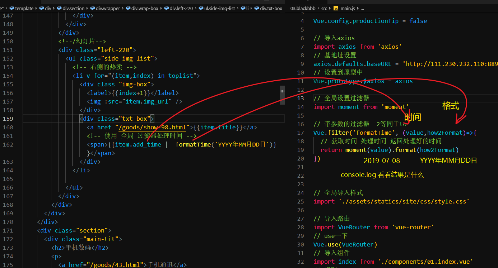
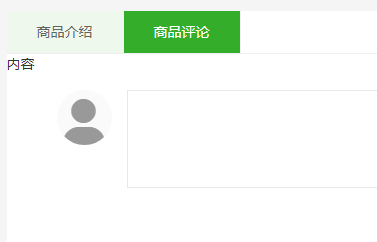
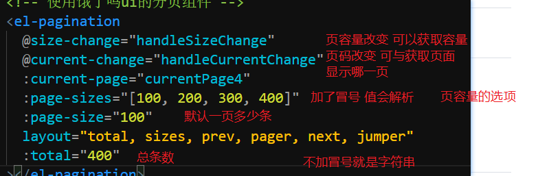
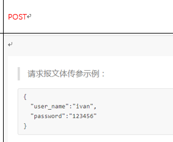
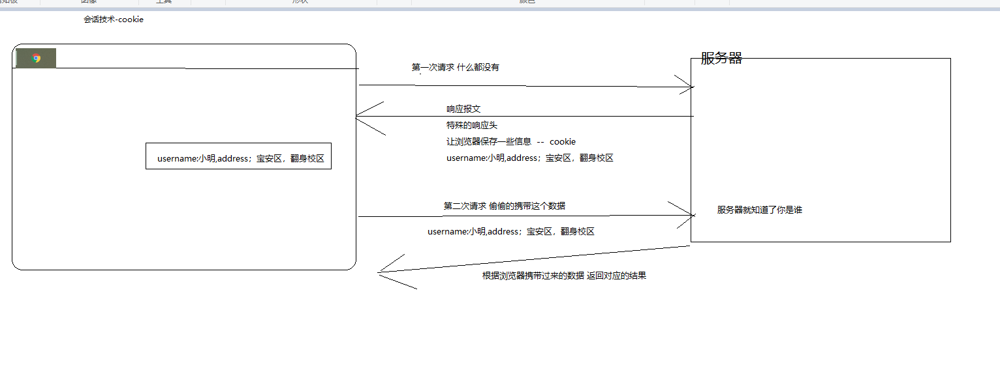
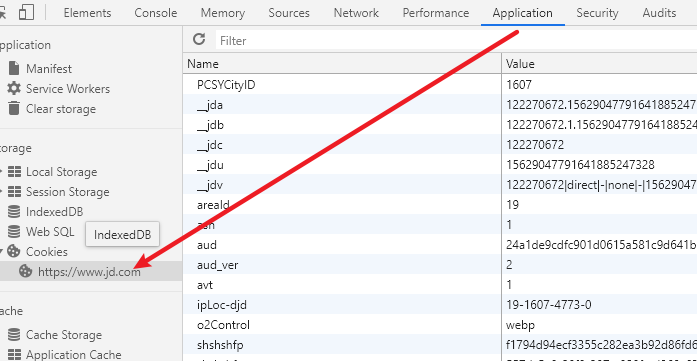
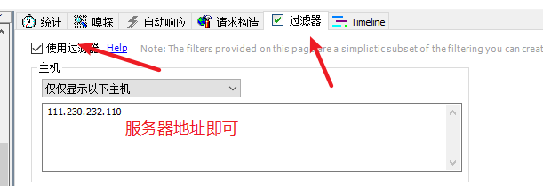

# Vue.js - day09

## 反馈

1. export default {name:'result',}中这个name的可写可不写是吗 }
   1. name 组件的名字
   2. 可以省略
   3. 建议写上
2. 其实吧,我要求不高,找个工作,看得起病.买得起主机打打刺客信条,旅的起游--看看澄净的盐湖,跑的起香港百公里说不定还能遇到发哥合个影,吃得起四川麻辣烫,工作累了就健健身,岂不美哉!!!!
3. 我说简单,你们说我装,我说太难,不会,你们说我学婊,好难呀
4. 花姐,电脑太卡了啊...写一个小时的代码,花半个小时在等电脑反应,又不敢粗暴对他...激情都被磨没了= =
   1. 固态
   2. 内存
   3. 换电脑
5. 万能的花姐,请告诉我晚上不失眠多梦该怎么解,做梦多导致早上上课老想睡觉,没有熬夜晚睡.......感觉是用脑过度造成的......
   1. 想法太多
   2. 睡觉之前让自己累一些
   3. 瑜伽
6. 相信我是基本清楚
7. 带参数的过滤器不太会用emme 老师再讲一下
8. 大家好,我是康哥
9. 士别三日当刮目相待
10. 》》》》》》》》》
11. 我们组的大神说好简单啊 首页好简单啊~
12. 花姐,moment设置时间格式的文档在哪里看
    1. [传送门](http://momentjs.cn/docs/#/parsing/string-format/)
13. 老师讲黑云音乐讲了太久了,重复做了好多次,希望多讲点新鲜的知识点. vue使用bootstrap是和原生一样吗?
    1. 普通的bootstrap 和之前用法一样 导入 直接使用 提供的结构即可
    2. 封装了一个基于Vue bootstrap [传送门](https://www.npmjs.com/package/bootstrap-vue)
14. 是真的懵，都不会怎么办啊
15. 不会啊 咋办 有药吗
    1. 动手
    2. 药没有用
16. 我好像快瞎了...头发也少了...冲动也减少了
    1. 体质变差了
17. 完了完了...太难了..在看看附近的人...大概自己是整个班最菜的了.....啊...崩溃了////
18. 这个技术要去谈薪酬有点心虚,梦想着过万,现在感觉能进就好......
19. 有点模糊、有点不懂、有点没学会，说不出来那种感jio
20. 花姐那个首页的轮播图感觉布局有点问题,做不出来,讲一下呗! 下面的商品展示感觉好爽,一下就全部渲染出来了
21. 炸服.......................BOOM
22. 赛亚人的起名都与蔬菜有关——贝吉塔王（King Vegeta）：所有“蔬菜”的领袖；贝吉塔（Vegeta）、塔布尔（Tarble）：兄弟二人名字合起来读即是蔬菜“vegetable”；巴达克（Bardock）：英语牛蒡[bang]“burdock”；卡卡罗特（Kakarotto）：胡萝卜法语发音“carotte”；布罗利（Broly）：英语西兰花“broccoli”；——————花姐一进入餐厅：老板，来一盘布罗利炒鸡蛋......
23. 动态组件 和 异步组件讲一下吧
    1. keep-alive 让组件不被销毁
24. 每次从A组件切换到B组件, B组件的created钩子函数都会触发吗 , 每次切换到B组件 ,是不是都会重新创建B组件的vue实例
    1. a->b 每次b都会created 除非你用了 `keep-alive`
25. 10块钱的服务器不行啊 快去买个998
    1. 998 还没有10块钱的好
    2. 各大云供应商，对于新用户特别优惠，续费比较坑
26. 老师，验证码的实现后面会学吗？
    1. 前端，调用接口即可
    2. 后端，用代码的方式生成一张图片
    3. 所有的功能对前端而言都是接口
27. 老师后面能帮我们总结或者汇总一下vue在面试中会问到的东西,那些部分很重要,既会问到而且要掌握
    1. 面试造火箭
    2. 工作拧螺丝

## 回顾

1. 全局过滤器



## 黑买 - 首页携带id去详情页

1.  为顶部右侧的商品绑定点击事件 toDetail(item.id)
2. 方法中 编程式导航
3. main.js
   1. 写组件
   2. path:/detail/:id
   3. component:detail
4. **如果某个组件 需要根据某个数据才能够显示结果，可以用 `动态路由匹配**`


## 黑买 - 详情页顶部右侧数据渲染

1. 获取路由传递的数据 `this.$route.params.id`
2. 调用接口
   1. created
   2. site/goods/getgoodsinfo/87 
3. .then
   1. data中定义数据
   2. 页面中挖坑填坑
   3. 还需要用到全局过滤器`formatTime`
4. 前端在编写静态页面时，最终页面中的结构会被数据动态渲染
   1. 列表的效果，写一个即可
   2. 页面中的内容，也不需要写的那么精确，用测试数据即可

### 快速生成测试文本

```
lorem  + tab
lorem数字 + tab
比如 lorem10 + tab
	生成10个单词
```

## 黑买 - 详情页顶部详情

## 饿了吗UI - 计数器

1. 下包 npm i element-ui -S 
2. 导包 `main.js`
3. 用包 找到你要的组件 c+v
4. [文档传送门](https://element.eleme.cn/#/zh-CN/component/input-number#inputnumber-ji-shu-qi)

```
  <el-input-number v-model="num" @change="handleChange" :min="1" :max="10" label="描述文字"></el-input-number>
```

v-model 双向数据绑定 要在data中设置

@change是事件绑定，需要在methods中定义

## 黑买 - 详情页 点击推荐切换详情

1. 02.detail.vue中
2. 顶部右侧热卖， 绑定点击事件，点了之后 编程式导航，切换地址 携带商品id
3. 因为页面没有切换 created不会触发，只能使用watch 检测 $route.params.id的改变
4. 只要改变，重新调用获取数据的方法
5. 把created中的获取数据的逻辑抽取到 methods中

### 注意

1. a标签如果设置了有意义的href 点击会跳转 vue中可以通过`@事件.prevent`,来阻止默认行为
2. 如果有组件不切换，但是数据改变，希望执行自定义逻辑的情况可以使用`watch`

## 黑买 - 详情页底部tab切换



1. 使用索引的方式记录点击的tab
   1. data中 添加一个 `tabIndex`
2. tab的高亮本质是 class的添加和移除 使用v-bind即可实现
3. 底部的内容切换 因为频率较高 使用v-show 判断的条件也是索引

### 注意点

自己实现tab的本质

1. tab栏 动态切换类名 v-bind:class={类名：表达式}
2. tab-content 动态的切换显示和隐藏 v-show="条件"

## 黑买 - 详情页底部详情数据渲染

1. 底部tab的 内容区域
2. 使用v-html的方式渲染 服务器返回的详情数据即可

### 注意点

1. 电商类的详情，服务器返回的基本都是一个页面结构，直接使用v-html即可完成渲染
2. 如果有多个图片堆叠，图片底部会有一个小间隙，可以用`display:block` 去除

## 黑买 - 详情页评论分页获取

1. 进入到详情页时，获取评论
2. 点击顶部右侧时，评论重新获取
3. 把评论的逻辑抽取到methods中
   1. created
   2. watch中调用即可
4. site/comment/getbypage/goods/102?pageIndex=1&pageSize=1 
   1. id  商品id  动态
   2. pageIndex 页码 动态
   3. pageSize 页容量 动态
5. then方法
   1. 获取数据
   2. data中定义数据
   3. 页面挖坑 填坑

### 注意点

1. 评论一般会比较多接口调用时，很大可能需要传递页码和页容量，具体的数字根据需求来写即可
   1. 页码默认基本都是1
2. 评论在切换url地址时也需要重新获取，这个时候直接使用 `watch`侦听器

## 饿了吗UI - 分页



1. [文档传送门](https://element.eleme.cn/#/zh-CN/component/pagination)
2. 设置在文档的底部

### 实现步骤

1. 找到饿了么的分页组件
2. 整合到项目中
3. 根据文档设置方法和属性
4. 数据获取的时候，额外的获取总条数

### 注意点

1. 任何一个框架的设置都不会少，不要强迫自己一定要全部记下来，随用随查，用的越多越熟练
2. 饿了么ui的组件设置都在 当前这个组件的 最下面


## 黑买-评论分页功能

1. 页码改变之后，重新获取这一页的数据
   1. handleCurrentChange 
2. 页容量改变之后，重新获取数据并且，页码变为1
   1. handleSizeChange 

### 注意点

1. 页容量改变之后，切换到第一页，是一个提升用户体验的方法
2. handleCurrentChange  &handleSizeChange  自己实现的方法名，名字是可以修改的
   1. 如果修改，分页组件绑定的方法也要一起修改
3. 使用其他组件时，方法和属性可能名字比较奇怪，组件内部实现的方法，先按照名字使用，然后再考虑实现的方式

## 黑买 - 登录

1. 登录功能，需要后端提供接口判断用户信息或者错

2. 用户提交数据的时候，根据服务器返回的信息提示对错

3. 整合登录页面

   1. 03.login.vue

4. 注册登录路由

   1. main.js
      1. path:/login
      2. component:login

5. 登录组件中，为点击登录绑定点击事件

   1. @click login

6. 获取用户名和密码

   1. data:username,password
   2. v-model.trim

7. 调用接口提交数据

   1. site/account/login 

   2. 

   3. ```
      axios.post('地址', {
         对象的方式传递参数 key:value
        })
        .then(function (response) {
          console.log(response);
        })
      ```

8. 根据服务器返回的信息 提示用户

   1. 饿了吗ui this.$message


### 注意点

1. axiospost请求如何发

   1. ```
      axios.post('地址'，对象的方式传递参数)
      ```

2. 工作中如果是ajax的登录肯定有接口

3. 项目开发阶段可能注册功能不存在，为了登录一般会准备测试用户

   1. 用户名:admin
   2. 密码:123   
   3. 这里写的是黑买的测试用户
   4. 工作中测试用户找后端

4. 额外的准备一个去登录页的按钮

5. 登录状态的判断一般都是状态码，不建议使用中文进行判断，可能项目需要出口，或者是国际项目

## 黑买 - 登录状态判断

1. 用户登录成功之后，
2. 需要有一些判断的以及 来确定是否成功，
3. 有一个接口`site/account/islogin ` 获取登录的状态
4. 就可以根据这个接口的返回结果判断当前用户是否登录，进行一些额外的处理
5. 这里为了测试，提供一个按钮，专门用来调用这个接口


### 实现步骤

1. 03.login.vue中 增加一个按钮，这个按钮用来判断用户是否登录
2. 按钮的点击事件中 发请求
   1. 根据接口判断是否登录

## 黑买 - 用户登出

1. 登录页面增加一个美观的按钮
2. 点击调用 登出接口`site/account/logout`

## 会话技术

1. 工作中，全部都是后端来设置的

2. 解决http的状态维持

   cookie

   1. 服务器向浏览器发送一个响应头
   2. 浏览器接收到这个特殊的响应头之后，把一些特殊的信息保存到本地
   3. 第二次请求的时候，会自动的把这个信息，偷偷的携带在请求报文中
   4. 服务器接收到这个信息，就可以判断出你是谁了

   

   可以把这个类比于

   1. 学员=浏览器，黑买=服务器，听课证=cookie
   2. 学员报到，第一次过来 ，黑马给你发了个听课证
   3. 第二次过来，你带着听课证，我们就知道你是谁了
   4. 如果把cookie干掉，（牌子丢掉），原本记录的状态就没有了
   5. 保存的位置是浏览器
   6. 

   

   ### 抓包工具使用

   

   

   

   

## 坑点 axios 跨域携带cookie

1. axios 如果请求的是不同源的接口，需要通过一个设置才可以携带`状态信息`

2. 而这个设置axios默认是 关闭

3. ```
   // 允许携带cookie
   axios.defaults.withCredentials=true
   ```

4. 把上述代码添加到main.js中 axios部分即可


## 重点 - vue项目开发中的坑点们-axios跨域携带cookie

1. 我有一个项目用的axios来发送请求，登录的状态的判断是基于cookie的

2. 后台提供了一个登录状态判断接口，目的是验证登录是否成功

3. axios调用登录接口成功之后，

4. 调用登录判断接口，提示--未登录

5. postman测试接口时，可以正常使用的

6. 通过研究cookie的工作机制，发现 axios默认不会再请求不同源接口时，自动携带cookie，倒是登录判断失败

7. 通过查阅文档发现可以添加一个设置

8. ```
   // 允许携带cookie
   axios.defaults.withCredentials=true
   ```

9. axios就回携带cookie 解决了这个登录问题

10. 可能会被追问

    1. 你跟我介绍一下cookie
    2. 除了cookie之外，你还用过什么登录的方式呢？
       1. token
    3. **cookie 和 localStorage 和SessionStorage的区别？**
       1. cookie 存储容量小，4kb,解析起来麻烦，需要自己解析，关闭浏览器，没有了
       2. **localStorage**  容量大，常驻，读写方便，不能保存复杂类型（字符串）如果非要存复杂 JSON.stringify
       3. SessionStorage 不常住，关闭就消失了，不能保存复杂类型（字符串）如果非要存复杂 JSON.stringify
    4. 如果面试官是后台开发人员，可能还会问你session?

    


##嵌套路由

## 黑买 - 个人中心页

## 补充

### vscode拉取配置


