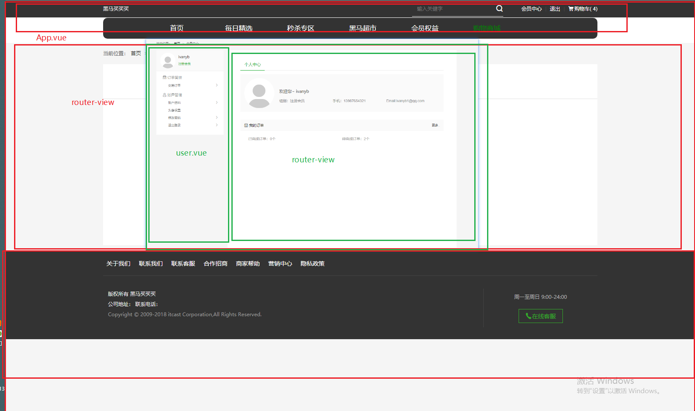
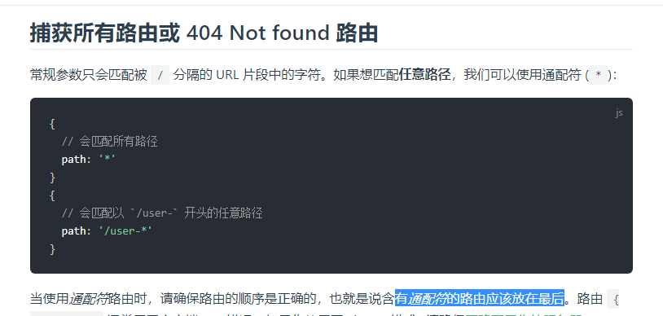
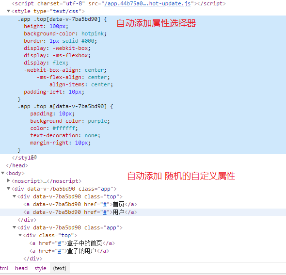
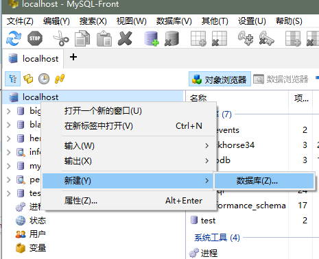
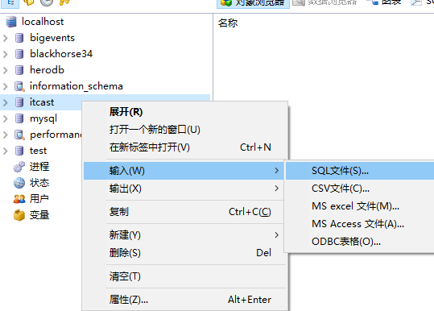
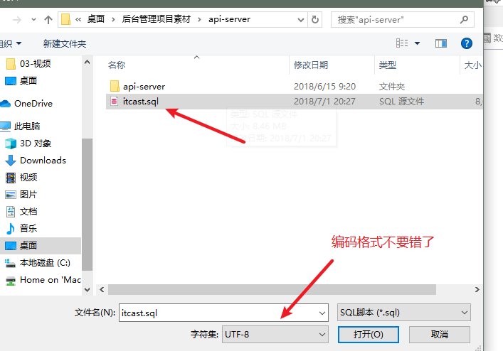
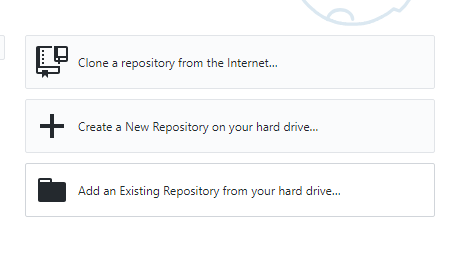
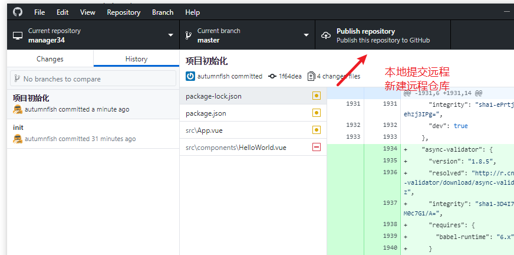
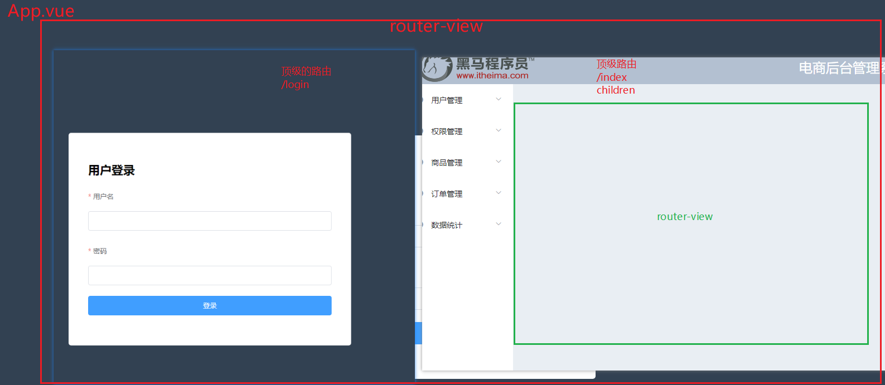

# Vue.js - day10

## 反馈

1. 感觉自己好没用啊,不知道自己能干嘛,干vue么,也就只会发发请求而已,能干什么呢~~~~~~颓废的人生啊!!
2. 花姐,可否用 computed计算属性 来替换watch功能? 感觉他们功能有些相似; 商品详情里面的大图显示是否需要插件?还是自己写原生...
   1. 素材的详情中
3. 每天都要跟一堆报错斗智斗勇
4. 卢本伟牛逼
5. 我蛟塘流浪法师今天就要把戴斌斌当超级兵补.
6. 我好想当学婊啊
7. 老师 老师 ,我们昨天看了传智播客的讲座 ,以后是要升级9-12个月的课程 而且还不涨价 ,那我们是不是亏死了┭┮﹏┭┮;他们的项目教材好诱人,我们能不能用上最新的教材 畅游商场就很不错 ,我同桌都快馋哭了
   1. 随时欢迎来拷
8. cookies有点懵逼，知道他的存在，有可能她认识我，但是我不认识他，这可能就是有缘千里来相会，我就是不认识他
9. cookie还不是很清楚,希望老师在讲一下
10. 好难啊 学不会的第9天 哪个帮我人工呼吸(♂)
11. 代码千万行，注释第一行。命名不规范，同事两行泪
    1. 全局变量中用 i ...
12. 怎么在github上面找vscode同步上去的所有配置
    1. 下课搜搜
13. 改了一下午的bug.快绝望了.............
14. 花姐,我们现在做的项目是模拟公司做项目的流程来做的麽
15. 我铁场无极剑圣今天就要追着伍世栋砍他九条街！
16. 诶，我这茂盛的头发啊，为什么就是不掉啊，你忘记你当初来黑马的初衷了吗？
17. 我同桌 写不来问我 我装作会的样子 告诉了 他一个错的 哈哈哈哈哈哈哈哈哈哈哈 他改了一下午的bug 是我教的 哈哈哈哈哈哈哈哈哈哈哈哈
18. 从前有个人叫玛斯·锟旭，有一天，他撑着船，到了一个叫才没跆倪的一个小岛上，在这里的发现了新物种，他喜出望外的回去把眼前看到的一切写了一本小说叫《玛斯·锟旭才没跆倪记》。不过他总喜欢把这本书的名字倒着念
19. 插件的使用好像会了
20. 老师请问一下，是不是所有涉及到data 中的数据的axios请求， 都要放在created钩子中？ 之前第五天的课程里您有讲到如果要获取data中的值 或者 methods中的方法 ，逻辑要写在created中，但是为什么提交评论的方法写在methods里， 没有在created中调用，也是可以评论成功的呢？不是应该获取不到数据么？
    1. methods中的方法，除了可以在created中调用之外，可以也可以直接绑定在页面上
    2. data的操作最早要放到created中？ created之前，拿不到data中的数据
21. 为什么给li标签的点击事件加.prevent修饰符可以阻止li标签下面a标签的跳转? 老师,把产品详情里面的那个产品图片(放大镜那个)安排讲一下吧
    1. 冒出来的，prevent相当于阻止了那一溜元素的默认行为
    2. 写个文本教程
22. 花姐，需要你的醍醐灌顶
23. 老师,把黑买页面要用到的外部组件都说一些吧,后面你应该也没时间教完了估计
24. 输入框下拉框中的历史数据是默认的吗, 怎么设置不显示默认数据呢
    1. chrome中历史数据
25. 老师,如果点击事件需要用到多个修饰符怎么办?比如要阻止冒泡,又要阻止默认行为,又要去除前后空格,这要怎么用?
    1. 一路写下去即可  @click.prevent.enter.xx
26. 花姐,Bootstrap这个怎么玩,以后工作出去后静态页面是自己敲出来的还是用这个Bootstrap,还有出去工作看不懂公司代码怎么办,要跑路吗??
    1. bs 没有vue 没有饿了么的时候 蛮流行
    2. 现在 如果是基于vue的项目开发 饿了么 基本绑定
    3. 静态页
       1. 酷炫的页面，自己写
       2. 后台页面，内部人员看的页面，ui框架去搭建
    4. 看不懂问！
27. Lorem ipsum dolor sit amet consectetur adipisicing elit. Molestiae deserunt aspernatur reiciendis, sunt maxime doloremque cum, error nihil, rem vel recusandae quas molestias fugiat odio consequatur labore itaque facilis voluptatum officiis! Reprehenderit incidunt fugiat error harum quae? Doloremque esse distinctio dolorum, placeat vitae labore autem, culpa amet eaque pariatur ex!
28. 老师,页面怎么格式化代码?
    1. 右键
    2. 无法格式化，肯定是代码有问题
29. 我爱花姐 不爱彭林
30. 花姐棒棒哒

## 回顾

1. cookie
   1. 工作中，前端 基本上不需要操纵cookie
   2. cookie 绝大多数情况下都是后端设置的
2. cookie工作流程
   1. 浏览器 第一次请求 没有cookie
   2. 服务器接收到请求之后，返回了一个 cookie
   3. 浏览器接收并保存
   4. 浏览器 第二次请求 有了cookie  偷偷的携带cookie 去服务器
   5. 服务器接收到请求之后，发现有cookie 就知道浏览器的信息（是谁了）
3. cookie保存的位置
   1. 浏览器中
   2. application的cookie分栏中
4. ajax跨域携带cookie
   1. axios 跨域不会自动携带cookie
   2. **ajax跨域就不会携带cookie**
   3. axios浏览器中，基于ajax的封装
   4. jQuery.ajax跨域携带cookie？
      1. 

## Ajax跨域携带cookie

[传送门](https://developer.mozilla.org/zh-CN/docs/Web/API/XMLHttpRequest/withCredentials)

碰到的坑点！

axios跨域不带cookie 必须设置才可以

postman中测试接口没有问题

页面中开发项目没有效果

通过抓包工具发现 没有携带cookie

找到了这个设置 添加之后 就可以了 （差点跟后端干起来了！）

查阅文档发现 跨域携带cookie是ajax的问题 axios 只是 一个封装的ajax库而已

所以 原生ajax中 包括jQ封装的ajax中 也有这个问题 设置都是`withCredentials`设置为 true即可

## 黑买 - 登录状态判断

> 不是所有的页面都可以直接访问，比如会员中心

1. 创建会员中心组件 04.user.vue
2. main.js中注册路由
   1. path:/user
   2. compont:user
3. 不涉及data中的数据操纵，接口调用写到 beforeCreate中即可
4. 访问会员中心时，判断用户是否登录
   1. 登录了：什么都不用干
   2. 没登录：提示用户，去登录页

### 注意点

1. beforeCreate中使用axios判断是否登录如果网速较慢，会在会员页停留一会，再跳转 体验不好
2. 可以使用一个更早的钩子函数

## 前置导航守卫

[传送门](https://router.vuejs.org/zh/guide/advanced/navigation-guards.html#%E5%85%A8%E5%B1%80%E5%89%8D%E7%BD%AE%E5%AE%88%E5%8D%AB)

1. 编码位置 路由的下方
2. main.js

```
const router = new VueRouter({ ... })

router.beforeEach((to, from, next) => {
  // ...
})
```

1. 这个钩子，守卫，会在路由切换的时候执行
2. to 去的路由信息
3. from 来的路由信息
4. next 向后执行
   1. 如果不执行，路由就不会切换了

## 黑买 - 导航守卫登录判断

1. main.js中 
   1. router.beforeEach内部
   2. 增加axios登录判断的逻辑
   3. 当用户访问的是 user页面 需要 登录判断
   4. 登录了：放过去
   5. 没登录：打回来！

### 注意点

1. 为了避免登录判断出现组件一闪而过的情况，
2. 把登录的逻辑从组件中迁移到了 路由 导航守卫
   1. router.beforeEach (全局前置守卫)
   2. 路由切换的时候执行
   3. 组件还没有加载
   4. 用户看不到组件了
3. 工作中登录的判断一般也是放在  导航守卫

## router-嵌套路由

[传送门](https://router.vuejs.org/zh/)

1. 嵌套路由用来实现，在路由结构结构下，还需要动态的切换某个部分的效果
2. 写法
   1. 组件的内部，写一个`router-view`
   2. 路由规则中，children，
      1. children的规则，不加/

## 黑买-嵌套路由整合



1. 04.user.vue中 准备基本结构
   1. 左侧部分固定
   2. 右侧部分用 router-view替代
2. main.js中
   1. 写嵌套路由规则 
   2. 把右侧 动态切换的内容 抽取为组件
   3. children:[]
      1. path:规则
      2. component:组件

### 注意点

1. 嵌套路由的时候需要分析出来 嵌套的组件位置
   1. 找到对应的组件去 挖坑 设置`router-view`
   2. 在对应组件的路由规则下，写`children`数组 路由规则即可
2. 嵌套路由的重定向，省略 / vue-router自动帮我们加上/

## vue-router 统一的错误页

[传送门](https://router.vuejs.org/zh/guide/essentials/dynamic-matching.html#%E6%8D%95%E8%8E%B7%E6%89%80%E6%9C%89%E8%B7%AF%E7%94%B1%E6%88%96-404-not-found-%E8%B7%AF%E7%94%B1)



1. main.js中 添加一个规则
   1. 最下面 （兜底规则）
      1. 创建08.notfound.vue
      2. path:"*"
      3. componet:notfound

### 注意点

1. *的规则写到最下面
2. 虽然是找不到路由，组件也得写

## vue-cli - 使用css预处理

[传送门](https://cli.vuejs.org/zh/guide/css.html)

1. 下包  npm install -D less-loader less

2. style中 加上`lang="less"`

sass类似

1. 装包  npm install -D sass-loader node-sass
2. style中 加上`lang="scss"`

## vue-cli - css作用域

1. 希望限制作用范围的样式，style中添加`scoped `
2. vue-cli会自动为这个组件 所有的元素添加一个自定义的随机属性
3. 这个组件的样式，会自动的加上一个属性选择器 
4. 把样式的作用范围约束在这个组件的内部了



### 注意点

1. 当你使用了css作用域之后，意味着这个组件内部的样式是独有的，不要在外部尝试去修改它
   1. 封装组件时，一般建议加上，限制作用范围
2. 全局样式 不能加`scoped`修改一次全部生效

## 后台 - 本地接口运行

1. 解压文件 
2. 找到`\后台管理项目素材\api-server`
3. 开启 数据库`mysql`
4. 导入基础数据
5. 新建数据库 `itcast`
6. 
7. 导入数据
8. 
9. 选择utf-8
10. 
11. 运行 后台接口`api-server`中的 `start.bat`双击即可

###  注意

1. 双击start.bat之后不要关闭黑窗
2. 双击之后黑窗自动消失了
   1. mysql没有开
   2. 数据没有导入

## 后台 - 示例代码运行

1. 在`后台管理项目素材\管理项目示例代码`中的`start.bat`
2. 双击打开即可
3. 自动运行项目，自动打开浏览器
4. 登录
   1. 用户名:admin
   2. 密码:123456

### 注意点

1. 如果发现登录不上去，登录没反应
   1. 打开 后台接口黑窗，敲几下回车
2. 项目中的 权限部分的功能，如果瞎弄，导致自己无法登录了
   1. 删库 右键即可删除
   2. 重新建库`itcast` 导入数据即可就回
3. 为了运行示例代码，最起码有2个黑窗
   1. 接口黑窗
   2. 示例代码黑窗

## 后台 - 项目创建

1. vue created manager34
2. cd manager34
3. npm run serve
4. 删除app.vue的内容
5. 删除helloworld.vue

## 后台 - git托管

1. 小紫猫
2. 
3. 本地记录，提交远程
4. 
5. 主分支的代码一定可以正常运行
6. 创建开发分支，切换分支并开发

## 后台 - 嵌套路由分析



1. 规则
   1. /login
   2. /index
      1. children

### 注意点

1. 不是所有的项目路由的拆分都相同
2. 需要根据设计图来确认，重点是找到在哪里挖坑即可

## 后台 - 路由整合 

1. 下包
2. 导包
3. 用包
   1. 组件
   2. 规则
4. main.js
5. app.vue中
   1. router-view
6. 规则没错，看不到东西，十有八九 `router-view`

## 后台 - 登录组件布局

1. 基于ui框架的布局搭建
   1. 框架中有的内容直接用
   2. 没有的部分自己写

## 饿了么ui - 表单

[传送门](https://element.eleme.cn/#/zh-CN/component/form)

## 后台 - 首页组件布局

## 饿了么ui - 布局容器 

[传送门](https://element.eleme.cn/#/zh-CN/component/container)

## 饿了么ui - lay-out布局

[传送门](https://element.eleme.cn/#/zh-CN/component/layout)


## 饿了么ui - 导航

[传送门](https://element.eleme.cn/#/zh-CN/component/menu)


## 预习

路由抽取

axios plus抽取

项目结构调整

​	工作中，项目开始时搭建结构的是 leader(架构)

## 补充

less &sass 高级语法


