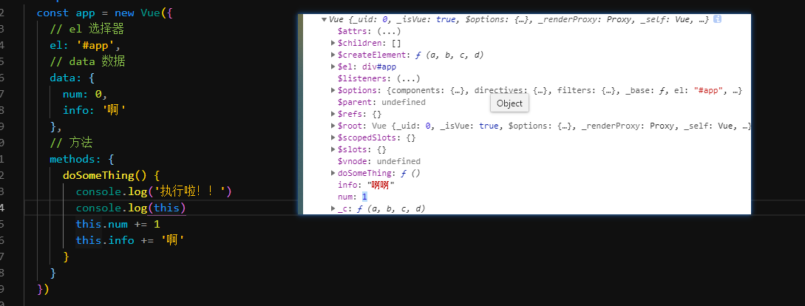
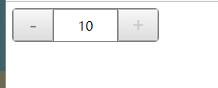
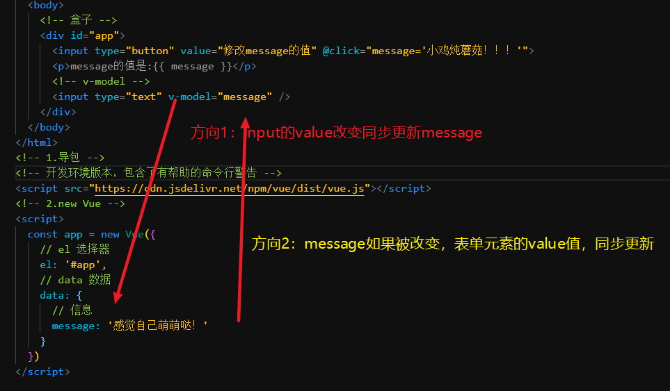
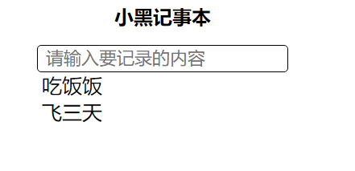

# Vue.js - day01

## 插件推荐


vue官方推出的插件，高亮，一些提示


 vue的代码提示

## 框架的学习方式

1. 没有速成
2. 官方文档是好朋友
   1. 很多问题，很多细节，很多面试题文档里面都有
3. 文档的阅读方式
   1. [起步](https://cn.vuejs.org/v2/guide/)
   2. [api](https://cn.vuejs.org/v2/api/)
4. 尝试：官网中的实例代码很多都是可以直接运行的，不要怕，不要怂，试一下
5. 顺应框架的使用方式：
   1. 很多自己的约定，自己规则
   2. 遵守约定

## Vue.js是什么

[官网地址](https://cn.vuejs.org/v2/guide/#Vue-js-%E6%98%AF%E4%BB%80%E4%B9%88)

1. 框架
2. 让开发人员从dom操纵中解放出来，可以专注于逻辑，专注于数据
   1. 早期：获取dom元素，操纵他们
   2. 现在：修改数据,Vue自动的去操纵dom元素

## Vue基本使用

[传送门](https://cn.vuejs.org/v2/guide/#%E8%B5%B7%E6%AD%A5)

1. 导包
2. 用包
3. art-template有点类似

注意点

1. el：后面的**选择器建议用id**
2. el:后面一定不能写`body`和`html`
3. data:中
   1. 字符串
   2. 数组
   3. 对象
   4. .. js中支持的类型都可以写
4. Vue的使用需要new  Vue

```js
var app = new Vue({
  el: '#app',
  data: {
    message: 'Hello Vue!'
  }
})
```

5. 固定的东西
   1. new Vue
   2. el:
   3. data:

## v-text指令

[传送门](https://cn.vuejs.org/v2/api/#v-text)

替换文本

```js
<span v-text="msg"></span>
<!-- 和下面的一样 -->
<span>{{msg}}</span>
```

1. `v-text`写法会直接替换标签内部的所有内容，比较暴力
2. `{{Mustache}}`写法只会替换挖坑的地方，比较温和，**使用频率最高**
   1. 可以叫 胡子语法
   2. 也可以叫做 `差值表达式`

## v-html指令

[传送门](https://cn.vuejs.org/v2/api/#v-html)

1. 替换元素的 `innerHTML`,全部替换
2. 标签元素会被解析
3. 普通元素，直接设置文本
4. 不能简写
5. 适应频率，相比于`v-text`低

```js
<div v-html="html"></div>
```

## v-on指令

[基本使用](https://cn.vuejs.org/v2/guide/events.html)

[详细说明](https://cn.vuejs.org/v2/api/#v-on)

1. 复杂写法`v-on:事件名='逻辑'`
2. 简化写法`@事件名='逻辑'`
3. 抽取为方法
   1. `@事件名='方法名'`
   2. new Vue的时候写`methods:{ 方法(){} }`
   3. 方法中如果要操纵数据，必须用`this`点出来才可以
4. 数据只要改变，页面自动改变，Vue内部偷偷的把`数据和页面关联起来`

### 高级使用（目前了解）

**修饰符**：

- `.stop` - 调用 `event.stopPropagation()`。
- `.prevent` - 调用 `event.preventDefault()`。
- `.capture` - 添加事件侦听器时使用 capture 模式。
- `.self` - 只当事件是从侦听器绑定的元素本身触发时才触发回调。
- `.{keyCode | keyAlias}` - 只当事件是从特定键触发时才触发回调。
- `.native` - 监听组件根元素的原生事件。
- `.once` - 只触发一次回调。
- `.left` - (2.2.0) 只当点击鼠标左键时触发。
- `.right` - (2.2.0) 只当点击鼠标右键时触发。
- `.middle` - (2.2.0) 只当点击鼠标中键时触发。
- `.passive` - (2.3.0) 以 `{ passive: true }` 模式添加侦听器

变种写法

```html
<!-- 方法处理器 -->
<button v-on:click="doThis"></button>

<!-- 动态事件 (2.6.0+) -->
<button v-on:[event]="doThis"></button>

<!-- 内联语句 -->
<button v-on:click="doThat('hello', $event)"></button>

<!-- 缩写 -->
<button @click="doThis"></button>

<!-- 动态事件缩写 (2.6.0+) -->
<button @[event]="doThis"></button>

<!-- 停止冒泡 -->
<button @click.stop="doThis"></button>

<!-- 阻止默认行为 -->
<button @click.prevent="doThis"></button>

<!-- 阻止默认行为，没有表达式 -->
<form @submit.prevent></form>

<!--  串联修饰符 -->
<button @click.stop.prevent="doThis"></button>

<!-- 键修饰符，键别名 -->
<input @keyup.enter="onEnter">

<!-- 键修饰符，键代码 -->
<input @keyup.13="onEnter">

<!-- 点击回调只会触发一次 -->
<button v-on:click.once="doThis"></button>

<!-- 对象语法 (2.4.0+) -->
<button v-on="{ mousedown: doThis, mouseup: doThat }"></button>
```


## vue实例中的this



1. new Vue的时候传入的对象是`实参`

2. Vue构造函数内部会去解析数据，比如data最终直接设置给`Vue实例`

3. 而methods中的方法 `this`就是`Vue实例`

   1. data的值已经直接设置上去了，所以直接`this.info`,`this.num`就可以访问数据

4. 注意点：

   1. **写方法的时候，可以用箭头函数吗**？

      [传送门](https://cn.vuejs.org/v2/api/#methods)

      1. 不可以
      2. 如果用了this会变成`window`
      3. 箭头函数在创建时，this会跟上一级作用域中this绑定，并且不能改变

## v-bind指令

[传送门](https://cn.vuejs.org/v2/api/#v-bind)

1. 属性绑定

   1. 写在标签内部的值：class,src,style,width,height,title,disabled(表单元素启用禁用)...

   2.标准写法`v-bind:属性名=xxx`

   3.简化写法`:属性名=xx`(使用频率高)

   4.绑定的值改变了，页面自动更新

   ### 高级写法（有印象即可）

   有各种变种写法，要有点印象，用到那个，讲解那个！！！

   ```html
   <!-- 绑定一个属性 -->
   
   
   <!-- 动态特性名 (2.6.0+) -->
   <button v-bind:[key]="value"></button>
   
   <!-- 缩写 -->
   
   
   <!-- 动态特性名缩写 (2.6.0+) -->
   <button :[key]="value"></button>
   
   <!-- 内联字符串拼接 -->
   
   
   <!-- class 绑定 -->
   <div :class="{ red: isRed }"></div>
   <div :class="[classA, classB]"></div>
   <div :class="[classA, { classB: isB, classC: isC }]">
   
   <!-- style 绑定 -->
   <div :style="{ fontSize: size + 'px' }"></div>
   <div :style="[styleObjectA, styleObjectB]"></div>
   
   <!-- 绑定一个有属性的对象 -->
   <div v-bind="{ id: someProp, 'other-attr': otherProp }"></div>
   
   <!-- 通过 prop 修饰符绑定 DOM 属性 -->
   <div v-bind:text-content.prop="text"></div>
   
   <!-- prop 绑定。“prop”必须在 my-component 中声明。-->
   <my-component :prop="someThing"></my-component>
   
   <!-- 通过 $props 将父组件的 props 一起传给子组件 -->
   <child-component v-bind="$props"></child-component>
   
   <!-- XLink -->
   <svg><a :xlink:special="foo"></a></svg>
   ```

## Demo-计数器



### 实现步骤

1. +和-使用`v-on`绑定点击事件
2. 中间区域使用`v-text`, data中定义一个数字`num`
3. +和-
   1. num=10, +不能用
      1. 灰：disabled
      2. ××：样式
      3. 可以写逻辑表达式
   2. num=0 , -不能用

### 注意点

1. v-bind中可以写data中属性值，也可以写表达式
2. 当data中的数据改变了，页面中所有和数据相关联的地方，都会改变
   1. 也是现在比较流行的开发方式

## Demo-图片切换


### 实现步骤

1. 点击上一张 和下一张  `v-on:click`
2. 切换图片的值:`v-bind:src`
3. data:图片地址数组 ，及索引
4. 边界判断

### 注意点

1. 逻辑比较复杂不建议写行内，建议抽取为方法
2. 这里的逻辑和轮播图类似，除了不能自动
   1. 自动：setInterval

## 表单输入绑定 v-model

[传送门](https://cn.vuejs.org/v2/guide/forms.html)

1. data中定义一个属性
2. 表单元素中`v-model`指定指定这个属性
3. 修改表单元素的值时，这个属性会同步更新
4. 如果直接修改属性的值
   1. v-model的表单元素会改变
   2. 使用属性的地方，同步更新

### v-model（双向数据绑定）基本使用

### 双向的含义



1. 方向1：表单元素的 value改变，message同步改变
2. 方向2：message改变，表单元素的value同步改变

## v-for指令

[传送门](https://cn.vuejs.org/v2/guide/list.html)

1. `v-for="item in 遍历的属性"`
   1. item 每一项 （可以改）
2. 数组的长度改变，页面会同步更新
3. 如果数组的每一项是对象，可以通过点语法去获取内容

## Demo-记事本



### 实现步骤

1. 文本框输入内容，点击回车页面中多一条数据
   1. v-model:表单元素的值和data中的属性关联起来
   2. keyup:keycode==13 代表回车
      1. @keyup.enter
      2. @keyup.13 
      3. 触发的按键是 回车
   3. `v-for` 结合data中定义数组`noteList`
2. 双击删除点击的这一项
   1. v-on:dblclick
   2. 点击的时候获取当前这一项的索引
      1. 遍历时，可以获取索引的
      2. `v-for="(item, index) in items"`
         1. item 每一项 可以改
         2. index 索引 可以改

### 注意点

1. v-model会吧表单元素的value和data中的属性关联
2. v-for可以结合数组遍历，前提是你得有数组
3. 事件绑定时，可以传入参数，
   1. methods定义的时候要接收
4. v-for可以获取下标`(item,index) in noteList `
   1. item,index可以改

## v-if指令

[传送门](https://cn.vuejs.org/v2/guide/conditional.html)

1. v-if 根据表达式的值，决定元素是否显示
   1. 真 显示
   2. 假不显示
2. v-else-if:elseif类似的 必须要跟在if的后面
3. v-else:else类似的 必须要跟在if的后面
4. `v-if`直接用多一些，后面跟上elseif及else用的不多

## v-show指令

[传送门](https://cn.vuejs.org/v2/guide/conditional.html#v-show)

1. 语法`v-show="表达式"`
   1. true:显示
   2. false:隐藏

### v-if&v-show对比

[两者对比](https://cn.vuejs.org/v2/guide/conditional.html#v-if-vs-v-show)

1. v-show 隐藏是display:none
   1. 性能消耗小：频繁切换用show
2. v-if 隐藏 从dom树中移除
   1. 性能消耗大：不频繁用if

## 语法细节

```js
const app = new Vue({
    el:"",
    data:{},
    methods:{}
})
Vue
el
data
methods
固定的
```


## 下面的明天讲解哈

## Demo-天气预报

## Demo-聊天机器人

## v-cloak指令

[传送门](https://cn.vuejs.org/v2/api/#v-cloak)

### 基本使用

## v-once指令

[传送门](https://cn.vuejs.org/v2/api/#v-once)

## v-pre指令

[传送门](https://cn.vuejs.org/v2/api/#v-pre)


## 补充

### 箭头函数的this

