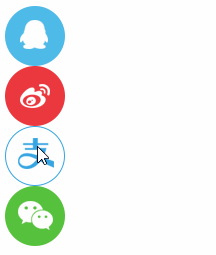

# 自习天梯任务


- [ ] ```
  1.复习并集选择器:
  <div>红色</div>
  <p>红色</p>
  <strong class="items">红色</strong>
  <span id="lists">红色</span>
  <a href="#">红色</a>
  ```

- [ ] ```
  2.复习交集选择器:
  <div>
  	<div class="nav">
  		<div class="list">红色</div>
  		<p class="list">黄色</p>
  		<strong class="list">绿色</strong>
  	</div>
  </div>
  使用交集选择器,控制文字颜色
  ```

- [ ] ```
  3.使用四个a标签的伪类选择器,控制a标签在不同状态下的颜色.
  ```

- [ ] ```
  4.设置div标签,宽高200px,背景颜色为红色.当鼠标悬停时,改变div的宽高为400px,背景颜色为绿色.
  ```

- [ ] ```
  5.请在底下默写出行内元素的特点:
  ```

```

```

- [ ] ```
  6.请在底下默写出块级元素的特点:
  ```

```

```

- [ ] ```
  7.请在底下默写出行内块元素的特点:
  ```

```

```

- [ ] ```
  8.请回忆之前写过的a标签导航栏,使用a标签,实现行内块模式转换,文字居中,hover状态下变换颜色.
  ```


- [ ] ```
  9.请设置一个div标签,宽高500px*500px.背景颜色红色,背景图片蔡徐坤.左上角显示.
  ```

- [ ] ```
  10.请设置一个div标签,宽高500px*500px.背景颜色红色,背景图片张学友.右上角显示.
  ```

- [ ] ```
  11.请设置一个div标签,宽高500px*500px.背景颜色蓝色,背景图片张国荣.居中显示.
  ```

- [ ] ```
  12.请设置一个div标签,宽高500px*500px.背景颜色红色,透明程度为0.4,需要用两种方式设置.
  ```

- [ ] ```
  13.请设置一个div标签宽高500px*500px.使用连写方式,设置背景图片张国荣,不平铺,水平垂直居中,背景颜色红色
  ```

- [ ] ```
  14.拓展小练习:
  尝试完成以下小练习
  ```

