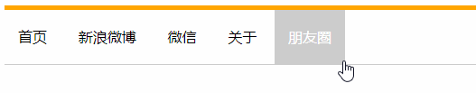

- [ ] ```
  1.请写出继承性的特点,以及哪个标签不继承文本颜色.
  ```

- [ ] ```
  2.请默写出选择器的优先级顺序.
  ```

- [ ] ```
  3.设置一个div标签,宽高300*300px,背景颜色红色,使用连写方式,边框10px,颜色蓝色,实线.
  ```

- [ ] ```
  4.使用a标签,与padding,模拟实现导航栏,以下效果:
  大盒子高度为80px,上边框5px,下边框1px.a标签左右内边距15px.
  ```



- [ ] ```
  5.设置div盒子,宽高为300px,使用margin设置水平居中
  ```

