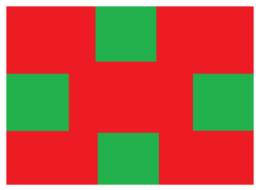

- [ ] ```
  1.使用额外标签法清除浮动的影响
  ```

- [ ] ```
  2.使用单伪元素清除浮动的影响
  ```

- [ ] ```
  3.在浏览器的四个方位,使用固定定位设置四个盒子
  ```


- [ ] ```
  4.使用绝对定位完成以下布局
  ```



- [ ] ```
  5.使用绝对定位完成以下布局
  ```


- [ ] ```
  6.设置一个子盒子宽高200*200,绝对定位,并且在父盒子内水平居中垂直居中.
  ```

- [ ] ```
  7.尝试完成京东头部练习,使用定位方式.
  ```

