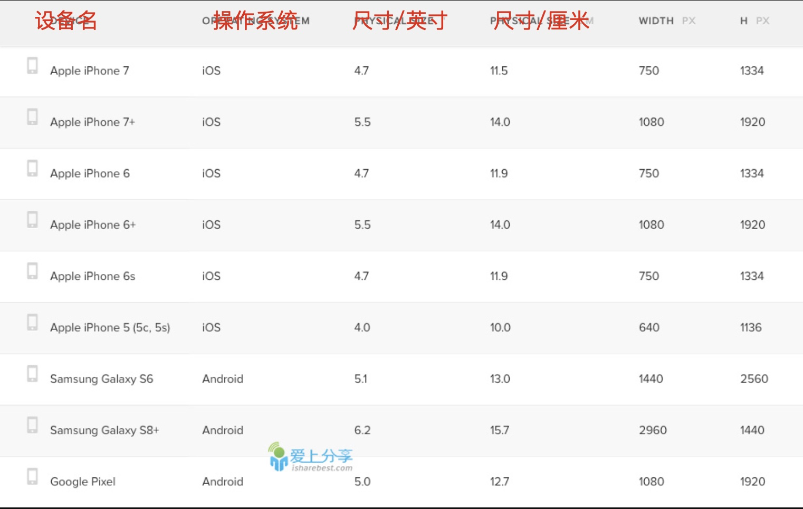

# 移动web学习

## 什么是移动页面

```
运行在移动设备的页面，称为移动页面。所谓移动设备泛指：手机，平板。
现阶段我们暂时不接触真机开发，而是利用chrome浏览器自身带的移动设备调试功能。
```

### 小练习：尝试编写移动页面

## 视口（viewport）--掌握

```
视口属性，用来约束网页显示的大小区域，主要针对移动端设备。
```

### PC端视口

```
在PC端中，视口就是我们浏览器的大小。
```

### 移动端视口

```
在移动设备上，视口不再受浏览器窗口大小影响。
允许开发者自定义视口大小，通常设备都会有一个默认的视口大小，如下图：
```

### 视口属性

```html
//我们使用mate标签来设置移动端的视口
<meta name="viewport" content="width=device-width, initial-scale=1.0, maximum-scale=1.0, minimum-scale=1.0, user-scalable=no">
//width=device-width --- 页面宽度与设备宽度一样
//initial-scale=1.0  --- 初始页面缩放值为1
//maximum-scale=5.0  --- 最大缩放比例值5
//minimum-scale=0.5  --- 最小缩放比例为0.5
//user-scalable=no   --- 禁止用户手动缩放
```

## 屏幕--了解

### 屏幕尺寸

```
指的是屏幕的物理大小，也就是屏幕对角线的长度。
下图是常见的设备物理尺寸。
```



### 屏幕分辨率（像素）

```
屏幕分辨率，例如：1366 * 768px。
指的是水平方向有1366个像素点，垂直方向有768个像素点。
```

### 像素密度（PPI）

```
所谓像素密度，就是每英寸能够容纳多少个像素。
像素密度越大，那么画面越精细(例如我的82年的iphone)
像素密度越小，那么画面越渣(来，拿出你们的诺基亚)
```

### CSS像素

```
上述讲到的设备像素，是物理性的，真实存在的。
但是CSS像素，并不是一个真实的像素大小，而是不同设备之间物理像素的一个比例。
嗯。我猜，你们已经蒙蔽了。
```

### 设备独立像素

```
设备独立像素，本质上是一个不同设备的像素比例关系，但是注意，不同的设备比例是不一样。而且不由开发者决定，这是屏幕硬件在一开始就设定好的。
主要是为了保证在不同设备下，让用户看到的图形大小一样。
不同设备的设备独立像素，可以通过js方法：
window.devicePixelRatio 获取。
```

注意：

作为前端开发，大家不用过分的去纠结设备的独立像素或者像素密度，了解即可，对我们的开发没有什么帮助。

### 常见苹果设备独立像素比例

|   设备名    | 屏幕分辨率 |  CSS像素  | 比例关系 |
| :---------: | :--------: | :-------: | :------: |
|  iphone 3G  | 320 * 480  | 320 * 480 |   1:1    |
|  Iphone 4   | 640 * 960  | 320 * 480 |   2:1    |
| Iphone6/7/8 |  750*1334  | 667 * 375 |   2:1    |
| Iphone plus | 1080*1920  |  414*736  |   3:1    |

```
如果像素比例是1的设备，那就是低清屏幕。
如果像素比例是2的设备，那就是高清屏幕。(第一个视网膜屏幕R屏)
如果像素比例是3的设备，那就是更加高清的，甚至成为超清屏幕。
pc端默认的比例是1:1,但是可以通过滚轮缩放来调整这个比例。
```


## 2倍图概念

因为不同设备的像素比例不一样，所以同一张图片在不同设备中显示会有失真效果，变模糊。

为了保证在不同设备中都要清晰的显示，那么就有了多倍图的概念。

```
例如当一张50 * 50的图片在比例为1的设备上显示的时候，可以正常清晰显示。
但如果这个时候把图片放到比例为2的设备上时，相当于把图片进行了放大，那这个时候就会失真。
所以，一般项目开发中会准备不同规格的图片，也就是1x图，2x图，3x图。
通过js代码判断是什么比例的屏幕，就对应使用什么倍数的图片。
```

垃圾公司，只有一倍图。

正常公司，使用二倍图。

严谨公司，使用1x，2x，3x。。。。。


## 调试方式--了解

### 浏览器模拟调试

只是简单的在浏览器模拟出各型号移动设备的屏幕大小，不要过分依赖模拟调试，只能简单作为参考。

### 真机调试

在公司中写项目，项目调试测试一定是在真机下。

一般各平台的主流手机都会进行测试。

现在我们暂时还不学，后面的课程会有专门讲解真机调试的方法。


## 百分比布局（流式布局）--掌握

```
在pc端布局，最常用的方式是版心布局，设置一个固定宽度并且居中的顶层盒子，称为版心。
但是在移动端中，由于屏幕尺寸等问题，没有办法使用版心布局，所以，引入一个新的知识点，百分比布局。
```

### 相关属性概念

```
width：宽度的百分比，是相对父盒子的width的比例。如果没有父盒子，那么就是相对浏览器的宽。
height：高度的百分比是相对于父盒子height的比例。
padding，margin：不管任何方向的百分比，都是相对于父元素width的比例。
border：不能书写百分比。
```

### CSS3的内减模型--掌握

```
在基础班的CSS2学习中，我们使用的盒模型是默认的box-sizing：content-box；这是一个外扩模型，设置padding，border，都会影响到盒子的真实宽高，有些时候需要自己手动计算。

CCS3中我们会学习使用另外一个盒模型，内减模型。在设置的width，height基础上，设置padding与border，盒子的真实大小依旧是设置的宽高，内容区域会自行内减。
使用内减模型，再也不需要大家自己手动计算。
```

### 布局案例：完成移动端京东首页

