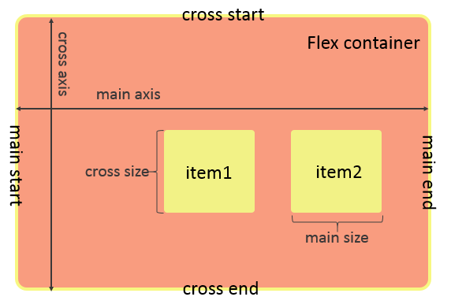
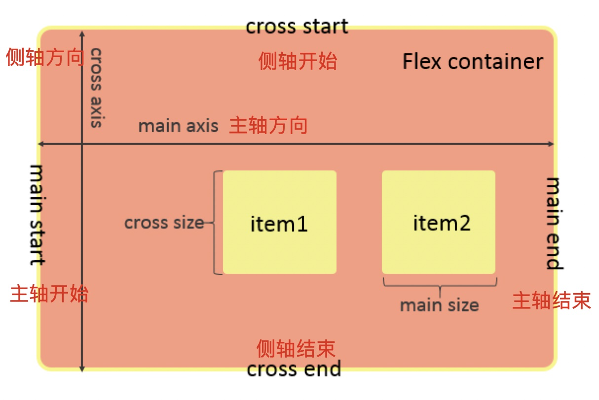
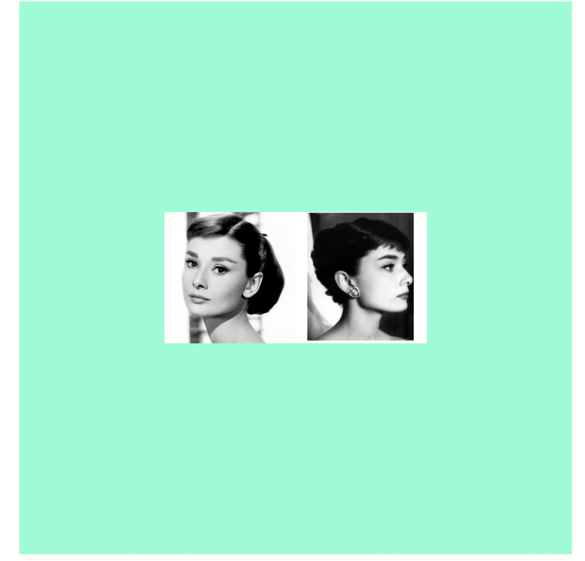
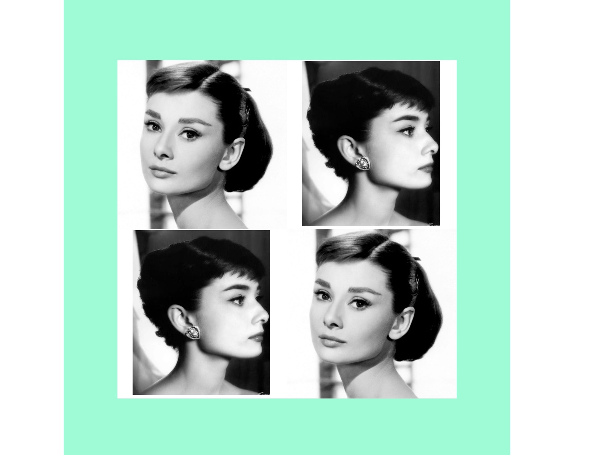
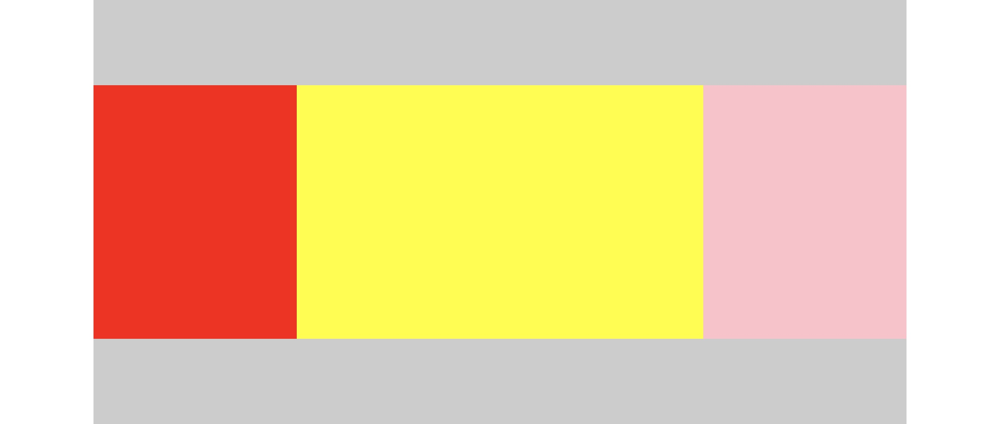
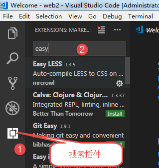

# 伸缩布局与LESS预处理

## 1.伸缩布局/弹性布局（flex）

```
flex指的是弹性布局，是一种常见的布局方式，主要体现在布局是盒子的灵活性；
关键字：display： flex；
给父盒子设置.
```

### 1.1-设置盒子为伸缩盒子/弹性盒子

```css
div {
    display: flex；
}
默认盒子在一开始的时候，是标准流盒子，通过flex可以将盒子设置为伸缩盒子。
让盒子拥有了很多更加灵活的属性以及布局效果。
简单理解，给盒子加了buff，让他更加强大。
```

```
伸缩盒子的主要内容如下图：
```



```
oh my god老师，我看不懂，不怕，我知道你英语差，看下面：
```



```
还是不懂，正常，你懂了，我教谁去。
其他不用管，先记住下面这几句话:
1.弹性盒子设置flex；
2.弹性有两轴，一主加一侧；
3.常见主横侧轴竖，随时可以调换个；
```

### 1.2-伸缩盒子的两条轴

```
主轴：默认水平从左到右；
侧轴：默认竖直从上到下；
两轴一定是互相垂直的；
```

### 1.3-调整主轴的方向

```css
flex-direction: row;
默认水平从左往右排布(类似左浮动)
flex-direction: row-reverse;
水平从右到左排布(类似右浮动)
flex-direction: column;
垂直从上到下排布
flex-direction: column-reverse;
垂直从下到上排布

注意：当主轴方向调整后，侧轴的方向也会随之修改，记住，两轴相互垂直。
```

### 1.4-设置主轴的对齐方式

```
主轴在默认情况下，是水平从左往右排布，那么有没有其他的常见排布方式呢？
例如，想让子元素一行显示的同时，彼此之间有一定的距离等操作。
```

```css
justify-content: flex-start;
默认从主轴开始位置排布；
justify-content: center;
居中显示；
justify-content: flex-end;
靠主轴结束位置排布；
justify-content: space-between;
盒子平均分布，例如左中右排布；
justify-content: space-around;
盒子左右的距离平分；
```

### 1.5-设置侧轴的对齐方式

```
侧轴的方向与主轴的相互垂直的，如果主轴水平，那么侧轴垂直。
如果主轴垂直，那么侧轴水平。
主轴有主轴的多种对齐方式，侧轴同样也有它的对齐方式。
```

```css
align-items: stretch;
默认子盒子没有高度的情况，那么拉伸至于父盒子同高；
align-items: flex-start;
从侧轴开始位置排布，默认顶部；
align-items: flex-end;
从侧轴结束位置排布，默认底部；
align-items: center;
垂直居中排布；
```

### 1.6-案例练习

```css
页面中间有一盒子，宽高800*800；
其中有两张图片，大小一致；
一行显示；
水平居中显示；
垂直居中显示；
```



### 1.7-设置子元素是否换行

```
默认情况下，子盒子是水平一行排布的。不管多少个子盒子，宽度相加是否超出父盒子，都会强制一行显示。
那能否用代码控制子盒子换行呢？
```

```css
flex-wrap: nowrap;
默认子元素强制一行显示；
flex-wrap: wrap;
父元素宽度不够时换行；
```

### 1.8-多行显示后的对齐方式

```css
align-content: stretch;
子盒子没有高度的时候，默认拉伸填满
align-content: flex-start;
靠顶部排布
align-content: flex-end;
靠底部排布
align-content: center;
居中显示
align-content: space-between;
平均分布，例如上下，上中下；
align-content: space-around;
行间距平分；
```

### 1.9-案例练习

```
与上题类似，要求四张图片，两行显示，垂直水平都居中；
```



### 1.10-设置子元素伸缩比例

```
存在多个子元素，如果想要控制每个盒子所占据的比例，可以直接通过像素值设置。但有些时候可能需要自己计算。
flex则提供了一个更好的方式，解决了不同比例的问题。
```

```css
 .red {
     background-color: red;
     flex: 1;
 }
 .yellow {
     background-color: yellow;
     flex: 2;
 }
 .pink {
     background-color: pink;
     flex: 1;
 }
```



```
通过给子元素设置flex值，对父盒子的空间进行均分。
数值越大，则占据的比例越大。
优点，不需要程序员自己计算，也可以快速完成比例布局。
```

### 1.11-了解align-self

```
用来单独控制某个元素的侧轴对齐方式，直接覆盖父元素的align-items。
但是几乎不会使用，故只需要了解即可。
```

### 1.12-了解排序order

```
order属性，控制子元素的排布顺序，数值越小，那么位置约靠前，默认为0；
```

## 2.完成携程首页

## 3.学习LESS语法

```
LESS是CSS的预处理器，对CSS做了扩展，添加了变量，函数等特性，简单来说，它让CSS变得更容易维护，更方便阅读。
```

### 3.1-如何安装LESS

1. 安装Node环境

2. 检测Node是否安装成功

   ```css
   运行cmd命令输入:
       node -v     node环境是否安装成功(如果安装成功,会出现版本号)
   	npm  -v     检测包管理工具是否安装成功(如果安装成功,会出现版本号)
   ```

3. 安装Less

   ```css
   运行cmd命令输入:
   	npm  install  less  -g
   ```

4. 验证less是否安装成功

   ```css
   运行cmd命令输入:
   	lessc -v 
   ```

5. 安装成功后新建一个less文件即可

   ```css
    test.less
   ```

6. 将Less文件编译为CSS文件

   ```css
   运行cmd命令输入:
   ☞ 注意: 首先要通过cmd命令进入到当前less文件所在的文件夹目录中
   ☞ 编译less文件cmd命令:   lessc  要被编译的less文件  要编译为自定义CSS文件
     例如:  lessc   index.less   index.css
   ```

7. 开发工具配置

   ```css
   1.webstorm自带less编译功能,实时编译
   webStorm: 配置快捷键方式进行编译
   ◆ 文件  - > 设置 - > 工具 -> file watchers  -> 选择less文件点击编辑 -> 取消实时编译选项
   ◆ 文件  - > 设置 ->  快捷键 - >  插件 - > File watchers  -> 点击右键添加键盘快捷键
   
   2.Sublime安装插件: LESS2CSS    
   
   	安装编译插件:  ctral+shift+P  ---> 在搜索栏中输入   LESS2CSS 
   
   3.VSCode需要安装插件:  Easy Less  安装成功后  Ctrl+s保存即可
   ```



### 3.2-变量

```css
自定义变量
@color: skyblue;

.box1 {
    color: @color;
}
.box2 {
    color: @color;
}
.box3 {
    color: @color;
}
.box4 {
    color: @color;
}
声明一个变量，存储一个值，这个变量可以给所有的元素同时使用，方便同时进行修改。
```

```css
@length: 100;

.box1 {
    width: @length * 3px;
    height: @length * 3px;
    background-color: red;
}
.box2 {
    width: @length * 2px;
    height: @length * 2px;
    background-color: blue;
}
变量还可以做运算，例如设置不同比例的宽高时。
```

### 3.3-混合

```
当遇到多个属性在很多元素中出现时，那么可以用LESS中的混合概念。
```

```css
.baseStyle() {
    width: 200px;
    height: 200px;
};

.box1 {
    .baseStyle();
    background-color: yellow;
}
.box2 {
    .baseStyle();
    background-color: red;
}
简单来讲，把常用的属性打包起来，给个名字。下次谁要用，就谁调用即可。
以上的方式是没有带参数的简单版本。
```

```css
()小括号中放的是参数，可以为空，也可以设置默认值；
.baseStyle(@bgColor:red;) {
    小括号中设置默认值@bgColor为红色;
    width: 200px;
    height: 200px;
    background-color: @bgColor;
};

.box1 {
    .baseStyle();
    此处调用代码小括号没写东西，那就是使用默认的参数；
    所以该元素背景颜色为红色；
}
.box2 {
    .baseStyle(skyblue);
    此时调用代码小括号中传入了参数，那就是使用了传入的参数；
    所以该元素的背景颜色为天蓝；
}
```

### 3.4-案例练习

```
设计一个LESS混合案例。
将元素的宽，高，背景颜色抽取设计为一个混合LESS；
但是要求使用时，参数可以由程序员传入。
```

### 3.5-嵌套

```
在传统的CSS代码中，我们需要用到很多选择器。
大多数HTML嵌套的标签，我们使用的是后代选择器，子代选择器等。
需要通过使用选择器的链接符号来判断嵌套关系，例如空格，大于号等。
那么我们可以想一下，标签的可以使用嵌套来表示父子关系，如果选择器也可以，那阅读起来岂不是更加的直观；
LESS就给我们提供了这样的一个机会；
```

```css
.baseStyle(@width,@height,@bgc) {
    width: @width;
    height: @height;
    background-color: @bgc;
};

传统写法：(代码重复，臃肿，不够优雅)
.box1 {
    .baseStyle(500px, 500px, red);
}
.box1 .box2 {
    .baseStyle(300px, 300px, pink);
}
.box1 .box2 .box3 {
    .baseStyle(100px, 100px, deeppink);
}

LESS嵌套写法：(牛逼。。。。。。)
.box1 {
    .baseStyle(500px, 500px, red);
    .box2 {
        .baseStyle(300px, 300px, pink);
        .box3 {
            .baseStyle(100px, 100px, deeppink);
        }
    }
}

```

### 3.6-多个less文件导入

```
项目一般是会有多个css文件，那么现在我们使用less的方式来写css，相对来讲，文件数目会翻倍。
如果每个css文件我都导入，那相对来讲是一件非常麻烦的事情,所以我们可以利用LESS中的import关键字；
```

```css
现有以下LESS文件
base.less
index.less
nav.less
对应生成的CSS文件有
base.css
index.css
nav.css
按照传统的写法，我需要link导入至少三个css文件；
这无疑是一个非常low的行为。
首先新建total.less文件
@import "base.less";
@import "index.less";
@import "nav.less";
此处将所有的less文件组合成了一个。
所以页面中只需要link导入total.css文件即可。

```

### 3.7-使用考拉软件来做LESS文件夹管理

```
如果使用vscode的easy less插件的话，那所有的less文件与css文件默认都会生成到同个目录下，虽然对项目不会有影响，但是维护起来还是有点麻烦。
所以最好的方式就是css文件在css文件夹，less文件在less文件夹。
easy less使用简单，但是管理麻烦。
建议大家都使用koala软件来进行管理，过程如丝般柔滑。
```

## 4.拓展知识-normalize.css文件

```
在某些低版本的浏览器中，例如ie9以下。
有很多新的标签或者新的属性是不被浏览器支持的。
简单来讲，就是有很多浏览器都有自己未定义的标签以及属性。
那么我们就应该写代码去让这些浏览器支持这些标签以及属性，可是浏览器很多，标签属性也很多，老娘记不住啊。
没关系，不需要你记。
打开百度搜索：normalize.css即可。
已经有团队写好了，我们只需要下载，全选，复制，黏贴。做一个高级的CV工程师即可。
```

## 5.使用LESS完成京东移动页面