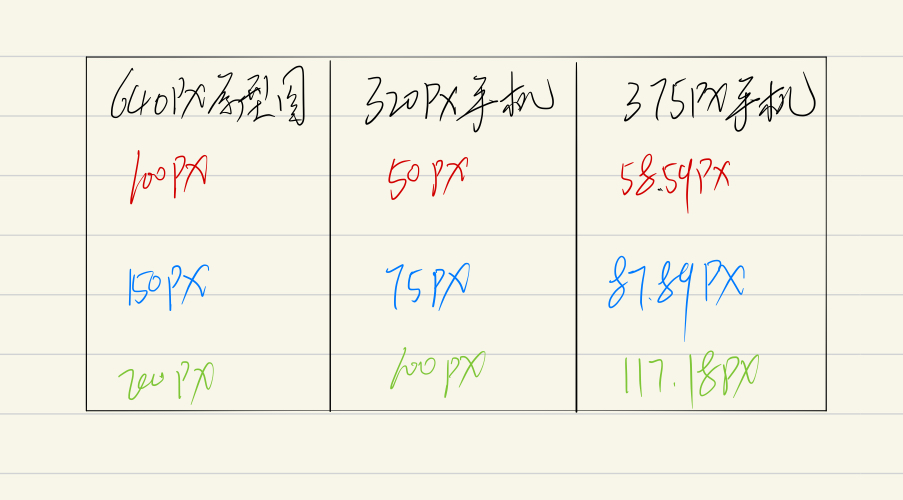
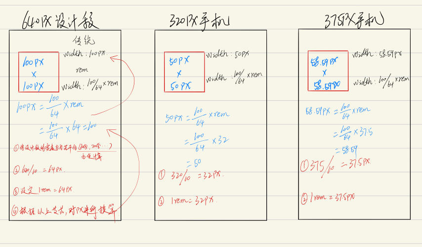

# rem适配方案与媒体查询

## 1.为什么要用rem

在640px的设计稿中测量的距离100px

写到320px手机中,就只能是50px

写到375px手机中,就只能是58.59px

.........(每一款手机的屏幕,你都要自己动手算一次)

```
首先我们要确定一个事情，前端工程师在拿到UI同学给的设计稿的时候，一般多为两个版本：640版本以及750版本。细心的同学可能就发现。我们之前在谷歌浏览器中看到的模拟设备的屏幕像素：320，375，414等很多不同的像素比例。
那么问题来了，你现在手头就只有一个640的设计稿。我有要求：
适配320设备：老夫拿起来就除以2！！！！
适配375设备：额。。。。。
适配414设备：额额。。。。
适配众多安卓设备：额额额。。。
所以，为了让我们的页面在不同的设备上面显示正常，我们就不能再用px一个个傻算了。
rem这个单位，就是为了解决我们的适配问题。提供一个移动布局中非常好用的布局方案。
```

## 2.rem与em的区别

```
em：相对单位；
	当前元素没有设置字体大小的时候，em参照继承的字体大小进行换算。
	如果当前元素设置了font-size属性，那么em参照当前的字体大小进行换算。
	注意：用em来布局比较麻烦，因为很多盒子都需要用到font-size属性，所以em的值就会经常变动，非常不稳定。

rem：相对单位；
	rem与em类似，都是参照字体大小来做换算；但是与em不同的是，rem只参考一个标签的字体大小做换算，也就是页面顶级节点html的字体大小。其他的标签那么设置了font-size，对rem也没有任何影响。所以比起em来讲，更加的问题。
```

### 2.1-案例演示em与rem的不同

## 3.rem如何实现适配

### 3.1-分析常见设计稿与不同设备的数据关系

```
常见设计稿的尺寸大小640px或者750px；
现在有一640px设计稿，有一盒子宽高100*100px；
那么，在320设备，375设备上，应该写多少才能按照正常比例显示；
```



```
通过上图，我们知道，设计稿的元素大小，是没有办法测量多少代码中就写多少的。必须要考虑设备与设计稿的比例关系，进行换算。
但是问题来了，元素不可能只有一个，成千上万个元素，不可能一个个进行换算，哪怕你真的换算了一个320设备上的所有元素大小，那后面还有375，414的其他设备，莫不成也继续一个个算？
不，你们是我带过最优秀的学生，怎么能做这么不优雅的事情。
```

### 3.2-分析rem如何实现适配



```
通过上述的推导，我们可以得出，rem不是一个固定的值，而是一个根据屏幕宽度不同所算出来的一个值。
通过rem，我们可以实现，写相同的一句代码：width: 100/64 * 1rem;
就可以在不同的屏幕中显示相同的效果。
```

### 3.3-如何设置不同屏幕的rem值

```
在一开始的时候，我们知道rem的值，受顶级元素html标签的字体大小影响。
简单来讲就是，html设置的字体大小是多少，1rem就等于多少。
```

```
那么每个设备的rem是多少，应该怎么算？
第一，先将设计稿分为若干份(10或者20，方便计算)，确定了分配份数之后，后面的所有设备都按照这个数字来分。例如10；
第二，得到设备屏幕的宽度，例如320px，然后除以10.得到32px；这就是320px屏幕的rem值。
第三，将得到这个值，赋值给html标签的font-size属性，那么此时1rem就等于32px；
第四，然后就可以愉快的使用rem做布局了
```

### 3.4-简单案例验证

### 3.5-老师，俺有问题

```
问题：
如何获得设备屏幕的宽度？
如何给不同设备的html标签设置不同的font-size；
```

## 4.媒体查询获得屏幕宽度

### 4.1-什么是媒体查询？

```
媒体指的是各种设备，pc设备，移动端设备；
针对不同的媒体类型，可以定义不同的样式属性；
例如，当屏幕宽度不同时，可以设置不同的rem值；
```

### 4.2-媒体类型

```
将不同的设备划分为不同的类型，称为媒体类型；
all：     所有设备
print：   打印设备，用于打印机以及打印预览
screen：  用于电脑，平板电脑，手机的屏幕
```

### 4.3-媒体特性

```
定义设备的某些特点，比如屏幕的宽度等。
width				   定义设备中可见区域宽度
height				   定义设备中可见区域高度
max-width/max-height   定义设备中的页面最大可见区域宽度/高度
min-width/min-height   定义设备中的页面最小可见区域宽度/高度
orientation:   portrait (竖屏模式)  | landscape (横屏模式)
```

### 4.4-语法关键字

```
and					可以将多个媒体特性链接到一块，相当于：且
not					排除某个媒体特性，相当于：非，可以省略
only				指定某个特定的媒体类型，可以省略
```

### 4.5-语法结构

```css
外联式语法
<link rel="stylesheet" href="css/index.css" media="screen and (min-width: 800px)">
/*当浏览区域宽度大于800px的时候，使用link中的css文件*/

内嵌式语法
@media screen and (min-width: 500px) {
    /* 当页面宽度大于500px时,设置背景颜色为红色 */
    body {
        background-color: red;
    }
}
```

### 4.6-案例练习

```
设计一个页面，有以下要求：
当宽度等于320px时，html字体大小为32px；
当宽度等于375px时，html字体大小为37.5px；
当宽度等于414px时，html字体大小为41.4px；
```

```css
@media screen and (width: 320px) {
    html {
        font-size: 32px;
    }
}
@media screen and (width: 375px) {
    html {
        font-size: 37.5px;
    }
}
@media screen and (width: 414px) {
    html {
        font-size: 41.4px;
    }
}
```

### 4.7-利用媒体查询设置rem

```
上面的案例，其实就是我们每个设备的rem值；
切记，是按10份进行划分的。
如果设计稿你是划分成为20份的话，那不同设备对应的也是20份。
```

## 5.了解js设置rem

```js
console.log(window.screen.width);
// 打印获取的屏幕宽度
document.querySelector('html').style.fontSize = window.screen.width/10 + "px";
// 获取屏幕宽度后,除以10,加上单位px,最后把结果设置给html的font-size
```

## 6.利用rem完成优惠券页面

### 6.1-准备项目文档结构

### 6.2-新增初始化等文件

### 6.3-项目导入koala进行less编译

### 6.4-思考如何用less对px转rem的过程进行封装

### 6.5-完成项目

## 7.任务

```
使用rem布局的思想，自行完成之前的京东移动页面。
```


