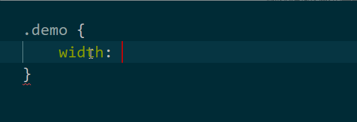

# 响应式布局

## 1.rem插件拓展使用

```
之前我们写rem布局，需要用到rem单位。但是我们知道，将px单位转换成rem单位是需要通过计算的。
我们第一种方式用的最傻的方式，一个个算：(假设设计稿是640px，rem定为64px，现测量100px)
	width：100/64rem;
第二种方式利用less将计算过程做了封装：
	.width(@size) {
        width: @size/64rem;
	}
以上两种方式，一种傻乎乎，一种看着稍微高级一些。但其实，程序员最讨厌做重复的事情，每次都去封装less的函数方法也是非常可气可气的。
既然有需求，那么自然就有程序员帮我们做轮子。
```

### 1.1-cssrem插件的使用（vscode版本）

```
1.在vscode中下载cssrem插件；
2.首选项》设置》扩展》cssrem设置；
3.cssrem默认的设计稿rem值16px，修改为自己定的rem，如64px；
4.重启vscode让设置生效；
5.愉快的测量px单位，愉快的写px值，加个tab，愉快的帮你直接算出rem；
```



### 1.2-关于工具

```
插件也好，工具也罢，都是可以提高我们编程效率的利器。
不用畏之如虎，我就是从黑马跳下去，摔死，也不会用这些投机取巧的工具。。。。。
真香。
学习一门技术，一开始就偷步确实不好，但一直墨守成规那也是傻。
学习初期，掌握这门技术是怎么回事，可以自己写原生的，那就是极好的。
慢慢的，道理搞明白了，自然就可以借助工具插件来提高自己的效率。
```

## 2.多种布局方式

### 2.1-固定网页布局

```
基础学习的布局方式就是固定网页布局，量多少写多少，以px为单位，常见PC端页面。
```

### 2.2-流式布局/百分比布局

```
为网页设置一个相对的宽度，以百分比为单位。
```

### 2.3-响应式布局

```
通过检测设备信息，使用不同的布局方式，一般是检测设备的宽度。
>1200px   大屏幕pc
>992      中屏幕pc
>768      平板
>320	  手机
```

### 2.4-栅格化布局

```
人为的把网页分为多个均等的长度，进行排版布局，通常以百分比为单位。
```

## 3.响应式布局

### 3.1-什么是响应式布局

```
说什么大道理，过来老夫给你看个大宝贝；
百度思否，手动调整大小；
```

### 3.2-实现方式

```
通过检测屏幕宽度的不同，设置不同的布局方式。
如果学了js，那么可以用js来动态设置。但是我们还没有学，所以我们用纯css的方式来实现；
```

### 3.3-响应式布局的核心

```
检测设备的宽度；
用什么？我们学过的！
媒体查询；
```

```css
@media and (width:1000px);
//当设备宽度等于1000px

@media and (max-width:800px);
//当设备宽度小于等于800px

@media and (min-width:600px);
//当设备宽度大于等于600px

注意，代码受层叠性的影响。
```

### 3.5-常见的设备屏幕设置

```
@media and (min-width:1200px);PC端
@media and (min-width:980px);
@media and (min-width:768px);平板
@media and (max-width:480px);手机
```

### 3.6-使用媒体查询完成案例

```
使用媒体查询方式，完成Bootstrap官网案例；
注意，学习的重点不是怎么布局，而是响应式的发生。
```

## 4.介绍UI框架

### 4.1-Bootstrap

### 4.2-妹子UI

### 4.3-Framework7

```
什么是框架；
有些功能程序员可以用代码实现；
但是实现起来很麻烦，代码很重复，程序员懒得写；
框架就是别人把一些功能写好了，封装起来；
然后程序员，直接从框架中拿去用；
主要目的，提高开发效率。
```

```
框架内容非常丰富，一天的时间不可能从0到精通。
我们的任务：
认识框架
知道框架是干嘛的
学会下载框架
学会导入框架
学会查看框架文档
学会简单的使用框架组件
然后告诉自己，没事就多看看，多用用，多试试
```


