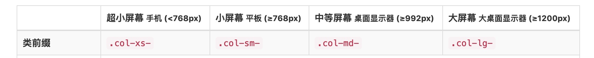

# Bootstrap框架

## 1.什么是CSS框架

封装了很多重复的工作

提高了开发的效率

```
随着Web应用变得越来越复杂。在大量的开发过程中，我们发现有许多的功能模块非常相似。
例如轮播图，分页，导航，进度条，模态框等，每一次都手动书写无疑是在做重复工作。
框架的作用就是把这些功能封装称为一个个组件，在开发过程中直接拿过来使用即可，极大的提高的开发的效率。
```

## 2.前端常用框架

```
Amaze UI
Framework7
Bootstrap(重点，目前最常用的前端框架)
```

## 3.Bootstrap准备学习

### 3.1-下载Bootstrap框架

```
生产环境版本：代码已经压缩，可以直接部署在服务器
源码学习版本：代码没有压缩，程序员可以学医源码
sass版本：进行了sass的预处理版本
```

```html
在线导入(需要网络，一般也不会直接从bootstrap服务器导入)
<link rel="stylesheet" href="//cdn.bootcss.com/bootstrap/3.3.5/css/bootstrap.min.css">

本地导入(学习阶段，下载存放在本地，直接导入即可)
<link rel="stylesheet" href="bootstrap/3.3.5/css/bootstrap.min.css">
```

```css
使用命令行安装下载
npm install bootstrap
```

### 3.2-离线文档的使用

```
在线的文档需要网络，查看并不是非常方便；
所以老师准备一份离线版的中文文档，直接打开index文件即可；
```

### 3.3-起步

```
从零到一看起步；
从一到精通看组件实例；
```

```
因为Bootstrap主要是用来做移动端与PC端的响应式布局，当然我们任务更多的是移动端布局。
所以就会有一些视口属性需要设置，包括一些浏览器的兼容。
不用担心
文档已经准备了一个基本模板让我们复制了。
```

```
复制起步页面中准备好的模板代码
并且修改导入文件路径为本地路径
```

## 4.Bootstrap使用学习

```
Bootstrap中，主要分为CSS样式学习，组件学习，以及js插件学习。
简单讲就是：
一些封装好的样式效果
一些封装好的功能模块
一些封装好的js效果
```

### 4.1-CSS样式演示

```
排版样式
	标题
	副标题
```

```
对齐样式
	左对齐
	居中
	右对齐
```

```
大小写转换
```

```
表单代码
```

```
按钮代码
```

```
图片形状
```

```
辅助类
	快速浮动
	块级居中
	清除浮动
	显示隐藏
```

### 4.2-组件演示

```
下拉菜单
```

```
导航条
```

```
路径导航
```

```
进度条
```

### 4.3-js插件演示（了解）

```
模态框
```

## 5.栅格布局

```
所谓的栅格布局，是将页面分为多个均等大小的列。
例如Bootstrap中就默认将页面分成了12列。
然后通过代码，控制元素的大小为其中的几列。
```

```
Bootstrap 提供了一套响应式、移动设备优先的流式栅格系统，随着屏幕或视口（viewport）尺寸的增加，系统会自动分为最多12列。
```

### 5.1-栅格布局注意点

```
必须要设置类名.container,或者.container-fluid
使用Boostrap栅格布局，默认一行最多为12列；
每行的元素相加最多12列，超出的会换行显示；
```



```
每个屏幕对应的类名前缀不同，-后面链接的是数字；
```

```
小练习：
1.全屏状态下，一行四个盒子均等排布；
2.中等屏幕下，一行四个盒子均等排布；
3.平板屏幕下，一行四个盒子均等排布；
4.手机屏幕下，一行四个盒子均等排布；

综合练习：
全屏下一行四个盒子，中屏下一行三个盒子，平板屏下一行两个盒子，移动屏下一行一个盒子；
这就是Bootstrap的响应式，已经帮我们写好了。
```

###  5.2-Bootstrap官网案例完成