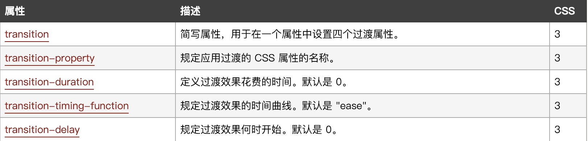
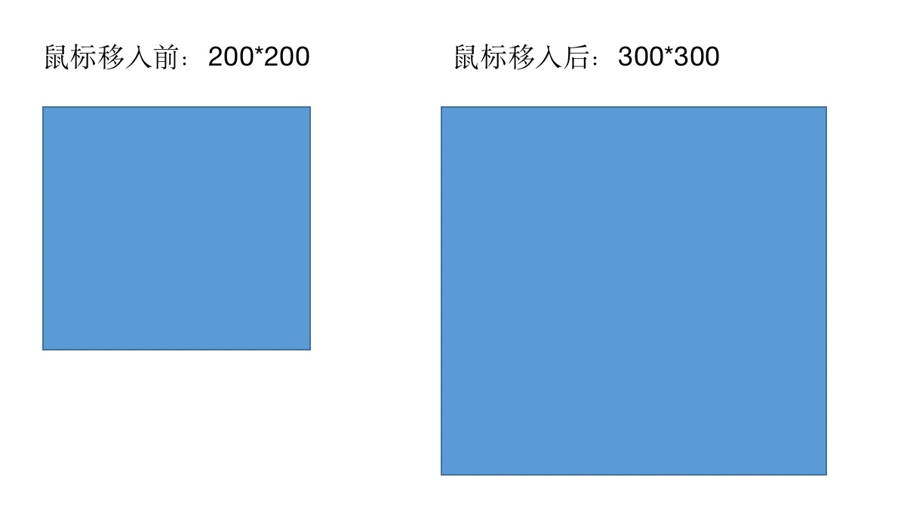
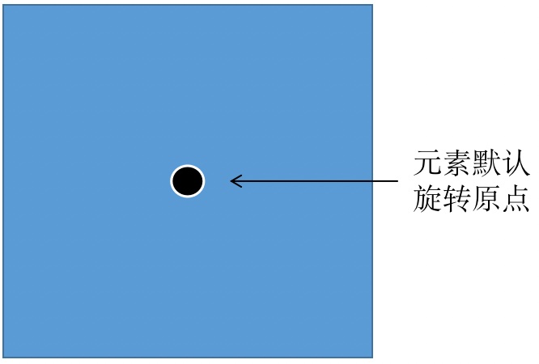
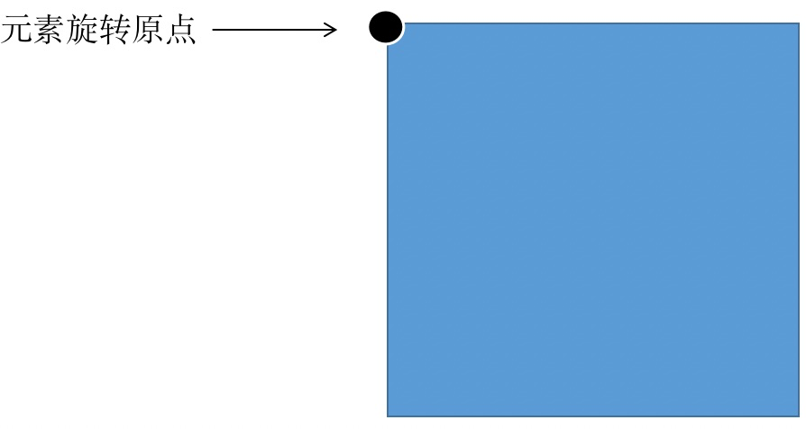
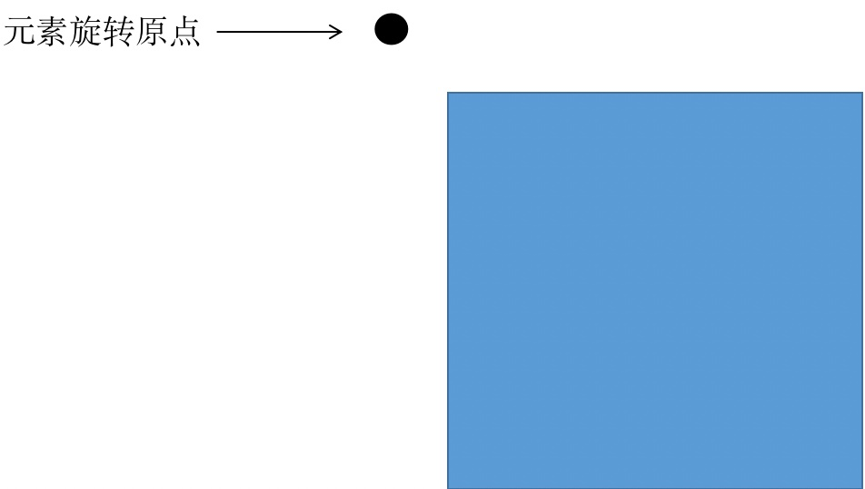
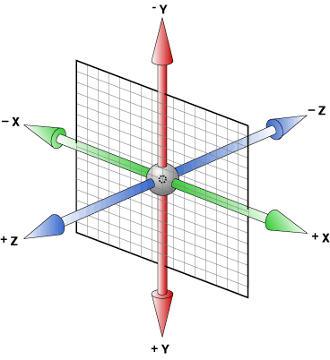
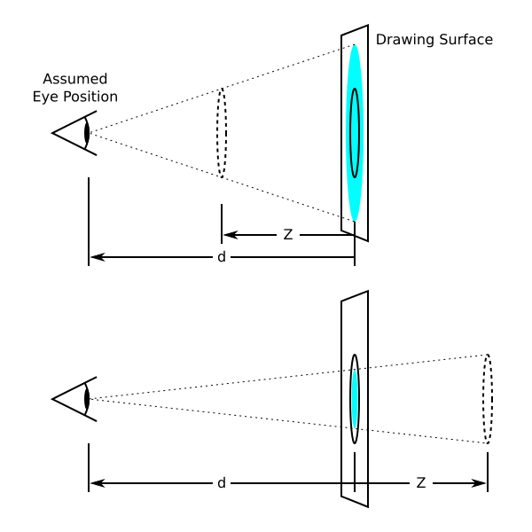

# CSS3属性（过渡，2D变换，3D变换，动画）

## 过渡（transition）--掌握

```
在CSS3中，我们如果不使用JS代码，或者flash动画，想要实现元素从A状态变成B状态，并且中间的过程可以被观察到，那么可以使用过渡属性：transitiont
```

transition是一个复合型属性，与基础班的background类似。

以下表格中的对各项属性值的解析。



从上图可知，过渡有四个属性值，分别是过渡属性，过渡时间，运动曲线，延迟时间。

虽然是有四个属性，但是编写代码的时候，为了代码更加简洁，我们一般会直接通过连写的方式来设置。

### transiton-timing-function：过渡运动曲线

```css
ease ：      由快到慢(默认值)
linear：     匀速运动
ease-in：    加速运动
ease-out：   减速运动
ease-in-out：先加速后减速
以上四个属性了解即可，功能需要用到哪种状态，就选择哪个属性值，若无要求，默认即可。
```

#### 课堂小案例



### 多组过渡效果

如果出现了多组过渡效果，例如需要同时过渡元素的宽度以及高度变化，那么可以用逗号将各组隔开。

```css
transition: width 2s , height 2s 2s;
```

如果需要同时执行，可以不设置延迟时间，如果需要有前后执行顺序，则需要自行计算各组过渡效果时间顺序。

### all属性值的作用

如果当前元素有多个属性需要过渡效果，并且同时发生，那么可以采取上述的多组属性用逗号隔开，也可以使用all关键字代替。

```css
transition: width 2s , height 2s , background-color 2s;
上面的代码，效果与下面的代码一致。建议使用all来指代所有的属性，代码更加简洁。
transition: all 2s;
```


## 2D变换（transform）--掌握

```
transform属性应用于元素的2D或3D转换。这个属性允许你将元素旋转，缩放，移动，倾斜等
```

注意一点，transform是属性，而后面我们要学习的旋转，缩放等是它的属性值，切记不要混淆到一块。

### 平移（translate）

平移：修改元素的位置，让元素在x轴与y轴方向进行位移。

语法：transform：translate（length，length），先设置x轴，再设置y轴

```css
div {
    width: 200px;
    height: 200px;
    background-color: red;
    transform: translate(200px , 200px);
    //让div元素，向右移动200px，同时向下移动200px；
}

//注意单位的正负值关系，对应的位移方向也不同。
div {
    width: 200px;
    height: 200px;
    background-color: red;
    transform: translate(-200px , -200px);
    //让div元素，向左移动200px，同时向上移动200px；
}

//如果只设置了一个值，那么只会位移水平方向。
div {
    width: 200px;
    height: 200px;
    background-color: red;
    transform: translate(200px);
    //让div元素，向右移动200px；
}

//也可以控制只位移一个方向。
div {
    width: 200px;
    height: 200px;
    background-color: red;
    transform: translateX(200px);
    //让div元素，向右移动200px；
    transform: translateY(200px);
    //让div元素，向下移动200px；
}

```

### 利用2D平移实现定位元素居中

我们在学习定位的时候，曾经讲过利用边偏移属性，可以设置元素定位居中，代码如下：

```css
div {
    width: 200px;
    height: 200px;
    position: absolute;
    left: 50%;
    margin-left: -100px;
    top: 50%;
    margin-top: -100px;
    //先走父盒子的一半，再往回走自己的一半，即可实现居中
    //但是上面这种方法有一个问题，但元素的宽高发生了改变，那么对应的赋值数据也要改变，比较麻烦。
}
```

那么，除了上面的方法，我们可以利用translate来实现不需要每次都改变代码的居中方式。

```
div {
    width: 200px;
    height: 200px;
    position: absolute;
    left: 50%;
    top: 50%;
    transform: translate(-50% , -50%);
    //如果使用百分比作为单位，那么位移的距离则是以元素本身的宽高作为参照计算。
    //此时不管元素的宽高如何发生变化，百分之五十都是自身的一半，不需要做任何修改。
}
```


### 缩放（scale）

缩放：控制元素的放大与缩小。

语法：transform：scale（x,y）。分别控制元素的宽高缩放比例，1等于不变，大于1为放大，小于1为缩小，0则为消失，不需考虑负数形态。

```css
div:hover {
    transform: scale(2,3);
    //宽度放大为2倍，高度放大为3倍。
}
```


### 旋转（rotate）

旋转：使元素可以围绕某个点旋转一定角度。deg是角度值单位，正数为顺时针，负数为逆时针。

语法：transform：rotate（angle），角度值后必须要带单位deg。

```css
div:hover {
    transform: rotate(360deg);
    //元素顺时针旋转360度。
}

div:hover {
    transform: rotate(-360deg);
    //元素逆时针旋转360度。
}
```

#### transform-origin:设置旋转原点

一般，元素在旋转的时候，是以自身的中点作为旋转原点的。



但是我们可以通过transform-origin这个属性，来控制元素的旋转原点位置。这个位置可以是在元素内部，也可以在元素外部。

```css
transform-origin：left top；
```



```css
transform-origin：-50px -50px;
```



### 倾斜（skew）--了解

倾斜：设置元素的倾斜角度，围绕x轴或者y轴。该知识点运用不多，只要求大家了解即可。

语法：transform：skew（x-angle，y-angle），角度单位deg。


### 2D组合变换

```css
//如果现在有多个变换属性要设置，那么可以通过复合属性赋值的方式来编写代码：
div:hover {
    transform: rotate(360deg) scale(2,2);
    //在旋转的同时，缩放。属性值之间用空格隔开，切记是空格隔开。
}
```


## 3D变换（transform）

3D变换与2D变换使用的都是同样的属性，不同的是，相对于2D来讲，3D多了一条立体坐标轴z轴。



在3D坐标轴中，x，y轴没有什么变化，z轴是一条垂直于屏幕的坐标轴，往外为正，往内为负。直观的来看，屏幕的z轴看起来就是一个点。

### 平移

#### translateX：水平平移

```
让元素沿着x轴移动
正数往右
负数往右
```

#### translateY：垂直位移

```
让元素沿着y轴移动
正数往下
负数往上
```

#### translateZ：z轴位移

```css
//让元素验证z轴位移，简单来讲，就是元素距离人眼的远近变化
//正数，朝着人眼移动，越来越近
//负数，远离人眼移动，越来越远
div:hover {
    transform: translateZ(300px); 
    //正数，靠近人眼
}
//但是，你会发现这样设置并没有效果
//为什么？
//z轴的平移的修改元素与人眼的距离，可以，元素本来与人眼的距离是多少？我们却没有设置。
//所以，要使用3D变换，那么一个属性必须要学习：视距
```

#### perspective：视距，元素与人眼的距离

```
概念：近大远小
当元素距离人眼越近，则看起来越大。当元素距离人眼越远，则看起来越小。
设置：perspective设置给变换元素的父元素，距离大小一般为600px-1000px之间。
```



### 旋转

控制元素进行3D旋转。

#### rotateX：沿着x轴旋转

```css
body {
    perspective: 800px;
    //注意，3D的变换需要有近大远小的效果，所以必须给变换元素的父元素设置视距。
}
div:hover {
    transform: rotateX(360deg);
}
```

#### rotateY：沿着y轴旋转

```css
body {
    perspective: 800px;
    //注意，3D的变换需要有近大远小的效果，所以必须给变换元素的父元素设置视距。
}
div:hover {
    transform: rotateY(360deg);
}
```

#### rotateZ：沿着z轴旋转

```css
body {
    perspective: 800px;
    //注意，3D的变换需要有近大远小的效果，所以必须给变换元素的父元素设置视距。
}
div:hover {
    transform: rotateZ(360deg);
    //z轴在大多数情况下，看起来都是屏幕上的一个点，所以z轴的旋转与平面旋转效果类似。
}
```

### 缩放

3D的缩放属性与2D的几乎类似，需要了解下z轴的缩放。

#### scaleZ：沿着z轴缩放

```css
div:hover {
     transform: scaleZ(2);
 }
 //代码是控制元素z轴方向放大2倍，但是平面元素只有长宽，没有高，所以z轴的缩放是没有效果的。
 //需要用在立方体元素上才有效果。
```


## 动画（animation）

动画：本质上就是让元素从状态A变成状态B中间的这个过程变得可以控制可以观察。

```
transition：过渡动画，必须要用户触发才能开始执行，例如hover效果；
animation：补间动画，可以让元素自身主动调用一个动画，不需要用户动作；
```

语法：

使用animation动画属性，必须要声明动画，然后再由元素调用动画。

```css
//声明动画语法
@keyframes 动画名称 {
    from {
        //开始状态
    }

    to {
        //结束状态
    }
}

//假设元素div要调用动画
//调用动画语法
div {
    animation: 动画名称 动画时间 运动曲线 延迟时间 播放次数 是否反向 ;
}
```

| 属性                      | 描述                                                         |
| :------------------------ | :----------------------------------------------------------- |
| @keyframes                | 定义动画                                                     |
| animation-name            | 规定 @keyframes 动画的名称。                                 |
| animation-duration        | 规定动画完成一个周期所花费的时间。                           |
| animation-timing-function | 规定动画的速度曲线。默认是 "ease"。                          |
| animation-delay           | 规定动画何时开始。默认是 0。                                 |
| animation-iteration-count | 规定动画被播放的次数。默认是 1。还有 infinite                |
| animation-direction       | 动画是否在下一周期逆向地播放。默认是 "normal"，alternate逆播放 |
| animation-play-state      | 规定动画是否正在运行或暂停。默认是 "running"。还有“paused”   |
| animation-fill-mode       | 规定动画结束后状态，保持 forwards 回到起始 backwards         |
| animation                 | 所有动画属性的简写属性                                       |

### 动画小练习：

```
设计一个动画，让div元素，从原点开始向右移动1200px，时间3s，反向播放，并且无限循环。
```


### 百分比设置多组动画

```css
//除了上面的使用from以及to关键字来声明动画之外，还有一种方式，可以将动画分割为若干个节点。
@keyframes 动画名称 {
     0% {
         //开始节点
     }
     50% {
         //中间节点
     }
     100% {
         //结束节点
     }
 }
//调用动画的方式与之前相同。
```

### 小汽车案例：

```
使用小汽车图片，要求完成以下动画：
1.让小汽车从原点像右位移1200px；
2.让小汽车在右边原地掉头；
3.保持掉头方向，向左边位移回到原点；
4.再原地掉头回原来的初始方向；
```


### 拓展动画属性，了解即可

#### 动画，给老夫hold住属性：animation-fill-mode

animation-fill-mode：规定动画结束时，元素是否回到初始位置；

```
animation-fill-mode：forwards；
//保持动画结束时状态
animation-fill-mode：backwards；
//回到动画初始时状态
```

#### 动画，我抓到你了属性：animation-play-state

动画在执行的过程中，可以设置hover状态，当鼠标悬停则动画停止；

```css
div:hover {
    animation-play-state: paused;
}
//当元素执行动画的时候，鼠标悬停停止，鼠标离开继续。
```

