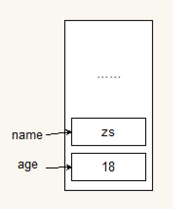
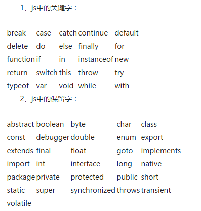

---
学习目标:
  - 掌握编程的基本思维
  - 掌握编程的基本语法
typora-copy-images-to: media
---

# JavaScript基础

## JavaScript介绍

### JavaScript是什么

> JavaScript是一种运行在***客户端*** 的***脚本语言*** 

Netscape在最初将其脚本语言命名为LiveScript，后来Netscape在与Sun合作之后将其改名为JavaScript。JavaScript最初受Java启发而开始设计的，目的之一就是“看上去像Java”，因此语法上有类似之处，一些名称和命名规范也借自Java。JavaScript与Java名称上的近似，是当时Netscape为了营销考虑与Sun微系统达成协议的结果。Java和JavaScript的关系就像张雨生和张雨的关系，只是名字很像。

JavaScript的解释器被称为JavaScript引擎，为浏览器的一部分，广泛用于客户端的脚本语言，最早是在HTML（标准通用标记语言下的一个应用）网页上使用，用来给HTML网页增加动态功能。

### JavaScript和HTML、CSS的区别

1. HTML：提供网页的结构，提供网页中的内容
2. CSS: 用来美化网页
3. JavaScript: 可以用来控制网页内容，给网页增加动态的效果

### JavaScript现在的意义(应用场景)

1. 网页特效
2. 服务端开发(Node.js)
3. 命令行工具(Node.js)
4. 桌面程序(Electron)
5. App(Cordova)
6. 控制硬件-物联网(Ruff)
7. 游戏开发(cocos2d-js)


## JavaScript初体验

### JavaScript的书写位置

- 写在script标签中

```html
<head>
  <script>
    alert('Hello World!');
  </script>
</head>
```

- 写在外部js文件中，在页面引入


```html
<script src="main.js"></script>
```

- 链接的外部js文件的script标签中，不能再写js代码。

### JavaScript中的五个单词

```javascript
//在页面弹出一个提示窗口
alert("请注意，敌方还有三十秒到达战场");

//在控制台窗口输出一句话
console.log("大吉大利，今晚吃鸡");

//接受用户输入的信息
prompt("你的名字叫什么");

//在页面上显示内容
document.write("装逼如风，常伴吾身");
//注意，如果当中有html标签的话，同样也会编译出标签的效果

//页面弹出一个确认提示框
confirm("你，爱我吗？");
```

##### 非常常用的五句话，各位老司机一定要谨记！！！


## 接下来，老司机们，我们来尝试一下下面的代码

```javascript
alert("10086");
alert("彭于晏");
alert(123);
alert(彭于晏);
alert(true);
alert(false);
//查看自己的开发人员页面，看看那个能成功输出，哪个不行，为什么可以，为什么不行？
```

### 直接量是什么？

可以直接被使用的数据，我们称为直接量。

直接量有哪些：字符串，数值，布尔类型，变量等

### 思考一个问题：变量怎么理解？

## 计算机组成

### 软件

- 应用软件：浏览器(chrome/ie/firefox)、QQ、Sublime、Word
- 系统软件：Windows、Linux、OSX

### 硬件

- 三大件：CPU、内存、硬盘
- 输入设备：鼠标、键盘、手写板、摄像头等
- 输出设备：显示器、打印机、投影仪等


## 变量

### 什么是变量

- 什么是变量

  变量是计算机内存中存储数据的标识符，根据变量名称可以获取到内存中存储的数据

- 为什么要使用变量

  使用变量可以方便的获取或者修改内存中的数据


### 变量在内存中的存储

```javascript
var age = 18;
```



### 如何使用变量

- var声明变量

```javascript
var age;
```

- 变量的赋值

```javascript
var age;
age = 18;
//阅读顺序从右到左
```

- 同时声明多个变量

```javascript
var age, name, sex;
age = 10;
name = 'zs';
```

- 同时声明多个变量并赋值


```javascript
var age = 10, name = 'zs';
```

- 变量是喜新厌旧的

```javascript
var age = 16;
age = 18;
//这个时候，age的值为18，而不是16，18.
```

### 变量的命名规则和规范

- 规则 - 必须遵守的，不遵守会报错

  - 由字母、数字、下划线、$符号组成，不能以数字开头

  - 不能是关键字和保留字，例如：for、while。(变量名称为name的注意点)

    ```javascript
    // 通过浏览器的控制台查看，是带引号的
    // name比较特殊，name是window对象的一个属性
    var name = 18; 
    ```

  - 区分大小写

- 规范 - 建议遵守的，不遵守不会报错

  - 变量名必须有意义
  - 遵守驼峰命名法。首字母小写，后面单词的首字母需要大写。例如：userName、userPassword



### 案例

1. 交换两个变量的值
2. 不使用临时变量，交换两个数值变量的值

## 数据类型

### 简单数据类型

number、string、boolean、undefined、null

#### number类型

- 数值字面量：数值的固定值的表示法

  6	7	110

- 进制

```
十进制
	var num = 9;
	进行算数计算时，八进制和十六进制表示的数值最终都将被转换成十进制数值。
十六进制
	var num = 0xA;
	数字序列范围：0~9以及A~F
八进制
    var num1 = 07;   // 对应十进制的7
    var num2 = 019;  // 对应十进制的19
    var num3 = 08;   // 对应十进制的8
    数字序列范围：0~7
    如果字面值中的数值超出了范围，那么前导零将被忽略，后面的数值将被当作十进制数值解析
```

- 浮点数

  - 浮点数的精度问题

```
浮点数
	var n = 5e-324;
浮点数值的最高精度是 17 位小数，但在进行算术计算时其精确度远远不如整数
   var result = 0.1 + 0.2; // 结果不是 0.3，而是：0.30000000000000004
   console.log(0.07 * 100);
   不要判断两个浮点数是否相等
```

- 数值范围

```
最小值：Number.MIN_VALUE，这个值为： 5e-324
最大值：Number.MAX_VALUE，这个值为： 1.7976931348623157e+308
无穷大：Infinity
无穷小：-Infinity
```

#### string类型

- 字符串字面量

  '程序猿'，'程序媛', "黑马程序猿"

  ​

  思考：如何打印以下字符串。
  我是一个"正直"的人 
  我很喜欢"传'智'播客"

- 转义符

  

- 字符串拼接

  字符串拼接使用 + 连接

  ```javascript
  console.log(11 + 11);
  console.log('hello' + ' world');
  console.log('100' + '100');
  console.log('11' + 11);
  console.log('male:' + true);
  ```

  1. 两边只要有一个是字符串，那么+就是字符串拼接功能
  2. 两边如果都是数字，那么就是算术功能。

#### boolean类型

- boolean字面量：  true和false，区分大小写
- 计算机内部存储：true为1，false为0

### 获取变量的类型

typeof

```javascript
var age = 18;
console.log(typeof age);  // 'number'
```


## 注释

### 单行注释

用来描述下面一个或多行代码的作用

```javascript
// 这是一个变量
var name = 'hm';
```

### 多行注释

用来注释多条代码

```javascript
/*
var age = 18;
var name = 'zs';
console.log(name, age);
*/
```


## 操作符

### 算术运算符

```
+、-、*、/、%
```

#### 优先级：先乘除求模，再算加减


### 比较运算符

```
<  >  >=  <= == != ===(全等) !==(不全等)
```

比较规则：

- 两边都为字符串时，则按照字符串的字符编码进行逐位比较
- 一边为数字，一边为字符串时，则将字符串转换为数字进行比较
- 一边为数字，一边为布尔值时，则将布尔值转换为数字进行比较

```javascript
==与===的区别：==只进行值得比较，===类型和值同时相等，则相等

var result = '55' == 55;  	//true
var result = '55' === 55; 	//false 值相等，类型不相等
var result = 55 === 55; 	//true
```


### 逻辑运算符

```
&&  两个操作数同时为true，结果为true，否则都是false
||  两个操作数有一个为true，结果为true，否则为false
!   取反
```

```javascript
// 练习	
var a = 3  &&  0 || 2;  
var b = 3 || 0 &&  2; 
var c= 0 || 2 && 3; 
alert(a),alert(b),alert(c);
```

```javascript
// 面试题
var a = 1+1 && 3;
var b = 0 && 1+1; 
var c = 1 ||  2 && 3-1;
alert(a);
alert(b);
alert(c);
```


### 赋值运算符（复合运算符）

=   +=   -=   *=   /=   %=

```javascript
例如：
var num = 0;
num += 5;//相当于  num = num + 5;
```


### 一元运算符

++、--

- 前置++

  ```javascript
  var num1 = 5;
  ++ num1;
  var num2 = 6;
  console.log(num1 + ++ num2);
  ```

- 后置++

  ```java
  var num1 = 5;
  num1 ++;
  var num2 = 6 
  console.log(num1 + num2 ++);
  ```

- 猜猜看

  ```javascript
  var a = 1; var b = ++a + ++a; console.log(b);    
  var a = 1; var b = a++ + ++a; console.log(b);    
  var a = 1; var b = a++ + a++; console.log(b);    
  var a = 1; var b = ++a + a++; console.log(b);  
  ```

  ​


### 运算符的优先级
	优先级从高到底
		1. ()  优先级最高
		2. 一元运算符  ++   --   !
		3. 算数运算符  先*  /  %   后 +   -
		4. 关系运算符  >   >=   <   <=
		5. 相等运算符   ==   !=    ===    !==
		6. 逻辑运算符 先&&   后||
		7. 赋值运算符 = 

```	javascript
// 练习1：
((4 >= 6) || ('人' != '阿凡达')) && !(((12 * 2) == 144) && true) 
// 练习2：
var num = 10;
if (5 == num / 2 && (2 + 2 * num).toString() === '22') {   
  console.log(true);
}
```
## 表达式和语句 

### 表达式
>一个表达式可以产生一个值，有可能是运算、函数调用、有可能是字面量。表达式可以放在任何需要值的地方。

  ```
常识:
  只能操作一个值的操作符叫一元操作符,组成的表达式叫一元表达式.(一个值一个运算符)
  由两个值和一个运算符连接起来的表达式叫二元表达式。(两个值一个运算符)
  由三个值和两个运算符连接起来的表达式叫三元表达式.(三个值两个运算符)
例如：
  12
  aa++
  aa + 56
  5 > 6 ? '5' : '6'
  ```

### 语句
>语句可以理解为一个行为，循环语句和判断语句就是典型的语句。一个程序有很多个语句组成，一般情况下;分割一个一个的语句
```
JavaScript所提供的语句分为以下几大类： 
  1. 变量声明，赋值语句：var。
  语法如下： var 变量名称 [=初始值]
  例如：var num = 25;
  2. 条件和分支语句：if...else，switch。 （后面具体学习）
  3. 循环语句：for， for...in，while,break,continue。（后面具体学习）
  4. 注释语句：//，/*...*/。 
  // 这是单行注释 
  /* 这可以多行注释.... */
```
