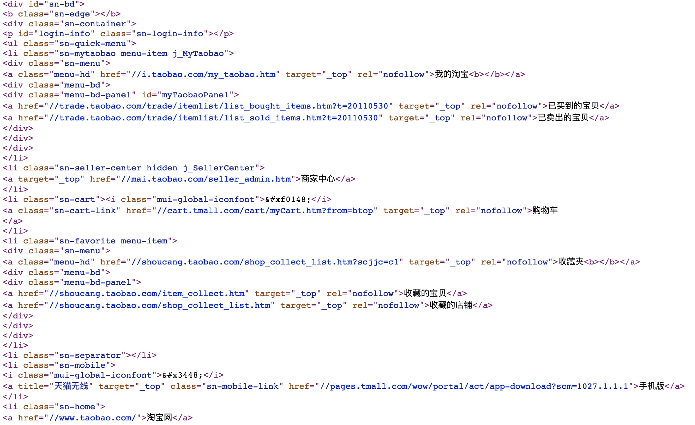

# 什么是前端与移动开发工程师（了解）

## PC端：

```
pc端其实就是电脑端，主要分为网页开发例如京东淘宝以及管理系统开发例如图书馆管理系统等。
```

## 移动端：

```
移动端泛指可移动的设备，想手机，平板等常见的移动设备。可以开发运行在移动端的网页，以及手机app，还有这两年比较火热的小程序等。
```


# 认识网页（了解）

```
网页，主要由文字，图片，链接，音频，视频，动画等元素构成。
```


```
虽然听起来很简单，但是我们要思考，这些元素并不是凭空就直接添加上去的。
所有的页面上你能看到的效果内容，都是程序员一字一句敲上去的代码！
```

```
用户眼中的美丽，是程序员日益光亮的头顶。
```



```
收获一枚表情包！
```


# 常见的浏览器（了解）

```
浏览器主要使用来运行网页的平台，常用的五大浏览器如下图：
```


## 浏览器的市场占有率

查看网站： <a href="http://tongji.baidu.com/data/browser" target="_blank">http://tongji.baidu.com/data/browser</a>


## 浏览器内核（了解）         

```
浏览器内核又可以分成两部分：渲染引擎(layout engineer 或者 Rendering Engine)和 JS 引擎。
渲染引擎 它负责取得网页的内容（HTML、XML、图像等等）、整理讯息（例如加入 CSS 等），以及计算网页的显示方式，然后会输出至显示器或打印机。浏览器的内核的不同对于网页的语法解释会有不同，所以渲染的效果也不相同。
JS 引擎 则是解析 Javascript 语言，执行 javascript语言来实现网页的动态效果。

最开始渲染引擎和 JS 引擎并没有区分的很明确，后来 JS 引擎越来越独立，内核就倾向于只指渲染引擎。有一个网页标准计划小组制作了一个 ACID 来测试引擎的兼容性和性能。内核的种类很多，如加上没什么人使用的非商业的免费内核，可能会有10多种，但是常见的浏览器内核可以分这四种：Trident、Gecko、Blink、Webkit。
```

（1）Trident(IE内核) 

国内很多的双核浏览器的其中一核便是 Trident，美其名曰 "兼容模式"。

代表： IE、傲游、世界之窗浏览器、Avant、腾讯TT、猎豹安全浏览器、360极速浏览器、百度浏览器等。

Window10 发布后，IE 将其内置浏览器命名为 Edge，Edge 最显著的特点就是新内核 EdgeHTML。

（2）Gecko(firefox) 

Gecko(Firefox 内核)： Mozilla FireFox(火狐浏览器) 采用该内核，Gecko 的特点是代码完全公开，因此，其可开发程度很高，全世界的程序员都可以为其编写代码，增加功能。 可惜这几年已经没落了， 比如 打开速度慢、升级频繁、猪一样的队友flash、神一样的对手chrome。

（3） webkit(Safari)  

 Safari 是苹果公司开发的浏览器，所用浏览器内核的名称是大名鼎鼎的 WebKit。

 现在很多人错误地把 webkit 叫做 chrome内核（即使 chrome内核已经是 blink 了），苹果感觉像被别人抢了媳妇，都哭晕再厕所里面了。

 代表浏览器：傲游浏览器3、 Apple Safari (Win/Mac/iPhone/iPad)、Symbian手机浏览器、Android 默认浏览器，

（4） Chromium/Bink(chrome) 

   在 Chromium 项目中研发 Blink 渲染引擎（即浏览器核心），内置于 Chrome 浏览器之中。Blink 其实是 WebKit 的分支。 

​     大部分国产浏览器最新版都采用Blink内核。

```
了解一点：
```

移动端的浏览器内核主要说的是系统内置浏览器的内核。

目前移动设备浏览器上常用的内核有 Webkit，Blink，Trident，Gecko 等，其中 iPhone 和 iPad 等苹果 iOS 平台主要是 WebKit，Android 4.4 之前的 Android 系统浏览器内核是 WebKit，Android4.4 系统浏览器切换到了Chromium，内核是 Webkit 的分支 Blink，Windows Phone 8 系统浏览器内核是 Trident。


# Web标准（掌握）w3c组织:万维网联盟

```
通过上文我们知道，不同的浏览器有不同的内核，那为什么在不同的浏览器中，显示的网页却是统一的。
```

```
中国地域辽阔，每个地方都有自己的方言，通用语言是普通话。各位同学可以思考下，如果我们当时没有规定一种通用的标准用语，那现在会是神马场景？
上海话：每趟我一看到侬，我额心就巴哒巴哒穷跳八跳了！
东北话：你丫说啥，骂人呐，老娘削死你。
```

```
所以，为了让不同的浏览器针对同一份代码，可以展示统一的内容，w3c组织规定了一个标准，并且要求所有的程序员还有浏览器都必须遵守这个标准。
这就是现行的web标准。
```


## Web标准的构成

```
结构层：html，负责整个网页元素的整理以及分类。
样式层：css，负责网页元素的版式，颜色，字体大小等外观样式。
行为层：js，负责网页中的交互行为编写。
```

### 直观解释Web标签

结构层，相当于人的身体


样式层，相当于人的外貌


行为层，相当于人的行为


```
熟记：
html负责页面结构
css负责样式外观
js负责交互行为
```


# 程序员开发工具（IDE）了解

```
IDE是指程序员用来写代码的编辑器，种类繁多，但终归是为了提高编程效率所产生的工具罢了。
下面简单介绍几种前端工程师常用的代码编辑器：
```


```
sublime：一款轻量级的开发软件，速度快，体积小，插件多。
```


```
webstrom：一款重量级的前端开发软件，被称为“前端开发神器”，功能齐全，体量略大，新手使用过于笨重。
```


```
vscode：微软家的免费编辑器，背后有微软爸爸加持，近几年更新频频，有望成为新一代开发神器，速度快，体量不大，基础班必备软件。
```

```
其他的诸如HBuilder，DW，atom等，都有各自的优缺点，都是工具，都只是为了提高效率。
```

# HTML初体验（掌握）

```
从web标准的组成我们可以知道，学习前端就是学习三门语言：html，css，js缺一不可。
那么我们就从第一门开始学起，html。
```

```
HTML(英文Hyper Text Markup Language的缩写)，翻译成中文”超文本标签语言“。
```

```html
什么是标签：简单讲记住，带有尖括号的代码，称为标签，例如
<strong>我是一个强壮的标签</strong>
```

## HTML固定结构代码

```
在学习html的标签代码之前，首先得了解在编码的一开始，需要遵守的一个固定格式。
```

```html
<!DOCTYPE html>
<html>
	<head>
		<title>网页标题</title>
	</head>
	<body>
	
	</body>
</html>
```

```
如何在vscode中快速搭建固定结构代码：
html
html：5
！
三者选其一。
```

## 固定结构代码解析(了解)

```
<!DOCTYPE html>
指定当前文档类型为html5版本

<html>
页面的一个根节点，网页从哪里开始到哪里结束

<head>
头部标签，用来存放页面辅助型标签，例如：title，mate，base，style，link等

<title>
网页标题标签，被head标签包裹，让页面拥有标题

<body>
主体标签，所有页面的内容，都是存放在这个标签内部

```


## HTML标签分类

```
在HTML标签中，有两种标签写法，对应的是单标签与双标签，在写法上有所区别，但是都是标签。
```

### 单标签

```html
<标签名>
<br>
<hr>
```

### 双标签

```html
<标签名></标签名>
<strong></strong>
<div></div>
```

```
如果一定要说两者有什么区别的话，那就是单标签没法存放内容，但是双标签可以。
```


## HTML标签关系

```
标签的相互关系有两种，嵌套关系与并列关系
```

### 嵌套关系

```html
<div>
	<table>
        <tr></tr>
    </table>
</div>
```


### 并列关系

```html
<head></head>
<body></body>
```


```
注意一点，如果存在嵌套的标签，那么被嵌套的那个标签一定要添加缩进，保证代码书写规范，便于阅读。
编程千万条，标准第一条。
代码不规范，维护两行泪。
```

# 排版标签（掌握）

```
在HTML页面中，会出现很多文字内容，那么也就对应有着很多的标签用来存放文字。
```

## 标题标签

```
h1,h2,h3,h4,h5,h6
代表标题，hmtl提供了六个等级的标题。
可作为页面标题使用，重要性递减。
```

```html
语法结构如下：
<h1>标题内容</h1>
```

```
注意：因为h1标题是最高等级的标题标签，所以一般也是给页面最重要的元素使用，基本是logo专用。
一个页面只能有一个h1，其他的没有数量要求。
```

## 段落标签

```
在网页中，以段落的方式来存放内容，可以使用段落标签，如果要引用某些文章的句子，也可以用段落标签<p></p>。
```

```html
语法结构如下：
<p>这是一个寂寞的天，下着有些伤心的雨</p>
```

```
p标签可以实现文字自动换行，属于最常用的标签之一。
```

```
请利用标题标签，与段落标签，写一首古诗词，运行到浏览器上。
```

## 水平线标签（了解）

```
hr标签，水平线标签。
在页面显示一条水平线，默认黑色，与浏览器同宽，一般用来做文章分割功能。
```

```html
<hr>单标签
```


## 换行标签（了解）

```
文字换行，可以使用上述的标题标签，或者p标签。当然，还有专门拿来换行的br标签。
br标签，起到强制换行的作用。
了解即可，用的不多。
```

## 拓展知识（了解）

```
pre标签，如果有文字格式需要保留，例如原文中的换行，空格等，那么可以使用pre标签。
```

```html
<pre>
	这是一个寂寞的天
	下着有些伤心的雨
</pre>
```

```
blcokquote标签，如果需要引用大段的文字，那么建议使用blockquote，与p标签类似。
```

```html
<blockquote>
	这是一段很长很长的文字，长到我都不想写完它。。。。。。
</blockquote>
```


## 传说中的div与span（熟悉）

```
div标签与span标签将是项目开发中使用非常频繁的标签。
后面还会深度学习，此刻先熟悉并且记住对应的特点即可。
```

```
div标签，独自占据一整行。
span标签，一行可以显示多个。
```


## 文本格式化标签（掌握）

```
在可以存放文字的标签中，有些标签自带显示效果，例如加粗，下划线，斜体等。这些标签我们称为文本格式化标签。
```


```
要求记住后面四个，前面四个了解即可。
```


# 标签属性（掌握）

```
如果把标签比作手机，那么标签的属性就是手机的颜色，版本，尺寸。
简单理解，属性就相当于标签的特点。例如hr标签，水平线的宽度就是属性。
```

```html
语法结构：
<标签名 属性名=”属性值“  属性名=”属性值“ .....>xxxxxxx</标签名>
```

```
1.属性写在第一个标签名后，用空格隔开
2.属性分为属性名与属性值两部分
3.一个标签可以拥有多个属性，之间用空格隔开
```

例如

```html
<hr width=”400“>
水平线，宽度为400px
```


# 图片标签（掌握）

```
image图片 img标签
网页中，处理文字之外，还有常见的图片，HTML中加载图片的方式好几种，其中最常用的就是使用img标签来设置图片。
```

```html
语法结构：

```

| 属性名 |   属性值    |          作用描述          |
| :----: | :---------: | :------------------------: |
|  src   | 图片路径url | 使img标签通过路径找到图片  |
|  alt   |    文字     | 图片加载失败，显示描述文本 |
| title  |    文字     |  鼠标悬停时，显示描述文本  |
| width  |   像素值    |       设置图片的宽度       |
| height |   像素值    |       设置图片的高度       |

```
注意，只设置图片的宽，那么高度自动等比例适应，反之也是。
```


# a链接标签（掌握）

```
在网页中，会有某些文字点击后可以发生页面跳转，这个功能可以用a链接标签实现。
```

```html
语法结构：
<a href=”跳转目标页面路径“ target=”目标页面打开方式“>文本或者图片</a>
```

```
a标签的使用方式：
1.本地链接跳转，直接设置本地路径即可。
2.网络地址跳转，需要注意域名完整。
3.网络资源跳转，设置资源网络路径。
4.空链接：#号代替路径，点击不会跳转。
```

```
target属性，可以控制跳转页面的打开方式，两种方式：
_self:直接打开页面，不保留原来的页面，默认方式。
_blank:打开新的窗口跳转，保留原来的页面。
```

## base标签

```
提问：
如果当前有一百个a标签。都需要打开新的窗口，保留原来页面跳转。那么我们是不是要写_blank一百次？？？？
```

```
base标签，可以统一控制页面上所有a标签的跳转方式。(前提，a标签本身没有设置target属性)
书写位置固定，在head标签中。
```

```html
语法结构：
<head>
	<base target="_blank">
</head>
```


## 锚点定位（了解）

```
我们经常在电商页面上看到一个效果，当页面滚动到底部的时候，想要回到页面的顶部，可以通过点击右侧的回到顶部，可以立刻跳转到页面顶部。
这个功能，就是a标签的锚点定位功能。
```

```
语法结构：
<a href="#id名">内容</a>
其中的逻辑，主要是通过标签的唯一标识id，进行定位。
```


# 路径（掌握）

```
所谓路径，现实生活中，就是从A地点到B地点的经过的途径。例如从兴东到深圳北，这段就是路径。
在前端项目中，路径只是更多的是目标文件的地址。
例如我们前面学的img标签，需要设置一个路径，让img标签可以找到图片文件并且显示出来。
```

```
在电脑中的路径体现，其实就是一个个文件夹，路径就是帮助你在这些文件夹中找到你想要的目标文件，不管是图片，还是视频，音频等。
```

### 绝对路径

```
完整的文件路径（带有盘符的路径，就是绝对路径）；
完整的网络地址；
```

```
绝对路径，工作中用的很少，因为可移植性差。
```

### 相对路径

```html
1.同一目录下结构。

2.下一级目录结构。

3.上一级目录结构。

```

```
相对路径是工作中用的最多的，因为可移植性强。
```


# 转义符（了解）

```
在HTML中，某些特殊符号，没有办法直接书写显示，例如><.
那么，HTML为这些特殊字符准备了专门的替代代码，如下
```


# 注释标签

```
注释标签，主要是为了让某些文字用户看不到，但是程序员可以看到。
例如某段代码的功能参数解释，但是客户并不需要看到，所以就用注释标签给包起来。
```

```
语法如下：
  <!-- 注释语句 -->
  操作：ctrl+/ 
```

