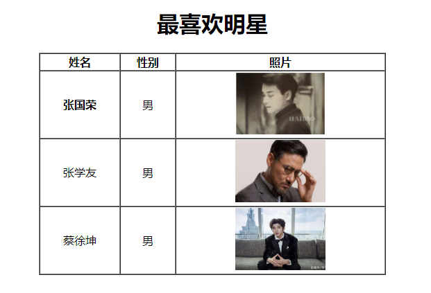

1.  页面有50个a标签,使用base标签,控制a标签统一保留原来的页面
2.  一百行p标签,其中第十行为目标元素,使用最底下的a标签点击定位
3.  准备一张图片在d盘任意位置,然后通过绝对路径的方式,加载图片
4.  将张国荣与html文件放在同一个文件夹下,通过相对路径加载图片
5.  将cxk放在html文件的下一级目录,通过相对路径加载图片
6.  将张学友放在html文件的上一级目录,通过相对路径加载图片
7.  将吴彦祖放在html的隔壁文件夹中,实现先返回上一级,再进入下一级的操作
8.  完成以下把表格,要求:1.图片大小固定为130*90  2.可以被点击  3.点击之后跳转到对应的大图.  4.点击后打开新的页面
9.  
10.  表单控件只学习了四个,所以要求出现的所有的单词都必须要会背,至少能做到在有提示的情况下,可以写出.

