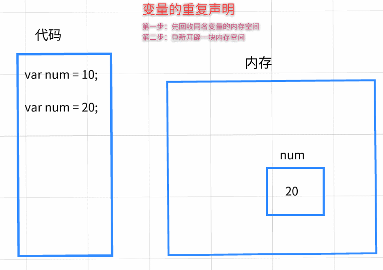

<center>
<h2>黑马程序员深圳中心</h2>
<h2>前端与移动开发学院</h2>
<h3>JavaScript基础</h3>
<h4>张晓坤</h4>
<h4>版权所有,本资料仅提供给黑马内部学员使用,禁止外传</h4>
<h4>黑马程序员拥有本资料的全部版权</h4>
<h4><a href="http://www.itheima.com">黑马程序员</a></h4>
<h5>2019年7月</h5>
</center>


# 今日学习目标

* [ ] 01-能够记住javascript三个组成部分(ECMAScript、Dom、Bom)
* [ ] 02-能够使用typeof关键字检测数据类型
* [ ] ==03-变量==
  * [ ] a.熟悉变量的声明/赋值/取值语法
  * [ ] b.了解第三方变量交换两个变量值的流程与原理
* [ ] 04-运算符与表达式(算术运算)
  * [ ] a.算术运算符
  * [ ] b.复合算术运算符
  * [ ] c.自增/自减运算符
  * [ ] d.Math对象实现高级数学计算

# 01-JavaScript入门


## 1.1-JavaScript简介


### 1.什么是Javascript？

  * javascript是一种编程语言

    

### 2.学习Javascript的意义

* 一个前端网页主要由三门语言组成，他们之间是缺一不可的关系
    * HTML：确定网页的结构
    * CSS: 确定网页的样式
    * JavaScript: 确定网页的行为(交互)

        * 众所周知，在前端开发中一个网页的源代码主要由三部分组成（HTML,CSS,Javascript）,其中HTML确定网页的结构，CSS确定网页的样式,而JavaScript则主要负责网页的行为（动态效果，交互事件等）。
* JavaScript应用场景

    * 1.网页特效
    * 2.游戏开发(cocos2d-js)
    * 3.服务端开发(Node.js)
    * 4.命令行工具(Node.js)
    * 5.桌面程序(Electron)
    * 6.App(Cordova)
    * 7.控制硬件-物联网(Ruff)

        * ***js作者有一句经典名言：凡是能用js实现的功能，最终都会用js来实现***


  ### 3.JavaScript语言的组成

 

  * ECMAScript - JavaScript的核心
      * ECMAScript定义了JavaScript的语言规范
      * JavaScript的核心：描述了语言的基本语法和数据类型，ECMAScript是一套标准，定义了一种语言的标准与具体实现无关

  * DOM - 文档对象模型
      * 一套操作页面元素的API
      * DOM可以把HTML看做是文档树，通过DOM提供的API可以对树上的节点进行操作

  * BOM - 浏览器对象模型
      * 一套操作浏览器功能的API
      * 通过BOM可以操作浏览器窗口，比如：弹出框、控制浏览器跳转、获取分辨率等


## 1.2-JavaScript的三种写法


### 1-复习CSS代码的三种写法

* 1.行内样式：不推荐，因为不便于维护
    * `<h1 style="background: bisque">哈哈哈</h1>`
* 2.内联样式：写在style标签中,如果界面css样式比较简单可以使用，复杂的话不推荐
    * `<style>.div{background: hotpink;}</style>`
* 3.外联样式：写在css文件中，使用link导入
    * `<link rel="stylesheet" href="./01-css外联样式.css">`
        * ***css外联样式的本质其实就是字符串替换 将下方这行代码替换成对应文件的所有代码***

### 2-JS代码三种写法

* JavaScript也有三种书写方式，并且与CSS的三种书写方式几乎一致

* 1.行内样式：不推荐，因为不便于维护
    * `<button onclick="window.alert('坤哥')">点我就告诉你黑马谁最帅</button>`
* 2.内联样式：写在script标签中,如果界面js代码较少可以使用，复杂的话不推荐
    * `<script >alert("这是JS内联样式")</script >`
* 3.外联样式：写在js文件中，使用script的src属性导入
    * `<script src="./01-JS外联写法.js"></script>`

### **3**-细节注意点

* 1.无论是CSS还是JS的三种写法，当一个html文件存在多种写法时要记住HTML的代码是从上往下解析的
* 2.如果script标签没有src属性则表示内联样式，如果有src属性则表示外联样式，外联样式JS代码只能写在
  js文件中而不能写在script标签中


```html

<!doctype html>
<html lang="en">
<head>
    <meta charset="UTF-8">
    <meta name="viewport"
          content="width=device-width, user-scalable=no, initial-scale=1.0, maximum-scale=1.0, minimum-scale=1.0">
    <meta http-equiv="X-UA-Compatible" content="ie=edge">
    <title>Document</title>
</head>

<!--
    总结：js三种写法
    1.行内写法：不推荐，因为不便于维护
    2.内联写法:写在script标签中
    3.外联写法：写在js中，使用script标签的src属性来导入
    注意点：如果一个script标签有src属性（外联写法），此时内联的js代码不会执行
-->

<!--3.外联-->
<script src="01-js外联写法.js"></script>
<body>
<!--1.行内-->
<div onclick="alert('js行内')">div</div>
<!--2.内联-->
<script>
    alert('js内联')
</script>
</body>
</html>

```


## 1.3-JS注释两种写法


* 代码注释的作用：
    * 1.理清思路，方便自己以后阅读代码
    * 2.规范编程，方便以后别人接手代码便于维护


* JS注释有两种写法
    * `// 注释内容`:单行注释：注释内容只能是一行，适用于注释内容较少
    * `/* 注释内容 */`:多行注释：注释内容可以是多行，适用于注释内容较多，比如一行写不下

```html

<!doctype html>
<html lang="en">
<head>
    <meta charset="UTF-8">
    <title>Document</title>
</head>
<body>

<script>

    //单行注释：注释内容只能是这一行
    /* 多行注释：注释内容可以是多行
    第一行
    第二行
    */

    alert("JS注释");
</script>
</body>

</html>


```


## 1.4-JS常用五句话

* JS中常用的五句话主要功能是用于调试以及浏览器简单的交互
  * JS是一门面向对象高级编程语言，它对于逻辑思想的要求较高，所以在编写JS程序时我们很难做到一次性编写就可以完成所有功能

  * 通常的做法是，我们逐步的去实现功能，每敲几行代码我们来打印一下检查代码是否有问题，如果没有就继续编写
      * 类似于我们使用HTML和CSS写静态界面时，并不是写完所有的代码才运行而是写一部分就看一下界面效果

```html

<!DOCTYPE html>
<html lang="en">
<head>
    <meta charset="UTF-8">
    <title>Title</title>
</head>
<body>

<h1>千万别点，少年</h1>
<button onclick="document.write('点一次两百')">点我啊</button>
<script>
    //第一句话：弹出一个提示框，通常用于提示用户，也可以用于调试
    alert("hello world");
    //第二句话：打印某个数据的值，查看数据是否成功
    //这个写法不是给用户看的，而是给程序员自己调试看的
    console.log("人生如戏，全靠演技");
    //第三句话：弹出一个输入框，可以用来输入数据
    prompt("小妹妹，你今年多大了呀？");
    //第四句话：弹出一个确认框，默认会有确定和取消按钮用于提示用户再次确认
    confirm("确定不加个钟吗？");
    //第五句话：可以给body加内容
    //用的非常少，因为可能会把body原来的内容替换掉
    document.write("how old are you?");
</script>

</body>
</html>

```


## 1.5-js代码执行原理


### 1-计算机组成

* 1.软件
    * 应用软件：浏览器(chrome/ie/firefox)、QQ、Sublime、Word、webstorm
    * 系统软件：windows，Linux，unix，OSX，iOS，android

* 2.硬件
    * 三大件：CPU,内存,硬盘
    * 输入设备：鼠标,键盘,摄像头等
    * 输出设备：显示器,打印机,投影仪等


### 2-代码运行的原理


```html

<!DOCTYPE html>
<html lang="en">
<head>
    <meta charset="UTF-8">
    <title>Title</title>
</head>
<body>
<!--
        计算机由硬件和软件共同组成
            硬件：cpu、内存、硬盘、主板、显卡、声卡等等
                看得见摸得着的
                cpu：相当于计算机中的大脑，也就是说计算机中的所有的运算都要交给CPU去执行
                内存：存储数据的，存储速度快，不会永久保存数据，断电后数据就消失
                硬盘：存储数据的，存储速度相对慢，会永久保存数据，断电后数据还在
                CPU是无法直接访问外存储器的，硬盘就是外存储器
                CPU可以访问内存，但是无法直接访问硬盘
                程序是存在硬盘的(exe)，但是程序运行时产生的一些数据保存在内存中

           软件：不开机一定看不到的东西，不存在于现实世界
                系统软件：windows,unix,linux,mac os,android,ios
                应用软件：QQ，微信，陌陌，快播

    -->

</body>
</html>
```


# ==02-数据类型与直接量==


* 1.如果某行js代码报错，原因只有`两个`
    * 第一：语法错误
    * 第二：数据不识别
* 2.在js中，只有符合数据类型的数据才能被识别
* `3.数据类型`:软件在运行时，会产生数据，数据有很多种，不同的数据CPU的处理方式不同
    所以需要对数据进行分类，不同的数据对应不同的类型

* `4.直接量（字面量）`:只要是符合数据类型的数据都叫做直接量
  * 顾名思义：让你从字面上理解这个数据

```javascript

console.log('123');
console.log(10);
console.log(true);
//console.log(哈哈);//程序会报错？为什么？
//js中程序报错主要有两个原因：（1）语法错误  （2）数据不识别

```


## String类型

* String：字符串
  * 例如：`"张三"`,`'abc'`
  * 范围：一切用双引号或者单引号包围起来的内容都是字符串
    * 作用：展示文本内容

## Number类型

* Number：数字
    * 例如： `10` `0.1`
    * 范围：数学中的一切数字，包含整数和小数
      * 作用：用于数学计算


## boolean类型

* boolean:布尔类型
    * 只有两个值：`true`、`false`
      * 作用：表示现实世界中事物的两种对立面  真假、长短、开关、男女等
        * true表示真
        * false表示假


## typeof关键字

* 作用：检测一个数据所属的类型
* 语法：`typeof 数据` 或者 `typeof (数据)`
  * 会得到改属性所属类型的字符串: `string` `number` `boolean`

```html

<!DOCTYPE html>
<html lang="en">
<head>
    <meta charset="UTF-8">
    <title>Title</title>
</head>
<body>

<!DOCTYPE html>
<html lang="en">
<head>
    <meta charset="UTF-8">
    <title>Title</title>
</head>
<body>

<script>
    console.log('123');
    console.log(123);
    console.log('哈哈哈');
    //console.log(哈哈);//程序会报错？为什么？
    //js中程序报错主要有两个原因：（1）语法错误  （2）数据不识别

    //1.直接量：可以直接拿来使用的数据
    //哪些数据是直接量：符合数据类型的数据

    //2.数据类型：js代码在运行时会产生不同的数据，不同的数据存储与处理方式不一样，所以要对数据进行分类

    //2.1 字符串类型：string     一切以单引号或者双引号引起来的内容
    //作用：在网页展示文本
    console.log ( "张三" );
    console.log ( '123' );
    console.log ( "" );//空字符串

    //2.2 数字类型：number   一切数学数字   10  -10  9.9
    //作用：数学运算
    console.log ( 10 );
    //了解js中数字的极限范围
    console.log ( Number.MAX_VALUE );//最大的数字  1.7976931348623157e+308
    console.log ( Number.MIN_VALUE );//最小的数字  5e-324   无限接近于0的正小数
    console.log ( Infinity );//正无穷
    console.log ( -Infinity );//负无穷


    //2.3 布尔类型：boolean  表示事物的两个对立面  真/假  成立/不成立
    // 只有两个值：true(真)和false(假)
    console.log ( true );
    console.log ( false );

    //2.4 检测一个数据的类型:会得到这个数据类型的字符串
    //语法： typeof  数据           typeof (数据)
    console.log ( typeof ("10") );//string
    console.log ( typeof 10 );//number
    console.log ( typeof  true );//boolean
    console.log ( typeof "" );//string
    console.log ( typeof  "true" );//string

</script>
</body>
</html>
</body>
</html>


```


# ==03-变量==


## 1.1-变量声明/赋值/取值


* 1.变量（variable）：内存中用来保存数据的一块空间

* 2.变量作用：在内存中存储数据

* 3.语法:
    * 1.声明变量:`var 变量名`
    * 2.赋值：`变量名 = 值`
    * 3.取值：直接写变量名即可


```html

<script>
    //如何来存储数据？
    //使用变量来保存数据
   var age = prompt('请输入你的年龄');
   console.log ( age );


    /** 变量variable：内存中用来保存数据的一块空间
     * 由来：有时候代码运行产生的数据我们需要存储到内存中，方便以后使用
     * 作用：变量的主要作用就是存储数据
     * 语法：
            （1）声明变量：  var 变量名
            （2）赋值：  变量名 = 值
            （3）取值：  直接写变量名
     * */

    //1.声明一个变量：在内存开辟一块空间，这个内存空间的名字叫做a
    var a ;

    //2.赋值:把number类型的数据10，放入a的这个内存空间
    //这个等号叫做赋值运算符：将右边的数据赋值给左边的变量
    a = 10;

    //3.取值:把a的内存空间中存储的数据拿出来
    console.log ( a );//10

    //注意：这里打印的是a这个字符串，而不是变量a
    console.log ( 'a' );
    
</script>

```

### 图解变量工作原理


## 1.2-变量补充说明


* 本小节知识点

  * 1.变量的初始化
  * 2.变量的批量声明
  * 3.变量批量声明赋值
  * 4.变量的重复声明
  * 5.变量的重复赋值
  * 6.变量的值是另一个变量的值

```html

<script>
    //1.变量的初始化：在声明的时候赋值
    var num = 10;//相当于(1)  var num;   (2)num = 10   这两行代码简写形式

    //2.变量的批量声明：同时声明多个变量
    var a,b,c;

    //3.批量声明的时候也可以赋值
   var num1 = 10,num2 = 20,num3 = 30;

   //4.变量的重复声明:会把已经存在的变量覆盖掉
    var num = 88;
    console.log ( num );//88

    //5.变量的重复赋值：修改变量里面存储的数据
    num = 99;
    console.log ( num );//99

    //6.变量的值是另一个变量的值
    var n1 = 20;
    var n2 = n1;//将n1的值拷贝一份赋值给n2
    console.log ( n1, n2 );//同时打印多个数据之间用逗号分隔

    //注意：这行代码的意思是将字符串'n1'赋值给变量n2，而不是变量n1的值
    //n2 = 'n1';
    //console.log ( n2 );//n1

</script>

```

### 图解变量补充说明




## 1.3-变量命名规则与规范


* `规则`：必须要遵守，否则会报错
    * 规则是由语法决定的，无法更改
      * 1.变量只能以下划线、字母、$开头，后面接任意的数字、下划线、字母、$
      * 2.不能以JS的关键字作为变量名
        * 尽量不要使用关键字和保留字作为变量名，也不需要死记硬背，孰能生巧
        * 关键字：JS内置的一些关键字，代表着特殊的语法含义，不允许程序员擅自声明
        * 保留字：有可能在将来会成为关键字，现在可以用，但是并不能保证以后一直可以用
* `规范`：程序员们在遵守规则时养成的一种习惯
    * 规范是程序员的一种编码习惯，主要目的就是为了提高代码的易读性
      * 1.起名要有意义，最好用名词作为变量名
      * 2.使用驼峰命名法：变量名第一个单词首字母小写，后面如果有其他单词则每一个单词的首字母大写


```html

<script>
    /**规则与规范
     * 规则：必须要遵守，否则会报错。由语法决定
     *        * 1.变量只能以下划线、字母、$开头，后面接任意的数字、下划线、字母、$
     *        * 2.不能以JS的关键字作为变量名
     *        * 3.js是严格区分大小写的， 例如：age与Age这是两个不同的变量名
     * 规范：编码的一种习惯，主要是为了提高代码的易读性
     *       * 1.起名要有意义，最好用名词作为变量名
     *       * 2.使用驼峰命名法：变量名第一个单词首字母小写，后面如果由其他单词则每一个单词的首字母大写
     */

    //1.这样命名虽然不会报错，但是代码一多，你自己都不知道是用来保存什么数据，别人看你代码也是一脸懵逼
    var ababababababbabab = "我就是这么屌";
    //2.这样写代码会报错，因为不是以下划线、字母、$开头
    //var 123str = "123";
    //var #666 = "666";
    //3.这样写符合规则，不会报错
    var _123$$$_ssss6666 = "what?";
    //4.命名规范演示
    var age = 18;//年龄
    var name = "张三";//姓名
    var userName = "admin";//用户名  驼峰命名法
    var passWord = "123456";//密码 驼峰命名法
    var gender = "男";//性别的英语单词
    var pwd = "1314520";//密码password的简写
    var oldFe = "老铁";//极其个别的英语名词不知道可以使用中文代替

</script>


```

## 1.4-练习：交换两个变量的值


```html
<script>
    /*变量赋值的原理： 变量名 = 值
    1.先将变量内存空间中原本存储的数据销毁
    2.然后将等号右边的数据放入这个内存空间中
     */

    //需求：交换两个变量的值 让n2变成20，n1变成10
    var n1 = 10;
    var n2 = 20;

    //不能直接交换
    // n1 = n2;//将n2的值赋值给n1的时候，会变把n1原本的值销毁
    // n2 = n1;
    // console.log ( n1, n2 );//20 20

    //使用第三方变量来交换
    var temp = n1;//先把n1的值存到变量temp中
    n1 = n2;//将n2的值赋值给n1
    n2 = temp;//将templ的值赋值给n2
    console.log ( n1, n2 );//20,10
</script>
```


# 04-运算符与表达式

* `1.运算符只是一种运算的符号，单独使用无意义，通常与需要计算的数据在一起组成表达式`
* `2.表达式一定有结果，要么直接打印要么存入变量中`

## 1.1-js中+号的作用


```html
<script>
    var name = '林立群' ;
    console.log ( "我的名字是name" );//这里name是字符串的一部分，无法获取到变量的值
    console.log ( '我的名字是：' + name );//使用+号连接左右数据

    //1.字符串连接符：如果+号两边，只要有一边是字符串，就是字符串的连接符
    console.log ( "10" + name );//10林立群

    //2.数学加法：两边都要是number
    console.log ( 10 + 10 );

    //示例
    console.log ( 20 + 10 );//30
    console.log ( 20 + "10" );//2010
    console.log ( 20 + "10" + 10 );//201010
</script>
```

## 1.2-算术运算符与算术表达式


```html
<script>
    /**1.算术运算符：数学中的算术运算
     +：加法
     -：减法
     *：乘法
     /：除法
     %：求余（求模运算）

     运算符只是一种运算的符号，由运算符参与的式子称之为表达式
     2.算术表达式（运算式）：由算术运算符组成的式子    例如： 数字1 + 数字2
     3.表达式一定会得到一个运算的结果：要么直接打印这个结果（直接量），要么用变量保存
     4.算术运算符的优先级与小学数学学的一致：小括号>乘除模>加减
     */

    /**加法*/
    console.log ( 1 + 1 )//2  直接打印算术表达式的结果
    var num = 100 + 50;//用变量保存表达式的结果
    console.log ( num );//150

    /**减*/
    console.log ( 2 - 1 )//1 数值

    /**乘法*/
    console.log ( 20 * 3 )//60

    /**除法
     * 1.如果两数相除的结果是一个无理数（无限不循环小数）或者无限循环小数，则无法完整的表示所有的小数
     一般这种情况不影响开发，可以忽略
     * 2.数学中0不能作为除数，JS里也一样
     如果作为除数会得到一个关键字：Infinity，代表无穷大的意思
     */
    console.log ( 10 / 3 )//3.333333
    console.log ( 10 / - 2 )//-5
    console.log ( 10 / 0 )//Infinity无穷大

    /**求模*/
    console.log ( 10 % 3 )//1


</script>
```


## 1.3-复合算术运算符


* 符合算术运算符是算术运算符的一种简写形式
  * `num += 5` 只是 `num = num + 5`的简写形式，他们之间完全等价


* `+=`: 在自身值的基础上再加多少
* `-=`：在自身值的基础上减多少
* `*=`: 在自身值的基础上乘多少
* `/=`: 在自身值的基础上除多少
* `%=`：在自身值的基础上模多少

```html
<script>
    /**
     *  `+=`: 在自身值的基础上再加多少

     * `-=`：在自身值的基础上减多少

     * `*=`: 在自身值的基础上乘多少

     * `/=`: 在自身值的基础上除多少

     * `%=`：在自身值的基础上模多少
     */
    //+=
    var num1 = 10;
    num1 += 10;//这行代码相当于 num1 = num1 + 10 的简写形式
    console.log ( num1 );//20
    //-=
    var num2 = 70;
    num2 -= 10; //相当于  num2 = num2 - 10;
    console.log(num2);//60
    //*=
    var num3 = 20;
    num3  *=  4;  //相当于  num3 = num3 * 4;
    console.log(num3);//80
    // /=
    var num4 = 90;
    num4 /= 3;//相当于 num4 = num4 / 3
    console.log(num4);//30

    var num5 = 10;
    num5 %= 3; // num5 = num5 % 3;
    console.log(num5);//1

</script>
```


## 1.4-自增/自减运算符


```html
<script>
    //自增运算符 : ++
    //自增表达式： num++
    //以后用的最多的就是自增表达式：num++

    var num = 10;
    num++;//num = num + 1
    console.log ( num );

    // 自减运算符：--
    // 自减表达式：num--
    var num1 = 20;
    num1--;
    console.log ( num1 );
</script>
```


### 课后拓展：前自增与后自增区别


```html
<script>
    /*1.自增/自减运算符既可以写在变量的前面，也可以写在后面
        * 前自增表达式: ++num
        * 后自增表达式: num++
      2.前自增与后自增异同点
        * 相同点：对于变量自身而言，没有任何区别，都是自身+1
        * 不同点：表达式的结果不同
            * 前自增表达式：先自身+1，后赋值（将num的值赋值给自增表达式的结果）
            * 后自增表达式：先赋值，后自身+1
     */

    //1.前自增表达式
    var num1 = 10;
    var res1 = ++num1;//将前自增表达式的结果赋值给res1
    console.log ( "num1:" + num1 );//11
    console.log ( "res1:" + res1 );//11

    //2.后自增表达式
    var num2 = 10;
    var res2 = num2++;//将后自增表达式的结果赋值给res2
    console.log ( "num2:" + num2 );//11
    console.log ( "res2:" + res2 );//10

    //3.例子（开发中不会遇到）
    var n1 = 10;
    var res = n1++ + n1++;
    //分析：自增表达式结果/n1的值
    //res = 10/11 + 11/12
    console.log ( "n1:" + n1 );//12
    console.log ( "res:" + res );//21
</script>
```


## 1.5-Math高级数学计算


```javascript
/** 1.JS中算术运算符只能实现一些基本的数学计算，如加减乘除余等，如果想要实现更加高级的数学计算，如幂运算求平方根等则需要用到Math对象
     *  2.Math对象的方法很多，不需要死记硬背，用到时查阅文档即可
     *  3.本小节主要学习Math对象一些使用比较多的高级数学运算
     *
     */

     //1.圆周率
    var pi = Math.PI;
    console.log ( pi );//3.1415926.....
    //2.绝对值:一个数字与坐标原点的距离
    console.log ( Math.abs ( - 2 ) )//2
    //3.天花板函数：向上取整
    console.log ( Math.ceil ( 10 ) );//整数得到自身
    console.log ( Math.ceil ( 10.1 ) );//11,小数则向上取整
    console.log ( Math.ceil ( -10.1 ) );//-10
    //4.地板函数: 向下取整
    console.log ( Math.floor( 8 ) );//8 整数得到自身
    console.log ( Math.floor ( 7.9 ) );//7,小数则向下取整
    console.log ( Math.floor ( -7.9 ) );//-8
    //5.四舍五入取整
    console.log ( Math.round ( 4.5 ) )//5
    console.log ( Math.round ( 3.3 ) )//3
    console.log ( Math.round ( - 9.9 ) )//-10
    //6.求最大值。  数值数量不限使用逗号分割
    console.log ( Math.max ( 50, 99, 888, 123 ) )//888
    //7.求最小值。  数值数量不限使用逗号分割
    console.log ( Math.min ( 50, 99, 888, 123 ) )//50
    //8.生成一个随机数  范围 0 - 1 之间的小数
    console.log ( Math.random () );
    //如果想得到0-100之间的整数  可以乘以一百然后向下取整即可
    console.log ( Math.floor ( Math.random () * 100 ) );
    //9.幂运算 Math.pow(x,y)  返回x的y次幂
    console.log ( Math.pow ( 2, 8 ) );//256    2的八次方
```


# 05-今日学习总结与课后作业


## 学习总结

* 1.js入门

  * （1）前端三层

    * HTML：网页的结构
    * CSS：网页的样式
    * javascript：网页的行为（交互）

  * （2）js书写位置

    * 行内写法

    * 内联写法：写在`<script></script>`标签中

    * 外联写法：写在js文件中，使用src属性导入

      ```
      <script src='js文件路径'></script>
      ```

      * 如果script标签写了src属性，那么表示外联写法，此时标签内的js代码不会执行

  * （3）js注释写法

    * 单行注释: `//注释内容只能一行`
    * 多行注释：`/* 注释内容可以多行 */`

  * （4）js五句话

    * 弹出窗：alert();
    * 控制台打印：console.log();
    * 输入框:prompt();
    * 确认框:confirm();
    * 给body加内容:document.write();

  * （5）简单了解计算机和代码的工作原理

    * 计算机三大件
      * CPU：计算机运算
      * 内存：运行时存储、
      * 硬盘：固定存储
    * 代码 运行原理
      * HTML文件存储在硬盘中，先读取出来
      * 当运行代码时，产生的数据存储在内存种
      * 运行代码时的计算由CPU负责

* 2.数据类型

  * string:双引号或者单引号中的文本
  * number：一切数字
  * boolean:只有两个值
    * true：真
    * false：假

* 3.变量与直接量

  * 变量：variable，内存中的存储空间
    * 声明变量:`var 变量名`
    * 赋值:`变量名 = 值`
    * 取值：`变量名`
    * 变量初始化:`var 变量名 = 值`
    * 变量的批量声明:`var 变量名1，var 变量名2`
    * 变量的重复声明
    * 变量的重复赋值
    * 变量的值是另一个变量的值
    * 交换两个变量的值
  * 直接量（又称字面量）：直接拿来使用的数据
    * 符合数据类型的数据:`'abc'` `10` `true`

* 4.+号的作用

  * 1.字符串连接符：+号两边只要有一边是string类型字符串
  * 2.数学加法 ： +号的两边都是number类型数字

* 5.运算符与表达式

  * **运算符只是运算的符号，表达式是由运算符组成的式子，表达式一定会有结果**

  * （1）算术运算符: 数学运算

    * `+ - * / %`

  * （2）复合算术运算符：

    ```
      * `+= -= *= /= %=`
    ```

  * （3）自增自减运算符

    * `++ --`

    * 前自增自减：

      ```
      ++num --num
      ```

      * 先自身+1/-1,后赋值

    * 后自增自减：

      ```
      num++ num--
      ```

      * 先赋值，后自身+1/-1

  * （4）赋值运算符:改变变量的值

    * `=`

## 课后作业

* 1.用变量保存，并 打印（★）

  * 要求用户输入两个数字，然后算出两个数字的和 相加
  * 要求用户输入两个数字，然后算出两个数字的差 相减
  * 要求用户输入两个数字，然后算出两个数字的积 相乘
  * 要求用户输入两个数字，然后算出两个数字的商 相除

* 2.随机生成0-100之间的三个数字，打印出每个数字，并打印出里面的最大值，最小值（★）
* 3.用户输入鸡蛋的数量，我们计算并打印出一共需要多少个篮子（一个篮子放10个鸡蛋）（★★）

* 4.写一个程序，输入总人数，每10人一列，要求站成一个方队（每队必须保持10人，不够就不要了），可以排多少列，余多少人。
  	例：一共有30个人，一共可以排3列，余0个
    	    一共有31个人，一共也只可以排3列（因为每对必须保持10个人，不够就不要了），余1个

* 5.请说出下面程序的值(★★★  选做题) 

  ```javascript
  var a = 12;
      var b = 10;
      var c = 5;
      var d = a++;
      var e = ++b;
      var f = c + d++;
      var g = c + ++d;
      算出d,e,f,g的值。
  ```

  

     