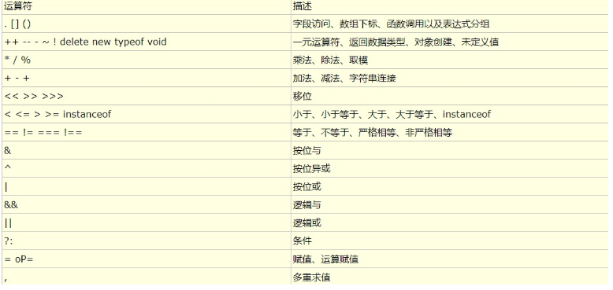

# 今日学习任务


# 01-运算符与表达式


## 1.1-关系运算符和关系表达式

```html
<script>
    /**1.关系运算符（比较运算符）：比较两个数据之间的关系（某种条件是否成立）
        * 八种： >  >=  <  <=  ==  !=  ===全等 !== 不全等
    * 2.关系表达式：由关系运算符组成的式子    例如:  2 > 1
            * 只要是表达式，就会有运算结果
     * 3.关系表达式的结果一定是布尔类型：true代表成立，false代表不成立
     */

    //1.基本使用
    console.log ( 5 > 3 );//true  成立
    console.log ( 100 < 1 );//false 不成立

    //2.相等与不等:只比较数据的值，不比较数据的类型
    //注意：一个 = 号表示赋值运算符  两个 == 是比较运算符，它们作用不一样，不要搞混淆了
     console.log ( 1 == 1 );//true   常用
    console.log ( "1" == 1 );//true  他们的值一样，只是数据类型不一样

    //3.全等不全等： 先比较数据的值，再比较数据的类型
    console.log ( "1" === 1 );//false  两者的值虽然相等都是1，但是他们数据类型不一样，所以不成立


</script>
```


## 1.2-逻辑运算符和逻辑表达式

* 1.逻辑运算符：三种

  * `&&`:逻辑与 ，读作并且

  * `||`:逻辑或，读作或者

  * `!`:逻辑非，读作取反
    * * true（真）变false（假），false（假）变true（真）

* 2.逻辑表达式：`表达式1 逻辑运算符 表达式2`

* 3.运算口诀

  * 逻辑与表达式&&:一假则假
    * 左右两边同时成立，才为真，否则为假
      * 例如：有为青年找女朋友： 白富美：既要白，又要富，还要美。`多个条件需要同时成立`
  * 逻辑或表达式||:一真则真
    * 左右两边同时为假，才为假，否则为真
      * 例如：小资青年找女朋友：要么白，要么富，要么美。`多个条件任意一个成立即可`
  * 逻辑非!:取反
    * 例如：屌丝青年找女朋友：只要不是充气的。 `非xxxx`类似于一种否定逻辑

```html
<script>

    /*  0.关系运算符：一个条件之间的关系（成立与不成立），例如我的年龄大于你的年龄30>20
     * 1.逻辑运算符：多个条件之间的关系
     * 2.逻辑运算符只有三种
        * `&&`:逻辑与 ，读作并且
        * `||`:逻辑或，读作或者
        * `!`:逻辑非，读作取反
            * true（真）变false（假），false（假）变true（真）
     * 3.逻辑表达式:`表达式1 逻辑运算符 表达式2`
     */

    //1.逻辑与&&：左右两边同时成立，才为真，否则为假   口诀：一假为假
    //表达式1    &&  表达式2    运算结果
    //真                        真              真
    //真                         假             假
    //假                         真             假
    //假                         假             假
    console.log ( 100 > 50 && 10 > 9 );//true  左右两边同时成立
    console.log ( 100 > 500 && 10 > 9 );//false   因为左边不成立

    //有为青年找女朋友： 白富美：既要白，又要富，还要美。`多个条件需要同时成立`


    //2.逻辑或 || :左右两边同时为假，才为假，否则为真  口诀：一真则真
    //表达式1    }}  表达式2    运算结果
    //真                        真              真
    //真                         假             真
    //假                         真             真
    //假                         假             假

     console.log ( 100 > 500 || 10 > 9 );//true  只要有一边为真则为真
    console.log ( 100 > 500 || 8 > 9 );//false 只有两边都不成立才为假

    //小资青年找女朋友：要么白，要么富，要么美。`多个条件满足任意一个即可`

    //3.逻辑非！ ： 又叫做取反  真变假 假变真
    //    ！    表达式   结果
    //               假         真
    //                真      假

    var res = !false;
    console.log ( res );//true  假变真，真变假
    console.log ( ! ( 2 > 1 ) );//false     2>1的结果是true    与true相反的就是false

    //屌丝青年找女朋友：只要不是充气的。   `非xxxx`类似于一种否定逻辑


</script>
```


## 1.3-运算符优先级


* **不需要刻意的去记，因为开发中很少会遇到多个运算符参与的式子，万一遇到也可以通过()来提升优先级**




* 运算符优先级：确定不同运算符的运算规则
  * 1.() 小括号：优先级运算符 作用就是提升优先级
  * 2.自增与自减
  * 3.算术运算符（先乘除后加减）
  * 4.比较运算符
  * 5.逻辑运算符
  * 6.赋值运算符
  * 同级运算符从左往右运算

```html
<script>

    var res = 3 + 2 - 5 * 0;
    console.log ( res );//5

    /**运算符优先级：确定不同运算符的运算顺序
     * 1.()      小括号：作用就是提升优先级
     * 2.自增与自减
     * 3.算术运算符（先乘除后加减）
     * 4.比较运算符
     * 5.逻辑运算符
     * 6.赋值运算符
     */

</script>
```


## 1.4-js转义符与逗号运算符(了解即可)


* 转义符： `\` 改变原来符号的作用就叫转义符


```javascript
/**
     * 转义符： `\`  改变原来符号的作用就叫转义符
     *  \" :输出双引号
     *  \t:水平制表符，说人话就是多打几个空格
     *  \n:换行符
     *  \\:显示一个\
     *
     */
    console.log ( "出来混了\\那么多年，从最开始的3万，到后来的五万，最后十五万，\n我也\"没有\"想到\t我最后会欠这么多钱");//出来混了\那么多年，从最开始的3万，到后来的五万，最后十五万，
//我也"没有"想到    我最后会欠这么多钱
```

* 逗号运算符


* 1.逗号运算符: `,`
* 2.逗号表达式:`(表达式1，表达式2，表达式3.............)`
  * 通常与小括号一起使用，逗号用于连接算式，逗号
* 3.运算规则:
  * （1）逗号运算符连接的每一个式子都会执行
  * （2）逗号运算式的结果是最终一个式子的结果

```html
<script>
    /**
     * 1.逗号运算符: ,
     * 2.逗号表达式：(表达式1，表达式2，表达式3.............)
         *  通常与小括号一起使用，逗号用于连接算式，逗号
     *  3.运算规则：
        *  （1）逗号运算符连接的每一个式子都会执行
        *  （2）逗号运算式的结果是最终一个式子的结果
     */

    var n1 = 10;
    var n2 = 20;
    var res = (n1++, n1 + n2);
    //  10/11 ,  11 +  20
    console.log ( res );//31 逗号运算符的结果是最后一个算式的结果
    console.log ( n1 );//11
    console.log ( n2 );//20

</script>
```


# 02-数据类型补充

## 1.1-五种基本数据类型补充


* 1.复习昨天三种基本数据类型
  * string
  * number
  * boolean
* 2.补充说明另外两种基本数据类型
  * undefined类型
    * 只有一个值，就是undefined
    * undefined:未定义,当一个变量有声明，但是没有赋值，那么这个变量的值就是undefined(未定义值)
  * null类型
    * 只有一个值，就是null
    * null这个值只能手动设置，变量在任何时候它的值都不会是null
    * 应用场景：一般用在函数中，表示这个函数返回数据失败 后面阶段会学习
* 3.undefined与null的区别
  * `null == undefined`:成立，他们的值都是空
  * `null === undefined`:不成立，他们的值相等但是数据类型不同


```html
<script>
    /*JS总共有七种数据类型，其中五种基本数据类型，两种复杂数据类型

    昨天：三种基本数据类型
        * string：字符串
        * number：数字
        * boolean：布尔类型  true和false
    今天：另外两种数据类型
        * (1) undefined:只有一个值就是undefined
        * (2) null：只有一个值就是null
        *（3）null与undefined有什么区别
            * null == undefined 成立
            * null === undefined 不成立

     */

    //1.undefined:未定义
    //当一个变量有声明，但是没有赋值，那么这个变量的值就是undefined（未定义）
    var num;
    console.log ( num );//undefined
    console.log ( typeof  undefined );//undefined
    //注意：如果我们直接使用一个没有声明的变量，程序就会报错
    //console.log ( age );//age is not undefined


    //2.null:空值
    //null这个值只能手动设置，变量在任何时候它的值都不会是null
    //应用场景：本阶段暂时用不上，后面阶段会学习
    var a = null;
    console.log ( a );//null
    console.log ( typeof  null );//object

    //3.null与undefined的区别：需要记忆
    console.log ( null == undefined );//true  他们的值都是空
    console.log ( null === undefined );//false  他们的值相等 但是数据类型不同

</script>
```


## 1.2-NaN与isNaN


* 1.NaN：not a number 不是一个数字
  * （1）NaN是number数据类型中一个特殊的数值，是数学计算错误得到的一个结果
    * 例如： `'张三' - 100`,在数学上这是一种错误的计算，它的结果就是NaN
  * （2）NaN与任何数字都不等，包含它本身
  * （3）NaN与任何数字计算得到的都是NaN

* 2.isNaN(数据)：检测一个数据是不是NaN 得到的结果是布尔类型
  * 例如：`isNaN(NaN)`,结果为true
  * 例如：`isNaN(123)`,结果为false，表示123不是NaN
* 3.了解：number类型浮点数（小数）精度丢失问题
  * （1）小数在进行数学计算时，会有一定的误差，这是计算机本身的bug，不仅是js语言，其他语言也有这个问题
  * （2）解决方案：不要让两个小数比较大小，这种情况一般不会影响正常开发

```html
<script>
    /*NaN:  not a number 不是一个数字
       * 1.NaN是number数据类型中一个特殊的数值，是数学计算错误得到的一个结果
       * 2.NaN与任何数字都不相等，包括它的本身
       * 3.NaN与任何数字计算得到的都是NaN
      isNaN(数据):判断一个数据是不是NaN，结果为布尔类型  true：是 false:不是
     */

    //1.NaN:not a number 不是一个数字
    //NaN是number数据类型中一个特殊的数值，是数学计算错误得到的一个结果
    var num = '张三' - 100;//当某个表达式无法计算（计算错误时），会得到NaN
    console.log ( num );//NaN
    console.log ( typeof  NaN );//number

    //2.NaN与任何数字都不等，包含它本身
    console.log ( NaN == 0 );//false
    console.log ( NaN == NaN );//false

    //3.NaN与任何数字计算得到的都是NaN
    console.log ( NaN + 100 );//NaN

    //4.isNaN(数据)：检测一个数据是不是NaN  得到的结果是布尔类型
    console.log ( isNaN ( NaN ) );//true
    console.log ( isNaN ( 123 ) );//false
    //如果检测的数据不是number类型，js编译器会尝试着将这个数据转化为number类型，然后再判断
    //这种数据类型转换称为隐式转换：下一小节讲解
    console.log ( isNaN ( "abc" ) );//true

    //5.（课后了解即可）number浮点数（小数）精度丢失
    //小数在进行数学计算时，会有一定的误差，这是计算机本身的bug，不仅是js语言，其他语言也有这个问题
    //解决方案：不要让两个小数比较大小，这种情况一般不会影响正常开发
    console.log ( 0.1 + 0.2 );//0.300000000000004
    console.log ( 0.1 + 0.2 == 0.3 );//false
    console.log ( 0.4 + 0.5 );//0.9
    console.log ( 1.1 - 0.2 );//0.9000000000000001
</script>
```


# 03-数据类型转换


## 1.1-显式数据类型转换

* ***数据类型的转变并不会改变原来变量的值，而是会产生一个新的值***
* 为什么要有数据类型转换？
  * 有时候想要进行某种计算的时候，由于数据类型不同往往会产生一些错误的结果，为了避免这种结果，我们需要将某种数据类型转化为其他数据类型
    * 例如：prompt()输入框得到的数据的类型是string，如果想要进行数学计算则需要转成number类型，否则会计算出错
* 什么是显示类型转换:程序员主动转换（可以理解为使用关键字来转换）
  * 这种方式代码易读性更高

### 1-其他类型转换成number类型


```javascript

/**转换成number
     * 第一种方式：`parseInt()`
     *          * 作用：转换整数
     *          * 从左往右解析，遇到非数字结束（停止解析），将解析好的整数返回
     *          * 如果第一个字符不是数字或者符号就返回NaN
     * 第二种方式：`parseFloat()`
     *          * 作用：转换小数
     *          * 与parseInt()最大的区别就是可以解析字符串的第一个小数点
     * 第三种方式: `Number()`
               * 作用：布尔类型转换成数字 
     *         * 可以把任意值转换成数值，如果要转换的字符串只要有一个不是数字，返回NaN
     */
    console.log ( Number ( "123" ) );//123
    console.log ( Number ( "123.1.1abc" ) );//NaN  只要有一个字符不是数字，得到就是NaN
    console.log ( parseInt ( "123.1.1abc" ) );//123  从左往右解析，遇到非数字结束
    console.log ( parseFloat ( "123.1.1abc" ) );//123.1  与parseInt唯一的区别就是可以识别第一个小数点

    //一般数字字符串使用parseInt和parseFloat，其他数据类型转数字使用Number（）
    console.log ( Number ( true ) );//1    布尔类型转换number会得到数字0(false)和1（true）
    console.log ( Number ( "" ) );//0  空字符串转number会得到0

```

### 2-其他类型转换成string类型

* 1.第一种方式:`变量名.toString()`
    * 如果变量的值为undefined或者null，则会报错

* 2.第二种方式：`String(变量名)`
    * 与第一种方式的唯一区别就是如果变量的值为undefined或者null不会报错，会得到undefined或者null


```javascript

     /**转换成字符串string
     * 第一种方式：`变量名.toString()`
     *      * 如果变量的值为undefined或者null，则会报错
     *  第二种方式：`String(变量名)`
     *      * 与第一种方式的唯一区别就是如果变量的值为undefined或者null不会报错，会得到undefined或者null
     */
    

    var a = null;

    //1.常用： String (  )
    //特点：可以识别undefined与null
    console.log ( String ( null ) );
    console.log ( typeof String ( a ) );

    // //2.   变量名.toString ()
    //特点：无法识别undefined与null，程序会报错
    console.log ( a.toString () );

```


### 3-其他类型转换成boolean类型

 * 只有一种方式:  `Boolean(变量名)`
    * 官网文档中有八种情况得到的false，其他一切均为true：`0、-0、null、false、NaN、undefined、或者空字符串（""）、 document.all（js下个阶段会接触的东西）`
        * MDN官网:<https://developer.mozilla.org/zh-CN/>
        * 关于Boolean()描述:<https://developer.mozilla.org/zh-CN/docs/Web/JavaScript/Reference/Global_Objects/Boolean>

```javascript

/**转换成boolean
     * 只有一种方式:  `Boolean(变量名)`
     *      * 以下八种情况会得到false，其余的一切数据得到都是true
     *          * 数字0、-0、null、false、undefined、空字符串”“、NaN、document.all(下个阶段东西)
     */

    console.log ( Boolean ( 0 ) );//false
    console.log ( Boolean ( -0 ) );//false
    console.log ( Boolean ( null ) );//false
    console.log ( Boolean ( false ) );//false
    console.log ( Boolean ( undefined ) );//false
    console.log ( Boolean ( '' ) );//false
    console.log ( Boolean ( NaN ) );//false
    console.log ( Boolean ( document.all ) );//false

```

### 知识点小测试

* 请说出下列代码打印的值

```javascript

    var a = 5;
    var b = 0;
    console.log ( a+b );
    console.log ( typeof (a+b) );
    console.log ( a-b );
    console.log ( typeof (a-b) );
    console.log ( a-Boolean(b) );
    console.log ( typeof (a-Boolean(b)) );
    console.log ( Boolean(a)-b );
    console.log ( typeof (Boolean(a)-b) );

```


## 1.4-隐式数据类型转换

`显式转换：程序员主动调用语法去转换数据类型，语义更加明确`

`隐式转换：运算符两边数据类型不一致，编译器自动帮我们转换一致在计算，这是js的语法特点`

* 隐式转换
  * 1.转成string类型：+号两边如果有一边是字符串，则会把另一边转换成字符串，然后进行拼接
  * 2.转成number类型：以下几种运算符会将任何数据转换成number类型再运算，如果无法转换则为NaN
    * 自增自减（++ --）
    * 算术运算符（+ - * / %）
    * 比较运算符(> < >= <= == != === !==)
      * 说明：全等与不全等会先比较值（此时会隐式转换再比较），然后再比较数据类型
  * 3.转成boolean类型：逻辑非（！）会将任何数据转为boolean类型再运算
  * 4.+号有三种含义：数学正负号（转成number）、算术运算符（转成number）、字符串连接符（转成string)

```html
<script>

    // var age = +prompt('班长，请告诉我你的年龄');//prompt得到的是string类型的数据
    //  console.log ( typeof  age );//string
    //  var age5 = age + 5;
    //  console.log ( "班长，五年之后你" + age5 + "岁" );

    /*隐式类型转换：运算符在运算时，如果两边数据类型不一致，编译器会先转换数据类型进行运算
     */
     console.log ( "10" - 1 );//9

    //1.其他数据类型转换成number

    //1.1 [推荐使用]： 数学正号+
    // 当+号写在一个数据的前面时，此时+号表示数学正号，可以把其他数据类型转成number类型
    console.log ( + "123" );

    //1.2 算术运算符
    var res = true + 0;//注意，这里+号还是算术运算符（不要和字符串连接符搞混淆：+号任何一边是字符串）
    console.log ( res );//1
    console.log ( "10" - 1 );//9


    //2.其他数据类型转换成string
    //就是使用+号连接符，连接空字符串
    var num1 = 10;
    var res1 = num1 + "";
    console.log ( res1 );
    console.log ( typeof res1 );

    //3.其他数据类型转布尔类型
    //逻辑非运算符： !
    console.log ( ! undefined );//true   （1）Boolean(undefined) 得到 false  (2)!false 得到 true
    console.log ( !! "10" );//true

</script>
```

# 课后拓展：计算机进制了解

* 一般情况下，我们写的数字都是十进制，而且其他进制在使用时极少，所以只做了解即可
  * 在js代码中我们在数字的前面加上进制标识符表示进制
    * 二进制标识符:`0b`
    * 八进制标识符：`0`
    * 十进制无标识符：默认进制
    * 十六进制标识符：'0x'
* 例如：现在有一个数字是188，分别用不同的进制表达

```javascript
//分别用不同进制表示数字188
    //二进制
    var bin = 0b10111100;
    //八进制
    var oct = 0274;
    //十进制
    var dec = 188;
    //十六进制
    var hex = 0xbc;
    console.log ( bin, oct, dec, hex );
```

* 二进制：0、1

  * ```
    1011 1100
    ```

    : 从左往右分别代表

    ```
    pow(2,7) * 1
    ```

    ,

    ```
    pow(2,6) * 0
    ```

    ,

    ```
    pow(2,5) * 1
    ```

    ,

    ```
    pow(2,4) * 1
    ```

    ,

    ```
    pow(2,3) * 1
    ```

    ,

    ```
    pow(2,2) * 1
    ```

    ,

    ```
    pow(2,1) * 0
    ```

    ,

    ```
    pow(2,0) * 0
    ```

    * 结果：128 + 0 + 32 + 16 + 8 + 4 = 188

* 八进制：0、1、2、3、4、5、6、7

  * ```
    274
    ```

    :从左往右分别代表

    ```
    pow(8,2) * 2
    ```

    ,

    ```
    pow(8,1) * 7
    ```

    ,

    ```
    pow(8,0) * 4
    ```

    * 64*2 + 8*7 + 1*4 = 188

* 十进制：0、1、2、3、4、5、6、7、8、9

  * ```
    188
    ```

    :从左往右分别代表

    ```
    pow(10,2) * 1
    ```

    ,

    ```
    pow(10,1) * 8
    ```

    ,

    ```
    pow(10,0) * 8
    ```

    * 100*1 + 10*8 + 1*8 = 188

* 十六进制：0、1、2、3、4、5、6、7、8、9、a、b、c、d、e、f

  * ```
    BC
    ```

    :从左往右分别代表

    ```
    pow(16,1) * 11
    ```

    ,

    ```
    pow(16,0) * 12
    ```

    * 16*11 + 1*12 = 188


# 05-今日学习总结与课后作业


## 学习总结

* 1.运算符与表达式

  * 1）关系运算符：比较两个数据之间的关系（是否满足某种条件）
    * **结果一定是布尔类型，要么成立要么不成立**
    * `> >= < <= == != === !===`
    * 相等:== 只是比较值是否相等
    * 全等：=== 不仅要值相等，数据类型也要相等
  * 2）逻辑运算符：多种条件之间的关系
    * 逻辑与&&:一假则假
    * 逻辑或||:一真则真
    * 逻辑非！：取反，假变真，真变假
  * 运算符的优先级：确定不同运算符的运算顺序
    * 1.() 小括号： 作用就是提升优先级
    * 2.自增与自减
    * 3.算术运算符（先乘除后加减）
    * 4.比较运算符
    * 5.逻辑运算符
    * 6.赋值运算符
      * 同级运算符从左往右运算

* 2.五种基本数据类型补充

  * string

  * number

  * boolean

  * undefined：只有一个值undefined

    * 当变量只声明，未赋值的时候，它的默认值是undefined（未定义）

  * null：只有一个值null，在打印的时候数据类型是object

    * 只能手动设置，变量在任何情况下它的值都不会是null

  * undefined与null的区别

    * ```
      undefine == null
      ```

      :成立，因为两者都代表空值。

      * undefine：表示变量只声明，未赋值
      * null：表示变量的值是空

    * ```
      undefined === null
      ```

      ：不成立

      * undefined的数据类型是undefined
      * null的数据类型是object

* .3.显示数据类型转换:开发者主动转换

  * string
    * `变量名.toString()`:如果变量的值为undefined或者null，则会报错
    * `String(变量名)`:与第一种方式的唯一区别就是如果变量的值为undefined或者null不会报错，会得到undefined或者null
  * number
    * `Number(变量名)`:可以把任意值转换成数值，如果要转换的字符串中有一个不是数值的字符，返回NaN
    * `parseInt(变量名)`：只能得到整数，从左往右依次解析，遇到非数字结束
    * `parseFloat(变量名)`：可以得到整数或者浮点数，与parseInt()最大的区别就是可以解析字符种的第一个小数点
  * boolean
    * `Boolean(变量名)`:除数字`0、-0、undefined、null、flase、""、NaN、document.all()`这八种情况为假之外，其他所有一切皆为真

* 4。隐式数据类型转换:运算符两边数据类型不一致时，编译器自动转换成一致再运算

  * 1.转成string类型：+号两边如果有一边是字符串，则会把另一边转换成字符串，然后进行拼接
  * 2.转成number类型：以下几种运算符会将任何数据转换成number类型再运算，如果无法转换则为NaN
    * 数学正号 +
    * 算术运算符（+ - * / %）
      * 包含自增自减（++ --）
  * 3.转成boolean类型：逻辑非（！）会将任何数据转为boolean类型再运算
  * 4.+号有三种含义：数学正负号（转成number）、算术运算符（转成number）、字符串连接符（转成string)

## 课后作业

* 1.接收用户输入的身高（178.2），并转成 浮点数，在此基础上 + 2，最后打印到控制台。
* 2.var numLove = parseInt("   520  1314")  执行后 numLove 的值是什么？
* 3.var num = parseInt("12.3abc")  执行后 num 的值是什么？
* 4.Boolean()函数能把那些数据 转成 false.
* 5..下面代码中 res 结果为？

```javascript
   var a = 5;
    var b = 0;
    console.log ( a+b );
    console.log ( typeof (a+b) );
    console.log ( a-b );
    console.log ( typeof (a-b) );
    console.log ( a-Boolean(b) );
    console.log ( typeof (a-Boolean(b)) );
    console.log ( Boolean(a)-b );
    console.log ( typeof (Boolean(a)-b) );
```

