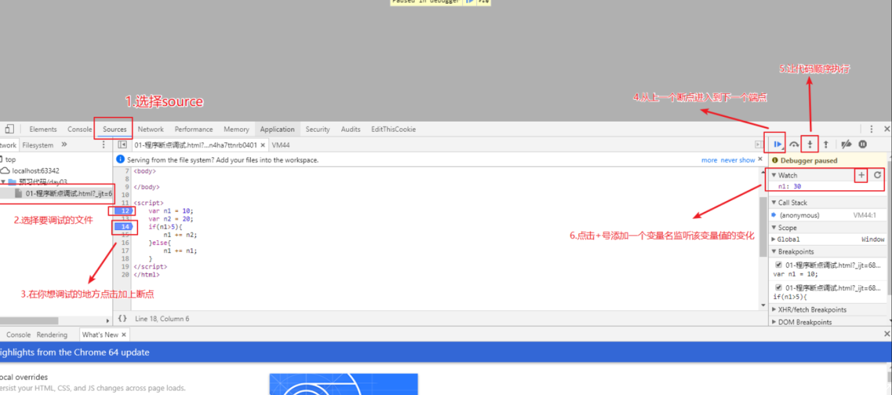

# 01-分支结构（3种语法）

`分支结构作用：代码根据条件执行`

* 为什么要有分支结构？
  * 现实世界中，我们在做某些事情的时候是有前提条件的，例如：我明天去买一辆法拉利，前提是我今晚要中五百万
    * 也就是说：如果我今晚中了五百万，明天就去买法拉利，没中的话就不买

## 1.1-if单分支结构

* 1.if结构语法：`if(条件 true/false){ 条件成立时需要执行的代码 }`
* 2.if结构补充说明：
  * 1.大括号中可以是任何代码，不限数量
  * 2.如果大括号中代码有且只有一行，则可以省略大括号。这种写法代码不规范，不是老司机的作风
* 3.注意点:小括号中的条件可以是哪些呢
  * (1)关系表达式：结果一定是布尔类型
  * (2)布尔类型的值：true和false
  * (3)其他表达式和值：都会先转换成布尔类型再判断真和假

```javascript
  //只有满足if()小括号中的条件才会执行大括号中的语句，否则不执行
  if(条件  true/false){条件成立时需要执行的代码}
<script>

    //1.默认情况下，代码是从上往下执行的（顺序结构）
    // console.log ( "我今天考试了" );
    // console.log ( "我回家了" );
    // console.log ( "我被爸爸打了" );
    // console.log ( "我睡觉了" );

    //需求：考试不及格爸爸才打我，及格了就不打

    //2.if分支结构：根据条件来执行代码

    /**if结构语法
       if ( 条件   true/false ){ 
            条件成立时需要执行的代码
        }
     */

    //示例1
    if(1>0){
        console.log ( "我被执行了" );
    }
    console.log ( "111" );//只有大括号内的代码才是根据条件执行的，大括号后面的代码还是顺序执行

    //需求实现
    var score = 80;
    console.log ( "我今天考试了" );
    console.log ( "我回家了" );
    if(score < 60){
        console.log ( "爸爸打了我一顿" );
    }
    console.log ( "我睡觉了" );

    //注意点：小括号中的条件可以是哪些呢
    /*[最常用]关系表达式：结果一定是布尔类型
    布尔类型的值：true和false
    其他表达式和值：都先转换成布尔类型再判断真会和假
     */
    var num = 10;
    if(num){//num是10，转换成布尔类型是true，所以会执行大括号代码
        alert('呵呵');
    }

</script>
```

## ==1.2-if-else双分支结构==

```javascript
if（条件）{
    条件成立时需要执行的代码
}else{
    条件不成立时需要执行的代码
}
```

* 1.if-esle结构语法:用于两种互斥的条件判断
  * 例如：如果(if)我的钱超过100块就洗脚(也就是说钱>=100)，否则(else)不洗脚（也就是说钱<100）
* 2.if-else结构注意点
  * **if大括号中的代码与else大括号的代码只会执行一个，不会同时执行**
* **if-else语句的作用主要就是为了提高代码的运行效率,虽然可以用两个if语句来代替if-else语句，但是两个if语句需要判断两次，而if-else只需要判断一次**

```html
<script>
    //需求：(1)如果不及格，爸爸就打我 (2)如果及格，爸爸给我买奥迪

    //1.用if实现
    var score = 80;
    console.log ( "我今天考试了" );
    console.log ( "我回家了" );
    if(score >= 60){//及格
        console.log ( "爸爸给我买了一辆奥迪" );
    }
    if(score < 60){
        console.log ( "爸爸打了我一顿" );
    }
    console.log ( "我睡觉了" );

    //（最常用的）互斥条件：两个条件无论如何只会满足一个，不会同时满足
    //2.if-else结构：用于两个互斥的条件
    //优点：只需要一次判断
    /*语法
    if(条件){
        条件成立时需要执行的代码
    }else{
        条件不成立时需要执行的代码
    }
     */

    var score = 80;
    console.log ( "我今天考试了" );
    console.log ( "我回家了" );
    if(score >= 60){//及格
        console.log ( "爸爸给我买了一辆奥迪" );
    }else{
        console.log ( "爸爸打了我一顿" );
    }

    console.log ( "我睡觉了" );

    //if-else结构注意点：if大括号中的代码与else大括号的代码一定会执行一个，不会同时执行
    //世界上最遥远的距离不是生与死，而是我在if里，你在esle里，看起来那么近却永远不能在一起
    if(5 > 3){
        alert('执行了if中的语句')
    }else{
        alert('执行了else中的语句');
    }
</script>
```


## 1.3-if-else if-else多分支结构

* 1.if-else if-else结构语法：

```javascript
if(条件1){
    条件1成立时需要执行的代码
}else if(条件2){
    条件2成立时需要执行的代码
}else if(条件3){
    条件3成立时需要执行的代码
}else{
    以上所有条件都不成立时需要执行的代码
}
```

* 2.注意点：
  * (1) if-else if -else结构中必须以if开头，中间的else if可以是多个，末尾的esle可以省略（一般都不会省略）
  * **(2)if-else if-else语句中所有的大括号中的代码只会执行其中一个，不会执行多个**

```html
<script>

    //需求：(1)如果不及格，爸爸就打我 (2)如果60-70，爸爸给我买奥迪 （3）如果70-80分，爸爸给我买保时捷
    //(4)如果超过80分，爸爸给我买法拉利

    /**
     * if-elseif-else结构语法：用于多种条件判断

      if(条件1){
            条件1成立时需要执行的代码
      }else if(条件2){
            条件2成立时需要执行的代码
      }else if(条件3){
            条件3成立时需要执行的代码
      }else{
            以上所有条件都不成立时需要执行的代码
      }

     * 注意点：
        * (1) if-else if -else结构中必须以if开头，中间的else if可以是多个，末尾的esle可以省略（一般都不会省略）
        * (2)if-else if-else语句中所有的大括号中的代码最多只会执行一个，不会执行多个

     */

    var score = 50;
    console.log ( "我今天考试了" );
    console.log ( "我回家了" );

    if(score >= 80){
        console.log ( "爸爸给我买了一辆法拉利" );
    }else if(score >= 70){//隐藏条件: score < 80
        console.log ( "爸爸给我买了一辆保时捷" );
    }else if(score >= 60){//隐藏条件: socre < 70
        console.log ( "爸爸给我买了一辆奥迪" );
    }else{//隐藏条件： score < 60
        console.log ( "爸爸打了我一顿" );
    }

    console.log ( "我睡觉了" );


</script>
```


## 1.4-switch-case分支结构

* 1.语法

```javascript
switch(表达式){
    case 值1:
        表达式的结果 === 值1，需要执行的代码
        break;
    case 值2:
        表达式的结果 === 值2，需要执行的代码
        break;
    case 值3：
        表达式的结果 === 值3，需要执行的代码
        break;
    .......
    default:
        表达式的结果和上面所有的case后面的值都不全等，则会执行这里的代码
        break;
}
```

* `2.注意事项
  * 1.表达式的结果要和值一定是全等的关系===
  * 2.break作用：结束该switch语句，所以一般情况下要加上，如果不加上则会发生穿透
    * 穿透：从上一个case代码快执行到下一个case代码快
    * break关键字的作用就是防止穿透
  * 3.default语句可以写在任何地方，也可以省略，但是一般写在最后，这是一种代码规范

```html
<script>
    /**
     switch-case分支结构：常用于值匹配
        * 匹配：全等的关系

     * switch(表达式){
            case 值1:
                表达式的结果 === 值1，需要执行的代码
                break;
           case 值2:
                表达式的结果 === 值2，需要执行的代码
                break;
           case 值3：
                表达式的结果 === 值3，需要执行的代码
                break;
            .......
           default:
                表达式的结果和上面所有的case后面的值都不全等，则会执行这里的代码
                break;
        }

    /**switch语句注意事项
     * 1.表达式的结果要和值一定是全等的关系===
     * 2.break作用：结束该switch语句，所以一般情况下要加上，如果不加上则会发生穿透
     *      * 穿透：从上一个case代码快执行到下一个case代码快
     *      * break关键字的作用就是防止穿透
     *  3.default语句可以写在任何地方，也可以省略，但是一般写在最后，这是一种代码规范
     */

    //示例：用户输入黑马学科编号，告诉用户学习什么学科  1-前端  2-PHP  3-java  4-UI
    var subject= +prompt("请输入您要报名的学科编号，1-前端  2-PHP  3-java  4-UI");

    switch (subject){
        case  1:
            alert("恭喜你选择了2018年最有钱途的学科！");
            break;
        case  2:
            alert("臭流氓，居然选择了拍黄片这种猥琐的学科");
            break;
        case  3:
            alert("Java妹子少，请做好搞基准备");
            break;
        case  4:
            alert("未来的UI视觉交互设计师");
            break;
        default :
            alert("脑子有包");
            break;
    }
</script>
```

## 1.5-switch-case穿透用法

* 合理穿透：多种值需要执行相同代码

```html
<script>
    /**合理穿透：当存在多种值需要执行相同代码时使用穿透可以节省代码
     * 用户输入某一个月份，告诉用户这个月份属于什么季节
     * 12，1，2 冬季
     * 3，4，5 春季
     * 6，7，8 夏季
     * 9，10，11 秋季
     */
    var month = +prompt("请输入月份");
    switch (month){
        case 12:
        case 1:
        case 2:
            alert("冬季");
            break;
        case 3:
        case 4:
        case 5:
            alert("春季");
            break;
        case 6:
        case 7:
        case 8:
            alert("夏季");
            break;
        case 9:
        case 10:
        case 11:
            alert("秋季");
            break;
        default:
            alert("你来自火星吧？");
            break;
    }

</script>
```

## 1.6-三元表达式

* 1.运算符根据参与运算的值数量分为一元、二元、三元运算符

  * 一元运算符：只能操作一个值 ++ -- ！
  * 二元运算符：操作两个值 1 + 1 1 > 0
  * 三元运算符：操作三个值

* 2.三元运算符语法

  * 三元运算符： `?:`

  * 三元表达式：

     

    ```
    表达式?代码1：代码2
    ```

    * 1.如果表达式成立则执行代码1，否则执行代码2
    * 2.如果代码1或者代码2有运算结果则三元运算式的结果就是他们其中的一个

  * 三元运算符做的事和if-else类似，只是代码更简洁

```html
<script>
    /*
    一元运算符：由一个值参与的运算符  ：  a++    a--  !a
     二元运算符：  由两个值参与的运算符 ：  a + b   a > b
     三元（三目）运算符：由三个值参与的运算符
    */

    /*
     * 三元运算符：  ?:
     * 三元表达式：   表达式?代码1：代码2
     *      * 1.如果表达式成立则执行代码1，否则执行代码2
     *      * 2.如果代码1或者代码2有运算结果则三元运算式的结果就是他们其中的一个
     *
     * 三元运算符做的事和if-else类似，只是代码更简洁
     */

    //案例1:
    var num1 = 10;
    num1 > 0?console.log('哈哈'):console.log('呵呵');

    //上面这个三元表达式等价于下面的if - else语句
    // if(num1 > 0){
    //     console.log ( "哈哈" );
    // }else{
    //     console.log ( "呵呵" );
    // }

    //案例2：
    var num2 = 20;
    var res2 = num2 > 0?num2 + 1 : num2 - 1;
    console.log ( res2 );//21

    //上面这个三元表达式等价于下面的if - else语句
    // if(num2 > 0){
    //     res2 = num2 + 1;
    // }else{
    //     res2 = num2 - 1;
    // }

    //练习：输出性别  （实际开发中，性别通常会使用一个布尔类型来存储，这样存储效率更高）
    var name = "林利群";
    var age = 38;
    var gender = true;      //true男 1         false女 0
    console.log("我的名字是"+name+"，我的年龄是"+age+"，我是一个"+(gender == true ? "男":"女")+"生");


</script>
```


## 1.7-三种分支结构语法总结

* 1.原则上，三种分支结构语句之间可以互转，只不过每一种分支结构语句适用场景不一样
* 2.if分支结构：适合条件判断
  * 最常用：if-else 两种互斥条件判断
* 3.switch-case 适合做固定值匹配
* 4.三元表达式： 比if-else代码更简洁，但是代码量较多时易读性变差


## 课后代码调试介绍

* 本小节主要介绍
* 1.程序出错的原因
* 2.代码调试好处
* 之前我们的调试方式主要通过打印变量的值来查看代码是否出现问题，这是js中最简单基本的调试
  * alert();
  * console.log();
* 断点调试:断点调试是指自己在程序的某一行设置一个断点，调试时，程序运行到这一行就会停住，然后你可以一步一步往下调试，调试过程中可以看各个变量当前的值，出错的话，调试到出错的代码行即显示错误，停下
* **1.断点调试是一种非常经典的调试方法，在其他编程语言中也经常使用这种调试方法，只不过不同的语言使用的工具不同而已**
  * **前端开发中的js代码主要使用谷歌浏览器的开发者工具进行断点调试**
* 2.代码调试的能力非常重要，只有学会了代码调试，才能学会自己解决bug的能力。初学者不要觉得调试代码麻烦就不去调试，知识点花点功夫肯定学的会，但是代码调试这个东西，自己不去练，永远都学不会。
* 3.今天学的代码调试非常的简单，只要求同学们记住代码调试的这几个按钮的作用即可，后面还会学到很多的代码调试技巧。
* 使用步骤
* 1.浏览器中按F12进入开发者控制台
* 2.选择sources找到要调试的文件



```html
<script>
    //1.程序报错：浏览器停止工作，后面的代码都不会执行
    //程序报错在js中主要有两个原因
    //1.1  语法错误
    //var var = 10;//报错：变量命名不符合规则
    //consol.log('111');//报错：关键字单词拼写错误

    //1.2  数据类型错误
    //console.log ( abc );//abc既不是变量，也不是直接量（符合数据类型的数据）

    //2.程序bug：程序能够正常运行，但是产生的结果达不到预期的要求
    //产生原因：代码不熟悉，粗心大意，逻辑不严谨
    //需求：弹出一个确认框
    //prompt();//写成了弹出一个输入框

    //3.代码调试：  打断点
    //F12 - source -  可以选择某一句话前面打上断点
    /*好处：（1）可以逐行的检查代码执行的顺序
    （2）可以随时查看一个变量的值，有利于分析代码（鼠标放到变量上自动显示）
     */
    var num = 10;
    num++;
    num++;
    if(num++ >= num++){
        console.log ( "你猜我执不执行？" );
    }
    console.log ( num );

</script>
```


# 02-今日学习总结及课后作业


## 学习总结

* if分支结构：适合范围判断
  * if语句：适合一种情况判断
  * if-else:适合两种互斥情况判断
  * if-else-if：适合多种情况判断
  * **注意点：if分支结构中的大括号代码只会执行一个，不会执行多个**
* switch分支结构：适合固定值匹配（全等关系）
  * break关键字作用：结束witch语句，防止穿透
  * 合理穿透：当多种值需要执行相同的代码时
  * default：如果表达式的结果没有任何一个值匹配，那么就执行default里面代码块
* 三元运算符: `表达式?代码1:代码2`
  * 表达式如果不是布尔类型，则会转换成布尔类型来判断真假
  * 代码1或者代码2如果有运算结果，那么三元表达式的结果就是他们的值

## 课后作业

* 1.请用户输年份，输出该年是平年还是闰年。 （★）
  * 闰年的计算方法：能被400整除 或者 能被4整除且不能被100整除
  * if（   （year % 400 == 0）|| （   year % 4 == 0 && year % 100 != 0  ）    ）{ 闰年 }else{ 平年 }
* 2.请用户输入年份和月份，打印出这个月有多少天（★）
  * 1，3，5,7,8,10,12月有31天
  * 4,6,9,11有30天
  * 2月，如果是平年就是28天，闰年就是29天
* 3.请用户输入1个星期数. 就将对应的英文的星期打印出来. 英文自己查有道.1 monday 2 tuesday（★）
* 5.要求用户输入两个数a、b，如果a能被b整除或者a加b大于100，则输出a的值，否则输出b的值（★）
* 6.编一个程序，从键盘上输入三个数，把最大数找出来。（★★）
  * 不能用Math.max
  * 要自己用if-else来判断
    * 难度提升：也可以尝试分别用三种分支结构来实现,仅当锻炼自己的逻辑思维
* 7.接收用户输入的分数，根据分数输出对应的等级字母 A、B、C、D、E。其中：（★）
   a. 90分(含)以上 ，输出：A；
     	b. 80分(含)~ 90 分(不含)，输出：B；
     	c. 70分(含)~ 80 分(不含)，输出：C；
     	d. 60分(含)~ 70 分(不含)，输出：D；
     	e. 60分(不含) 以下，输出 E。
* 8.拯救网瘾少年
  * （1）弹出输入框，让用户输入年龄
  * （2）如果年龄在18岁以上，就打印“这个网站可以给你看
  *  （3）如果年龄在14-18岁中间， 就用 选择框 询问是否真的要继续查看    （var a = confirm() -> 返回 bool）
    * 如果用户按的是确认，就提示‘给你看了，后果自负’ 
    * 如果用户按的是取消，就提示‘好孩子，不看也好
  * （4）如果年龄在14岁以下，就提示‘sorry，请回家找妈妈’。