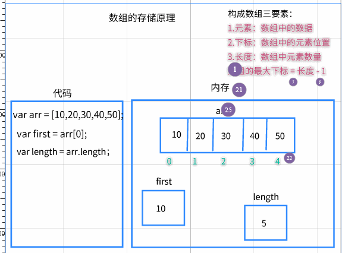
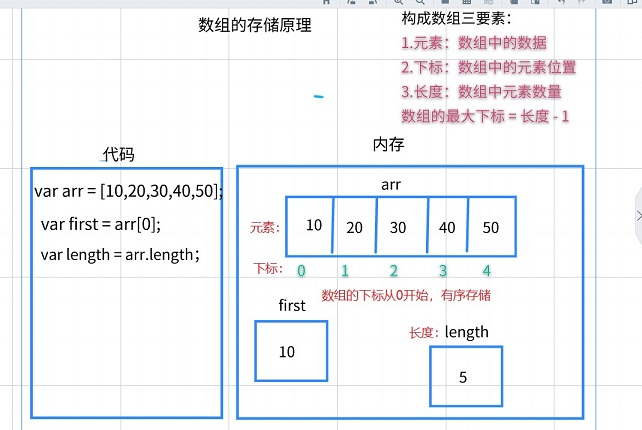
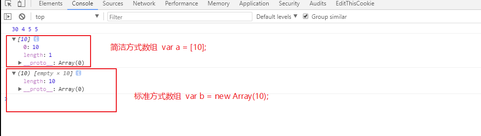
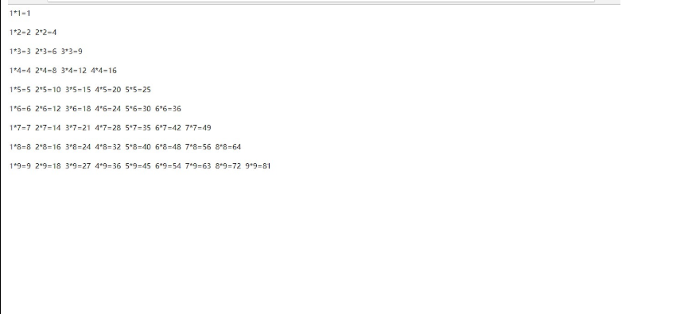

# ==01-数组(语法学习)==

`数组作用：一个变量存储多个数据`

## 1.1-数组介绍

* 1.声明一个数组：`var 数组名 = [元素1，元素2，元素3…………]`

  * 数组名其实就是变量名，只是习惯上称之为数组名
  * 元素其实就是数组中保存的数据，只是习惯上称之为元素

* 2.获取数组中某一个数据:`数组名[下标]`

* 3.获取数组中元素的数量:`数组名.length`

* 4.总结：数组主要由三要素构成

  * 元素：数组中的数据
  * 下标：元素在数组中的位置(从0开始按照顺序递增)
  * 长度：数组中元素的数量

  ```javascript
   //吉泽老师有五位关门大弟子，一次考试将这五位弟子的分数存储起来(25,98,100,89,88)
  
      //使用多个变量弊端：（1）代码冗余 （2）不便于维护
      // var s1 = 25;
      // var s2 = 98;
      // var s3 = 100;
      // var s4 = 89;
      // var s5 = 99;
  
      //数组：数据的组合，一个变量可以存储多个数据
  
      //1.声明数组  语法： var 数组名 = [元素1，元素2，元素3]
      var array = [25,98,100,89,99,5];
      console.log ( array );//
  
      //2.下标：记录元素的位置   注意：数据中元素的下标是从0开始
      //可以获取数组中的元素  语法：  数字名[下标]
  
      console.log ( array[ 0 ] );
      var a = array[0];//将数组中的第一个元素存储到变量a中
      console.log ( a );
  
      //3.长度：数组中元素的数量
      //语法：数组名.length
      console.log ( array.length );//6
  ```





 

## 1.2-数组取值与赋值

* 1.取值：`数组名[下标]`

  * 取第一个元素:

    ```
    数组名[0]
    ```

    * 下标从0开始

  * 取最后一个元素:

    ```
    数组名[数组名.length - 1]
    ```

    * 最后一个元素下标（最大下标） = 长度 - 1

  * 如果下标超过数组最大下标，得到的是undefined

* 2.赋值：`数组名[下标] = 值`

  * 如果下标有对应的值，会把原来的值覆盖
  * 如果下标不存在，会给数组新增元素

```html
<script>
    /**
     * 数组取值：  `数组变量名[下标]`
     *      * 1.数组的下标是从0开始的
     *      * 2.数组的最大下标 = 长度 - 1
     *      * 3.如果数组的的下标超过最大下标时，则得到undefined
     *
     * 数组赋值：`数组变量名[下标] = 值;`
            * 1.：如果下标有对应的值，会把原来的值覆盖
            * 2.如果下标不存在，会给数组新增一个元素，并且数组的长度发生变化
     */

    //下标的作用：数组的取值与赋值
    //数组的下标是从0开始的

    var arr = [20,65,78,90];

    //1.数组的取值: 数组名[下标]

    //a.如果没有超过最大下标：获取该下标对应元素的值
    console.log ( arr[ 2 ] );//78 第三个元素的值
    console.log ( arr[ 0 ] );//20 第0个元素

    //b.如果取值下标超出最大下标则会得到undefined
    console.log ( arr[ 4 ] );//undefined

    //2.数组的赋值   语法：数组名[下标] = 值

    //a.如果没有超过最大下标：则将旧值给覆盖
    arr[0] = 100;//将100这个值赋给数组的第1一个元素
    console.log ( arr );

    //b.如果超过最大下标：则将往数组后面添加元素（用法不多）
    arr[5] = 88;
    console.log ( arr );
    console.log ( arr[ 4 ] );

    //数组赋值用的最多的是往数组后面只添加一个元素


</script>
```

## 1.3-数组长度

* 1.获取数组的长度:`数组名.length`
* 2.修改数组的长度会改变数组的元素数量:`数组名.length = 值`
* 3.删除数组的最后一个元素:`数组名.length--`

```html
<script>
    /*获取数组的长度：数组中数据（元素）的个数
    获取：数组名.length
    赋值：  数组名.length = 值
        * 改变数组的长度会改变数组的元素数量
     */

    //1.往数组后面添加一个元素
    var arr = [10,20,30,40];
    arr[arr.length] = 50;//arr.length = 最大下标 + 1
    console.log ( arr );//[10,20,30,40,50]

    //2.删除数组最后的一个元素
    arr.length--;//长度-1，相当于把最后一个元素删除了
    console.log ( arr );//[10,20,30,40]

    //3.设置数组的长度会修改数组的元素
    arr.length = 2;
    console.log ( arr );//相当于只保留前面两个元素，后面元素全部被删除了
</script>
```

## 1.4-数组遍历

* 1.数组的遍历：获取数组中每一个元素的值，称之为遍历该数组
  * 如果想要获取数组中每一个元素的值，则需要通过循环语法来获取
* 2.一般使用for循环来遍历数组，只不过数组的遍历是一种固定格式的for循环
* 3.固定循环语句格式:`for(var i = 0; i < arr.length; i++) {// 数组遍历的固定结构}`
  * 思考：为什么循环变量var i = 0 而不是1呢？

```html
<script>

    /**
     * * 1.数组的遍历：获取数组中每一个元素的值，称之为遍历该数组
     *          * 如果想要获取数组中每一个元素的值，则需要通过循环语法来获取
     *    2.一般使用for循环来遍历数组，只不过数组的遍历是一种固定格式的for循环
     *    3.固定循环语句格式:
     *    `for(var i = 0; i < arr.length; i++) {
     *    // 数组遍历的固定结构
     *    }`
     */

    var arr = [10,20,30,40,50];

    for(var i = 0;i<arr.length;i++){
        var element = arr[i];//获取数组的每一个元素
        console.log ( element );
    }
</script>
```


## 1.5-数组另一种声明方式

* 1.简洁方式:`var 数组名 = [元素1，元素2，元素3，……]`
  * 最常用
* 2.标准方式：`var 数组名 = new Array(元素1，元素2，元素3……)`
* 3.两种方式唯一区别：创建时如果数组的元素只有一个时含义不同
  * 简洁方式：`[10];` 代表数组长度为1，元素是10
  * 标准方式：`new Array(10);` 代表数组长度为10，没有元素
  * 

```javascript
/**
     * js中复杂的数据类型在初始化的编译器要做的事情远多于基本数据类型
     * 所以为了方便开发者，ECMAJavascript为负责数据类型提供了简洁的创建方式
     *
     * 数组的创建方式有两种:
     *      * 简洁方式：[]
     *      * 标准方式： new Array()
     *      * 它们最大的区别就是创建时如果数组的元素只有一个时含义不同
     *          * 简洁方式：[10]; 代表数组长度为1，元素是10
     *          * 标准方式：new Array(10)； 代表数组长度为10，没有元素
     */
//1.创建一个空数组

//1.1简洁方式：最常用
var nums = [];
//1.2 标准方式
var array = new Array();

//2.创建有多个元素的数组
//2.1 简洁方式
var nums1 = [10,20,30,40,50];//创建一个长度为5的数组，元素分别为10，20，30，40，50
//2.2 标准方式
var array1 = new Array(10,20,30,40,50);//创建了一个长度为5的数组，元素分别为10,20,30,40,50
//2.3 这两种方式只是创建的区别，取值和获取长度都是一致
console.log ( nums1[ 2 ], array1[ 3 ]);
console.log ( array1.length, nums1.length );

//3.创建只有一个元素的数组
//3.1简洁方式
var nums2 = [10];//创建一个长度为1的数组，元素是10
var array2 = new Array(10);//创建一个长度为10的数组，没有元素。这是一个空数组
console.log ( nums2 );
console.log ( array2 );
```

# 02-数组练习

## 1.1-数组练习1

```html
<script>
    /*1.求数组中元素的平均值
    2.求数组中元素的最大值
    3.求数组中元素的最小值
    3.将1-100中3的倍数放入数组中
     */

    var arr = [50,88,25,60,45];

    //1.求数组中所有元素的平均值
    var sum = 0;
    for(var i = 0;i<arr.length;i++){
        sum += arr[i];
    }
    console.log ( sum / arr.length );//平均数

    //2.求数组中元素最大值
    //打擂台思想
    var max = - Infinity;
    for(var i = 0;i<arr.length;i++){
        if(max <= arr[i]){
            max = arr[i];
        }
    }
    console.log ( max );

    //3.求数组中元素最小值
    var min =  Infinity;
    for(var i = 0;i<arr.length;i++){
        if(min >= arr[i]){
            min = arr[i];
        }
    }
    console.log ( min );

    //4.将1-100之间3的倍数放入数组中
    var arrar = [];//定义个空数组
    for(var i = 1;i<101;i++){
        if(i % 3 == 0){
            arr[arr.length] = i;//往数组后面添加元素
        }
    }

</script>
```

## 1.2-数组练习2

```html
<script>
    /*1.翻转数组
    2.斐波那契数列
     */

    //1.翻转数组 
    var arr = [90,88,20,100,5];//翻转之后：[5,100,20,88,90]
    // console.log ( arr );
    //1.倒着对数组遍历
    var newArr = [];
    for(var i = arr.length - 1;i>=0;i--){
        console.log ( arr[ i ] );
        //2.将倒着遍历的元素按照顺序添加到新数组中
        newArr[newArr.length] = arr[i];
    }
    console.log ( newArr );

    //1.2  将数组首尾元素的值互换
    for(var i = 0;i<arr.length/2;i++){
        console.log ( arr[ i ] );
        //交换首尾元素的位置
        //交换arr[i]和arr[arr.leth-1 - i]这两个元素的值
        var temp = arr[i];
        arr[i] = arr[arr.length-1 - i];
        arr[arr.length-1 - i] = temp;
    }
    console.log ( arr );

    //2.斐波那契阿数列:1,1,2,3,5,8,13,21,34,55.....   求第十位数字是几？
    //特点:从第三个数字开始，每一个数字是前两个数字的和

    var fibNum = [1,1];

    for(var i = 2;i<10;i++){//i=2 是因为从下标为2的数字开始 才是  前面两个元素的和
        fibNum[i] = fibNum[i-1] + fibNum[i-2];
    };

    console.log ( fibNum );
    console.log ( fibNum[ fibNum.length - 1 ] );//数组中最后一个元素

</script>
```

## 1.3-数组练习3

 

```javascript
/**1.目前阶段的学习中，我们仅能做一些静态网页，也就是说所有的数据都是写死的
     * 2.实际开发中，我们通常会使用js代码从服务器请求数据加载到网页中，而这些数据通常都是数组
     * 3.本小节我们来学习如何根据数组的内容来产生网页的结构
     */

        //1.请求服务器，得到一个数组的数据
    var books = [ "C语言从入门到放弃", "编程之道：从程序员到卖烧烤", "颈椎病治疗指南", "JavaScript权威指南" ];

    //2.生成外层的ul标签
    document.write ( "<ul>" );
    //3.根据数组内容生成内层li标签
    for ( var i = 0 ; i < books.length ; i ++ ) {
        document.write ( "<li>" );
        document.write ( books[ i ] );
        document.write ( "</li>" );
    }
    document.write ( "</ul>" );
```

# 03-循环嵌套

`嵌套循环：一个循环中嵌套另一个循环`

* 嵌套循环执行的总次数 = 外层循环执行次数 * 内层循环执行次数

## 1.1-循环嵌套介绍

```html
<script>
    /**
     * 循环的嵌套：一个循环中嵌套另外一个循环
     */

    //1.例如月亮循环绕地球一圈是一个月，地球自转一圈是一天，一个月有30天
    //嵌套循环执行的总次数  =  外层循环的次数  * 内层循环的次数
    for(var i = 1;i<4;i++){//外层循环次数是3
        console.log ( "第" + i + "个月开始了" );

        for(var j = 1;j<=30;j++){//内层循环次数是30
            console.log ( "第" + i + "个月的第" + j + '天' );
        }

        console.log ( "第" + i + "个月结束了" );
    }

    //2.示例，在页面打印如下内容:一次只能打印一个星星
    /**
     * * * * *
     * * * * *
     * * * * *
     * * * * *
     */
    for(var i = 1;i<=4;i++){//外层循环执行4次

        console.log ( "第" + i + "行" );
        for(var j = 1;j<=5;j++){//内层循环执行5次
            document.write('*&nbsp;');
            console.log ( "第" + i + "行,第" + j + '个星星' );
        }
        document.write('<br/>');//每一行星星打印结束后加一个换行符
    }


</script>
```

* 1.先找出外层循环需要执行的次数

  * 例如：外层循环只要执行五次，那么外层循环for语句可以这样写`for(var i = 1;i<=5;i++){ //外层循环 }`

* 2.找出外层循环变量i与内层循环执行次数之间的关系规律

  * 例如：如果i = 1,内层循环只要执行1次，i = 2 内层循环需要执行2次，那么内层循环可以这样写

    ```
    for(var j = 1;j<=i;j++){ //内层循环 }
    ```

    * 这是j是内层循环的循环变量,`j<=i`这个循环条件就可以控制内层循环执行的次数就是外层循环变量i的值

* 3.根据规律写代码

```html
<script>
    //打印一个倒立的金字塔
    /**

     *
     * *
     * * *
     * * * *
     * * * * *

     分析：外层循环需要执行的次数： 5      for(var i = 1;i<=5;i++)
     第一行：  i = 1     内层循环执行的次数   1
     第二行：  i = 2     内层循环执行的次数   2
     第三行:    i = 3     内层循环执行的次数    3
     第四行:    i = 4     内层循环执行的次数    4
     第五行:    i = 5     内层循环执行的次数    5
     规律：内层循环执行的次数 = i
     */
    for(var i = 1;i<=5;i++){

        for(var j = 1;j<=i;j++){
            document.write("*&nbsp;");
        }
        document.write("<br>");
    }
</script>
```

## 1.2-循环嵌套练习：九九乘法表



```html
<script>

    /*
    i = 1     内层循环执行  1 次
    i = 2  内层循环执行 2 次
    i = 3  内层循环执行 3次
    …………………………
    i = 9  内层循环执行9次
    规律： 内层循环执行次数  = i
     */
    for(var i =1; i<=9;i++){//外层循环决定行的数量

        for(var j = 1;j<=i;j++){//内层循环决定列的数量
            document.write( j + "*" + i + "=" + j*i + "&nbsp;&nbsp");
        };

        document.write("</br></br>");

    }


</script>
```


# 04-今日学习总结及课后作业

## 学习总结

* 1.熟悉数组的三要素

  * 元素：数组中存储的数据
  * 下标：元素在数组中的位置
    * 数组的下标从0开始，连续存储
  * 长度：数组中元素的数量
    * 最大下标 = 长度 - 1

* 2.掌握数组的取值与赋值

  * 取值

    ```
    数组[下标]
    ```

    * 获取第一个元素：`数组[0]`
    * 获取最后一个元素:`数组[数组.length -1]`
    * 如果下标超过数组最大下标，得到的是undefined

  * 赋值：

    ```
    数组[下标] = 赋值
    ```

    * 如果下标有对应的值，会把原来的值覆盖
    * 如果下标不存在，会给数组新增元素
    * 给数组最后面添加一个元素:`数组[数组.length] = 值`
    * 删除数组最后面一个元素:`数组.length--`

* 3.掌握数组的长度特点

  * 获取数组的长度：`数组.length`
  * 设置数组的长度会修改数组的元素

* 4.熟悉数组的遍历方式

  * 固定的for循环语法：`for(var i = 0;i<数组的长度;i++){}`


## 课后作业

* 1.将数组中所有为0的元素去掉（★）
  * 例如:[0,10,20,30,0,40,0] 变成[10,20,30,40]
* 2.写一个程序，要求如下（★★）
  * a.让用户输入五个有效年龄（0-100之间），放入数组中
    * 必须输入`五个``有效`年龄年龄，如果是无效年龄，则不能放入数组中
  * b.==打印出所有成年人的年龄==
* 3.求出数组中是否所有的数字都是正数，打印结果（★★）
  * 例如：[10,20,30,40,50],打印：`true`
  * 例如：[-10,20,30,40,50],打印：`false`

* 4.大马驮2石粮食，中马驮1石粮食，两头小马驮一石粮食，要用100匹马，驮100石粮食，该如何调配？（★★★）

* 5.小明单位发了100元的购物卡，小明到超市买三类洗化用品，洗发水（15元），香皂（2元），牙刷（5元）。要把100元整好花掉，可如有哪些购买结合？（★★★★）

