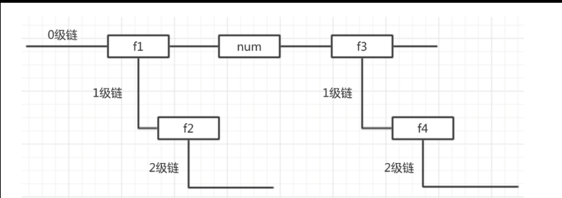

# 01-函数

`函数作用：将代码存入变量中，实现代码复用`


## 1.1-函数介绍


```javascript
//1.声明函数：将代码存入变量中
function 函数名(){
    函数体：一段代码
}

//2.调用函数：执行函数体代码

函数名();

 */
```

```html
<script>

    /*1.函数与循环区别：本质区别
        a.作用不同：
            循环：一段代码在一个地方执行多次
            函数：一段代码在多个地方执行一次
        b.本质不同
            循环：只是一种语法，让代码重复执行
            函数：是一种数据类型，存储的是代码
    */

    /*2.什么样的代码需要使用函数存入变量中
            a.这段代码需要在多个地方执行
            b.这段代码通常都是完成一个独立的小功能
    */

    /*3.语法误区：函数语法就两个（声明与调用）
    1.声明函数：  function 函数名(){ 函数体代码 }
    2.调用函数：  函数名()
    3.变量取值：  函数名    (不会执行函数体代码，只是以字符串形式将变量中存储的东西打印出来而已)
    */


    //需求：一段代码需要执行多次
    //复制粘贴弊端： （1）代码冗余 （2）不便于维护
    // console.log ( "大宝剑开始了" );
    // console.log ( "天黑请闭眼，我是本次服务的1号技师" );
    // console.log ( "不知不觉中，两个小时过去了……快乐的时光总是短暂的" );
    // console.log ( "您好，本次消费1888元，请喝杯雪碧压压惊" );
    // console.log ( "大宝剑结束了" );

    /*函数作用:将代码存入变量中，实现代码复用

    //1.声明函数：将代码存入变量中
    function 函数名(){
        函数体：一段代码
    }

    //2.调用函数：执行函数体代码

    函数名();

     */

    //1.声明函数：将代码存入变量中
    function bigSword(){
        console.log ( "大宝剑开始了" );
        console.log ( "天黑请闭眼，我是本次服务的1号技师" );
        console.log ( "不知不觉中，两个小时过去了……快乐的时光总是短暂的" );
        console.log ( "您好，本次消费188元，请喝杯雪碧压压惊" );
        console.log ( "大宝剑结束了" );
    };

    console.log ( bigSword );//取值语法（获取变量中存储的数据），会以字符串形式打印这段代码

    //2.调用函数：执行函数体中的代码
    bigSword();

    console.log ( "这里写了两百行代码" );


    bigSword();
    // console.log ( "大宝剑开始了" );
    // console.log ( "天黑请闭眼，我是本次服务的1号技师" );
    // console.log ( "不知不觉中，两个小时过去了……快乐的时光总是短暂的" );
    // console.log ( "您好，本次消费1888元，请喝杯雪碧压压惊" );
    // console.log ( "大宝剑结束了" );

    console.log ( "这里三百行代码" );

    bigSword();
    // console.log ( "大宝剑开始了" );
    // console.log ( "天黑请闭眼，我是本次服务的1号技师" );
    // console.log ( "不知不觉中，两个小时过去了……快乐的时光总是短暂的" );
    // console.log ( "您好，本次消费1888元，请喝杯雪碧压压惊" );
    // console.log ( "大宝剑结束了" );

    console.log ( 111 );
</script>
```


## 1.2-函数参数


```html
<script>
    /*1 .函数的参数：让调用者可以传递数据给函数
    谁传递数据：调用者
        * 语法： 函数名(实际参数，简称实参)
    谁接收数据：函数声明
        * 语法： function 函数名(形式参数，简称形参){  函数体代码  }

      * 2.参数的传递本质：实参给形参赋值
      
      * 3.实参给形参赋值是按照顺序赋值的
      
      * 4.实参与形参数量可以不一致
     */

    //示例1
    function bigSword ( jishi ) {
        //函数的参数相当于在函数的内部声明了一个变量，只不过省略了var关键字
        //这个变量只是声明，并没有赋值，我们称之为形式参数，简称形参
         console.log ( "大宝剑开始了" );
        console.log ( "天黑请闭眼，我是本次服务的" + jishi + "号技师" );
        console.log ( "不知不觉中，两个小时过去了……快乐的时光总是短暂的" );
        console.log ( "您好，本次消费188元，请喝杯雪碧压压惊" );
        console.log ( "大宝剑结束了" );
    }

    //在调用的时候，传递一个数据，相当于给函数的参数赋值
    //调用时传递的参数称之为实际参数，简称实参
    bigSword(3);
    bigSword(5);

    //示例2：函数的形参可以是多个，用逗号分隔
    function bigSword1 ( jishi,drink ) {
         console.log ( "大宝剑开始了" );
        console.log ( "天黑请闭眼，我是本次服务的" + jishi + "号技师" );
        console.log ( "不知不觉中，两个小时过去了……快乐的时光总是短暂的" );
        console.log ( "您好，本次消费188元，请喝杯" + drink +"压压惊" );
        console.log ( "大宝剑结束了" );
    }
    bigSword1(6,"雪碧");//实参给形参赋值，是按照顺序来赋值的
    bigSword1(8,"可乐");


</script>
```


## 1.3-函数返回值

```html
<script> 
/*需求：函数需要将自己计算的结果传递给调用者  （返回数据给调用者）

    1. 返回值：  函数传递数据给调用者
        传：函数
            function 函数名(){    函数体代码    return 返回值  }
        收：调用者
           var 变量名 =  函数名()
     */
    function getSum ( a,b ) {
        var sum = a + b;
        // console.log ( sum );

        return sum;//返回值
    };

    /*注意点：在函数的外部是无法访问函数内部变量
    * */
    // console.log ( sum );//程序报错

    //班长：求10+20的和，将结果显示到页面中
    console.log ( getSum ( 10,20 ) );//打印函数的返回值
    var banzhang = getSum ( 10,20 );// 将函数的返回值存入变量中
    console.log ( banzhang );
    document.write(banzhang);

    /*2.函数的几种形态
     无参无返回函数 ： 几乎不用
     有参无返回函数：使用较少
     无参有返回值：使用较少
     有参有返回值：使用最多


    函数工作流程：类似于fsk加工厂      完整语法： var 变量名（返回值） = 函数名(实参)
        1.调用者传递参数
        2.函数执行自己的功能(函数体代码)
        3.函数将计算后的结果返回给调用者
     */


    function getSum (a,b  ) {
        var sum = a + b;
        return sum;

        console.log ( 1111 );//只要写了return，不管有没有接值，return后面的代码都不会执行
    };

    // console.log ( sum );//程序报错


    var num1 = getSum(10,20);
    console.log ( num1 );

   // console.log ( getSum ( 1, 1 ) + getSum ( 1, 1 ) );//4

    /*函数返回值注意点：
        1.如果函数没有写return关键字，则函数返回值就是undefined
        2.如果函数有写return关键字，但是return后面没有接值,函数返回值也是undefined
        3.return关键字后面的不会执行
        4.如果函数有写return，并且return后面有值，这个值就是函数的返回值
     */


</script>
```


## 1.4-函数另一种声明方式

* 1.函数声明:`function 函数名() {};`
* 2.函数表达式:`var 函数名 = 匿名函数`
  * 匿名函数：函数的字面量又称为匿名函数，顾名思义就是没有变量名的函数
  * `var 函数名 = function(){};`
* 3.两者唯一区别：函数声明可以在任何地方调用，而函数表达式方式调用必须在声明后面

```html
<script>
    //函数有两种声明方式

    //1.函数声明：  function 函数名() {};
    function fn1 (  ) {
        console.log ( "哈哈" );
    }

    //2.函数表达式：  var 函数名 = 匿名函数
    var fn2 = function (  ) {
        console.log ( "呵呵" );
    }

    //这两种方式唯一的区别：函数声明可以在任何地方调用，而函数表达式方式调用必须在声明后面

   // test();//这样调用会报错
    var test = function (  ) {
        console.log ( "嘿嘿" );
    }

    test();//只能在声明的后面调用

</script>
```


# 02-函数练习

## 1.1-函数练习1(参数与返回值)

```javascript
 //1.求n-m之间数字的总和
    function getSum  (n,m) {
        var sum = 0;
        for(var i = n;i<=m;i++){
            sum += i;
        };

        console.log ( sum );
    }

    getSum(100,200);
    getSum(1,2);
    getSum(15,20);

 //2.求一个数组中的最大数
    function getMaxNumber ( arr ) {
        var max = -Infinity;

        for(var i = 0;i<arr.length;i++){
            if(max <= arr[i]){
                max = arr[i];
            }
        }
        return max;
    }

    var max1 = getMaxNumber([10,20,30,40]);
    console.log ( max1 );

    var max2 = getMaxNumber([99,66,50,100]);
    console.log ( max2 );
```


## 1.2-函数练习2(函数内部调用其他函数)

```javascript
 //一个函数体中可以调用另外的函数
    //注意：函数的调用，相当于执行函数体代码
    function haha (  ) {
        console.log ( "哈哈" );
    }

    function xixi (  ) {
        haha();
        console.log ( "嘻嘻" );
    }

    xixi();

    //示例：写一个函数，求两个数字的最大数
    function getMaxByTwoNumber (  num1,num2) {
       return num1 >= num2?num1:num2
    }

    console.log ( getMaxByTwoNumber ( 10, 20 ) );

    //写一个函数，求三个数字的最大数
    function getMaxByThreeNumber (  num1,num2,num3) {
       // var res1 = num1 >= num2?num1:num2;//num1与num2的最大数
        var res1 = getMaxByTwoNumber(num1,num2);
       // var res2 = res1 >= num3?res1:num3;//求res1与num3最大数
        var res2 = getMaxByTwoNumber(res1,num3);
        return res2;
    }

    console.log ( getMaxByThreeNumber ( 100, 99, - 10 ) );
```


# 03-高阶函数(暂时了解)

## 1.1-回调函数

* 1.什么是回调函数：如果一个函数的参数也是一个函数，那么这个参数函数就叫做回调函数
* 2.为什么要有回调函数？
  * 当一个函数调用执行完毕之后，我想执行另一段代码块，也就是调用另一个函数
  * 但是有时候可能本函数执行完毕后，根据不同的情况需要调用的函数也不同，那么我们可以使用形参来接收这个函数，然后再调用
    * 此时：这个形参函数就称之为回调函数

```html
<script>
    //回调函数：如果一个函数的参数也是一个函数，那么这个参数函数就叫做回调函数
    //回调函数在什么地方会执行呢？   函数名() 的时候执行
    //回调函数难点： 本质是一个参数
    //谁来传：调用者传参   （函数名）
    //谁来收,调用：函数调用  （函数执行完函数体之后，调用保存在这个参数中的一段代码）


    function a (  ) {
        console.log ( "哈哈" );

    }

    function b (  ) {
        console.log ( "呵呵" );
    }

    //c函数有一个功能，可以接收调用者传递过来的一段代码，并且在执行完自身函数体之后，会帮调用者执行这一段代码
    function c ( fn ) {
        console.log ( "嘿嘿" );
        //fn里面是调用者传递过来的一段代码，怎么让这段代码执行呢？
        fn();
    };

    //调用函数c，传的是变量a中存储的一段代码
    c(a);
    c(b);

</script>
```

## 1.2-自调用函数

* 1.什么是自调用函数：函数自己调用自己
  * 最常见的：匿名函数自调用
* 2.自调用函数作用
  * 开辟作用域，js中只有函数才可以开辟作用域
* 3.匿名函数自调用语法:`( function(){} ) ()`
  * 将整个函数使用小括号包裹，然后在后面再加上小括号调用

```html
<script>

    /*自调用函数：函数自己调用自己
        * 最常见的：匿名函数自调用
     */


    //作用：开辟作用域，js中只有函数才可以开辟作用域

    //匿名函数相当于字面量函数,由于没有函数名，所以只能在声明的同时调用
    //语法：  ( function(){} ) ()     将整个函数使用小括号包裹，然后在后面再加上小括号调用
    (function (  ) {
        console.log ( "我是匿名函数" );
    })();

    //补充：其实有名字的函数也可以自己调用自己，只是比较少见
    (function test(  ) {
        console.log ( "我是有名字的函数，我也可以自调用" );
    })();

</script>
```


# ==04-js作用域及变量预解析==

## 1.1-js作用域

```html
<script>

    /*作用域：变量起作用的范围
        * js中只有两种：全局作用域  局部作用域
        *
       1.全局作用域：变量在任何地方起作用
        * 全局变量:在函数外面声明

        2.局部作用域：变量只能在函数内部起作用
        * 局部变量：在函数内部声明


     */

    //1.全局变量
    var a = 10;
    function fn (  ) {
        console.log ( a );
    }
    fn();


    //2.局部变量
    function fn1 (  ) {
        var num = 10;
        console.log ( num );
    }
    fn1();
    console.log ( num );
</script>
```

## 1.2-作用域链


* 1.作用域链是怎么来的
  * 默认情况下，我们的js代码处于全局作用域，当我们声明一个函数时，此时函数体会开辟一个局部作用域， 如果我们在这个函数体中又声明一个函数，那么又会开辟一个新的局部作用域，以此类推，就会形成一个作用域链
* 2.变量在作用域链上的访问规则
  * 就近原则：访问变量时，会优先访问的是在自己作用域链上声明的变量，如果自己作用域链上没有声明这个变量，那么就往上一级去找有没有声明这个变量，如果有就访问，如果没有就继续往上找有没有声明，直到找到0级作用域链上，如果有，就访问，如果没有就报错



```html
<script>

    /**
     * 作用域链的由来：默认情况下，我们的js代码处于全局作用域，当我们声明一个函数时，此时函数体会开辟一个局部作用域，
     如果我们在这个函数体中又声明一个函数，那么又会开辟一个新的局部作用域，以此类推，就会形成一个作用域链条

     * 变量在作用域链上的访问规则
     *      * 就近原则：访问变量时，会优先访问的是在自己作用域链上声明的变量，如果自己作用域链上没有声明这个变量，那么就往上一级去找有没有声明这个变量，如果有就访问，
     如果没有就继续往上找有没有声明，直到找到0级作用域链上，如果有，就访问，如果没有就报错
     */

        //案例
    var num = 10;//0级链   全局作用域链
    //0级作用域
    function f1 (  ) {//函数变量f1本身还是处于0级链（变量f1本身处在全局作用域中，是一个全局变量。函数体中才是局部变量，也就是局部作用域链）

        var num = 20;//1级链
        console.log ( num );//20

        function f2 (  ) {//1级链
            //2级链
            console.log ( num );//20，当前作用域链未声明，就会找上级作用域链的num变量
            num += 100;//当前作用域链未找到，会从上级寻找 num = 20 + 100
            console.log ( "二级链" + num );//2级链  120
        }
        f2();
        console.log ( "一级链" + num );//120   为什么不是20：因为二级链上并没有声明变量，而是直接获取父级变量修改
    };

    //0级作用域
    f1();
    //0级作用域
    console.log ( "0级链" + num );//10
</script>
```

## 1.3-练习：作用域

* **记住：js中只有函数才可以开辟作用域，其他的任何语句都不可以**

```html
<script>
//案例1:只有函数中声明的变量才是局部变量，分支语句与循环语句的大括号中声明的变量仍然是全局变量
    var num = 10;
    if(num > 0){
        var sum = 20;
    }
    console.log ( sum );//20

    //案例2:一般其他语言，循环变量i只能在for循环内部访问（局部变量），在js语言中是全局变量
    for(var i = 0;i<5;i++){

    }
    console.log ( i );//5

    //案例3：
    var name = '张三';
    function fn (  ) {
        name = '李四';
    }
    fn();
    console.log ( name );//李四
</script>
```

## 1.4-js预解析


* 1.为什么要有预解析机制？
  * 通过前面的学习我们知道，js代码是从上往下执行的，这样有什么不好的地方呢？
  * 实际开发中，往往一个文件中js代码会有很多的函数，而如果我们都把函数的声明写在最上面，那么我们的业务逻辑就会在下面，这样的话开发效率不高
    * 函数毕竟只是保存一段代码的，我们希望可以将函数写在页面的下面，而把一些业务逻辑功能写在代码上面，这样的话维护起来更方便
* 2.什么是预解析机制
  * （1）其实js代码并不是从上往下执行的，这种说法不严谨
  * （2）预解析：JS在执行代码之前，会把变量的声明提前到所在作用域的最顶端
    * a.只是声明提前（相当于提前开辟内存空间），变量的赋值与函数的调用还是在原地
    * b.函数的声明也会提前
* 3.预解析的意义（好处）
  * 让函数可以在任意地方调用

```html
<script>

    /*1.代码从上往下执行  -----不严谨

    2.预解析：js在执行代码之前，会将代码扫描一遍
    在预解析的时候，js编译器会做一件事：变量的提升

    3.变量的提升
        * a.将变量的声明提前到当前作用域的最顶端，赋值还是在原地
        * b.函数的声明也会提前
        *
    4.js预解析意义（好处）：让函数可以在任何地方被调用

    5.特殊情况：如果一个变量在声明的时候没有使用var，该变量无论写在什么位置都是全局的，不参与预解析 （不要用）

     */

    console.log ( num );//undefined
    var num = 10;
    console.log ( num );//10

    /*
    var num;
    console.log ( num );
    num = 10;
    console.log ( num );
     */

    fn();
    function fn (  ) {
        console.log ( num );
        console.log ( "哈哈哈" );
        var num = 10;
        console.log ( num );

        /*
        //函数声明提前
        function fn(){
         var num;
        console.log ( num );//undefined
        console.log ( "哈哈哈" );
        num = 10;
        console.log ( num );//10
        }

        //调用语句在原地不变
        fn()

         */
    // }
</script>
```

## 1.5-练习：预解析

```html
<script>
    //练习1
    console.log ( a ) ;   //function 我是函数
    var a = "我是变量";
    function a(){
        console.log ( "我是函数" );
    };
    console.log ( a );//我是变量

    /*预解析过程

    var a;
    function a(){  //变量的重复声明
        console.log ( "我是函数" );
    };
    console.log ( a ) ;
    a = "我是变量";//变量的重新赋值
    console.log ( a ) ;
    * */

    //练习2

       var num = 10;
       fun();
       function fun(){
         console.log(num); //undefiend
         var num = 20;
       }

    console.log ( num );//10

    /*预解析过程
    var num;
    fun();
       function fun(){
        var num;
         console.log(num); //undefiend
         num = 20;
       }
    num = 10;
    console.log ( num );
    */

</script>
```


# 05-今日学习总结及课后作业


## 学习总结

* 1.了解函数的作用

  * 将一段代码保存在一个变量中，可以让这段代码复用（封装）

* 2.了解函数的参数与返回值的使用

  * ```
    function(形参1，形参2,....){ return 返回值}
    ```

    * 了解return关键字的作用
      * **只能写在函数体中**
      * 结束函数：return关键字后的代码都不执行
      * 返回函数的运行结果：返回值

* 3.了解函数的两种声明语法

  * 函数声明：`function fn(){//函数体}`
  * 表达式声明：`var fn = function(){//函数体}`
  * 区别：函数声明可以在任何位置调用，表达式声明只能在声明之后调用

* 4.熟悉函数的调用语法

  * ```
    函数名(参数)
    ```

    * 函数调用是执行函数体代码的唯一语法

* 5.了解函数的几种形态

  * 1.无参无返回值函数
  * 2.无参有返回值函数
  * 3.有参无返回值函数
  * 4.有参有返回值函

## 课后作业

* 1.写一个函数，实现翻转数组，返回一个新数组（★）
  * 例如 fn([10，20，30，40，50]) 得到[50,40,30,20,10]
* 2.输入一个年份，判断是否是闰年[闰年：能被4整数并且不能被100整数，或者能被400整数]（★）
  * 写一个判断平年闰年的函数
* 3.写一个函数输入某年某月某日，判断这一天是这一年的第几天？（★★★）
  * 提示：一年中除了二月份的天数不同，其他天数是固定的
* 4.书写一个函数，随机生成十六进制颜色值比如： #ff6600 16进制指0-f之间的数。（★★★）