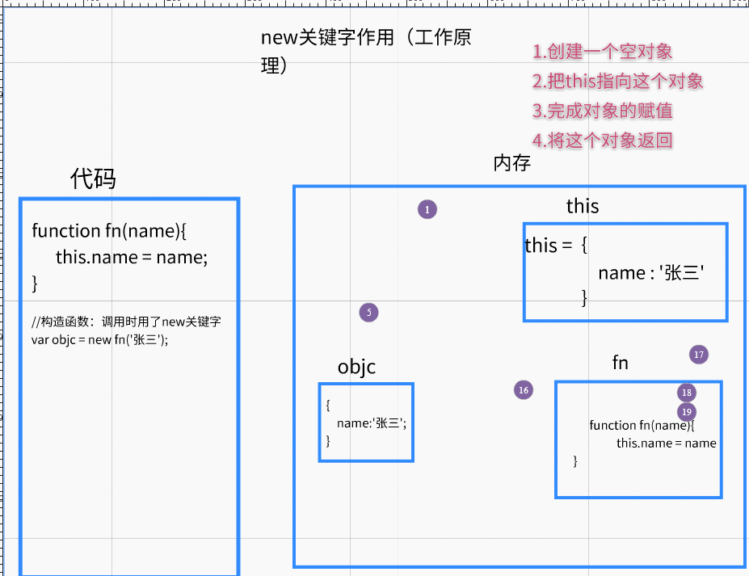

# ==01-对象(语法学习)==

## 1.1-对象介绍

`对象作用：一个变量存储多个数据`

对象与数组异同点

​	相同点：一个变量存储多个数据

​	不同点：

​		数组有序存储：元素与下标一一对应

​		对象无序存储：属性名与属性值一一对应（键值对）


//需求：使用一个变量存储一个人的信息（姓名name：林绿群  年龄age:38  性别sex:'男'）

```javascript
//1.使用数组
//弊端：易读性不高
var arr = ['林绿裙',38,'男'];
console.log ( arr );
console.log ( arr[ 1 ] );

//2.使用对象：  一个变量存储多个数据，易读性更高
var person = {name:'林绿裙',age:38,sex:'男'};
console.log ( person );

//对象取值：   对象名.属性名
console.log ( person.name );//林绿群
console.log ( person.age );//38

/*对象与数组的异同点
相同点：一个变量存储多个数据
不同点：存储的方式不一样
    * 数组：有序存储（元素与下标一一对应）
    * 对象：无序存储（属性名与属性值一一对象  键值对）
 */
```

## 1.2-对象取值与赋值

//1.声明对象    var 对象名 = { 属性名1：属性值1 ， 属性名2：属性值2 };

```javascript
var person = {
    name:'林绿裙',
    age:38,
    sex:'男'
};

//2.对象的取值语法 ： 点语法 ：  对象名.属性名

//2.1 对象有该属性名，则是获取属性对应的值
console.log ( person.name );//林绿裙
//2.2 对象没有该属性名，则获取的是undeifend
console.log ( person.girlFirend );//undefined

//3.对象的赋值：     对象名.属性名 = 值

//3.1 对象有该属性名,则是修改属性值
person.sex = '女';
console.log ( person );

//3.2 对象没有该属性名
person.girlFirend = '大桥老师';
console.log ( person );
```

## 1.3-对象的初始化


 //1.声明空对象
    var person = {};
    person.age = 18;//赋值语法
    person.name = '保健坤';//赋值语法
    console.log ( person.age );//取值语法
    console.log ( person );

```javascript
//2.初始化对象：声明的时候就赋值

var student = {
    //初始化   属性名:属性值    ----键值对关系
    name:'陈红桥', //多个属性之间逗号
    age:18,
    girlFriend:['苍老师','波多老师','吉泽老师'],
    wife:{
        name:'孙笑川',
        age:38,
        sex:'男',
        play:function (  ) {
            console.log ( "今晚你要学习什么技术" );
        }
    },
    sayHi:function (  ) {
        console.log ( "大吉大利，今晚吃鸡" );
    }
};

student.age++;
student.girlFriend[3] = '天海老师';

console.log ( student );
console.log ( student.name );//陈红桥

console.log ( student.wife.name );//孙笑川

student.sayHi();//调用student的sayHi方法

student.wife.play();//调用student的wife的play方法

/*
函数： 变量
方法：也是函数，这种叫法有归属感。 对象的属性值的数据类型是函数
 */
```

## 1.4-对象的点语法与字符串语法
```javascript
//声明对象
    // var person = {
    //     name:'右护法',
    //     age:38,
    //     sex:'男'
    // };
    //
    // //对象的取值语法有两种: 这两种语法没有任何区别，只是语法不同而已
    //
    // //1.点语法;   对象名.属性名
    // console.log ( person.age );
    //
    // //2.字符串语法;   对象名['属性名']
    // console.log ( person[ "age" ] );
    // person['age'] = 18;
    // console.log ( person );

//3.测试
var p1 = {
    age:18,
    sex:'男'
};

var sex = 'age';
//点语法取age属性值
console.log ( p1.age );//18
//字符串语法取age属性值
console.log ( p1['age'] );//18
//点语法取sex属性值
console.log ( p1.sex );//'男'
//字符串语法取sex属性值
console.log ( p1['sex'] );//'男'
//字符串语法取sex变量中存储的字符串对应的属性值
console.log ( p1[sex] );//18
//报错原因：不是因为对象取不出来这个属性（没有则获取undefined）,是因为age变量没有声明
// console.log ( p1[ age ] );
var age = '111111';
console.log ( p1[ age ] );//undefined    p1['111111']
```

## 1.4-对象遍历

```html
<script>
    //对象的遍历

    var person = {
        name : "保健坤", age : 18, sex : "男", girlFrined : "白石老师"
    }

    console.log ( person )

    /*
    1.复习数组的遍历：  固定的for循环结构  for(var i = 0;i<arr.length;i++){ arr[i]  }
            * 对象不能使用数组的遍历语法，因为对象没有下标
    2.在js中，有专门的循环结构用来遍历对象的属性： for-in
        for(var key in 对象名){  对象名[key] }
                * 注意点：只能用字符串1语法取值
     */

    for ( var key in person ) {
        console.log ( key )//属性名字符串
        /*注意：不能用点语法取值  */
        console.log ( person.key )//  点语法取key属性值
        /*只能用字符串语法*/
        console.log ( person[ key ] )//  字符串语法取key变量中存储的字符串对应的属性值
    }


    var p1 = {name:'zs',age:18}
    var p2 = p1//拷贝p1的地址
    p2.name = "ls"
    console.log ( p1.name )//ls
    console.log ( p2.name )//ls

</script>
```


## 1.5-方法中的this关键字

```html
<script>
    //this关键字: 谁调用这个方法，this代表谁

    var person3 = {
        name:'陈红桥',
        age:32,
        sex:'男',
        play:function (  ) {
            console.log ( "今晚我要请坤哥精油开背" );
        },
        sayHi:function (  ) {
            //弊端：如果对象名修改了，方法中的person全部都要修改
            // console.log ( "大家好，我系" + person.name + "我的年龄是" + person.age + "我的爱好是：足疗爱好者" );
            console.log ( "大家好，我系" + this.name + "我的年龄是" + this.age + "我的爱好是：足疗爱好者" );
        }
    };


    person3.name = '社会桥';
    console.log ( person3.age );
    person3.sayHi();

    // person.name = '保健桥';
    // person.sayHi();
</script>
```


# 02-对象练习

```javascript
//有一个字符串数组,找出出现次数最多的字符及对应的次数
var str = ['a','b','a','s','f','g','g','g','h','j','j','k','k','g','f','d','d','s','s','s','s','s','3','4','4','4','3','4','3'];
/*思路：利用对象两个特点  1.属性可以动态添加   2.属性与属性值之间是一个键值对的关系
   1.声明一个空对象，遍历字符串
   2.将字符串的字符作为对象的属性，出现的次数作为对象的属性值
    */
   var objc = {};
   for(var i = 0;i<str.length;i++){
       var s = str[i];
    //先判断对象是否有该属性
       if(objc[s] == undefined){//使用字符串语法对对象取值，如果取出来是undefined，表示对象没有这个属性
           //既然没有表示这个字符是第一次出现，那么就将这个字符作为对象的属性，属性的值为1 （第一次出现）
           objc[s] = 1;//动态赋值
       }else{//如果对象有这个属性，则让这个属性的值自身+1  （每出现一次就加1）
           objc[s]++;
       }
   }
   console.log ( objc );//遍历这个对象，就知道哪个字符出现的最多了
```


# 03-自定义构造函数创建对象（new关键字工作原理）


## 1.1-对象的另一种声明方式


```javascript
<script>

    //1.（最常用）简洁方式：   var 对象名 = { 属性名：属性值 }
    var p1 = {name:'张三'};

    //2.构造函数：
    //构造函数：如果调用一个函数使用了new关键字，这个函数成为构造函数
    var p2 = new Object( {name : '张三'} );

    /*这两种方式没有任何区别，只是语法不同而已*/
    console.log ( p1 );

    console.log ( p2 );
</script>
```


## 1.2-使用函数创建对象


```html
<!DOCTYPE html>
<html lang="en">
<head>
    <meta charset="UTF-8">
    <title>Title</title>
</head>
<body>

</body>

<script>
    //使用函数来创建对象
    //什么时候需要用到函数来创建对象:假如我需要创建多个对象，
    /* 好处：属性的值不需要写死，由调用者动态赋值 */
    function createPerson (name,age,hobby  ) {
        //1.创建一个空对象
        var person = new Object();
        //2.将工厂函数的参数作为对象属性的值(类似于一个加工厂的流水线，将原材料加工变成成品返回)
        person.name = name;
        person.age = age;
        person.hobby = hobby;
        //3.返回创建好的对象
        return person;
    }

    console.log ( createPerson ( "尼古拉斯赵四", 22, "尬舞" ) );
    console.log ( createPerson ( "到格森张三", 20, "尬聊" ) );

</script>
</html>
```


## ==1.3-使用自定义构造函数创建对象(new关键字工作原理)==



```html
<!DOCTYPE html>
<html lang="en">
<head>
    <meta charset="UTF-8">
    <title>Title</title>
</head>
<body>

</body>

<script>
    //自定义构造函数
    //什么是构造函数：如果调用一个函数的时候加了new关键字，那么这个函数我们称之为构造函数

    /*new这个关键字在构造函数中会做四件事
       * 1.在内存中开辟空间，创建一个空对象
       * 2.把this指向这个对象
       * 3.给这个对象赋值
       * 4.将这个对象返回return
   */


    //1.声明一个空函数
    function fn (  ) {

    }

    //查看使用new调用和不使用new调用的结果有什么不同
    var res1 = fn();//不加new关键字，此时fn就是普通函数
    var res2 = new fn();//加new关键字，fn就变成了构造函数
    console.log ( res1 );//undefined
    console.log ( res2 ,typeof  res2);//object  空对象(对象名就叫做fn)

    //结论：使用new关键字之后，函数在内部会自动创建一个对象，并且帮我们自动返回


    //2.既然构造函数内部会自动创建一个对象，那么可以使用this关键字来代表这个对象

    function Teacher ( name,age,hobby ) {
        this.name = name;
        this.age = age;
        this.hobby = hobby;
    }

    //使用new关键字调用构造函数
    var teacher2 = new  Teacher ( "利群", 38, "宝剑" );
    console.log ( teacher2 );//{name: "利群", age: 38, hobby: "宝剑"}


    //3.构造函数使用注意点
    /*1.通常函数名首字母大写，用于区分普通函数
    2.必须要使用new关键字来调用
    3.手动在函数内return造成的影响
        * 如果 return 基本数据类型   ： 无效，还是会返回默认对象
        * 如果 return 复杂数据类型 ： 有效，会覆盖默认的对象
     */

    function GirlFirend(name,age){
        this.name = name;
        this.age = age;
        //如果手动return
        // return  '123' ;   //基本数据类型，无效
        //return ['123'];   //复杂数据类型，有效，会覆盖默认对象
    }

    var person1 = new GirlFirend('苍老师',18);
    console.log ( person1 );
</script>
</html>
```


# 04-今日学习总结及课后作业


## 学习总结


* 1.了解对象类型

  * 与数组相同点：都是存储多个数据
  * 与数组不同点：数组是有序存储，数据的位置与下标一一对应。对象是无序存储，数据通过键值对来一一对应(属性名:属性值)

* 2.掌握对象的取值与赋值

  * 取值两种方式
    * `对象名.属性名`
    * `对象名["属性名"]`
  * 赋值
    * `对象取值 = 赋值`

* 3.了解对象的初始化

  * 初始化：在声明的时候赋值
    * 语法:`属性名:属性值`(键值对)
    * 多个属性之间使用逗号分隔
    * 最后一个属性省略逗号

* 4.掌握遍历对象所有属性的方式

  * ```
    for-in循环
    ```

    :

    ```
    for(var key in 对象名){ var value = 对象名[key]}
    ```

    * 不能用点语法获取，因为key是一个字符串

* 5.了解方法中this关键字指向

  * 谁调用这个方法，this就代表谁（动态指向）

* 6.掌握对象类型的两种创建方式

  * 字面量方式：`{}`
  * 构造函数方式：`new Object()`


## 课后作业

1. 创建一个电脑对象，该对象要有颜色、重量、品牌、型号，可以看电影、听音乐、打游戏和敲代码。

   题目描述：颜色、重量、品牌、型号是属性；看电影、听音乐、打游戏、敲代码是方法，在调用方法时打印 “我在看电影/听音乐/打游戏/敲代码”

   

2. 写一个构造函数，用来创建学生对象，学生对象包括的内容有：姓名（name）、学号（id）、性别（sex）、年级（grade）、打招呼（sayHi）—— 在弹出框中提示：“你好我是XXX”，其中XXX代表对象的name属性值