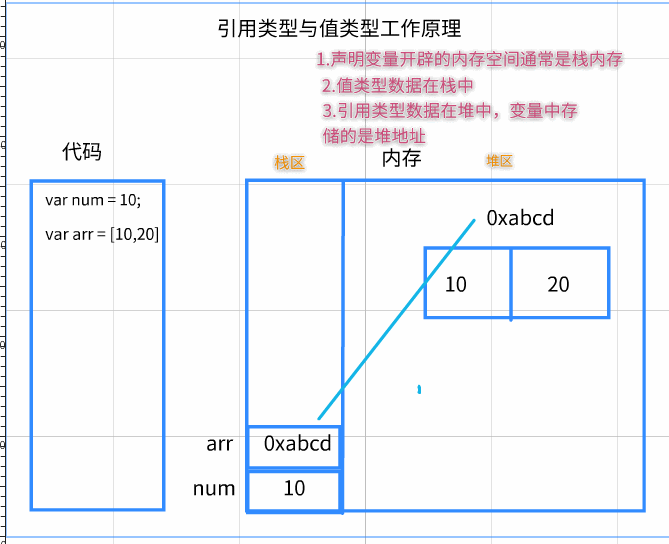
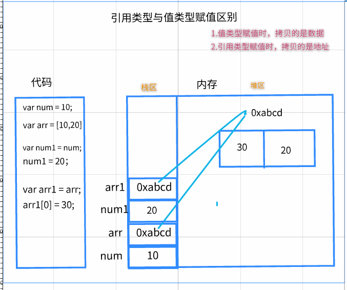
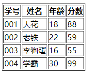

# 01-内置对象的API


## 1.1-Date日期对象

* 1.获取当前日期:`var date = new Date();`
* 2.获取日期中的年月日时分秒
* 3.创建自定义日期

```html
<script>
    /**
     * Date对象：js内置的用于获取当前日期与时间的对象
     *      日期：只有年月日  2018/3/20
     *      时间：只有时间  15：30：00
     *      完整时间：年月日时  2018/3/20 15：30：00
     */

    //1.创建一个Date对象
    var date = new Date();

    /*时间日期打印*/
    //2.打印当前完整时间:  （1）默认显示当前电脑的时区时间 （2）打印date时会自动转为字符串 date.toString()
    console.log ( date );//Fri Mar 23 2018 20:45:15 GMT+0800 (中国标准时间)
    //3.打印日期：标准版本
    console.log ( date.toDateString () );//Fri Mar 23 2018
    //4.打印日期：本地版本（当前电脑）
    console.log ( date.toLocaleDateString () );// 2018/3/23
    //5.打印当前时间：标准版本
    console.log ( date.toTimeString () );//20:51:17 GMT+0800 (中国标准时间)
    //6.打印当前时间：本地版本
    console.log ( date.toLocaleTimeString () );//下午8:51:17

    /*年月日时打印*/
    //1.打印当前年份
    console.log ( date.getFullYear () );//2018
    //2.打印当前月份  范围：0-11 代表 1-12月
    console.log ( date.getMonth () );//2 代表下标2  也就是3月
    //3.打印当前日
    console.log ( date.getDate () );//23
    //4.打印当前星期  范围0-6 代表星期天-星期六
    console.log ( date.getDay () );//5
    //5.打印时
    console.log ( date.getHours () );
    //6.打印分
    console.log ( date.getMinutes () );
    //7.打印秒
    console.log ( date.getSeconds () );

    /**创建自定义日期*/
    var date1 = new Date(2020,0,1,12,3,5);//依次传入 年，月，日，时，分，秒
    console.log ( date1 );//Wed Jan 01 2020 12:03:05 GMT+0800 (中国标准时间)
    var date2 = new Date("2022-05-06 12:03:35");
    console.log ( date2 );//Fri May 06 2022 12:03:35 GMT+0800 (中国标准时间)
</script>
```

## 1.2-Array数组对象

* 数组常用api
  * 连接数组:`concat()`
  * 将数组元素拼接成字符串:`join()`
  * 删除数组最后一个元素:`pop()`
  * 往数组后面添加元素:`push()`
  * 翻转数组:`reverse()`
  * 删除数组第一个元素:`shift()`
  * 查找数组元素:`slice()`
  * 数组排序:`sort()`

```html
<script>
    //我们创建了一个数组对象。此时它就已经拥有了内置对象所有的属性和方法
    var arr = [10,20,30];

    console.log ( arr.length );//访问数组对象的length属性

    //1.连接多个数组:将另一个数组的所有元素都添加到arr的后面
    console.log ( arr.concat ( [ 40, 50 ] ) );//[10,20,30]

    //2.将数组中的每一个元素都拼接成一个字符串
    var str = arr.join();//10,20,30
    console.log ( str );

    //3.删除数组的最后一个元素
    arr.pop()//删除数组的最后一个元素
    console.log ( arr );//[10,20]


    //3.往数组的最后面添加一个元素
    arr.push(100);
    console.log ( arr );//[10,20,100]

    //4.翻转数组
    var newArr =  arr.reverse();
    console.log ( newArr );//[100,20,10]

    //5.删除数组的第一个元素
    arr.shift();
    console.log ( arr );//[20,10]

    //6.查找一个数组中的某些元素
    var arr1 = [10,20,70,40,50,60];
    // 第一个参数：start：从那一个下标开始查找 如果为负数则倒着查找
    //第二个参数： end ： 结束位置    start <= 范围 < end
    console.log ( arr1.slice ( 1, 3 ) );//

    //7.数组排序

    //数组排序方法的参数是一个回调函数：告诉数组内置对象你的排序规则
    //从小到大排序
    var sortArr = arr1.sort(function (a,b)
    {
        return a - b
    });

    console.log ( sortArr );//从小到大
    console.log ( sortArr.reverse () );//从大到小  （将从小到大排序好的数组翻转一下即可）
</script>
```

## 1.3-String字符串对象

* 1.获取字符串长度:`str.length`
* 2.获取字符串某一个下标字符:`str.charAt()`
* 3.拼接字符串:`str.concat`
* 4.判断字符串中是否包含某些字符串:`str.indexOf()`
* 5.截取字符串:`str.substr()`
* 6.修改字符串:`str.replace()`
* 7.大小写转换:`str.toLowerCase()`小写 `str.toUpperCase()`大写
* 8.分隔字符串：`str.split()`

```html
<script>

    //字符串常用API介绍
    var str = "黑马颜值担当坤哥我爱你么么哒!";
    //1 获取字符串长度
    var length = str.length;
    console.log ( length );//15
    //2  获取字符串某一个下标字符  （字符串相当于一个伪数组）
    console.log ( str[ 4 ] );//担
    console.log ( str.charAt(4) );//担    charAt(下标)函数相当于`字符串[下标]`
    //3  拼接字符串
    var str1 = str.concat("今晚一起吃鸡");//这行代码等价于   var str1 = str + "今晚一起吃鸡";
    console.log ( str );
    console.log ( str1 );//
    //4 判断一个字符串在不在某个字符串里面
    var index1 = str.indexOf("黑马");//如果存在，则返回参数字符串首字母所在的下标
    var index2 = str.indexOf("坤");
    var index3 = str.indexOf("林利群");//如果不存在，则返回 -1
    console.log ( index1, index2, index3 );//0,6,-1
    //5 截取字符串  第一个参数：从哪个下标开始截取  第二个参数：截取的长度
    var str2 = str.substr(2,4);//颜值担当
    console.log ( str2 );
    //6  修改字符串  第一个参数：要修改的字符串  第二个参数：修改后的字符串
    var str3 = str.replace("黑马","传智播客");
    console.log ( str );//
    console.log ( str3 );//传智播客颜值担当坤哥我爱你么么哒!
    //7 大小写转换  (只有英文才有大小写，中文不存在大小写)
    console.log ( "AKlkshflsLKJHDHL".toLowerCase () );//转为小写 aklkshflslkjhdhl
    console.log ( "AKlkshflsLKJHDHL".toUpperCase () );//转为大写  AKLKSHFLSLKJHDHL
    console.log ( "中文不存在大小写".toLowerCase () );//转为小写
    //8 分隔字符串:将字符串按照指定的符号分隔，得到一个数组
    var str4 = "我&爱&你";
    //这个函数的返回值一定是一个数组
    var arry = str4.split("&");//以&符号分隔字符串  [我,爱,你]
    console.log ( arry );// [我,爱,你]
    console.log ( str4.split ( ":" ) );//["我&爱&你"]   如果字符串中没有这个分隔符  也会得到一个数组


</script>
```

## 1.4-字符串恒定性（了解即可）

* 字符串恒定性：字符串不可以被修改的

  * 一般调用字符串api的时候使用新的变量来接收

* 字符串恒定性原理

  * 1.在内存中有一块专门的内存空间区域负责存储字符串(字符串常量区)
  * 2.当我们声明一个字符串的时候，编译器会先去这个区域寻找有没有该字符串，如果有就直接取出来，没有就新开辟空间
    * 相当于缓存机制
  * 3.这块内存空间中的字符串一旦被创建，是不可以被修改的

* 字符串恒定性注意点

  * （1）

    ```
    var str1 = 'abc'
    ```

    * 先去字符串常量区寻找有没有叫做abc的字符串，没有就创建

  * (2)

    ```
    str1[0] = 'b'
    ```

    * 修改无效

  * (3)

    ```
    str1 = 'cba';
    ```

    * 修改有效，因为我修改的是str1这个变量存储的数据，而不是改abc这个字符串

  * (4)

    ```
    var str2 = 'cba'
    ```

    * 这行代码效率极高，相当于`str2 = str1`，编译器不会重新开辟内存空间，而是从已有的字符串中寻找

  * (5)

    ```
    str2 += 'abc'
    ```

    * 可以修改，这行代码相当于将`'cba' + 'abc'`拼接之后的新字符串赋值给str2

```html
<script>
    //string恒定性：字符串是不可以被修改的

    //验证:字符串是不可以被修改的
    var str = '坤哥我爱你';
    str[3] = '恨';
    console.log ( str );

    //结论：调用字符串任何的API的时候，都用新的字符串去接收
   var str1 =  str.replace('我爱你','么么哒');
   //生成一个新的  坤哥么么哒
    console.log ( str1 );//字符串的任何API都是返回一个新的字符串，不能改变自身的
    console.log ( str );//字符串不可修改

    //容易混淆：遍历赋值操作与字符串恒定性搞混淆
    var s1 = 'abc';
    s1 += 'bbb';//这行代码的意思不是去修改abc，而是将abc+bbb拼接的新字符串赋值给s1
    console.log ( s1 );//abcbbb
</script>
```


# 02-JS补充知识点

## ==1.1-逻辑运算符的短路运算==

```html
<script>
    /*1.逻辑运算符
        * 逻辑与&&:一假则假
        * 逻辑或||:一真则真
        * 逻辑非!：取反
     2.短路运算：
        * 如果第一个式子就可以决定整个逻辑表达式的结果，那么第二个式子根本就不会去运行计算，这就叫短路运算
     3.逻辑与表达式：
        * 找假：如果第一个式子结果能转换为false，逻辑与表达式的结果就是第一个式子的值；否则就是第二个式子的值
     4.逻辑或表达式：
        * 找真：如果第一个式子结果能转换为true，逻辑或表达式的结果就是第一个式子的值；否则就是第二个式子的值
     5.逻辑非表达式：
        * 没有短路运算：因为它只有一个式子
     */

    //1.如果第一个式子能够决定逻辑表达式的结果，那么第二个式子就不会执行：短路运算
    // var num1 = 10;
    // var num2 = 20;
    // var res = num1 > 0 || ++num2;
    // console.log ( res );//true
    // console.log ( num2 );//20  此时右边式子没有执行

    //2.逻辑运算符的结果不一定是true或者false，有可能是其他的值
    // var num1 = 10;
    // var num2 = 20;
    // var res = num1  || num2;
    // console.log ( res );//10

    //3.逻辑与表达式：&&
    //找假：如果第一个式子结果能转换为false，逻辑与表达式的结果就是第一个式子的值；否则就是第二个式子的值
    var num1 = 10;
    var res1 = undefined && ++num1;
    console.log ( res1 );//undefined
    console.log ( num1 );//10  发生短路，第二个式子不会执行

    //4.逻辑或表达式:||
    //找真：如果第一个式子结果能转换为true，逻辑或表达式的结果就是第一个式子的值；否则就是第二个式子的值
    var num2 = 20;
    var res2 = 100 || ++num2;
    console.log ( res2 );//100
    console.log ( num2 );//20

</script>
```


## ==1.2-引用类型与值类型区别==

* 引用类型：复杂数据类型，两种：array和object
* 值类型：基本数据类型，五种：string number boolean undefined null
* 为什么要有引用类型与值类型?
  * 假设将数据比喻为现实生活中的钱，当我们买东西的时候如果是比较少量的钱，一般我们使用钱包里面的现钱，这样更加快捷方便。如果我们买东西需要使用很多的钱，比如买一辆五百万的法拉利，那么使用现金就不方便，一般我们会把大量现金存到银行，然后使用刷卡来支付
  * 在计算机的内存中，数据的存储也是如此。
    * 1.内存主要有两部分:栈（钱包） 与 堆(银行金库)
    * 2.如果是值类型(基本数据类型)，则数据保存在栈中（数据比较小，读取比较快捷方便）
    * 3.如果是引用类型(复杂数据类型)，则将保存在堆中（银卡），而栈中存储的是这个数据的地址（钱包里面的银行卡）
    * 4.变量只能访问栈中的空间（买东西要么给现金要么刷卡，不会跟别人你把钱存到什么什么银行别人就会把东西给你）






```html
<script>
     /* 引用类型：array,obejct    数据存储在堆中，地址存储在栈中
         值类型：string number boolean undefined null 数据存储在栈中

         区别：值类型：栈中存储的是数据，变量赋值时拷贝的是数据，修改拷贝后的数据不会对原数据造成影响
         引用类型：栈中存储的是地址，变量赋值时拷贝的也是地址，修改拷贝后的数据会对原数据造成影响

     */

    //1.值类型：拷贝的是数据
    var num1 = 10;
    var num2 = num1;//将num1的数据拷贝一份保存到num2中
    num2 = 100;
    console.log ( num1, num2 );//修改num2不会对num1造成影响

    //2.引用类型:  拷贝的是地址
    var arr1 = [10,20,30,40,50];
    var arr2 = arr1;//将arr1的地址拷贝一份保存到num2中
    arr2[0] = 100;
    console.log ( arr1, arr2 );//修改arr2会对arr1造成影响
</script>
```


## 1.3-arguments关键字介绍

* 1.arguments关键字：获取函数的所有实参
* 2.为什么要有arguemnts关键字
  * js是一门弱语言：声明函数的时候假如只有一个形参，实际上在调用的时候无论我们传入多少实参程序都不会报错
  * 为了防止这种情况:函数有一个arguments关键字来获取所有的实参
* 3.arguments特点
  * 1.只能在函数体中使用，在函数外使用会报错
  * 2.是一个特殊的数组（伪数组）
    * 有数组的三要素，但是没有数组其他的方法
  * 3.arguemngs数组中的元素与形参一一对应
* 4.arguements好处:可以让函数变得更加灵活
  * 可以让函数根据实参的不同而实现不同的功能

```html
<script>
    /**arguments关键字作用：获取函数的所有实参
     * 本质：当前函数的内置对象，每一个函数都有一个arguments对象，作用是存储调用者传递过来的所有实参
     * 特点：1.只能在函数体中使用，函数外部使用会报错
     *          2.是一个特殊的数组（伪数组）
     *          3.arguments伪数组的元素与形参一一对应
     *
     * 说明：1.可以用函数变得更加灵活
     *           2.arguments是一个伪数组
     *              * 伪数组：只有数组的下标、元素、长度，没有数组其他方法
     */
    /**一：argument用法演示*/

    //1.这行代码会报错，因为函数外部无法使用arguments
    // console.log ( arguments );

    //2.定义一个无参的函数，作用是打印该函数的所有参数
    function fn ( num1 ) {

        //(1)arguemnt保存的是所有的实参的值

        // console.log ( num1 );
        // console.log ( arguments );//arguments只能在函数内部使用

        //(2)arguemnt与形参是一一对应的

        //修改了形参，arguemnt也会修改
        num1 = 100;
        console.log ( arguments );//修改了形参，arguments也会修改

        //反之，修改了argeumnts，形参也会变化

    }

    fn(10,20);//实参与形参一一对应


    /** 二：arguments实际用途展示：根据参数的数量让函数实现不同的功能 */
    function test (  ) {
        if(arguments.length == 0){
            //执行这个代码
            console.log ( "没有参数" );
        }else if(arguments.length == 1){
            //执行这个代码
            console.log ( arguments[ 1 ] );
        }else{
            //执行这个代码
            console.log ( arguments[ 0 ] + arguments[ 1 ] );
        }
    }

    test();
    test(100);
    test(10,20);


</script>
```


## 1.3-基本包装类型

```javascript
/*为了让ji中的基本数据类型也可以像对象一样调用方法，js中提供了三种特殊的对象类型(基本包装类型)
        new Number()
        new String()
        new Boolean()

     */
    //问题：为什么num是一个基本数据类型，可以像对象一样调用方法呢？

    //基本数据类型
    var num = 10;
    console.log ( typeof num );
    /*
    (1) var num = new Number(10)
    (2) num.toString()
     */
     num.toString () ;

     //对象类型
     var num1 = new Number(10);

     /*
     由于num1本身就是对象类型，所以这里可以直接调用，无需转换
      */
     num1.toString();
    console.log ( num1 );
    console.log ( typeof num1 );//object


    var str = '111';
    /*
    (1)var str = new String('111');
    (2)str.toString()
     */
    str.toString();


    var bol = true;
    /*
    (1) var bol = new Boolean(true)
    (2)bol.toString()
     */
    bol.toString();
```


## 1.4-json对象介绍

* json对象与js对象外观上唯一的区别： json对象的属性和值都需要双引号，js对象不需要
* 为什么要有json对象：因为在实际开发中，后台并不是只是为了前端服务，他们还需要为android和ios服务 如果直接返回一个js对象，那么其他语言无法转换，为了统一，所以会返回给我们一个json对象，这样前端/安卓/ios都可以识别

```javascript
/**
     * json对象与js对象外观上唯一的区别：  json对象的属性和值都需要双引号，js对象不需要
     * 为什么要有json对象：因为在实际开发中，后台并不是只是为了前端服务，他们还需要为java和ios服务
     如果直接返回一个js对象，那么其他语言无法转换，为了统一，所以会返回给我们一个json对象，这样前端/安卓/ios都可以识别
     *
     */

    //后台通常返回数据是一个json对象：为了让不同语言的平台达到数据统一性
        //1.json对象，无论键还是值，无论什么数据类型需要双引号（不识别数据类型，都是字符串）
    var json = {
        "name" : "张三",
        "age" : "18",
        }

        //2.js对象是javascript语言中的对象(识别数据类型)
    var js = {
        name : "张三",
        age : 18,
    }

    //他们在打印的时候都是object对象类型，几乎没什么区别
    console.log ( json );
    console.log ( js );
```


## ==1.5-json对象练习 ： 根据数组生成表格==



```html
<!DOCTYPE html>
<html lang="en">

<head>
    <meta charset="UTF-8">
    <meta name="viewport" content="width=device-width, initial-scale=1.0">
    <meta http-equiv="X-UA-Compatible" content="ie=edge">
    <title>Document</title>
</head>

<body>
    <script>
        //模拟从服务器返回一个json数据
        var jsonData = {
            "head": ['学号', '姓名', '年龄', '分数'],
            "data": [
                {
                    "number": "001",
                    "name": "大花",
                    "age": "18",
                    "score": "88"
                },
                {
                    "number": "002",
                    "name": "老铁",
                    "age": "22",
                    "score": "59"
                },
                {
                    "number": "003",
                    "name": "李狗蛋",
                    "age": "16",
                    "score": "55"
                },
                {
                    "number": "004",
                    "name": "学霸",
                    "age": "30",
                    "score": "99"
                },
            ]
        };

        document.write('<table border = "1px solid black">');
        //1.生成表头
        var head = jsonData.head;
        document.write('<tr>')
        for (var i = 0; i < head.length; i++) {
            document.write('<th>' + head[i] + '</th>');
        };
        document.write('</tr>')
        //2.生成内容
        var data = jsonData.data;
        //data是一个数组，数组种每一个元素是对象
        for (var i = 0; i < data.length; i++) {
            document.write('<tr>')
            for(var key in data[i]){
                document.write('<td>' +data[i][key] + '</td>');
            }
            document.write('</tr>')
        };

        document.write('</table>');
    </script>
</body>

</html>
```


## 1.6-数组去重

```html
<!DOCTYPE html>
<html lang="en">
<head>
    <meta charset="UTF-8">
    <title>Title</title>
</head>
<body>

</body>

<script>
    /**
     * 开关比较法
     * 1.先定义个空的新数组newArr
     * 2.遍历旧数组arr中所有元素
     * 3.定义一个bollean变量表示开关，默认为开启状态
     * 4.遍历新数组所有元素与旧数组元素比较
     * 5.如果该元素存在于新数组中，开关为关闭状态。否则开关为开启状态
     * 6.如果开关为开启状态，则将旧数组的元素添加到新数组中
     */
    var arr = [20,25,66,78,25,66,39];//[20,25,66,78,39]

    //1.定义个空的新数组
    var newArr = [];
    //2.遍历旧数组中所有元素
    for(var i = 0;i<arr.length;i++){
        //3.定义一个开关，默认为开启状态
        var canAdd = true;
        //4.遍历新数组所有元素
        for(var j = 0;j<newArr.length;j++){
            if(newArr[j] === arr[i]){
                //5.如果存在，开关关闭
                canAdd = false;
                break;//一旦重复，后面没必要比较，结束本次循环
            };
            //5.不存在，开关继续保持开启状态
        }
        //6.如果开关为开启状态，则将旧数组的元素添加到新数组中
       if(canAdd == true){
           newArr[newArr.length] = arr[i];//往新数组后面添加元素
       }
    }

    console.log ( newArr );
</script>
</html>
```


# 今日课后作业

给定一个字符串如：“abaasdffggghhjjkkgfddsssss3444343”问题如下：?

* 1、输出字符串的长度?
* 2、取出指定位置的字符，如：0,3,5,9等?
* 3、查找指定字符是否在以上字符串中存在，如：i，c?，b等?
* 4、替换指定的字符，如：g替换为22,ss替换为b等操作方法?
* 5、截取指定开始位置到结束位置的字符串，如：取得1-5的字符串（包括下标5）
* `6、找出以上字符串中出现次数最多的字符和出现的次数?`
* 7、遍历字符串，并将遍历出的字符两头添加符号“@”输出至当前的文档页面。
* `8.已知有字符串foo=”get&element&by&className”,写一个function将其转化成驼峰表示法”getElementByClassName”`