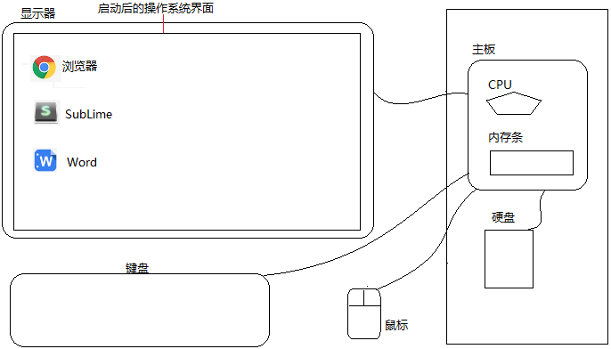
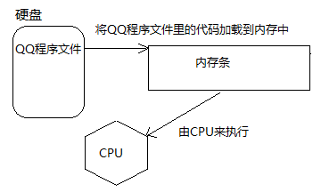
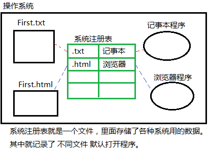
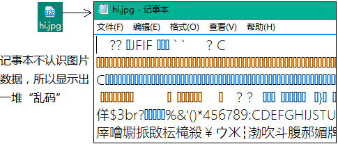
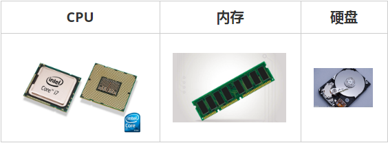

> 第02阶段.前端基本功.前端基础.入门语法

# 系统知识补充

## 学习目标
* 理解
  * 计算机组成进阶
  * 能说出 系统、程序 与 文件 三者关系

## 一. 核心内容

### 1. 计算机组成

#### 1.1 软件（程序）

- 应用软件：浏览器(Chrome/IE/Firefox)、QQ、VSCode、Sublime、Word
- 系统软件：Windows、Linux、macOS

#### 1.2 硬件

- 三大件：CPU、内存、硬盘，而 主板 是起到连接主要硬件的作用 
- 输入设备：鼠标、键盘、手写板、摄像头等
- 输出设备：显示器、打印机、投影仪等



#### 1.3 硬件运行介绍

+ 主板：起到连接各个硬件桥梁作用
+ CPU（中央处理器）
  + 负责处理数据与运算
  + 负责通过几十个针脚连接控制主板上不同的硬件
+ 内存条
  - 临时存放数据，断电后不能保存数据
  - 读写速度很快
  - 空间小（单价高）
+ 硬盘
  + 永久储存数据，断电后依然保存数据
  + 读写速度较慢
  + 空间大（单价低）


#### 1.4 程序运行介绍

+ 关于二进制简述

  简单来说 用 0 和 1 来表示数据。具体的说，是用 0 和 1 的各种不同组合 代表 不同的数据，如

```` js
0=00000000   1=00000001   2=00000010   3=00000011   4=00000100   5=00000101
6=00000110   7=00000111   8=00001000   9=00001001   10=00001010
````

+ 各种进制的数值 可以 通过 算式 换算（计算）出来

> 思考：那如果要表达字母文字呢？
> 解答：可以用数字代表字母，比如  65 代表 A。为了统一这个代表的过程，美国标准组织 制定了 ACSSII 编码表，见附件。
>            也就是说，字母 -> 数字 -> 二进制 -> 计算机

+ 关于数据储存
  + 所有数据，包含文件、图片等最终都是以二进制数据（0 和 1）的方式存放在硬盘中
  + 所有程序，包括操作系统，本质都是各种数据，也以二进制数据的方式存放在 硬盘里。平时我们所说的安装软件，其实就是把程序文件复制到硬盘中
  + 硬盘、内存都是保存的 二进制数据
+ 关于数据存储单位（bit < byte < kb < GB < TB<.....）
  + 位：1bit 可以保存一个 0 或者 1
  + 字节：1byte = 8bit
  + 千字节：1kb = 1024byte
  + 兆：1mb = 1024kb
  + 1GB = 1024mb
  + 1TB = 1024GB
+ 关于运行
  + 打开某个程序时，先从硬盘中把程序的代码加载到内存中
  + CPU执行内存中的代码
  + 注意：之所以要内存 的一个 重要原因，是因为 cpu 运行太快了，如果只从硬盘各种读数据，会浪费cpu性能。所以，才使用 存取速度更快 的 内存 来 保存 运行时 的数据。



> **系统是个大软件程序：**我们开启电脑后，由主板内置的bios程序来启动操作系统，这时会把硬盘里的操作系统启动代码加载到内存中并执行代码，然后由系统通过主板控制显示器显示界面。

### 2. 系统、程序与文件 关系

#### 2.1 概念

+ 文件名 和 文件数据 其实 没有直接的联系

理解：** 当我们双击某个文件时，操作系统会根据后缀名到注册表中找到对应的程序，并启动它打开被双击的文件。
**如： **    双击 txt文件会自动启动 `记事本程序` 打开这个文件。



+ 操作系统：其实就是一个软件程序， 是所有应用程序运行的*运行环境*（所有程序都运行在操作系统中），在开机时由电脑主板启动。（著名的有 微软的Windows，苹果的iOS，甲骨文的Linux）
+ 系统注册表：操作系统需要 *存储各种数据*  用来保证正常运行（如：已安装程序清单），所以系统会在硬盘中创建一个叫“系统注册表”，里面存储了各种系统使用的数据，**其中就记录了 不同后缀文件的 默认打开程序** 。
+ 文件后缀名：方便用户区分文件类型，方便系统记录默认启动程序。
  但它并不能保证文件内容类型与后缀名一致，因为后缀名作为文件名的一部分，可以被随意修改。*如：把 图片.jpg 改成 图片.txt*

> 注意：系统注册表 实际是一个结构较复杂的文件，并不是简单的表状结构。此处只为方便理解。

#### 2.2 常见问题

**“乱码”：** 我们可以用任何程序去打开某种文件，但有可能会因为程序不识别文件里的数据而出现乱码。

*如 用记事本去打开图片文件，但由于记事本程序不认识图片数据，所以会显示出一堆乱码。*

> 演示：用记事本程序 打开 .jpb 图片文件。



#### 2.3 小结

+ 文件后缀名作用：分辨文件类型，*关联*  默认启动程序。
+ 系统注册表中记录了 不同类型文件 的 默认打开程序

------

## 二. 扩展阅读

### 3.1 硬件真实模样

+ 主板


+ CPU 内存条 硬盘



### 3.2 为什么内存读写比硬盘快? 

+ 硬盘是有机械结构的，磁头要运动到相应的位置，转片还在转动，然后读取磁信号。

+ 内存是没有机械结构的，是电，瞬间到达。电的到达速度要比磁头的运动快得多，比盘算转动也快得多。所以，有机械结构的磁头的读取速度是不能和无机械结构电的速度相比的。

+ 补充：固态硬盘，硬盘一般分为机械硬盘和固态硬盘。固态硬盘使用的是闪存，比机械硬盘的磁盘要快得多，但也不能和真正的RAM去比速度。


