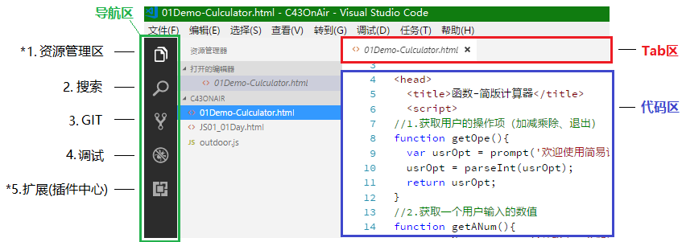

> 第02阶段.前端基本功.前端基础.入门语法

## VSCode开发工具

## 学习目标

+ 应用
  + 使用 VSCode 编辑单个文件
  + 使用 VSCode 编辑文件夹内文件，并新建 文件和文件夹
  + 能熟练使用扩展中心进行插件安装与维护
  + 使用基本Emmet语法创建 HTML 标签
  + 使用常用快捷键

## 一. 核心内容

## 1. VSCode介绍

+ Visual Studio Code（以下简称vscode）是一个微软提供的轻量且强大的 *代码编辑器* ，支持Windows，OS X和Linux。内置 JavaScript、TypeScript 和 Node.js支持，而且拥有丰富的插件生态系统，可通过安装插件来支持C++、C#、Python、PHP等其他语言。

+ VSCode 安装注意
  把 其它 里的 第 1、2、4 个 选中，方便使用时直接 **右键通过 VSCode** 打开文件夹和文件

   

  **右键通过 VSCode** 打开文件夹和文件

   


### 1.1 界面主要区域介绍

  左侧导航区 有5个选项，我们前期主要使用 第1个，偶尔使用第5个。（2、3、4 暂时用不到）

 


### 1.2 资源管理区使用

+ **单个文件编辑**
  当我们用 VSCode 打开单个文件时，在资源管理区 会在 `打开的编辑器` 区 显示文件

   

  

+ **文件夹文件编辑**

  打开文件夹 + 新建文件 和 文件夹 + 关闭文件夹

  1.打开文件夹方式

  ​	1.1通过   `打开文件夹` 按钮 来选择文件夹

  ​	

  ​	1.2通过 在 `文件夹` 上 右键鼠标    `Open With Code`

  ​	

  

  2.可以通过 快捷按钮 直接在 打开的文件夹中 **新建** 文件 和 子文件夹

   

  3.关闭文件夹
     菜单栏 文件 --> 关闭文件夹

   


### 1.3 扩展(插件中心)使用

+ VSCode 提供了众多插件，让我们可以更高效便捷的工作。这些插件 有各种官方提供的，也有用户自己编写的


+ **现在需要使用的插件：** Color Highlight，Emmet，open in browser

+ Color Highlight 一款用来在 样式表 代码 中直接显示 颜色块 的插件

  

+ Emmet 一款 **VSCode内置** 的快速 生成代码 的插件（详细语法参见扩展内容1），如：

  **1.**快速生成 HTML 页面结构：使用 `!` 或者 `html5`  + tab键

   

  **2.**快速生成 div：使用 `标签名` + tab键

   

  **3.**快速生成 3 个 li 标签

​          

+ open in browser 一款用来直接调用默认浏览器打开 文件 的插件

​     


## 2. 常见操作

### 2.1 放大缩小字体

+ 快捷键
  放大  `Ctrl` + `=` 
  缩小  `Ctrl` + `-`


### 2.2 注释

+ 快捷键
  切换注释行 `Ctrl` + `/`
  切换块注释 `Alt` + `Shift` + `A`


## 二.扩展内容

### 1. Emmet 语法规则

+ 介绍

  ```` js
  Emmet (前身为 Zen Coding) 是一个能大幅度提高前端开发效率的一个工具。在前端开发的过程中，一大部分的工作是写 HTML、CSS 代码。特别是手动编写 HTML 代码的时候，效率会特别低下，因为需要敲打很多尖括号，而且很多标签都需要闭合标签等。于是，就有了 Emmet，它可以极大的提高代码编写的效率，它提供了一种非常简练的语法规则，然后立刻生成对应的 HTML 结构或者 CSS 代码，同时还有多种实用的功能帮助进行前端开发。
  ````

  VsCode内置了Emmet语法,在后缀为.html/.css中输入缩写后按 `Tab键` 即会自动生成相应代码

+ 语法规则

  ```` 
  E 代表HTML标签。
  E#id 代表id属性。
  E.class 代表class属性。
  E[attr=foo] 代表某一个特定属性。
  E{foo} 代表标签包含的内容是foo。
  E>N 代表N是E的子元素。
  E+N 代表N是E的同级元素。
  E^N 代表N是E的上级元素。
  ````


### 2. Emmet 详细语法(常用)

#### 2.1 元素(Elements)

可以使用元素的名称，如div或p来生成HTML标签。

```` html
div => <div> </div>
foo => <foo> </foo>
html:5 => 将生成html5标准的包含body为空基本dom
html:xt => 生成XHTML过渡文档类型,DOCTYPE为XHTML
html:4s => 生成HTML4严格文档类型,DOCTYPE为HTML 4.01
a:mail          => <a href="mailto:"></a>
a:link          => <a href="http://"></a>
base            => <base href="">
br              => <br>
link            => <link rel="stylesheet" href="">
script:src      => <script src=""></script>
form:get        => <form action="" method="get"></form>
label           => <label for=""></label>
input           => <input type="text">
inp             => <input type="text" name="" id="">
input:hidden    => <input type="hidden" name=""> input:h亦可
input:email     => <input type="email" name="" id="">
input:password  => <input type="password" name="" id="">
input:checkbox  => <input type="checkbox" name="" id="">
input:radio     => <input type="radio" name="" id="">
select          => <select name="" id=""></select>
option          => <option value=""></option>
bq              => <blockquote></blockquote>
btn             => <button></button>
btn:s           => <button type="submit"></button>
btn:r           => <button type="reset"></button>
````

#### 2.2 文本操作符(Text)

```` html
div{这是一段文本}  =>  <div>这是一段文本</div>
a{点我点我}  =>  <a href="">点我点我</a>
````

#### 2.3 属性操作符(Attribute)

属性运算符用于修改输出元素的属性，如：id 和 class ( `elem#id` and `elem.class` )

```` html
div.test  =>  <div class="test"></div>
div#pageId  =>  <div id="pageId"></div>
````

#### 2.4 嵌套操作符(Nesting)

嵌套操作符用于将缩写元素放置在生成的树中，是否应放置在上下文元素的内部或附近

+ 子级：通过 `>` 字符标识元素生成嵌套子级元素，可以配合元素属性进行连写，如：

```` html
div#pageId>ul>li 
=> 
<div id="pageId">
    <ul>
        <li></li>
    </ul>
</div>
````

+ 同级：通过 `+` 字符表示生成兄弟级元素，如：

```` html
div#pageId+div.child
=>
<div id="pageId"></div>
<div class="child"></div>
````

+ 父级：`^` 用于生成父级元素的同级元素，从这个 `^` 字符所在位置开始，查找左侧最近的元素的父级元素并生成其兄弟级元素，如：

```` html
div>p.parent>span.child{有趣的代码}^ul.brother>li
=>
<div>
    <p class="parent">
        <span class="child"></span>
    </p>
    <ul class="brother">
        <li></li>
    </ul>
</div>
````

#### 2.5 乘法(Multiplication)

+ 使用 N 即可自动生成重复项，N是一个正整数。

```` html
ul>li*3
=>
<ul>
	<li></li>
	<li></li>
	<li></li>
</ul>
````

#### 2.6 自动计数(numbering)

+ 生成重复项时增加一个序号，只需要加上 `$ ` 符号即可。

````html
ul>li.item${$}*3
<ul>
	<li class="item1">1</li>
	<li class="item2">2</li>
	<li class="item3">3</li>
</ul>
````

> 注意：如果生成 两位数 则使用两个连续的 $$，更多位数以此类推~~

#### 2.7 Emmet生成CSS语法

+ Emmet 不仅能生成 HTML，还可以生成 CSS

参考：[【emmet系列之CSS语法】](http://www.cnblogs.com/moyuling/p/4939922.html)

### 3. VSCode 常用快捷键

```` js
上下移动一行：Alt + Up / Alt + Down
向下复制行：Shift + Alt + Down
代码行缩进：tab / shift tab
列选择：ALT＋左键单击

转到行首/行尾：Home / End
转到文件头/文件尾：Ctrl + Home / Ctrl + End

html代码格式化：Shift＋Alt + F

文件切换：Ctrl + Tab
文件/文件夹重命名：F2

转定义：F12 / Ctrl + click
预览定义：Alt + F12
查看引用：Shift + F12
命令面板：F1
````

+ 可以修改快捷键：菜单 文件 --> 首选项 --> 键盘快捷方式
  小技巧：可以通过 这个方式 了解所有 快捷方式

  

## 四.深度阅读

[《VsCode中使用Emmet神器快速编写HTML代码》](https://www.cnblogs.com/summit7ca/p/6944215.html)


[《vscode: Visual Studio Code 常用快捷键》](http://www.cnblogs.com/bindong/p/6045957.html)