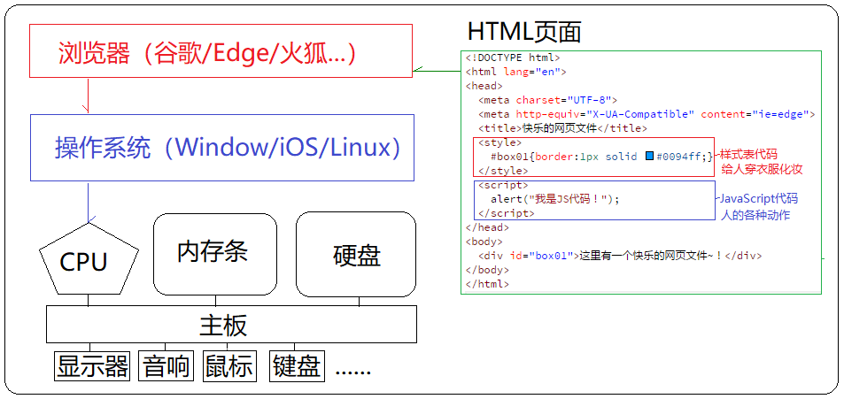
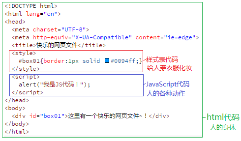
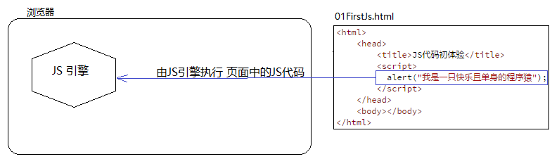
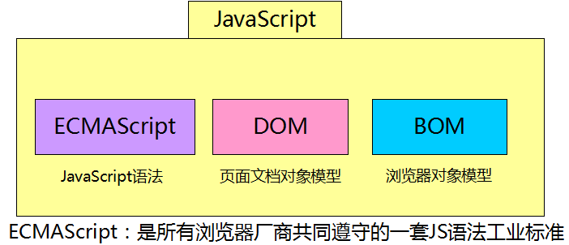
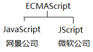
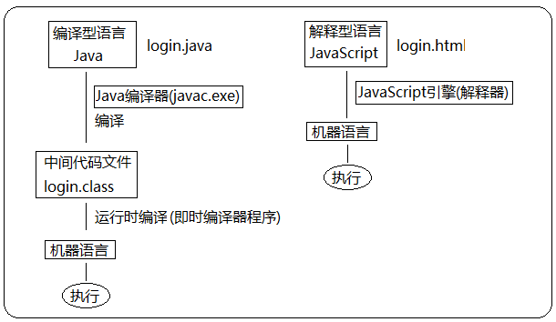

> 第02阶段.前端基本功.前端基础.入门语法

# 认知 JavaScript

## 学习目标
* 理解
  * 能说出 JavaScript 是什么
  * 能说出 HTML、CSS、JS 的关系
  * 能说出 JS 基本运行原理


## 一.核心内容

### 0. 硬件、系统、软件关系图

+ CPU、内存条、硬盘 等各种硬件 通过 主板相连，CPU可以通过指令信号指挥调度各种硬件
+ **操作系统** 本质上 就是一个大的软件，通过控制CPU对硬件进行协调调用
+ 浏览器 是一个运行在 **操作系统** 里的 代码 (C语言)
+ HTML页面 是一个 运行在 **浏览器** 里的 代码 （HTML + CSS + JS）




### 1. 为什么要学 JavaScript

- 用代码操作浏览器，如：
  - 让HTML元素动起来
  - 控制Cookies，包括创建和修改等
- 业务逻辑控制，如：
  - 在数据被提交到服务器之前验证数据

> 演示：

- 页面各类动态广告
- 表单动态校验（密码强度检测）
- 各类动画效果（百度地图）
- 在线游戏（偷菜、三国志）


### 2. JavaScript 是什么

**概念：**JavaScript 是世界上最流行的编程语言。可用于 HTML 和 web，更可广泛用于服务器、PC、笔记本电脑、平板电脑和智能手机等设备。 JavaScript 被设计为向 HTML 页面增加交互性。

**通俗：**JavaScript 主要用在浏览器端运行的脚本编程语言，可用来实现各种业务和页面控制。*现在也可以基于Node.js技术进行服务器端编程。*

**本质：**JavaScript 是一种逻辑控制代码，最终会转成 cpu 的指令集，控制 cpu 执行各种逻辑操作与硬件操作。

#### 2.1 代码初体验

> 演示：01FirstJs.html
>
> 注：为节约页面篇幅，使用方便第一次阅读，省略掉html各种设置

```html
<html>
    <head>
        <title>JS代码初体验</title>
		<script>
			alert("我是一只快乐且单身的程序猿");
		</script>
    </head>
    <body></body>
</html>
```

#### 2.2 HTML/CSS/JS 关系

+ HTML/CSS 是 **描述类语言**

  HTML 决定网页结构和内容( 决定看到什么 )，*相当于人的身体*

+ CSS 决定网页呈现给用户的模样( 决定好不好看 )，*相当于给人穿衣服、化妆*

+ JavaScript 是 **编程类语言**

  实现业务逻辑和页面控制( 决定功能 )，*相当于人的各种动作*




### 2.浏览器执行JS简介

> 提问：为什么浏览器可以执行JS代码呢？

**回顾：** 我们写的代码可以看做是对浏览器下的命令，浏览器收到后，要按照我们的代码来*做事情*。

**概念：** 浏览器本身并不会执行JS代码，而是通过内置 **JavaScript引擎(解释器)** 来执行JS代码。



**执行逻辑：** `JS代码` -> `JS引擎` -> `执行js逻辑代码 *& 调用浏览器 dom接口*` -> `执行结果`

JS引擎执行代码是逐行解释每一句源码，所以 JavaScript语言 归为 “解释型语言”。


-----

## 3.扩展内容 @

### 3.1 JS 特点(了解)

- JavaScript 是一种轻量级的编程语言。（平时也被简称为 JS）
- JavaScript 是可插入 HTML 页面的编程代码。
- JavaScript 插入 HTML 页面后，由浏览器执行。
- JavaScript 很容易学习。（其实编程很简单，和学会用工具做家具一样）

### 3.2 JS 历史(了解)

Netscape在最初将其脚本语言命名为LiveScript，后来Netscape在与Sun合作之后将其改名为JavaScript。JavaScript最初受Java启发而开始设计的，目的之一就是“看上去像Java”，因此语法上有类似之处，一些名称和命名规范也借自Java。JavaScript与Java名称上的近似，是当时Netscape为了营销考虑与Sun微系统达成协议的结果。Java和JavaScript的关系就像张雨和张雨生的关系，只是名字很像。

​	Java  服务器端的编程语言

​	JavaScript  运行在客户端(浏览器)的编程语言

> JavaScript是一种运行在***客户端*** 的***脚本语言*** 
> JavaScript的解释器被称为JavaScript引擎，为浏览器的一部分，广泛用于客户端的脚本语言，最早是在HTML（标准通用标记语言下的一个应用）网页上使用，用来给HTML网页增加动态功能。

### 3.3 JavaScript 最初的目的(了解)

演示：https://www.aliyun.com
最初的目的是为了处理表单的验证操作，后来功能越来越强大，以至于发展出今天的前端技术。

### 3.4 JavaScript 应用场景(了解)

JavaScript 发展到现在几乎无所不能。

1. 网页特效
2. 服务端开发(Node.js)
3. 命令行工具(Node.js)
4. 桌面程序(Electron)
5. App(Cordova)
6. 控制硬件-物联网(Ruff)
7. 游戏开发(cocos2d-js)

### 3.5 JavaScript 的组成(了解)



+ ECMAScript（ECMA 欧洲计算机制造联合会）

  ECMAScript是一套JS语言设计标准，描述 JavaScript 语言基本语法和数据类型，以及其它实现标准。

  


+ BOM - 浏览器对象模型

  一套提供给程序员 **操作浏览器功能** 的API

  通过BOM可以操作浏览器窗口，比如：弹出框、控制浏览器跳转、获取分辨率等

+ DOM - 文档对象模型

  一套提供给程序员 **操作页面元素** 的API

  通过DOM提供的API可以对页面上的各种元素进行操作（大小、位置、颜色等）

### 3.6 解释型语言 和 编译型语言

*计算机不能直接理解任何除机器语言以外的语言*，所以必须要把程序员所写的程序语言翻译成机器语言，计算机才能执行程序。*程序语言翻译成机器语言的工具，被称为编译器*

编译器翻译的方式有两种：一个是*编译*，另外一个是*解释*。两种方式之间的区别在于*翻译时间点的不同*。

编译器是在代码执行之前进行编译，生成中间代码文件。

解释器是在运行时进行及时解释，并立即执行。(当编译器*以解释方式运行的时候*，也称之为*解释器*)



## 4.深度阅读 @

[《前端必读：浏览器内部工作原理》 ](http://www.cnblogs.com/jameszou/p/8470097.html)

[《漫谈JS引擎的运行机制 你应该知道什么》 ](http://www.jb51.net/article/86663.htm)


