>  第02阶段.前端基本功.前端基础.入门语法 - from：JamesZou

# 基础语法

## 学习路线图

+ 学习路线图

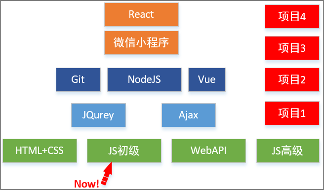

+ **JS初级** 核心知识

  **数据类型、变量、条件语句、循环语句、数组、函数、对象**

## 今日学习目标

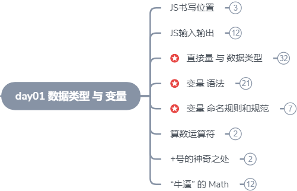
* 推荐在线学习网站
  * 由于前端开发正处于高速进化期，语法和框架更新都较快，有需要可以通过权威网站来了解
  * MDN：
    * https://developer.mozilla.org/zh-CN/ 
    * https://developer.mozilla.org/zh-CN/docs/Web/JavaScript
  * 在线编程游戏
    * https://codecombat.163.com/

## 一.核心内容

## 0. 浏览器端语言

### 0.1 浏览器三种语言

+ HTML(标记语言) ： 页面的结构和内容 
+ CSS(样式表)：页面的样式
+ JavaScript(逻辑语言)：页面的逻辑与行为


### 0.2 JavaScript 组成

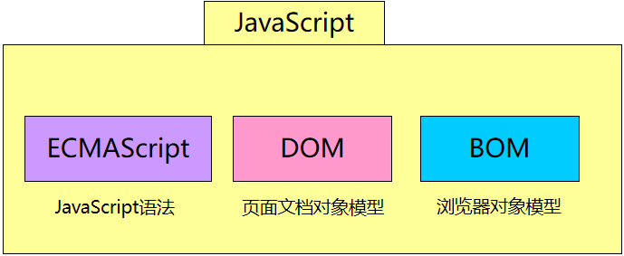

+ ECMAScript（ES）：逻辑编程语法，可以用来实现业务逻辑

+ DOM（文档对象模型）

  一套提供给程序员 **操作页面元素** 的API

  通过DOM提供的API可以对页面上的各种元素进行操作（大小、位置、颜色等）

- BOM（浏览器对象模型）

  一套提供给程序员 **操作浏览器功能** 的API

  通过BOM可以操作浏览器窗口，比如：弹出框、控制浏览器跳转、获取分辨率等


## 1. JS代码 书写位置

> 联想：CSS 行内样式表、嵌入样式表、外部样式表

JS代码不能随意写在HTML页面中，否则会被当做普通字符串。
JS的书写位置如样式表一样有3种书写位置，分别为 *行内、内嵌、外部* 

### 1.1 行内 JS

+ 可以将 **单行或少量JS代码** 写在HTML标签的事件属性（以 `on` 开头的属性），如：`onclick`
+ 注意单双引号的使用：尽管HTML中单引号和双引号都可以，但前端开发时规范引号都用双引号

````html
<input type="button" value="事件中编写JS" onclick="alert('Hello JS World')" />
````

**缺点：**

+ 可读性差， 在html中编写JS大量代码时，不方便阅读
+ 引号易错，引号多层嵌套匹配时，非常容易弄混

### 1.2 内嵌 JS 

+ 可以将 **多行JS代码** 写到 `<script>` 标签中

````html
<head>
  <script>
    alert('Hello JS World~!');
    alert('Keep learning~!');
  </script>
</head>
````

+ **注意：**
  + js 每行结束 用 **; ( 分号 )**  结尾  -- 非严格模式下可以省略，但建议每句结束都加上分号
  + 内嵌 JS 是学习期间最常用的方式

### 1.3 外部 JS 文件

+ 利于HTML页面 代码结构化，把大段 JS代码 独立到 HTML页面 之外。既美观，也方便文件级别的复用：

  从而让 不同的 HTML页面 可以 引入 同一个 JS文件。

````html
<script src="outdoor.js"></script>
````

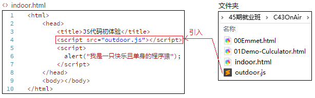

 **注意：**引用外部 js 文件的 script 标签中不可以写代码

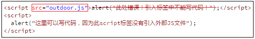

### 1.4 小结

+ 三种JS书写位置：行内、内嵌标签 ( 学习期间 推荐 )、外部引入 ( 工作后看情况 )
+ 三种语言各司其职

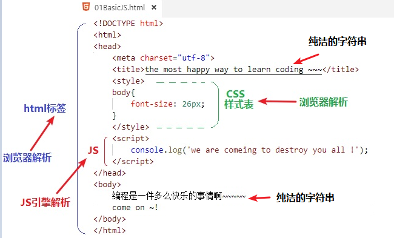


## 2.注释

### 2.1 什么是注释

+ **概念：**是代码文件中的解释性文本，在运行代码时，会被 `JS引擎` 跳过，不做处理。
+ **为什么要有注释：**开发者在编写程序时需要做一些说明文字，提高程序代码的可读性，以便于以后的开发人员参考、修改。
+ 有两种注释格式：`单行注释` 与 `多行注释`

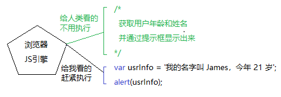

### 2.2 单行注释

+ 用来注释单行文字

```` javascript
// 我是一行文字，不想被 JS引擎 执行，所以 注释起来
var usrName = "James"; // 也可以在一句代码 结束后 写注释
````

### 2.3 多行注释

+ 用来注释多行文字

```` javascript
/*
  获取用户年龄和姓名
  并通过提示框显示出来
*/
var usrInfo = '我的名字叫 James，今年 21 岁';
alert(usrInfo);
````

> **提问：如果有一段代码不需要执行怎么办？**

## 3. 基础输入输出

> 为了方便JS基础入门课程的学习，我们在此教大家简单使用的输入输出方式

+ 所谓 **输入**，就是 **用代码** **获取** 用户 **键盘** 等硬件 输入的信息，如：去银行取钱，在 ATM 上输入密码
+ 所谓 **输出**，就是 用代码 显示数据 给用户看。
+ 如我们本节获取用户在 **键盘** 上的输入信息，需要使用到浏览器 `prompt` 函数

### 3.1 关于函数（Function） 

> 此节只需简单了解函数用法，后面有专门课程详解函数

- 函数：一个 **提前准备好的功能**（别人或者自己写的代码），**可以直接使用**，而 **不用关心内部的细节**
  - 比如电视机：不需要每个人 都自己 拼一台电视机 出来，而是 直接买一台别人拼好的，然后 点按钮
- 如今天要学的以下4个函数：

| 函数              | 说明                                       | 归属       |
| ----------------- | :----------------------------------------- | ---------- |
| prompt(info)      | 用户输入框，接收用户输入，info是提示信息 | 浏览器提供 |
| confirm(info) | 确认选择框，接收用户选择，info是提示信息 | 浏览器提供 |
| alert(msg)        | 用浏览器提示框显示msg                      | 浏览器提供 |
| console.log(msg) | 用浏览器控制台显示msg                      | 浏览器提供 |
| * document.write(msg) | 向浏览器body标签中输出msg | JS语法内置 |

### 3.2 prompt() 获取输入

- 消息输入窗：在 JS 中可以使用浏览器提供的 `prompt` 函数从键盘接收用户的输入
  - 括号中的参数 info 是用来显示在输入窗给用户看的提示信息
- 用户输入的 **任何内容** 都是一个 **字符串**
- 语法如下：

```` javascript
prompt('请输入您的名字'); //会在输入窗显示给用户看的提示信息
````

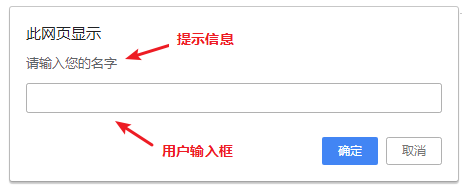


### 3.3 confirm() 确认框

+ 确认框：用来提醒用户是否确认操作，会返回 一个 bool 值

```js
confirm('你确认要养我吗？'); //显示给用户看的提示信息
```

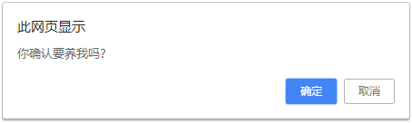

> **思考： 如何显示 用户输入的数据？**

### 3.4  alert() 消息框

- 消息弹出窗：在 JS 中可以使用浏览器提供的 `alert` 函数 显示消息
- 语法如下：

```` javascript
alert("请问有空吗？");
````
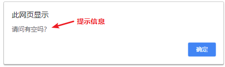

### 3.5  console.log() 控制台输出

- 控制台输出：在浏览器控制台输出消息，可以通过 F12键 打开控制台
- 语法如下：

```` javascript
console.log('深圳的空气确实不错，不过我还是想去P城~~~ ：）');
````

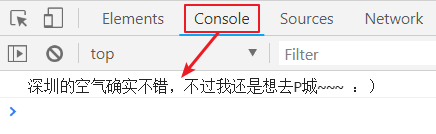


## 4. 直接量和数据类型简介

### 4.1 直接量

> 直接在代码中表示数据值

```js
// 1. 各种数值
console.log(10);
console.log(27.1);
console.log(-100);

// 2. 各种字符串
console.log('James');
console.log('1000');
console.log("Linda");
console.log("1000");

// 3. 两种布尔值 对/错
console.log(true);
console.log(false);
```


### 4.2 数据类型简介

+ 计算机世界里有各种数据值，如：`11`，`true`，`'字符串~~'`
  不同的数据值 的 处理方式 和 存储方式 都不同，我们为这些值分好了类别，统称为 **数据类型**
+ JavaScript 中的数据类型 分两大类：**简单数据类型** 和 **复杂数据类型**

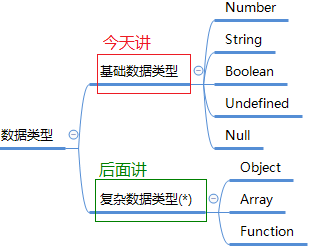


## 5. 简单数据类型(值类型)

| 简单数据类型     | 说明            | 默认值 |
| -------- | ----------------- | :------- |
| Number | 数值类型，包含 整型值和浮点型值，如 21、0.21 | 0 |
| String | 字符串类型，如 'James' | '' |
| Boolean | 布尔值类型，如 true 、false，等价于 1 和 0 | false |
| Undefined | var a;   声明了变量a 但是没有给值，此时 a = undefined | undefined |
| Null | 表示空的对象 | null |

### 5.1 Number 数值类型

+ JavaScript 只有一种数字类型：正数、负数、整数、小数，都用 Number类型的变量保存

```` js
var usrAge = 21;// 整数
var doubleNum = 21.3747;// 浮点小数
var dNum = -101; // 负数
````


#### 5.1.1 科学计数法

+ 当我们保存一个很大的数值时，可能有很多0，如：1个亿 = `100000000`，但很容易写错 0 的个数
+ 所以我们可以用数学里的科学计数法来表示：`1e8`

````javascript
var y=123e5;  // 12300000 : e 后面跟正整数，代表 小数点向右移动 n 位
var z=123e-5; // 0.00123  : e 后面跟负整数，代表 小数点向左移动 n 位
````

> 思考：变量所占用的空间有限，那最大数是多少？最小数是多少呢？

#### 5.1.2 数值范围

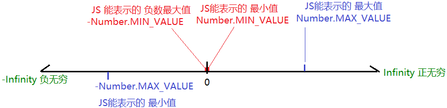

+ JS 中的 数值的 **最大值 和 最小值** 存放在两个地方： 

  + 最大值：`Number.MAX_VALUE`，这个值为： `1.7976931348623157e+308`

  + 最小值：`Number.MIN_VALUE`，这个值为：`5e-324`

```` js
console.log(Number.MAX_VALUE); // 1.7976931348623157e+308
console.log(Number.MIN_VALUE); // 5e-324 是一个无限接近于 0 的正数
````

+ **无穷大 和 无穷小** ，是两个特殊值（本身并不代表一个确定的数字，相当于2个符号）
+ 无穷大：`Infinity` ，代表无穷大，大于任何数值
  
+ 无穷小：`-Infinity` ，代表无穷小，小于任何数值

```js
console.log(Infinity); // Infinity
console.log(-Infinity); // -Infinity
```


### 5.2 String 字符串类型

+ 用于表示 `文本数据` ，由 一对 双引号 `""` 或 一对 单引号` '' ` 包裹

```` javascript
var strMsg = "我爱北京天安门~";  // 使用 双引号 表示字符串
var strMsg2 = '我爱广州小蛮腰~'; // 使用 单引号 表示字符串

// 常见错误
var strMsg3 = 我爱上海黄浦江;    // *报错*，没使用引号，会被认为是 js代码，但js没有这些语法
````

+ 字符串的嵌套

如何显示 `我是"高帅富"程序猿` ？（注意里面包含一对双引号）

```` javascript
var strMsg = '我是"高帅富"程序猿';  // 可以用   '' 包含 ""
var strMsg2 = "我是'高帅富'程序猿"; // 也可以用 "" 包含 ''

// 常见错误
var badQuotes = 'What on earth?"; // *报错*，不能 单双引号搭配
````

+ JS 可以 用 `单引号` 嵌套 `双引号` ，或者 用 `双引号` 嵌套 `单引号`

> **问题：**那开发时，到底用 单引号还是双引号 来表示字符串呢 ？
> **回答：规范 统一用** `单引号` 


### 5.3 Boolean 布尔类型

- 编程时经常遇到只有 两个限定值 的情况，如：性别、是否、对错...
  布尔类型 就是专门为这种情况设计的。
- 布尔类型的值只有两个：`true` 和 `false`
  - 补充：true 相当于 1， fase 相当于 0

- 常见的 3个 例子：

```js
//1.用布尔类型的变量表示 性别
var sex = true; // 男
sex = false; // 女

//2.用布尔类型的变量 表示 是否
var isOk = true; //是
isOk = false; //否

//3.用布尔类型的变量 表示 对错
var isRight = true; // 对
isRight = false; // 错
```


### 5.4 Undefined 未定义类型

+ 一个声明后没有被赋值的变量会有个默认值 undefined。

```` javascript
var usrName; // 声明变量后没有直接赋值，此时它的默认值就是 undefined
alert(usrName); // 显示 undefined
````


### 5.5 Null 空对象类型

+ null类型被看做空对象指针，前文说到null类型也是空的对象引用。只有一个值，即 null 值

```` javascript
var usrObj = null;
alert(usrObj); // null

var usrInput = prompt('请输入您的名字：'); // 如果用户点击取消 或 输入空内容，也会返回 null
alert(usrInput); // null
````

+ 如果你定义了一个变量，但是想在以后把这个变量当做一个对象来用，那么最好将该对象初始化为 null 值
+ 如果你想把一个对象占用的内存释放掉，办法之一就是把这个变量设置为 null

+ 设置 null 的两个方式：
  + 手动设置给变量
  + JS引擎  也会在释放对象空间后把变量设置为 null
  + 在调用prompt方法时，如果用户点击取消，也会返回 null


### 5.6 undefined 和 null 判等

> **提问：undefined 和 null 是否相等呢？**

```js
undefined == null // true 因为都表示为空，都能转成 0
undefined === null // false 因为数据类型不同
```


### 5.7 typeof 获取数据类型

+ typeof 可用来获取数据的数据类型，返回 被检测数据 的 `类型名称字符串`
+ 语法：
  + typeof  数据
  + typeof( 数据 ) 

```` javascript
console.log(typeof 520);                 // 'number'
console.log(typeof '想和你一起跳 P城~~');  // 'string'
console.log(typeof true);                // 'boolean'
````

+ 不同类型返回值

| 类型         | 例                 | 结果         |
| ------------ | ------------------ | ------------ |
| String       | typeof "小白"      | "string"     |
| Number       | typeof 3747        | "number"     |
| Boolean      | typeof true        | "boolean"    |
| Undefined    | typeof undefined   | "undefined"  |
| **Null**     | **typeof null**    | **"object"** |
| 函数         | typeof alert;      | "function"   |
| 任何其它对象 | typeof  new Date() | "obejct"     |

> 思考：NaN、Infinity 会打印出什么类型？

### 5.8 小结

+ Number ：JS中的数值类型变量 可以保存 整型数值 和 浮点型数值
+ String ：字符串用 ``` `  和 `""` 都可以，但前端开发统一规范使用 单引号 `var usrName = '字符串值'`
+ Boolean：布尔值 用 `true ` 和 `false`
+ Undefined：声明后未赋值的变量的默认值
+ Null：空对象
+ 可用 typeof 获取 数据类型名称

## 6. 变量

> 思考：但相同的直接量需要重复使用，修改起来很麻烦~~！有没啥办法呢？

```js
console.log('i love u ~');
console.log('i love u ~');
console.log('i love u ~');
console.log('i love u ~');
console.log('i love u ~');
```

### 6.1 什么是变量？


+ 通俗：变量就是一个装东西的盒子
+ 概念：变量是用于存放数据的**容器**，内容可以修改，一次可以用来装 一个 数据
+ 本质：变量是程序在 内存 中申请的一块用来存放数据的 空间

#### 6.1.1  声明和赋值

+ **第一种：先声明，后赋值**  -- 注意：var 和 变量名 之间的空格 不能省

```js
var age; // 变量声明 - 声明了一个 名字叫做 age 的变量
age = 10; // 变量赋值 - 向变量 age 赋值
console.log(age); // 打印 age里保存的值：10 
```


  + **第二种：声明和赋值一行完成**  -- 注意：var 和 变量名 之间的空格 不能省

```js
var age = 10; // 声明和赋值一次完成
console.log(age); // 打印 age里保存的值：10
```

+ 代码图解

  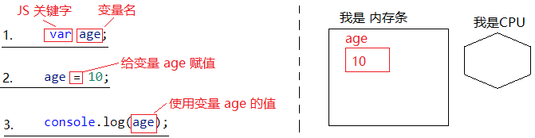

  + `var` 是 一个 JS关键字，用来 声明变量 - 本质：CPU在内存条中申请一个空间

  + `age` 是 程序员定的 **变量名**，用来方便程序员通过代码 访问变量空间

  + `= ` 用来把 右边的**值** 赋给 左边的 **变量空间**中


> 解决上面的问题：
> 用变量保存要打印的字符串，修改的时候 只需要修改 变量里的值就行了！

```js
var str = 'i love u ~';
console.log(str); // i love u ~
console.log(str); // i love u ~
console.log(str); // i love u ~
console.log(str); // i love u ~
console.log(str); // i love u ~
```


#### 6.1.2 修改变量值

+ 每个变量中只能存放一个值，所以一旦放一个新的值，会把原来的值替换

```js
var age = 101;
console.log(age); // 打印 age里保存的值：101

age = 18; // 把变量 age 的值改为 18
console.log(age); // 打印 age里保存的值：18
```

> **课堂练习**  时长：5分钟
>
> 要求：使用内嵌 JS 方式，编写上1段 代码，并通过 浏览器运行。


#### 6.1.3 练习易错

> 大家前期使用变量时 常遇到 两种类型的问题：

+ 变量名 和 字符串 容易弄混

```js
var uName = 'a';
console.log('uName'); // 字符串 'uName'
console.log(uName); // 'a'
```

+ 不声明，不赋值，报错！

```js
console.log(ccc); // 报错，因为访问了一个 不存在的变量
```


#### 6.1.4 变量的几个情况

+ 只声明，不赋值，默认为 undefined

```js
var usrName; // 声明变量
console.log(usrName); // undefined - 未定义
```

+ 不使用 var 关键字来创建变量（不建议使用）

```js
usrAge = 27; // 不使用 var 关键字来声明变量 并赋值
console.log(usrAge); // 27
```

+ 声明同名变量，后面的会覆盖前面的

```js
var age = 1;
console.log(age); // 1
var age = 2;
console.log(age); // 2
```


### 6.2 为什么要有变量？

#### 6.2.1 存储、复用 值

比如：将 打印输出的 "Linda" 改成 "Jenis"，下面两种方式哪种更好呢？

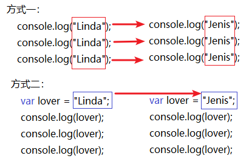


#### 6.2.2 接收用户输入的值

- 因为用户是在程序运行后输入的值，程序员在写程序代码时无从得知，所以可以用变量接收用户的值。

```js
var lover = prompt("请输入暗恋对象的名字：");
alert("我的天哪，竟然是ta:" + lover); // 注：用 +号 连接 字符串 和 变量，拼成一个新的字符串
```


### 6.3 变量命名规则和规范

- **a. 规则** 必须遵守的，不遵守的话 JS引擎 发现并报错

  > 规则 相当于人类社会的法律，犯法就坐牢

- 由 字母(A-Za-z)、数字(0-9)、下划线(_)、美元符号( $ )组成，如：`var usrAge, num01, _name`

  ```js
  var var = 12; // 报错
  console.log(var); // 报错
  ```

- **不能** 以数字开头 `var 1$$$__8age = 1;`

- **不能** 是关键字、保留字 和 代码符号，例如：var、for、while、+ 、&
  
  - 区分大小写 `强调：JS 严格区分大小写` ，`var app;` 和 `var App;` 是两个变量
  
```` js
  // JS 区分大小写，所以当 大小写 不一样时，JS引擎 会认为是两个变量
  var age = 1;
  var Age = 2;
  alert(age + Age); // 3
````


- **b. 规范**  建议遵守的，不遵守的话 JS引擎 也不会报错

  > 规范 相当于 人类社会的 道德，违反了不会有警察找你，但旁人可能指责你

  - 变量名必须有意义  `var aaa = 18;`

  - 遵守驼峰命名法。首字母小写，后面单词的首字母需要大写。

    如：`usrName` 、 `usrPassword ` 、`xiAn`

> **提问：以下哪些变量名不合法**


|第一组|第二组|第三组|
|:---|:----|:---|
|var a|var usrName|var theWorld|
|var 1|var $name|var theworld|
|var age18|var _sex||
|var 18age|var &sex||

特殊情况：

​		变量名 不要用 `name` ，原因以后再说

​		变量名 区分大小写


### 6.4 变量语法扩展

> 以下语法不推荐使用

+ 不用 var 关键字
  + 可以不用 var 关键字，直接 声明赋值，但强烈不推荐！

```js
age = 10;
console.log(age);
```

+ 同时声明多个变量

```js
var age, name, sex; // 一次声明 3个变量
age = 10;
name = 'zs';
sex = 2;
```

+ 同时声明多个变量并赋值

```js
var age = 10, name = 'zs',sex = 2;
```

+ 同时给多个变量赋值

```js
var age,name,sex;
age = name = sex = 120;
```

+ 变量给变量赋值

```js
var age = 101;
var myage = age; // 将 age 里的 10 复制 一份 给 myage
console.log(myage); // 101
```

​			图解

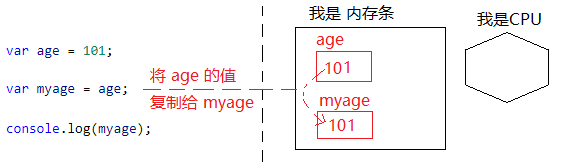


> **课堂案例** 5分钟
> 要求：交换两个变量的值 ( *实现思路：使用一个 临时变量 用来做中间存储* )
> 思路：杯子1装满可乐，杯子2装满了茶，要把两个杯子里的饮料对调，可以借用第三个杯子

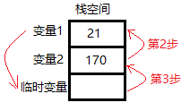


### 6.5 小结

+ 变量 是内存里的一块空间，用来存储数据
  + var my27Lover_Name = '小白';
  + my27Lover_Name  = '小白白';


## 7. 运算符（上）

### 7.1 算数运算符

+ 算数运算符 是完成基本算数运算使用的符号，用来处理四则运算

| 运算符 | 描述         | 实例                                    |
| ------ | ------------ | --------------------------------------- |
| +      | 加           | 10 + 20 = 30                            |
| -      | 减           | 10 - 20 = -10                           |
| *      | 乘           | 10 * 20 = 200                           |
| /      | 除           | 10 / 20 = 0.5                           |
| %      | 取余数(取模) | 返回除法的余数 9 % 2 = 1                |
| **     | 幂           | 次方、乘方，2 ** 3 = 8 （2 * 2 *2 = 8） |

**例子：**

+ 数字 运算

```` js
var res = 15 + 6; // 21
res = 21 - 15; 	  // 6
res = 3 * 5;      // 15
res = 10 / 20;    // 0.5
res = 9 % 2;      // 1
res = 2 ** 3;     // 8
````

+ 数值变量 运算

```js
var n1 = 3;
var n2 = 7;
// 存了数值 的 变量 之间也可以进行 算数运算
var res = n1 * 2; // 6
res = n1 * n2;    // 21
```


+ 注意：
  + 数字 / 0 = Infinity ，因为除数不能为 0 （除数为0 会得到 无穷大）

  + 0 / 0 = NaN

  + 数学中除不尽时会得到无限位小数，JS 中只保留小数点后面 15-17位，如：

    `10 / 3 = 3.3333333333333335`
  
    在JS 中，不要直接 使用 小数数值进行运算

### 7.2 神奇的 + 号

#### 7.2.1 求和运算


- 特殊情况：数值 + 布尔值，会 直接把布尔值当做 1 或者 0 来进行运算

```js
//2.1 数值相加
alert(15 + 6); // 21

//2.2 数值与布尔值相加，会 把 true 当成 1 ，false 当成 0
alert(15 + true); // 相当于 15 + 1，等于 16
alert(15 + false); // 相当于 15 + 0，15
```


#### 7.2.2 连接字符串

+ **字符串** + **任何类型数据** = 拼接之后的**新字符串**

> 两边 有任意一边 是 字符串时，会将两边转成字符串，然后 将 两个 字符串 拼接为一个 新的字符串，返回。

```javascript
alert('a' + 'b'); // 'ab'
//1.1 字符串 "相加"
alert('hello' + ' ' + 'world'); // ’hello world‘
//1.2 数值字符串 "相加"
alert('100' + '100'); // ’100100‘
//1.3 数值字符串 + 数值
alert('11' + 12); // '11' + '12'   ->  ’1112‘
//1.4 字符串 + 布尔值
alert('male：' + true); // ’male：true‘
```

+ **变量"相加"**：要看 两个变量中的值 是否有 字符串，如果有，就起到连接字符串作用

```js
var cityName = 'P城';
var gunName = 'Scar';
var str = cityName + gunName + ',天下无敌~~~';
console.log(str);
```

#### 7.2.3 数值字符串 转 数值

+ 可以将 "数值字符串" 转成 数值

```js
var num = +'120'; // 120
console.log( typeof num ); // number
```

> 思考题：

```js
//思考1：使用下面变量中的值 做自我介绍：你们好呀~我的名字叫 心安理得的伏地魔
var usrName = '心安理得的伏地魔';
console.log('你们好呀~我的名字叫 ' + usrName);

//思考2：如何接受用户的名字并 打印：'你好，【James】，我是您的高级管家~~~'
var usrName = prompt('请输入您的名字：');
console.log('你好，【' + usrName + '】，我是您的高级管家~~~');

//思考3：接受用户的年龄，并为这个年龄 + 10岁，最后打印
var usrAge = +prompt('请输入您的年龄：'); // +'18' -> 18
console.log(usrAge + 10); // 18 + 10
```


### 7.3 复合赋值运算符

>  复合算数运算符
>
> 思考：用一个变量保存了 James 的钱，然后再此基础上再加 50万，怎么实现呢？

+ **概念：**让变量 自身 与 数据 运算，结果 赋给 变量本身

```js
var age = 10;
age += 5; // age = age + 5;  -> age = 10 + 5;
console.log(age); // 15
```

+ 代码图解

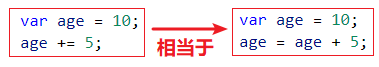

| 运算符    | 描述     | 实例                                   |
| --------- | -------- | -------------------------------------- |
| x  +=  y  | 加等于   | var x = 1;    x += 4;    //  x = x + 4 |
| x   -=  y | 减等于   | var x = 2;    x -= 3;     // x = x - 3 |
| x  *=   y | 乘等于   | var x = 3;    x *= 2;    // x = x *2   |
| x  /=   y | 除等于   | var x = 4;    x /= 1;     // x = x /1  |
| x  %=  y  | 取模等于 | var x = 10;   x%=3 ;   // x = x %      |

+ 例子：

```js
var x = 1;
x += 5; // -> x = x + 5; 结果 6

var x = 10;
x -= 3; // -> x = x - 3; 结果 7
console.log(x); // 7

var x = 7;
x *= 3; // -> x = x * 7; 结果 21
console.log(x); // 21

var x = 10;
x /= 2; // -> x = x / 2; 结果 5
console.log(x); // 5

var x = 10;
x %= 3; // -> x = x % 3; 结果 1
console.log(x); // 1
```


#### 7.3.1 神奇的 += 号

+ **+=** 可以对字符串变量起到 连接的作用

```js
// 字符串连接
var str = 'Hi~';
str += '今天天气不错哦~'; // str = str + '今天天气不错哦~';
console.log(str); // Hi~今天天气不错哦~
```


> **课堂练习**  用时：5分钟
> 要求：练习下段代码

```js
var age = +propmt('请输入您的年龄：');
age += 10;
alert('您的年龄为：' + age);
```

## 8.Math高级数学函数

> Math 可以看成是 JS提供给 开发者的一个 高级算数 工具包

### 8.1 圆周率

```js
console.log(Math.PI); // 3.141592653589793
```

### 8.2 绝对值、求次方函数

+ **绝对值函数**：将负数前面的 - 去掉

```js
var absNum = Math.abs(- 2);
console.log (absNum); //2
```

+ **求次方函数**：求某个数的次方数
  + 注意要输入两个值

```js
var ciNum = Math.pow(2,3); // 求 2 的 3次方 = 2* 2* 2  -> 2**3
console.log (ciNum); // 8
```

### 8.3 天花板、地板、四舍五入

+ **天花板函数**：如果是小数，则去掉小数，整数 +1

```js
console.log ( Math.ceil ( 5.3 ) );//6
```

+ **地板函数**：如果是小数，则去掉小数，整数 不变

```js
console.log ( Math.floor ( 5.2 ) );//5
```

+ **四舍五入函数**：去掉小数部分，如果小数部分 >= 0.5，则整数 +1，否则整数不变

```js
console.log ( Math.round ( 8.5 ) );//9
console.log ( Math.round ( 8.4 ) );//8
```

### 8.4 最大值最小值函数

+ **最大值函数：**求一组数值中的最大值

```js
var maxNum = Math.max( 99, 88, 100, - 5, 20 );
console.log('最大值为：' + maxNum); // 100
```

+ **最小值函数：**求一组数值中的最小值

```js
var minNum = Math.min( 99, 88, 100, - 5, 20 );
console.log('最小值为：' + minNum); // -5
```

### 8.5 随机数函数

+ 生成 0~1 之间的随机小数
  + 随机小数范围 [0，1) --> 大于等于 0，小于 1

```js
var ranNum = Math.random();
console.log(ranNum);
```

+ 生成 0~100 之间的随机整数

```js
var ranIntNum = Math.random() * 100;
console.log(ranIntNum); // 77.39207143088139

ranIntNum = Math.floor(ranIntNum); // 地板函数 去掉 小数部分 77
console.log(ranIntNum); // 77
```

> 思考：生成 0~1000之间的随机整数呢？


> 课堂案例演示：加法计算器V0.01版本

```` js
// 在浏览器控制台 显示 欢迎消息
alert("欢迎使用 加法计算 ！");
// 获取 用户输入 的 第一个数
var num01 = +prompt("请输入第一个数：");

// 获取 用户输入 的 第二个数
var num02 = +prompt("请输入第二个数：");

// 计算两数之和
var sNum = num01 + num02;

// 按照 1 + 1 = 3 的格式 显示
alert(num01+" + " + num02 +' = '+ sNum); // 用 + 号拼接字符串
````

> 课堂练习：10分钟
> 要求：编写 减法计算器

## 二. 扩展内容@

### 1. 变量内存图解

- `var age = 10;` 执行过程中 相当于变成了 ` 内存地址 = 10;`  因为 变量名是给程序员看的，执行的时候不存在，都是内存地址，如下图中 为 变量 age 申请的空间地址为  0x11。
  - 栈空间：空间较小，但是程序方便访问
  - 堆空间：空间较大，但是程序访问起来稍微没那么方便

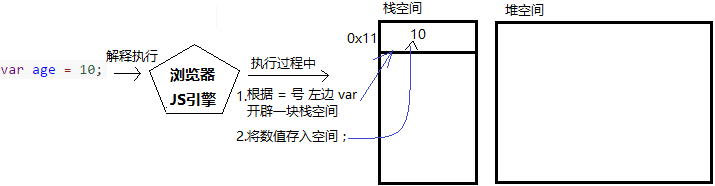

### 2. 语法扩展内存图解

>  注意：以下变量语法 不推荐使用

- 同时声明多个变量

```javascript
var age, name, sex;
age = 10;
name = 'zs';
sex = 2;
```

​	内存图：

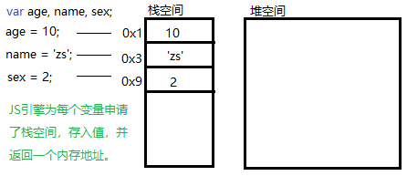

- 同时声明多个变量并赋值
```javascript
var age = 10, name = 'zs',sex = 2;
```
​	内存图 同上。

+ 声明后同时给多个变量赋值

```` js
var age,name,sex;
age = name = sex = 120;
````

​	内存图：

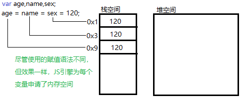

### 3. 变量内存图扩展

+ 简单数据类型（值类型） 和 复杂数据类型（引用类型） 的内存结构

````javascript
var usrAge = 12;
var objDemo = new Object();
````

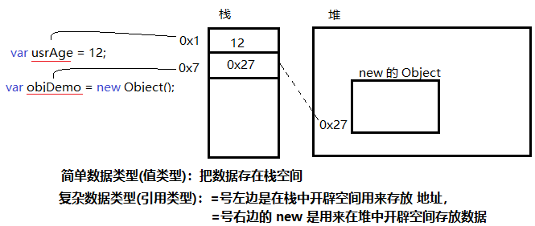

+ 注意：在计算机编程中，一般情况下，访问 内存地址，其实就是访问 地址所指向的 内存空间 里的 数据


+ 详解 5.5 Null 空对象类型，使用 null 来释放对象所占的堆内存

```` javascript
var usrArr = new Array(); // 创建了一个数组对象
usrObj = null; // 释放这个数组对象 （原理在引用类型图解时会讲）
````

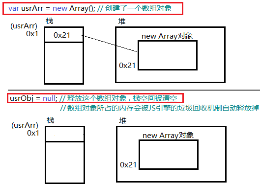

### 4. 数据类型本质

- **问题01：**什么是数据类型？

  数据本来就是根据各自的特点分为不同类型的，比如 数字、字符就是最常见的两类数据。

  程序语言使用 `清单` 来记录不同类型的特点、规范，这个 `清单` 就是 **数据类型**。

  


- **问题02：**使用变量时，谁在申请空间？申请多大的空间呢？

  `var age = 10;` 其实我们发现这个 整数10 保存在内存中的时候我们并没有使用特别的语法。


- 在较早的编程语言中，`变量值` 在内存中的空间需要 `程序员通过编码来申请`，太麻烦！


- 后来的语言中内置了一种 `清单`， 为每一种数据都定义一个 `清单` 记录这种数据所需内存大小等信息。

- 运行代码时，由 `JS引擎` 根据 `清单` 为 `变量值` 申请对应大小的 内存空间。

  这种 `清单` 的名字就叫 **数据类型** 。它既可以减少程序员对内存操作的工作量，也可以避免程序员申请不适当的空间，而造成内存不够或内存浪费的问题。


### 5. 动态类型语法

- JS是动态类型语法，同一个变量可以 *多次设置* 不同 数据类型的值

```javascript
var usrInfo = 11; // Number 类型
usrInfo = false;  // Boolean 类型
```

### 6. 数值的进制

```` javascript
//1.十进制
	var num = 9;
    // 进行算数计算时，八进制和十六进制表示的数值最终都将被转换成十进制数值。
//2.十六进制 数字序列范围：0~9以及A~F
	var num = 0xA;
//3.八进制 数字序列范围：0~7
    var num1 = 07;   // 对应十进制的7
    var num2 = 019;  // 对应十进制的19
    var num3 = 08;   // 对应十进制的8
    //如果字面值中的数值超出了范围，那么前导零将被忽略，后面的数值将被当作十进制数值解析
````

### 7. 浮点数的精度问题

+ 浮点数值的最高精度是 17 位小数，但在进行算术计算时其精确度远远不如整数。
  注意：了解即可，不用纠结。

```` javascript
var result = 0.1 + 0.2;    // 结果不是 0.3，而是：0.30000000000000004
console.log(0.07 * 100);   // 结果不是 7，  而是：7.000000000000001
// 所以：不要直接判断两个浮点数是否相等 !
````

### 8. 处理小数位数的一个方法

+ num.toFixed(x) 方法，x 为要保留 num 里的小数位数。

```` javascript
var result = 0.1 + 0.2;    // 结果不是 0.3，而是：0.30000000000000004
console.log(result.toFixed(2)); //结果为 0.30
console.log(result.toFixed(5)); //结果为 0.30000
````

### 9. typeof 示例

> 学习提醒：切记，不要硬背，有印象即可

```` javascript
// Numbers
typeof 3747 === 'number'; // true
typeof 3.747 === 'number'; // true
typeof Infinity === 'number'; // true
typeof NaN === 'number'; // true 尽管NaN是"Not-A-Number"的缩写
typeof Number(1) === 'number'; // true 但不要使用这种形式

// Strings
typeof "" === 'string'; // true 空字符串
typeof " " === 'string'; // true 含有空格的空字符串
typeof "bla" === 'string'; // true
typeof (typeof 1) === 'string'; // true，typeof总是返回一个字符串
typeof String("abc") === 'string'; // true，但不要使用这种形式!

// Booleans
typeof true === 'boolean'; // true
typeof false === 'boolean'; // true
typeof Boolean(true) === 'boolean'; // true，但不要使用这种形式!

// Symbols
typeof Symbol() === 'symbol'; // true
typeof Symbol('foo') === 'symbol'; // true
typeof Symbol.iterator === 'symbol'; // true

// Undefined
typeof undefined === 'undefined'; // true
typeof declaredButUndefinedVariable === 'undefined'; // true
typeof undeclaredVariable === 'undefined';  // true

// Objects
typeof {a:1} === 'object'; // true

// 使用Array.isArray 或者 Object.prototype.toString.call
// 区分数组,普通对象
typeof [1, 2, 4] === 'object'; // true

typeof new Date() === 'object'; // true

// 下面的容易令人迷惑，不要使用！
typeof new Boolean(true) === 'object'; // true
typeof new Number(1) === 'object'; // true
typeof new String("abc") === 'object'; // true

// 函数
typeof function(){} === 'function'; // true
typeof class C{} === 'function' // true
typeof Math.sin === 'function'; // true
typeof new Function() === 'function'; // true
````

### 10. 数值 toString 的基模式

+ 数值类型 toString() 方法的基模式 可以用不同的进制（基）输出数字
  如：二进制的基是2，八进制的基是8，十六进制的基是16
+ 语法：num.toString(进制基)

```` javascript
var iNum = 10;
alert(iNum.toString(2)); // 输出 "1010"
alert(iNum.toString(8)); // 输出 "12"
alert(iNum.toString(16)); // 输出 "A"
````


### 11. 关键字、保留字、标识符

+ 标识符：就是指开发人员为 变量、函数、属性、参数 取的名字


+ 关键字：是指 JS本身已经使用了，不能再用它们充当变量名啊方法名啊什么的
+ 保留字：实际上就是预留的“关键字”，意思是现在虽然现在还不是关键字，但是未来可能会成为关键字的，你一样是不能使用它们当变量名或方法名

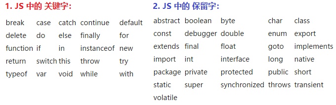


+ 在代码中使用关键字作为标识符在大多数浏览器中都会倒是“Identifier Expected”（缺少标识符）错误。而使用保留字可能不会导致同样的错误，这要视具体的浏览器而定。一般来说，最好不要使用关键字和保留字作为标识符，一遍与ECMAScript未来的版本保持兼容。

  参考：http://www.itxueyuan.org/view/6627.html

### 12.控制台输出图片

+ 高人写的代码，估计是有丰富的浏览器插件经验~~~我们看看就好了


```js
console.log("%c\n       ", "font-size:61px;background:url('http://www.itheima.com/images/logo.png') no-repeat 5px -1px");
```


## 三. 课后综合练习（作业）

+ 总体要求：
  + 用文字描述实现业务思路
  + 用代码实现业务思路


> **题1. 不使用临时变量，交换两个 数值 变量的值**
> ​    思路：两个数值变量的加减运算

> **题2. 依次询问并获取用户的 姓名、年龄、性别，并打印用户信息如图。** 

图一：

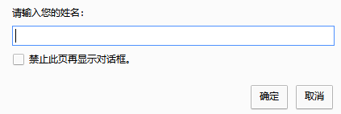

图二：

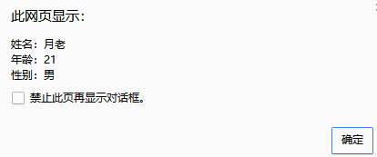

> **题3.要求用户输入鸡蛋数量，每20个鸡蛋放一个盒子，显示装下所有鸡蛋需要的盒子数量。效果如图：**

图一：接收用户输入的鸡蛋个数

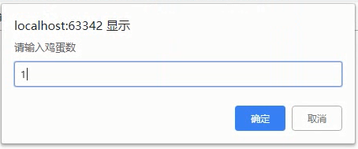

图二：显示需要的盒子数量

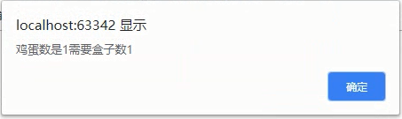


> **题4.输入人数，要求排成一个矩形队列，每10人一列，可以排多少列？余多少人？（每队必须10人，最后一队不够10人就不要加入矩形队列了）**

图一：接收用户输入的班级人数

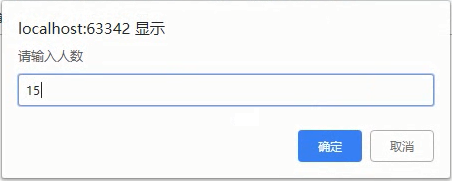

图二：显示总人数，队列数，剩余人数

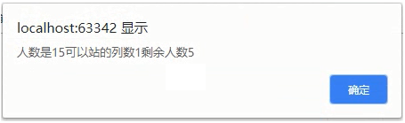


> **题5.使用3个变量，分别保存随机函数生成的3个100以内的随机数，分别将其中 最大 和 最小 的数值 显示出来。**


> **题6. 根据下面代码片段，分析 d、e、f、g  4个变量的结果，并写出变量值的变化过程。**

```js
var a = 12;
var b = 10;
var c = 5;
var d = a++;
var e = ++b;
var f = c + d++;
var g = c + ++d;
console.log(d); // 结果 ， 数据变化过程
console.log(e); // 结果 ， 数据变化过程
console.log(f); // 结果 ， 数据变化过程
console.log(g); // 结果 ， 数据变化过程
```


## 四. 深度阅读@

[《详解 ECMAScript 数据类型》](http://www.cnblogs.com/onepixel/p/5140944.html)

[《浏览器内核、渲染引擎、JS引擎》](http://www.cnblogs.com/jameszou/p/8524501.html)

[《浏览器内核与js引擎》](http://www.cnblogs.com/xiyangbaixue/p/4042548.html)