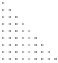
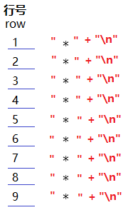

> 第02阶段.前端基本功.前端基础.入门语法 - from：JamesZou

# 流程控制

## 学习目标

* 推荐前端行业APP
  * 开发者头条、掘金、SegmentFault

## 一.核心内容

## 1. 流程控制（下.循环结构）

### 1.0 为什么要有循环？

+ 重复的事情，比如：跑步（一圈又一圈的跑）、吃包子（一个又一个的吃）
+ 程序业务也是如此，有很多重复的代码 需要 执行若干遍。

+ JS的三种循环结构： while、do...while、for 
  + 三个关键：循环条件、循环体代码、循环条件修改代码（用来退出循环）

### 1.1 for 循环

- **语法**

```js
//for 循环一般 用来 根据次数 循环 
for(初始化表达式; 条件表达式; 改值表达式 ){
    //循环体
}
//如：
for(var i = 0; i < 10; i++){
    console.log('i='+i);
}
```

- **执行顺序**

  1.初始化表达式

  2.条件表达式 -> 3.循环体 -> 4.改值表达式 

  之后 一直 执行 234 -> 234，直到条件表达式为 false，才结束循环。

> **课堂案例：** 用 console.log( ) 输出 一行 17 个星星。  `老师调试演示执行过程`

```js
var strStars = '';//准备 一个字符串
for(var i = 0; i < 17; i++){ // for循环 3个表达式
    strStars += '*'; // 字符串链接
}
console.log(strStars + ',共 ' + strStars.length +' 颗星星');
// 请大家试试 把 条件表达式 改一改，看看运行效果
```

> **课堂案例：** 求1-100之间所有偶数的和。 `老师调试演示执行过程`

```js
var sumNum = 0;
for(var i = 1;i <= 100; i++){
    if(i % 2 == 0){ // 如果 i 取模2 等于0，则 i 为 偶数
        sumNum += i;
    }
}
console.log('1-100之间所有偶数的和 = ' + sumNum);
```

### 1.2 双重 for 循环

> **课堂案例 1：**用 *字符 组成 一个正方形 (3 * 3)，并输出。 `老师调试演示执行过程`

思路一：我们先用一个循环来打印 3 行，再在 里面 通过 一个子循环 来打印 3颗星星。

思路二：我们先用一个循环来打印 3颗星星，再在 外面 通过一个父循环 来执行3次，每次还追加一个换行符。

```js
var strStar = ''; // 星星字符串
//1.外层循环打印 行，一共生成 3 行，所以 i = 0 , i < 3
for (var i = 0; i < 3; i++) { // 0 , 1 , 2 
	//2.内层循环打印 一行里的每颗星星，每行生成 3 颗星，所以 j = 0 , j < 3
	for (var j = 0; j < 3; j++) {
		strStar += '* '; // 往字符串中 加一颗 星星
	}
	strStar += '\n'; // 往字符串中 加一个 换行符
}
//3.输出星星字符串
console.log(strStar);
```

**执行过程图解：**


> **课堂案例 2：** 使用 `for循环` 打印 `正`  三角形 （9行 * 9列）

  

```js
var strStars = '';
for (var i = 0; i < 9; i++) { // 循环 9 行
  for (var j = 0; j < i+1; j++) { // 循环生成 每一行的星星，星星的个数 等于 行数
    strStars += '* '; // 向字符串中追加 星星，加了个 空格 更好看
  }
  strStars += '\n'; // 每生成一行星星，就加入 换行符
}
console.log(strStars);
```

> **课堂案例 3：** 使用 `for循环` 打印 `倒` 三角形（9行 * 9列）

```js
var strStars = '';
for (var i = 0; i < 10 ; i++) { // 循环 9 行
  for (var j = 1; j <= 9-i; j++) { // 循环生成 每一行的星星，星星的个数 等于 9 - 行数
    strStars += '* '; // 向字符串中追加 星星，加了个 空格 更好看
  }
  strStars += '\n'; // 每生成一行星星，就加入 换行符
}
console.log(strStars);
```


### 1.3 乘法口诀表 练习

#### 1.3.1 思路图解

+ **A.乘法口诀表 整体思路分析**

  > 共 9 行 9 列（列数逐行递减）

  

+ **实现思路：**

  + 行的生成：想 怎么生成行？
  + 列的生成：想 如何 在行中 生成 多少个列？
  + 列内容的生成：想 每个列的 **算式** 如何生成？
  + 所有的内容，都以字符串的方式 在 console.log()打印出来~~

+ **B.行的生成**

  > 目标：生成9行，每行1个星星

  

  + 行数：乘法口诀表一共 9 行
  + 内容：在每行内容的结尾处 添加一个 `换行符\r` ，以实现换行效果

  > 小技巧：可以看成拼接在一起的 9 个 字符串，输出时，可以用一个变量str保存
  >          通过 console.log(str) 一次输出 

+ **C.列的生成**

  > 目标：生成一个 9 行，9 列 的 星星倒三角

  

  + 分析：每一行的 列数 和 行数 成关联关系：行号 + 列数 = 10，那么每行要生成的列数可以算出。

  + **列数计算方式**：**10 - 行号 = 当前行的 列数**

+ **D.列内容的生成**

  > 目标：将每个 星星 换成 对应的 乘法算式

  + 列的循环

    

  + ##### 列里的算式

    如第2行第3列： `3 * 8 = 24` , 字符串拼接:  `列号 + "*" + (10-行号) + "=" + (列数 * (10-行数))`

  

#### 1.3.2 小结

+ 代码

```js
var strKouJueBiao = '';
//1.使用一个 for 循环 来循环生成行
for(let row = 1; row <= 9; row++){
    //2. 打印 列
    for(let col = 1; col <= 10 - row; col ++ ){
        //3. 生成算式，最后 制表符 会让格式好看点
        strKouJueBiao += col + ' * ' + (10-row) + ' = ' + (10-row)*col + '\t';
    }
    //4.每行都要换行
    strKouJueBiao += '\n';
}
console.log(strKouJueBiao);
```

  + 注意
      + 双重嵌套循环 通常用来生成表格类似结构
      + 外部循环与内部循环的条件可以相关联
      + 在字符串中，可以使用 \r 和 \t  分别实现 换行 和 退格

+ 代码二：思路扩展

```js
var strKJB = "";
//1.使用一个 for 循环 来循环生成行
for(let i = 9; i >= 1; i--){
   //2. 打印 列
   for(let j = 1; j <= 9; j++){
      //3.生成算式，最后 制表符 会让格式好看点
      strKJB += j + " * " + i + " = " + i * j + "\t";
      //4.加入换行符，并结束循环
      if(i==j){
         strKJB += "\n";
         break;
      }
   }
}
console.log(strKJB);
```

### 1.4 for 循环 小结

- for 循环 是 循环条件和数字 直接相关的循环


> **课堂练习：** (5分钟)
> 要求：计算1-100之间能 `3的倍数` 的和。(提示：3的倍数 就是 num %3 = 0)


### 1.5 while 循环

+ **语法：**

```` js
while(条件表达式){
    // 循环体代码 - 条件表达式为 true 时重复执行循环体代码
}
while(true){
    // 循环体代码 - 条件表达式为 true 时重复执行循环体代码
}
````

​       **条件表达式** 的结果是一个 `布尔值` ，为 true 时，执行循环体代码，为 false 时，退出循环，执行后面代码。

+ **执行顺序：** 先判断，再执行循环体

  1.先执行 `条件表达式` ，结果为 true，则 执行循环体代码，如果为 false，则退出 循环，进入后面代码执行

  2.然后执行 `循环体代码` ，只要 条件表达式 为真，则会一直执行。

  3.回到 1，执行 `条件表达式` ....

> **课堂案例 1** 用 console.log() 在控制台打印 50 遍 'Hi，有空吗？'  `老师调试演示执行过程`

```` js
var numCount = 1; // 用来记录循环次数
while(numCount <= 50){ // 判断循环的次数是否达到我们的条件
    console.log('Hi,有空吗？'); // 要执行的循环体 业务代码
    numCount++; // 做条件改变，否则 循环会出现【死循环】！
}
````

> **课堂案例 2** 跟媳妇承认错误，说 100 遍 '媳妇儿，我错了！'

```` js
var numCount = 1;
while(numCount <= 100){
    console.log('媳妇儿，我错了！'); 
    numCount++; 
}
````

> **课堂案例 3** 计算 1 ~ 100 之间所有数的和

```` js
var countNum = 1; // 作为 1 ~ 100 的每个数
var numSum = 0; // 用来记录 相加 结果
while(countNum <= 100){
    numSum += countNum;
    countNum++;
}
console.log('1~100所有数的和为：' + numSum);
````

### 1.6 while 小结

+ while 语句就是**当条件满足**时**重复执行相同的代码**；
+ 无论是循环结构还是分支结构，在执行完成后，都会执行后续代码；
+ 在循环体内部，**需要修改循环条件**，否则会造成**死循环**。

> **课堂练习** （5分钟）
> 要求：计算 1~ 100 之间所有偶数的和。


### 1.7 do...while 循环

+ 语法

```` js
do{
    // 循环体代码 - 条件表达式为 true 时重复执行循环体代码
} while(条件表达式);
````

+ **执行顺序** 先执行一次循环体代码，再判断 循环条件

  1.先执行一次 `循环体代码` 

  2.再执行 `条件表达式` ，结果为 true，则 继续执行循环体代码
  ​                                        如果为 false，则退出 循环，进入后面代码执行

> **课堂案例：** 用console.log() 模拟吃2个包子案例  `老师调试演示执行过程`

```` js
var eatCount = 0;
do{
    eatCount ++;
    console.log('我已经吃了'+ eatCount+'个包子~~~');
}while(eatCount<2)
````

> **课堂案例：** 使用do-while循环：输出询问“我爱你，嫁给我吧？”，选择“你喜欢我吗？(y/n):"，如果输入为y则打印”我们形影不离“，若输入为n,则继续询问。（提示：使用 prompt 和 alert 函数）

```` js
var strAns = 'y';
do{
    alert('我爱你，嫁给我吧~~');
    strAns = prompt('你喜欢我们？（y/n）');
}while(strAns == 'n');

````

### 1.8 do...while 小结

- do..while 循环和 while 循环非常像，二者经常可以相互替代，但 do..while 的特点是不管条件成不成立，都会执行一次。
- do...while 语句就是先执行一遍，后面才根据 **条件是否满足** 决定执行次数；
- 和 while 循环一样，在循环体内部，**需要修改循环条件**，否则会造成**死循环**。


### 1.9 continue 跳出本次循环

+ **概念：**立即跳出本次循环，继续下一次循环（本次循环体 continu 之后的 代码 就都少执行这一次）
+ **通俗：** 吃5个包子，第3个有虫子，就扔掉第3个，继续吃第4个第5个包子。

> **课堂案例：** 
> 要求：模拟 吃5个包子，第3个有虫子，就扔掉第3个，继续吃第4个第5个包子。

```` js
for(var i = 0; i < 5; i++){
    if(i==2){
        console.log('f~! 第 '+(i+1)+' 个里面有虫子！扔掉！');
        continue;//跳出 i == 2 这次循环，进入 i == 3 的循环
    }
   	console.log('哈哈哈，吃完了第 '+ (i+1) +' 个大包子~~！');
}
````

### 1.10 break 退出整个循环

+ **概念：**理解跳出整个循环（循环结束），开始执行 循环后面的代码
+ **通俗：** 吃5个包子，吃到第3个吃饱了，就不再吃后面的包子。

> **课堂案例：** 
> 要求：模拟 吃5个包子，吃到第3个吃饱了，就不再吃后面的包子。

```` js
for(var i = 0; i < 5; i++){
    if(i==2){
        console.log('额~~~ 吃到 第 '+(i+1)+' 个时已经很撑了，不吃了~！');
        break;//退出 for 循环，执行 后面的代码
    }
   	console.log('哈哈哈，吃完了第 '+ (i+1) +' 个大包子~~！');
}
console.log('已经退出循环了~~');
````

### 1.11 循环小结


## 2. 代码调试

### 2.1 过去调试JavaScript的方式

- alert()
- console.log()


- 断点调试

> 断点调试是指自己在程序的某一行设置一个断点，调试时，程序运行到这一行就会停住，然后你可以一步一步往下调试，调试过程中可以看各个变量当前的值，出错的话，调试到出错的代码行即显示错误，停下。

### 2.2 断点调试步骤

```js
浏览器中按F12--> sources --> 找到需要调试的文件 --> 在程序的某一行设置断点
```

- 调试中的相关操作

```javascript
Watch: 监视，通过watch可以监视变量的值的变化，非常的常用。
F10: 程序单步执行，让程序一行一行的执行，这个时候，观察watch中变量的值的变化。
F8：跳到下一个断点处，如果后面没有断点了，则程序执行结束。
```

tips: ***监视变量，不要监视表达式，因为监视了表达式，那么这个表达式也会执行。***

1. 代码调试的能力非常重要，只有学会了代码调试，才能学会自己解决bug的能力。初学者不要觉得调试代码麻烦就不去调试，知识点花点功夫肯定学的会，但是代码调试这个东西，自己不去练，永远都学不会。
2. 今天学的代码调试非常的简单，只要求同学们记住代码调试的这几个按钮的作用即可，后面还会学到很多的代码调试技巧。


### 2.3 强调：调试错误的 步骤：

+ 1.先到 console 控制台 tab 页 去看 是不是 有 报错！（JS语法错误）
+ 2.如果 没有语法错误，就应该 resource  资源 tab页 去页面js代码中设置断点，并 f11 逐句调试。


## 3. 代码规范

### 3.1 命名规范	

+ 变量、函数 的命名 必须要有意义
+ 变量 的名称一般用名词
+ 函数 的名称一般用动词

### 3.2 操作符的前后要有空格

```` js
var usrName = 'James';
var res = 5 + 2;
````

### 3.3 单行注释规范

```` js
// 注释开头记得空格
var usrName = 'James'; // 行内注释记得 与前面 代码分号 之间加入一个空格
````

### 3.4 大括号空格

 

### 3.5 换行规范

+ 左 大括号 换行

```` js
var arr = [1, 2, 3, 4];
if (a > b) { // 换行
  
}
for (var i = 0; i < 10; i++) { // 换行
      
}
function fn() { // 换行
      
}
````

## 4. 运算符的优先级

> 思考： var res  = 2 + 5 * 0 ;  // res

```js
1. ()  优先级最高
2. 一元运算符  ++   --   !
3. 算数运算符  先*  /  %   后 +   -
4. 关系运算符  >   >=   <   <=
5. 相等运算符   ==   !=    ===    !==
6. 逻辑运算符 先&&   后||
7. 赋值运算符
```

### 4.1 小结

- 关系运算符 - 比较运算符：< ， > ， >=  ， <= ， == ， !=
- 逻辑运算符 ：&& ， || ，  !
- 赋值运算符 ：=  ， +=  ，  -=  

## 二. 扩展内容

### 1. == 与 === 的区别

== 相等，两边值类型不同的时候，忽略类型比较，直接比较 值，只要值相等 就返回 true。
=== 全等，先判断类型是否相等，如果相等才去判断值是否相等，只有类型 和 值 都相等，才返回 true。

````javascript
var isEq0 = 1 == '1';   // true
var isEq2 = 1 === '1';  // false

var isEq3 = 1 == true;  // true
var isEq3 = 1 === true; // false
````

更多例子参考：[js中 == 和 === 区别](http://www.cnblogs.com/nelson-hu/p/7922731.html)

### 2. 三元表达式 ? :

+ **语法一：** 返回 表达式2 或 表达式3 的值

  `var result =  表达式1 ? 表达式2 : 表达式3`

  result 的值 ，在 `表达式1` 求值为 **true**  时的值为 `表达式2` 的值

  ​			在 `表达式1` 求值为 **false** 时的值为 `表达式3` 的值

+ **语法一案例：**

  ```` js
  var a = 10;
  var result = 0;
  if(a > 7){
      result = 21;
  }else{
      result = 12
  }
  alert(result); // 21
  ````

  等价于：

  ```` js
  var a = 10;
  var result = (a > 7) ? 21 : 12;
  ````

+ **语法二：** 执行 表达式2 或 表达式3

  `表达式1 ? 表达式2 : 表达式3`

  在 `表达式1` 求值为 **true**  时，执行 `表达式2`

  在 `表达式1` 求值为 **false** 时，执行 `表达式3`

+ **语法二案例：**

  ```` js
  var a = 10;
  if(a > 7){
      alert('a > 7 啦！');
  }else{
      alert('a <= 7 啦！');
  }
  ````

  等价于：

  ```` js
  var a = 10;
  a > 7 ? alert('a > 7 啦！') : alert('a <= 7 啦！')
  ````

  

### 3. 隐式类型转换

- 当运算符两边数据类型不一样的时候，编译器会先帮我们转换成一致之后再计算

  - 其他数据类型转number：  自增自减   算术运算符

  ```js
  //++ -- 可以将 数值字符串 转成 数值 再运算
  var str = '10';
  str++; // 相当于 Number(str)++
  console.log(str); // 11
  
  //+号以外的 算数运算符 都可以将 数值字符串 转成 数值 再运算
  console.log ( "10" - 1 );//9    相当于 Number('10') - 1
  console.log ( 1 + true );//2    相当于  1 + Number(true)
  
  /* +号写在一个数值字符串前，可以将 它 转成 数值 */
  console.log ( + "10" ); // 10 相当于 Number(10)
  var age = +prompt('班长，请输入年龄');
  console.log ( age );
  ```

- 其他数据类型转string：  字符串连接符  +

```js
console.log ( 10 + "10" );//1010  String(10) + '10' = '1010'
console.log ( 1 + "true" );//1true     连接符   String(1) + 'true' = 1true
```

- 其他数据类型转boolean： 逻辑非 ！

```js
  console.log ( ! 1 );//false   (1) ! Boolean(1)   (2)!true
```

- 特殊：

```js
console.log ( 1 + undefined );   //NaN   1 + Number(undefined) = 1 + NaN = NaN
console.log ( 1 + null ); //1      1 + Number(null) = 1+0 = 1
```

### 4. if 小括号的秘密

-  bool 值

```js
if(true){
    console.log('哈哈哈');
}
```

- 结果为 bool 的表达式

```js
if(1 < 2){
    console.log('哈哈哈');
}
```

- 隐式转换成 bool

```js
// 转成 false：0 NaN null undefined ''
if(0){
    console.log('哈哈哈');
}else{
    console.log('false了~~');
}
```

+ 下列语句会把 一些值 隐式转换 成 布尔类型，如：

```js
if('哈哈' && 12 ){
    console.log('非空字符串  非0数字 会被自动转成 true');
}
// 可以 看成 下面的代码
if(Boolean('哈哈') && Boolean(12) ){
    console.log('非空字符串  非0数字 会被自动转成 true');
}
// 执行结果 看成 下面的代码
if(true && true ){
    console.log('非空字符串  非0数字 会被自动转成 true');
}
```

- true：   非空字符串  非0数字  true 任何对象
- false：  空字符串  0  false  null  undefined


### 5. for 循环 表达式 可选

```` js
var i = 0;
for(;;){
    if(i>=5){
        break;
    }
    console.log(i);
    i++
}
````

## 三. 课后综合练习（作业）

>  **1.打印一个乘法口诀表**
> 思路：就是一个 倒 三角形，注意字符串拼接


> **2.简易 ATM 机器 **


## 四. 深度阅读@

[《详解 ECMAScript 数据类型》](http://www.cnblogs.com/onepixel/p/5140944.html)

[《浏览器内核、渲染引擎、JS引擎》](http://www.cnblogs.com/jameszou/p/8524501.html)

[《浏览器内核与js引擎》](http://www.cnblogs.com/xiyangbaixue/p/4042548.html)


## 五. 作

## 业参考答案


