> 第02阶段.前端基本功.前端基础.进阶语法 - from：JamesZou

# 数组

## 学习目标
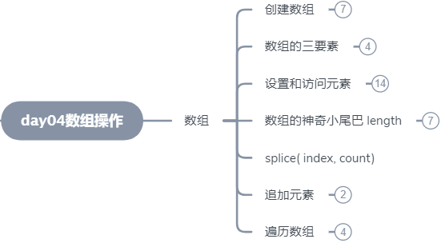
## 一.核心内容

## 1. 数组

> 普通变量一次只能存放一个值，有些时候用起来不方便。
>
> 数组 一次可以存放很多个值。

### 1.1 什么是数组？

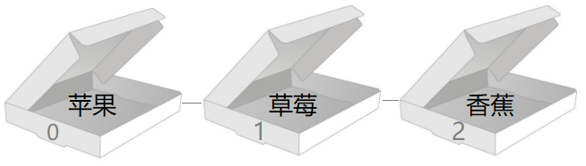

+ 通俗：数组就是一组盒子，可以按顺序存很多东西
+ 概念：数组是指一组数据的集合，其中的每个数据被称作元素，在数组中可以存放任意类型的元素。
+ 本质：数组是程序在 内存 中申请的N块连续的 空间，可以用来保存一组数据


### 1.2 为什么要有数组？

> 思考：苍老师有3位学生，考试中需要将这3位学生成绩保存起来。

```js
// 之前学习的数据类型，只能存储一个值，此时该如何存储？
// 方案：用 3 变量 来保存，但如果有50个学员呢？太多了！！！
// 缺点：a.代码冗余  b.非常不便于维护和访问
var score01 = 100;
var score02 = 89;
var score03 = 97;
```

+ 数组可以把一组相关的数据一起存放，并提供方便的访问方式。

### 1.3 数组语法

#### 1.3.0 数组初体验

##### a.第一个数组

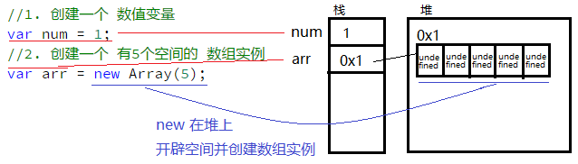

​	`关于 num 和 arr，相当于 篮子 和 仓库，一个可以直接提手上，一个手上只有仓库钥匙。`

##### b.数组三要素

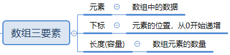

#### 1.3.1 创建数组 - new


> new 数组 的方式 较为不方便，慢慢不再流行了

+ 通过 **new 关键字** 创建一个数组对象，有三种方式：

  1. 创建 空 数组  `new Array()`

  2. 创建 指定容量 的数组 `new Array(3)`

     注意：此方式创建的 数组 会有 指定数量的空间，但里面的值都是 undefined

  3. 创建 含默认值 的数组 `new Array('小白','小黑','大黄','瑞奇');`

     注意：输入几个默认值，数组就有几个元素

```` js
// 1.创建一个空数组
var arrStus01 = new Array();

// 2.当为 Array(num) 括号中只传入 1个 数值 时，代表 数组的初始长度
var arrStus02 = new Array(3);// 创建一个新数组 并 设置初始空间为 3 （只传入 1个数值）

// 3. 创建包含4个值得数组
var arrStus03 = new Array('小白','小黑','大黄','瑞奇');// 创建一个新数组，设置4个空间并分别赋值
````

图解：

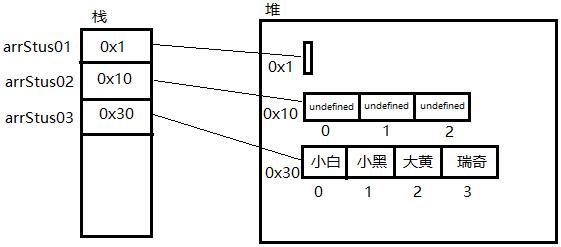 


#### 1.3.2 创建数组 - 字面量


> JS中存在字面量，可以更加方便的编写代码，开发中常用此方式创建数组。

##### 1.3.2.1 创建 空数组

```` js
//1.使用 new 方式创建 数组对象
var arrStus01 = new Array();
//2.使用 【数组字面量】 方式创建 数组对象
var arrStus02 = []; // 其实就是 new Array();
````

 图解：

 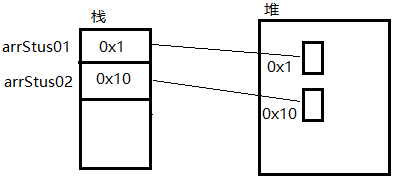

##### 1.3.2.2 创建 带初始值 数组

```` js
//1.使用 new 方式创建 带初始值数组对象
var arrStus01 = new Array('小白','小黑','大黄','瑞奇');
//2.使用 【数组字面量】 方式创建 带初始值数组对象
var arrStus02 = ['小白','小黑','大黄','瑞奇'];
````

图解：

 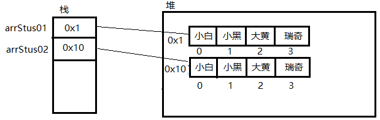

+ 注意：数组字面量 [ ] 的方式创建数组实例时，没有 设置初始容量的语法

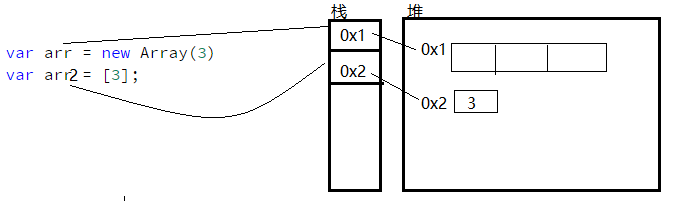

#### 1.3.3 数组元素的类型

+ 数组中每个空间里存放的值 叫 **元素**
+ 数组中可以存放任意类型的数据

```` js
var arrStus01 = ['小白',12,true,28.9];
````

 图解：

 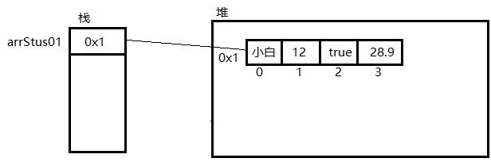

#### 1.3.4 设置和访问数组元素

> 思考：要访问数组中的元素，无法只通过变量名直接获取，因为 一个数组中 有很多元素

+ 数组可以通过 下标 来 访问、设置、修改 **对应下标空间** 里的元素
+ **元素：**数组中每个空间里存放的数据
+ **下标：**用来访问数组空间的 **序号** （数组下标从 0 开始）

```` js
var arrStus = new Array(3);
//1.通过下标 为对应空间 赋值
arrStus[0] = '大白很暖';
arrStus[1] = '有点儿意思';
arrStus[2] = '记得打call~！';


//2.通过下标 访问对应空间 里的值
alert(arrStus[1]); // '有点儿意思'
````

 图解：

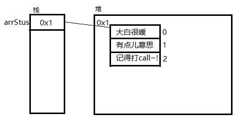 

> 思考：访问越界怎么办？

#### 1.3.5 数组的length属性

> 思考：既然数组可以有很多元素，万一忘了有数量怎么办？ -> length 属性

+ **数组.length**   可以获取数组里 **元素** 的数量（数组长度）

```` js
alert('arrStus数组包含的空间个数：' + arrStus.length); // arrStus数组包含的空间个数：3
````

+ **数组.length**   可以用来修改数组长度 `arrStus.length = 5`

  **a. 增加长度：**设置更大的 length来 **增加** 数组的空间

```` js
arrStus.length = 5;
````

 图解：因为设置数组长度为 5，所以数组 被新增 2 个空间

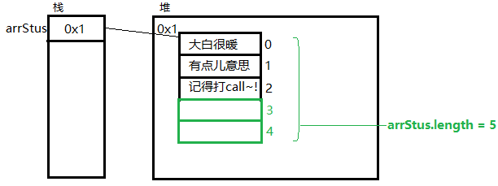

​	 **b.减少长度：**设置更小的 length来 **减少** 数组的空间

````js
//注意，这个数组实例 在上例中 已经设置了 length = 5，在本例中 设置为 2
arrStus.length = 2;
````

图解：因为设置数组长度为2，所以数组 最后3个空间被移除，只剩下了两个空间

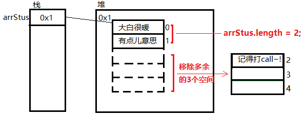

+ 数组长度 = 数组最大下标 + 1
+ 数组最大下标 = 数组长度 - 1

#### 1.3.6 遍历数组所有成员

> 思考：如果我们需要访问数组里所有的元素怎么办？ --> 通过 for 循环 逐一访问 对应元素下标

+ 通过for循环下标遍历

```` js
var arrStus = new Array(3);
//1.通过下标 为对应空间 赋值
arrStus[0] = '大白很暖';
arrStus[1] = '有点儿意思';
arrStus[2] = '记得打call~！';

//2.通过for循环遍历数组里的每个元素
for(var i = 0; i < arrStus.length; i++){
    console.log('arrStus['+ i +'] = ' + arrStus[i]);
}
````

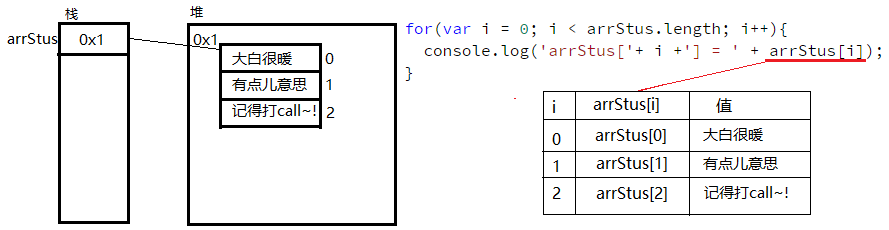

+ 注意：两种遍历条件的写法

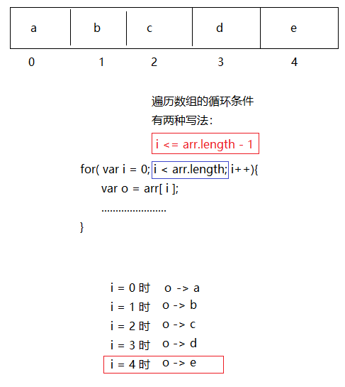

> **课堂案例** 
> 要求：求一组数值 [2,6,1,77,52,25,7] 的最大值，以及所在下标位置

```` js
var arrNum = [2,6,1,77,52,25,7];
var maxNum = -Infinity; // 用来 保存最大元素，默认值为 无穷小
var maxNumIndex = -1; // 用来 保存最大元素所在下标
//从 0 开始循环数组里的每个元素
for(var i = 0;i< arrNum.length; i++){
    //如果 数组里当前循环的元素 大于 maxNum，则保存 这个元素和下标
    if(arrNum[i] > maxNum){
        maxNum = arrNum[i]; // 保存数值到 变量maxNum
        maxNumIndex = i; // 保存数值下标到 变量maxNumIndex
    }
}
alert('最大值为：'+ maxNum + '，它的下标为：' + maxNumIndex);
````

图解：每次循环 都拿数组里的1个元素 跟 maxNum 进行比较，如果元素比maxNum大，则存入maxNum

 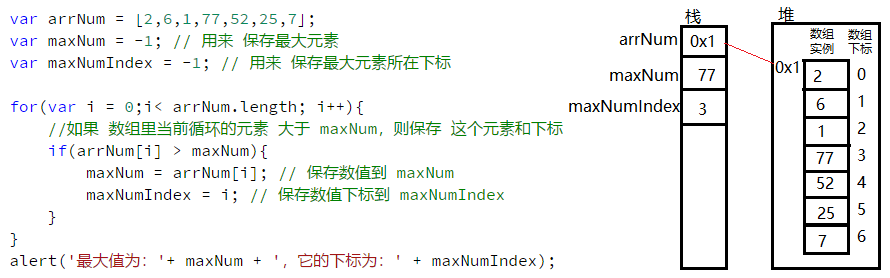


#### 1.3.7 新增数组空间

> 思考：数组已经声明并设置了初始值，如果想继续追加元素的话，该怎么办？

##### 1.3.7.1 push方法

+ 数组的 push 方法可以向数组尾部追加一个新元素

```js
var arrStus03 = ['小白','小黑','大黄','瑞奇'];
arrStus03.push('蓝天'); // 追加第一个元素
arrStus03.push('白云'); // 追加第二个元素
```

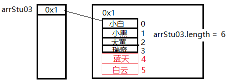

##### 1.3.7.2 下标访问法

+ JS 里的数组可以通过 **直接 访问 下标** 来实现扩容的目的

```` js
var arrStus03 = ['小白','小黑','大黄','瑞奇'];
````

 图解：通过初始化 创建了 4个空间大小的 数组

 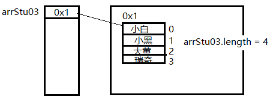

```` js
arrStus03[4] = '大白';
arrStu03[arr.length] = '小黑黑';
````

 图解：通过设置数组 第7个空间（下标6）  的值，数组自动添加了 3个 空间，已满足 访问第7个空间的目标

 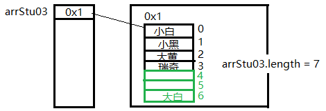


> **课堂案例**
> 要求：要求将数组 [2,0,6,1,77,0,52,0,25,7] 中的 0 去掉后 形成一个不包含 0 的新数组。

```` js
var arrNum = [2,0,6,1,77,0,52,0,25,7]; // 原数组
var arrNumNew = [];// 新数组
for(var i = 0;i < arrNum.length; i++){
    //如果原数组中当前循环的值 不等于零，则存入新数组
    if(arrNum[i]!=0){
        arrNumNew[arrNumNew.length] = arrNum[i]; // 向新数组中追加 一个 元素空间 并赋值
        // arrNumNew.push(arrNum[i]); // 也可以直接调用 push 方法添加元素到数组中
    }
}
alert(arrNumNew); // 打印新数组：2,6,1,77,52,25,7
````

图解：把元素组中 != 0 的数 存入新数组中

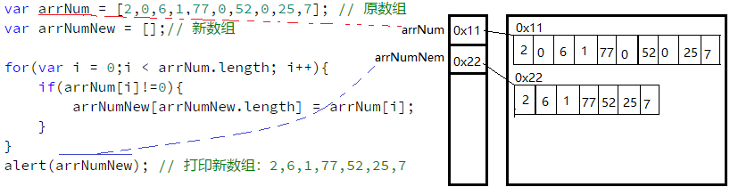


> **课堂案例**
> 要求，翻转数组，将数组[2,6,1,77,52,25,7] 的内容 反过来存放。

```` js
var arrNum = [2,6,1,77,52,25,7]; // 原数组
var arrNumNew = [];// 新数组
//从原数组 的最后一个 开始 往 前 访问，并将值顺序 存入 新数组
for(var i = arrNum.length - 1; i>=0;i--){
    arrNumNew[arrNumNew.length] = arrNum[i];
}
alert(arrNumNew);// 打印新数组：7,25,52,77,1,6,2
````

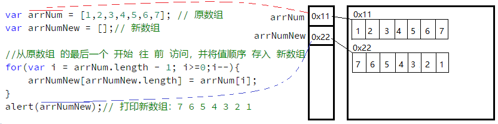


#### 1.3.8 删除数组元素

+ 数组对象**.splice(index,howmany)**
  + index，从数组开始删除的下标位置
  + howmany，从开始位置要删除元素的个数，可以是 0
                         如果不设置此参数，则删除从 index 到数组结尾的所有元素

```` js
var arrStus = ['小白','小黑','大黄','瑞奇','小爱'];
//从下标 1 开始删除 2个元素空间
arrStus.splice(1,2);
````

 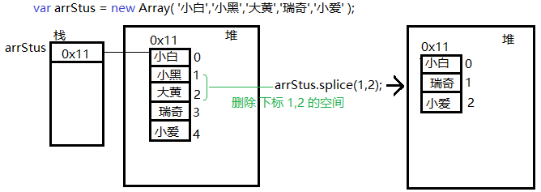

> **课堂案例**
> 要求：要求将数组 [2,0,6,1,77,0,52,0,25,7] 中的 0 从原数组中删除

```` js
// 删除 数组中的 0
var arrNum = [2,0,6,1,77,0,52,0,25,7]; // 原数组
for(var i = 0; i < arrNum.length; i++){ // 注意，每次通过 splice 移出一个元素后，arrNum.length 会变
    if(arrNum[i] == 0){
        arrNum.splice(i,1);//移出 下标 i 开始 的 1个 元素（就是i下标位置本身）
    }
}
alert(arrNum);
````

+ 注意：要删除的元素，如果连续出现时，会出现删除不掉的问题，如下段代码：

```js
// 删除 数组中的 0
var arrNum = [2,0,0,0,0,0,52,0,25,7]; // 原数组
for(var i = 0; i < arrNum.length; i++){ // 注意，每次通过 splice 移出一个元素后，arrNum.length 会变
    if(arrNum[i] == 0){
        arrNum.splice(i,1);//移出 下标 i 开始 的 1个 元素（就是i下标位置本身）
    }
}
console.log(arrNum); // [2, 0, 0, 52, 25, 7]
```

+ 解决方案：从个数组最后一个元素 向 遍历元素

```js
// 删除 数组中的 0
var arrNum = [2,0,0,0,0,0,52,0,25,7]; // 原数组
for(var i = arrNum.length-1; i >= 0; i--){ // 反过来遍历数组
    if(arrNum[i] == 0){
        arrNum.splice(i,1);//移出 下标 i 开始 的 1个 元素（就是i下标位置本身）
    }
}
console.log(arrNum); // [2, 52, 25, 7]
```


### 1.4 小结

+ 数组的 元素 可以是 任意类型
+ 数组的 长度（容量） 是可变的
+ 数组的 length 属性可读写


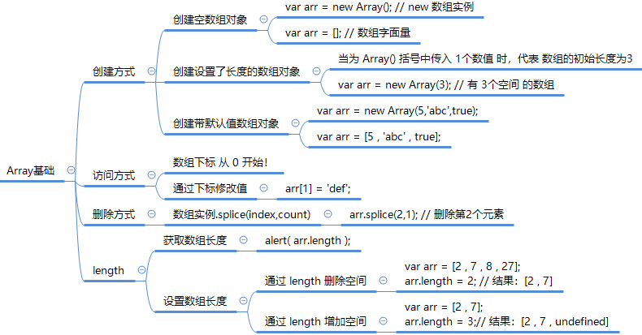


## 二. 扩展内容@

### 1. 数组

#### 1.1 通过 for in 遍历数组

````javascript
var arrStus = new Array('小白','小黑','大黄');
//for in 遍历数组时，会取出 数组的 下标 i
for(var i in arrStus){
  console.log(i + ' = '+ arrStus[i]);//再通过 下标i 访问数组里对应下标的元素
}
````

#### 1.2 冒泡排序

```js
var arr = [5,4,3,2,1];
var temp;
//2.1 外部循环，控制判断的轮数，每一轮 会把 一个最大值移到最后面
for(var j = 0; j < arr.length; j++){
  //2.2 内部循环，用来 做一轮最大值的比较，并 把最大值 移到最后面
  for(var i = 0; i < arr.length - j ; i++){
    //如果 i 的位置 的数值 大于  后面一个位置的数值，那么 就交换 两个位置的数值
    if(arr[i] > arr[i+1]){
      //使用临时变量 交换 数组中前后两个空间里的 值
      temp = arr[i];
      arr[i] = arr[i+1];
      arr[i+1] = temp;
    }
  }
}
alert(arr);
```

图解：请查看 `文件夹 上课资源`

#### 1.3 数组的栈和队列用法

+ 数组提供了4个便捷的 新增 和 删除 元素的方法

  新增方法：unshift() 和 push()，都可以将一个元素顺序追加到数组的 "头" 和 "尾" 部，并 **返回数组长度**

  删除方法：shift() 和 pop() ，都可以将数组里 "头" 和 "尾" 部顺序取出一个元素，并 **返回取出的元素**


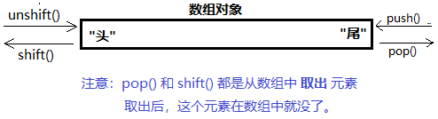

> **课堂案例**
> 向数组[5,6,7] 中的 "头" 和 "尾" 各自添加 4 和 8 两个数字，构成 [4,5,6,7,8]

```` js
var arrNum = [5,6,7];
arrNum.unshift(4);
arrNum.push(8);
alert(arrNum); // 4,5,6,7,8
````

> **课堂案例**
> 将数组 [4,5,6,7,8]中的 4 和 8 两个数字移出

```` js
var arrNum = [4,5,6,7,8];
arrNum.shift();
arrNum.pop();
alert(arrNum); // 5,6,7
````

+ **栈：**先进后出（LIFO-LastInFirstOut）

  push() + pop() 组合 -》 从尾部 添加，从 尾部 获取

  unshift() + shift() 组合 -》 从头部 添加，从 头部 获取

+ **队列：**先进先出（FIFO-FirstInFirstOut)）

  push() + shift() 组合 -》 从尾部 添加，从 头部 获取

  unshift() + pop() 组合 -》 从头部 添加，从 尾部 获取

+ **补充：**如果 将另一个 数组 通过 push() 或 unshift() 方法 添加到数组，会把 新的数组 当成一个元素 存入。


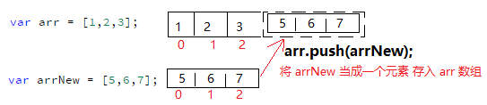


## 四. 深度阅读@

[《JavaScript中的作用域链详解》](https://blog.csdn.net/charlene0824/article/details/52252824)