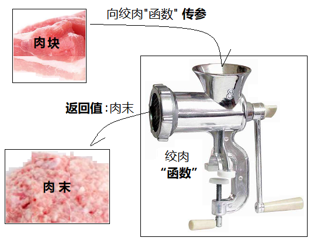

> 第02阶段.前端基本功.前端基础.进阶语法 - from：JamesZou

# 数组与函数

## 学习目标
* 理解
  * 函数的定义以及操作
* 应用
  * 能编写简易仓储系统

## 一.核心内容


## 1.函数

### 1.1 什么是函数？


+ **通俗：**函数 和 变量 一样 就是 一个 盒子，只不过函数类型的盒子里 装的是 **一堆代码**

+ **概念：**函数 就是一段 可被重复调用执行的 **代码块**

+ **函数语法初体验：**

  **1.函数 声明**

```` js
var usrName = '小白';

// 函数声明
function sayHello(){
    //函数体代码
    console.log('For the deep down period,');
    console.log('James becomes stronger and stronger now ~!');
}
````

​	  **2.函数 调用**

```js
// 调用函数
函数名();// 通过调用函数名来 执行函数体代码
```

+ **注意：调用函数** 函数声明后 不会被执行，只有调用时才会执行。调用语法：`函数名();`

### 1.2 为什么要有函数？

> **思考：**有一段代码，在整个程序中需要被执行 N 次，那代码会不会被重复写很多次呢？
>
> **解决思路：**将这段代码存到一个变量中，需要使用的时候直接调用变量中的代码

```js
// 正规盲人按摩代码... -> 第1次调用
// 晚饭 和 休息 代码...
// 正规盲人按摩代码... -> 第2次调用
// 看电影代码...
// 正规盲人按摩代码... -> 第3次调用
```


+ 通俗：**函数可以用来按照业务封装代码**。试想，一个程序有1万行代码，其中一定会有因为业务相同而重复的代码，我们可以**按照业务**来把代码**封装**在不同的**函数**中，从而达到复用和简化代码的目的。
  + 复用代码：通过函数可以封装任意多条语句，而且可以在任何地方、任何时候调用执行。
  + 方便修改：当需要修改代码时，只需要修改函数里的代码，就能应用到所有调用这个函数的地方。


### 1.3 不带参数的函数

+ 函数语法 分 `函数声明` 和 `函数调用`，函数声明 本身并不会执行代码，只有 调用函数 时 才会执行函数体

```` js
//1.声明函数
function sayHi(){
    //函数体
    alert('Hi~~');
    alert('James becomes stronger and stronger now ~!');
}
//2.调用函数
sayHi(); // 调用函数时，会逐行执行 函数里的代码

````


> **课堂案例**
> 要求：计算1-100之间的值

```` js
/* 
   计算1-100之间值的函数
*/
function get100Sum() {
  var sumNum = 0;// 准备一个变量，保存数字和
  for (var i = 1; i <= 100; i++) {
    sumNum += i;// 把每个数值 都累加 到变量中
  }
  alert(sumNum);
}

//调用函数
get100Sum();
get100Sum();
````


### 1.4 函数作用域与局部变量

> **思考：**函数的大括号 只是用来包含代码的吗？在函数大括号外面，是否能访问到函数里面的变量呢？

+ **作用域：**变量的可访问范围
  + **函数作用域：** `function 函数名(){ }` **大括号** 的范围就是 这个函数的作用域
  + 全局作用域：整个页面
  + 局部作用域：函数内部(大括号内)
+ **局部变量：**声明在某个函数内部的变量，只能在函数内部使用
+ **全局变量：**声明在所有函数外部的变量，可以所有地方使用

​      

> 课堂案例：阅读如下代码并指出会报错的地方

```js
var num = 10;

function f1() {
    var a = 30;
    console.log("函数内 num：" + num);
    console.log("函数内 a：" + a);
}

f1();
console.log("函数外 num：" + num);
console.log("函数外 a：" + a);
```


> 课堂案例：阅读如下代码并给出 num 的值

```js
var num = 10;

function f1() {
    num = 1000;
    console.log(num);
}

num++;
console.log(num); // ?

f1();

console.log(num);// ?
```


### 1.5 带参数的函数

> **思考：**如果我们需要向函数中传递一个值，供函数内部使用，该怎么办呢？

+ 函数内部是一个封闭的环境，可以通过参数的方式，把外部的值传递给函数内部
+ **语法：**

```` js
// 带参数的函数声明
function 函数名(形参1, 形参2, 形参3...) { // 可以定义任意多的参数，用 逗号 分隔
  // 函数体
}

// 带参数的函数调用
函数名(实参1, 实参2, 实参3); 
````

- **形参(形式参数)**

  在`声明函数`时，为了函数的功能更加灵活，有些值是编码时确定不了的，对于这些确定不了的值，我们可以使用形参来代替。

- **实参(实际参数)**

  是在 `调用函数` 时，传递给函数形参的值。

如：

```` js
function sayHiToMe(usrName,usrAge){
    //函数体
    var strMsg = 'Hi,我的名字叫' + usrName + '，年龄：' + usrAge;
    alert(strMsg);
}
sayHiToMe('小爱',21); // 调用函数，并传入 两个实参 '小爱' 和 21，分别 传给了形参 usrName 和 usrAge
sayHiToMe('小白',25);
````

图解：

  

> **课堂案例**
>
> 求圆形面积 (3.14 * 半径 ^2^ )

```js
// 获取圆形面积(半径)
function getArea (radius) {
    var area = Math.PI * Math.pow(radius,2); // 相当于 PI * radius * radius
    console.log ( area );
};
```


> **课堂案例**
> 要求：用函数封装 根据传入的 数值范围 计算和

````js
/* 
   根据传入的 数值范围 计算和
*/
function sumNumA2NumB(numA,numB){
	var sumNum = 0;// 准备一个变量，保存数字和
	for (var i = numA; i <= numB; i++) {
		sumNum += i;// 把每个数值 都累加 到变量中
	}
	alert(sumNum);
}
//4.调用函数，并传入两个 实参
sumNumA2NumB(50,5);
````

### 1.6 函数执行两大步骤

+ 第一步：1.为 函数形参 开辟 栈空间 （因为 形参 就是 一个局部变量）

​                        2.将 传入的实参 的值，复制一份给 形参。（实参的值 复制到 形参的 栈空间中！）

+ 第二步：执行函数体代码！


### 1.7 return 退出函数执行

> 在 while/do...while/for 循环中，退出循环体 用的是 break 关键字，那 在函数中有什么关键字呢？

+ **return 关键字：** 可以立即结束当前函数的执行


```js
function bigSword(jishiID){
    console.log('正规盲人按摩开始了~~~');
    // 如果 技师工号 小于0，则退出函数执行
    if(jishiID<=0){
        console.log('技师编号没有小于0的！');
        return; // 退出循环
    }
    console.log('天黑请闭眼，我是本次服务的'+jishiID+'号技师~~~');
    console.log('不知不觉中，2个小时过去了，快乐的时光总是短暂的...');
    console.log('您好，本次消费1777元，请喝杯果汁压压惊~');
    console.log('正规盲人按摩结束了~~~');
}

//调用 函数
bigSword(-1);
//函数 执行完 或 return退出后，会继续执行后面的代码
console.log('~~~~合法完成正规盲人按摩之旅~~~~');
```


### 1.8 带返回值的函数



> **思考：**如果我们想获取函数内部的值，该怎么办呢？

+ **返回值：**函数执行完后，可以把执行的结果 通过 **return 语法** 返回给 调用者

  ​		注意：retrun 后的代码不被执行

```` js
function add(num1，num2){
    //函数体
    return num1 + num2; // 注意：return 后的代码不执行
}
var resNum = add(21,6); // 调用函数，传入 两个实参，并通过 resNum 接收函数返回值
alert(resNum);// 27
````

+ **默认返回值**：如果函数 没有 使用 return 返回值，那么默认返回 undefined

```js
function add(num1，num2){
    console.log(num1 + num2); 
}
var resNum = add(21,6);
alert(resNum);// undefined
```


> **课堂案例**
> 要求：求任一个数组 中的最大数值。例： [5,2,99,101,67,77]

```` js
//定义一个 获取数组中 最大数 的函数
function getMaxFromArr(numArray){
    var maxNum = 0; // 用来保存 最大值 的变量
    for(var i = 0;i < numArray.length; i++){
        if(numArray[i] > maxNum){
            maxNum = numArray[i];
        }
    }
    return maxNum;
}
//定义一个数值数组
var arrNum = [5,2,99,101,67,77];
//调用函数获取最大值
var maxN = getMaxFromArr(arrNum);
//打印最大值
alert('最大值为：'+ maxN);

//找第二个 数组 里最大的值
var arrNum2 = [5,2,990,171,67,77];
var maxN2 = getMaxFromArr(arrNum2);
alert(maxN2);
````


### 1.9 小结


## 二. 扩展内容@

### 1. 数组

#### 1.1 通过 for in 遍历数组

````javascript
var arrStus = new Array('小白','小黑','大黄');
//for in 遍历数组时，会取出 数组的 下标 i
for(var i in arrStus){
  console.log(i + ' = '+ arrStus[i]);//再通过 下标i 访问数组里对应下标的元素
}
````

#### 1.2 冒泡排序

```js
var arr = [5,4,3,2,1];
var temp;
//2.1 外部循环，控制判断的轮数，每一轮 会把 一个最大值移到最后面
for(var j = 0; j < arr.length; j++){
  //2.2 内部循环，用来 做一轮最大值的比较，并 把最大值 移到最后面
  for(var i = 0; i < arr.length - j ; i++){
    //如果 i 的位置 的数值 大于  后面一个位置的数值，那么 就交换 两个位置的数值
    if(arr[i] > arr[i+1]){
      //使用临时变量 交换 数组中前后两个空间里的 值
      temp = arr[i];
      arr[i] = arr[i+1];
      arr[i+1] = temp;
    }
  }
}
alert(arr);
```

图解：请查看 `文件夹 上课资源`

#### 1.3 数组的栈和队列用法

+ 数组提供了4个便捷的 新增 和 删除 元素的方法

  新增方法：unshift() 和 push()，都可以将一个元素顺序追加到数组的 "头" 和 "尾" 部，并 **返回数组长度**

  删除方法：shift() 和 pop() ，都可以将数组里 "头" 和 "尾" 部顺序取出一个元素，并 **返回取出的元素**


> **课堂案例**
> 向数组[5,6,7] 中的 "头" 和 "尾" 各自添加 4 和 8 两个数字，构成 [4,5,6,7,8]

```` js
var arrNum = [5,6,7];
arrNum.unshift(4);
arrNum.push(8);
alert(arrNum); // 4,5,6,7,8
````

> **课堂案例**
> 将数组 [4,5,6,7,8]中的 4 和 8 两个数字移出

```` js
var arrNum = [4,5,6,7,8];
arrNum.shift();
arrNum.pop();
alert(arrNum); // 5,6,7
````

+ **栈：**先进后出（LIFO-LastInFirstOut）

  push() + pop() 组合 -》 从尾部 添加，从 尾部 获取

  unshift() + shift() 组合 -》 从头部 添加，从 头部 获取

+ **队列：**先进先出（FIFO-FirstInFirstOut)）

  push() + shift() 组合 -》 从尾部 添加，从 头部 获取

  unshift() + pop() 组合 -》 从头部 添加，从 尾部 获取

+ **补充：**如果 将另一个 数组 通过 push() 或 unshift() 方法 添加到数组，会把 新的数组 当成一个元素 存入。


### 2.函数

#### 2.1 函数的默认返回值

+ 如果函数使用 return语句，那么跟再return后面的值，就成了函数的返回值
+ 如果函数没有显示的使用 return语句 ，那么函数有默认的返回值：undefined

```` js
function sayHi(){
    alert('Hi');
}

var res = sayHi();
alert(res); // undefined
````

+ 如果函数使用 return语句，但是return后面没有任何值，那么函数的返回值也是：undefined

```` js
function sayHi2(){
    alert('Hi');
    return; //相当于 return undefined;
}
var res = sayHi2();
alert(res); // undefined
````

+ 函数使用return语句后，这个函数会在执行完 return 语句之后停止并立即退出，也就是说return后面的所有其他代码都不会再执行。
+ **推荐的做法：**是要么让函数始终都返回一个值，要么永远都不要返回值，如：


#### 2.2 作用域链入门

+ 作用域链：简单的说，就是包含一个函数执行期间，可以访问到的所有数据的 “链条”
+ **(1. 就近原则：代码访问一个变量时，会先从离得近的作用域中查找**

 


+ **(2. 当在最近的作用域中找不到时，就会去上一级作用域中查找**

 


+ **(3. 当我们在上一级中也找不到时，就会去更上一级去找，知道找到 或 在顶级也找不到**


+ **小结：作用域链可以由下向上找，但不能 相反。**

> 这次是简化版的作用域链讲解，方便大家打好基础，后面课程会详细详解。


#### 2.3 函数的三种创建方式

+ **方式一：函数声明**

```js
function sayHi(usrName,usrAge){
    alert('name=' + usrName + ',age=' + usrAge);
}
```

+ 函数其实也是一个对象，通过 alert 可以看到函数代码

 


+ **方式二：函数表达式（函数字面量）**

  用函数表达式 方式创建函数时，大家可以感受到：

  (1. 函数名 相当于一个变量名；

  (2. 函数    相当于一个变量值；

```js
// 变量可以 存数值
var usrAge = 10;
// 变量也可以存 函数
var sayHi = function(usrName,usrAge){
                alert('name=' + usrName + ',age=' + usrAge);
            }
```

 


+ **方式三：函数构造函数（new）**
  所有函数 都是 Function 对象的实例，所以也可以直接 new 创建
  由此我们更可以看出，**函数本质上 也是一个对象，在 堆 上也占据一块内存空间**

  参数：

  + 前面的参数 都是 形参 
  + 最后一个参数 是 这个函数的 函数体代码
  + 如果有一个形参，那就是 函数体代码

```js
var sayHi = new Function('usrName','alert("Hi~~!" + usrName);');
```


> 小结：函数 名 就是 变量名，函数体 就是 变量的 一个“值”！
> 延伸：函数本身也是 new 出来的对象！只不过平时 我们用的是 声明式的语法！


#### 2.4 匿名函数

+ 顾名思义，匿名函数 没有函数名。上面所学的 函数表达式 创建函数时，= 号右边就是一个 匿名函数对象

 

+ 作用：主要用于一次性代码使用的地方，如函数作为参数传递（2.6讲解）


> **课堂案例**
> 倒序排列 数组 [4,2,11,77,27,15,12,1]

```` js
var arrNum = [4,2,11,77,27,15,12,1];
arrNum = arrNum.sort(function(preNum,nextNum){
    if(preNum > nextNum) return -1;
    if(preNum < nextNum) return 1;
    return 0;
});
alert(arrNum); // [77, 27, 15, 12, 11, 4, 2, 1]
````

> **结合自执行函数，可以模拟 块级作用域。**

#### 2.5 自执行函数

+ 匿名函数除了作为参数传递外，也可以作为启动函数，定义后立即自执行
  **用法：**很简单，两对小括号，一对用来 **包裹函数**，一对用来 **调用函数并传参**

```` js
(function (usrName) {
  var regDate = '2210年';
  alert(usrName + '我是匿名函数，被自执行啦~~！当前时间：' + regDate);
})('小白');
````

 

+ 自执行函数 主要用于创建一个 `一次性的函数作用域` ，在此作用域内声明的变量，不会和其它作用域内的变量冲突或混淆，大多是以匿名函数方式存在，且立即自动执行。
  注意：案例中的 `var regDate` 在外部访问不到。

#### 2.6 函数作为参数传递

+ 函数既然就是一个“值”，当然也可以作为参数传递
+ **(1. **把 **数值** 作为参数传递

```js
function add(x,y){
    var res = x + y;
    return res;
}
var resNum = add(12,5);
alert(resNum);
```

+ **(2. **把 **匿名函数** 作为参数传递

```js
//1.调用 无返回值的 回调函数
function invokeFunc(func){
  alert('我要准备调用 传入 的 函数了哦~~~！');
  func(); // 调用 传给 func 的函数
}

//调用 invokeFunc 方法时，传入 一个 匿名函数
invokeFunc(function (){
  alert('我就是一个被传递到 add 里的函数！');
});

```

+ (3. 把 **有函数名的函数** 作为参数传递

``` js
function sayHi(){
    alert('Hi~~~');
}

// 接收 传入的函数，并执行
function invokeFunc(func){
  alert('我要准备调用 传入 的 函数了哦~~~！');
  func(); // 调用 传给 func 的函数
}

// 调用 并 传入 sayHi 函数
invokeFunc(sayHi);
```


+ **回调函数：** 被 作为 参数 传递的 函数 的 "小名"
+ 强调：函数 也是 一种值，既然是值，就可以 作为参数传递！！！！也可以 作为 返回值被 return !!
+ 注意：这种 被 作为参数传递 的函数 有个小名： **回调函数**


#### 2.7 函数作为返回值

+ 声明式函数作为返回值

```js
function sayHi(){
    alert('Hi~~~');
}
function makeFunc(){
    alert('我要准备返回 sayHi 函数 给 调用者');
    return sayHi;
}
var func = makeFunc();
func(); // 执行 alert('Hi~~~');
```

+ 匿名函数作为返回值

```js
function makeFunc2(){
    return function(){
      alert('Hi~~~');  
    };
}

var func = makeFunc2();
func(); // 执行 alert('Hi~~~');
```


> 课堂练习：编写 makeFunc 函数，根据用户输入的 算数符号 返回 对应的运算函数，并调用

```js
function add(x,y){
  alert(x+y);
}
function sub(x,y){
  alert(x-y);
}

// 1. 将 函数 作为 返回值 -> 本质上，是将 函数对象 的 地址 返回
// 返回 一个 运算函数 的函数 (operator:要进行的运算符 + - * /)
function makeFunc(operator){
  switch(operator){
    case '+':{
      return add; // 将 方法 返回
    }
    case '-':{
      return sub; // 将 方法 返回
    }
    case '*':{
      // 将 匿名函数 作为 返回值
      return function(x,y){
        alert(x*y);
      };
    }
    case '/':{
      // 将 函数对象 作为 返回值
      return new Function('x','y','alert(x/y);');
    }
  }
}

var ope = prompt('请输入您要进行的运算符号：+ - * /');
//2.接收 到 返回的函数（函数地址）后，可以 通过 （） 直接调用返回的 函数！！
var func = makeFunc(ope);
// 2.1 调用 获取的函数
func(777,7777); // add(777,7777)
//func(88,4);
```


#### 2.8 变量与函数提升

> JS引擎在遇见 JS 代码后，会做两件事情：
>
> + 预解析：JS引擎 会在 执行js代码之前，扫描一遍所有的代码，把 声明的 函数 和 变量 都提前！
> + 执行代码：预解析完成后，再逐行执行调整后的代码

##### 2.8.1 变量提升

+ 全局变量提升：全局变量 在 预解析时，会把 变量的 声明部分 提到整个页面代码最前面。

```js
alert(scope); // undefined
var scope = 'james';
alert(scope); // james
```


+ 局部变量提升：局部变量 会在 预解析时，会把 变量的 声明部分 提到函数内部的最前面

```js
var scope = '全局变量值';
function func(){
  alert(scope);
  var scope = '局部变量值';
  alert(scope);
}
func();
```

  


##### 2.8.2 函数提升

```js
func();
function func(){
    alert('是的，函数声明 会被JS引擎 提升到页面最顶端。');
}
```


#### 2.9 arguments的使用 

+ **arguments对象 中存储了传递的所有的实参**

```js
function add(){
    var res = arguments[0] + arguments[1]; // 2 + 5
    return res;
}

var result = add(2,5);
alert(result);
```

+ JavaScript中，arguments对象是比较特别的一个对象，实际上是当前函数的一个内置属性。也就是说所有函数都内置了一个arguments对象，arguments对象中存储了传递的所有的实参。arguments是一个伪数组，因此及可以进行遍历
+ 注意：由 arguments 的学习，我们可以看出，JS函数的形参和实参的个数是可以不一致的

## 三. 课后综合练习（作业）

>  **课堂案例**
>  要求：简版计算器，提供 加减乘除 功能

```` js
//1.获取用户的操作项（加减乘除、退出）
function getOpe(){
	var usrOpt = prompt('欢迎使用简易计算器：\r 1.加法运算；\r 2.减法运算；\r 3.乘法运算；\r 4.除法运算；\r 5.退出；\r 请输入您的选项：');
	usrOpt = parseInt(usrOpt);
	return usrOpt;
}
//2.获取一个用户输入的数值
function getANum(){
	var usrNum = prompt('请输入一个数值：');
	usrNum = parseInt(usrNum);
	return usrNum;
}
//3.执行算数运算，并返回结果
function doOperate(oprator,num1,num2){
	var res = 0;
	switch(oprator){
        case 1://加法运算
            res = num1 + num2;
            break;
        case 2://减法运算
            res = num1 - num2;
            break;
        case 3://乘法运算
            res = num1 * num2;
            break;
        case 4://除法运算
            res = num1 / num2;
            break;
	}
	return res;//返回计算结果
}
//4.启动功能
function startOpe(){
	while(true){
        //1.显示操作项目 获取用户选项
        var usrOpt = getOpe();
        if(usrOpt>=5){
            alert('计算器退出运行，感谢使用！');
            break;//退出循环
        }
        //2.获取 用户输入的两个 数值
        var usrNum1 = getANum();
        var usrNum2 = getANum();
        //3.根据用户选项进行 两个数的运算
        var res = doOperate(usrOpt,usrNum1,usrNum2);
        //4.显示执行结果
        alert(res);
	}
}
//5.启动计算器
startOpe();
````


