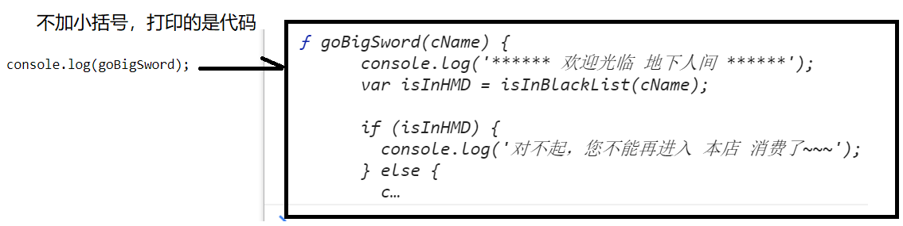

## 函数复习

> 什么是函数：是一种特殊的容器，内部　存放了　**代码**！
>
> 变量　是一个　容器，里面用来　存　单个数据
>
> 数组　是一个　容器，里面　用来　存　多个　数据

### 1.函数声明和调用

+ 函数声明：
  + 函数名 本质 就是一个 变量名
  + 函数命名规则 和 变量 命名规则一样：
    + 字母、数字、\_ 、$
    + 数字不能开头
    + 不能是 js 关键字
  + 函数命名规范：
    + 驼峰命名法
    + 函数命名要有意义
    + 尽量使用 动词

```js
function 函数名(){
    
}
```

+ 函数调用

```js
函数名(); // 调用了函数
函数名; // 没有调用函数
```

+ 注意：

  + 函数名 本质上就是一个变量，里面装了函数代码，如果 直接 打印 函数名，会将 函数中的代码 都打印出来

  

### 2.带参数的函数

+ 声明带 形参 的函数
  + 形参如果有多个，中间 用 逗号 隔开
  + 形参的数量不限

```js
function showLove(toName,fromName){
    console.log(toName + '，i love u ~~~ '+ fromName);
}
```

+ 调用带 参数 的函数
  + 传递实参 的规则：按照 顺序 依次 设置给 不同的 形参变量

```js
showLove('小白','小黑');
```


### 3.带返回值的函数

+ return 关键字 有两大作用
  + 返回一个值
  + 跳出函数体

```js
function test(){
    console.log('1231');
    console.log('1231');
    console.log('1231');
    return; // return 之后的 函数体的代码 ，不会再执行了，js引擎 直接跳出 函数体，执行调用函数后面的代码
    console.log('1231');
    console.log('1231');
}

test();

console.log('函数调用 之后的代码！！！');// 
```


```js
function add(x,y){
    return x + y;
}

var res = add(200 , 201);
```

+ 注意：

  + 调用 带返回值的 函数

  ```js
  function add(x,y){
      return x + y;
  }
  
  var res = add(1,2); // var res = 3;
  var res2 = add; // 将 add 函数代码 "复制" 一份给了res2
  ```
  + 如果 函数内部 没有使用 return关键字，默认返回 undefined

### 4.函数调用函数

```js
function a(){
    console.log('123');
}

function b(){
    a();
}

b();
```

### 5.作用域

+ 作用域：变量可以访问的 范围
  + 全局作用域 - 就是指整个页面
  + 局部作用域 - 就是指函数内部（函数大括号中）

+ 全局变量
  + 在全局作用域下创建的变量（在页面中函数外声明的变量），特点：在整个页面都可以访问到
+ 局部变量
  + 在局部作用域下创建的变量（函数内部 和 函数形参），特点：只能在函数内部访问，函数外无法访问