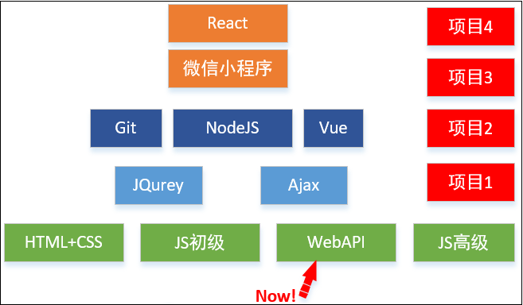
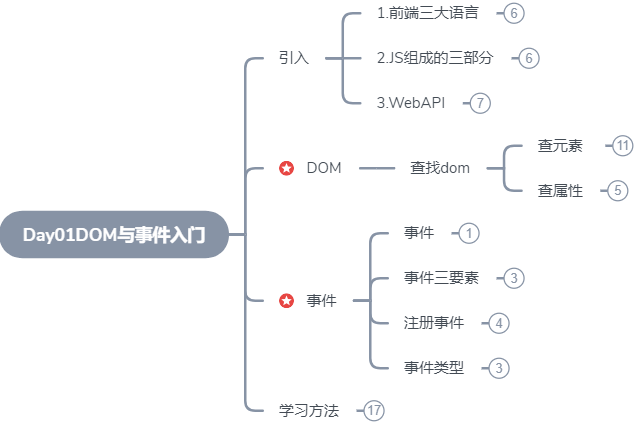
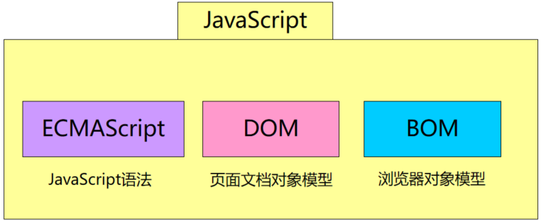
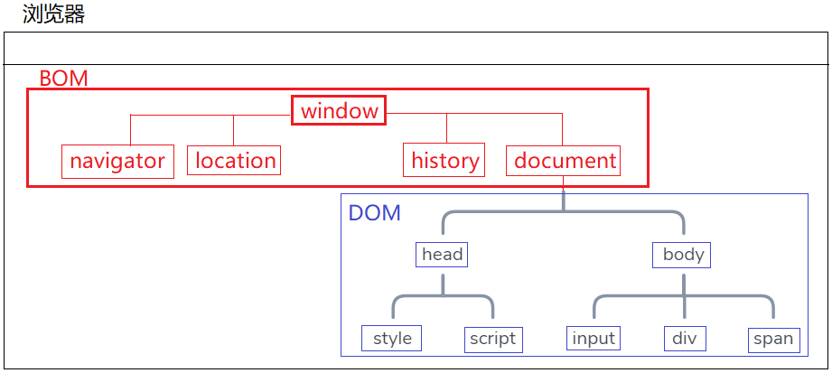

> 第02阶段.前端基本功.前端基础.WebAPI - from：JamesZou

# WebAPI

## 学习路线图

+ 学习路线图



+ **WebAPI** 核心知识

  DOM操作(增删改查)，DOM属性操作，DOM事件，BOM操作、浏览器端数据存储、计时器、 位置与位移、事件参数对象与鼠标位置、拖拽事件、0级和2级DOM事件、事件冒泡

## 今日学习目标



## 一.核心内容

### 0.浏览器三种语言

+ html - 页面结构 和 内容
+ css - 负责美貌
+ javascript - 交互和动作

### 1.JavaScript 组成

+ 回顾



+ JS ：基础语法
+ DOM：操作页面HTML元素与属性
+ BOM：操作浏览器窗口和相关属性

### 2.DOM对象与DOM树

+ window对象

  + 本质：就是浏览器 帮我们 自动创建的 一个 **窗口对象**，里面 包含了 200多个 成员( 属性、方法 )
  + window对象 是 整个窗口的 顶级对象，当前窗口以及打开的页面中所有的 内容 都属于 window对象
  + window对象 就是 我们 之前所熟知的 **全局作用域**

  

+ DOM对象：浏览器内置对象，会为每个 html标签 都 new 一个 dom对象，界面是根据 dom对象生成

+ DOM 将 HTML 文档表达为 **树结构**

  浏览器会根据 HTML代码 在内存中 创建一个 DOM树，方便操作



### 3.获取DOM对象

> 因为  dom 对象 都存放在 dom树中，dom树属于 document对象，所以 要查找 dom 对象，都需要调用 document 中的 一些方法。

#### 3.1 getXXX 方法

+ document.getElementById('id') -- 根据 dom对象的 id属性值 获取 dom对象
+ documnet.getElement**s**ByTagName('div');  -- 根据 dom对象 的 标签名称 获取 dom对象 ，返回一个 类数组
+ document.getElementsByClassName('clss'); -- 根据 标签中的 class 获取 dom对象
+ document.getElementsByName('name'); --      根据 标签中的 name 获取 dom对象

#### 3.2 queryXXX 方法

+ document.querySelector('选择器');   -- 获取 符合 选择器的 第一个 dom 对象
+ document.querySelectorAll('选择器'); -- 获取 符合 选择器的 所有 dom 对象

#### 3.3 返回单个和多个的方法注意

+ 如果 是根据 id　查询，返回的　是　单个 dom 对象，如果没找到 返回 null
+ 如果 是根据 TagName 查询，返回的 是 多个 dom 对象，装入 类数组 返回，如果 没有找到 返回 空数组

### 4.关于 dom对象 属性操作

#### 4.1 三类dom属性 值

+ 字符串：value , id , name ..
+ 函数方法：onclick ...
+ CSSStyleDeclaration：style

#### 4.1 访问对象的属性

```js
var domBtn = document.getElementById('btnLogin');
var strValue = domBtn.value; // 访问对象的 属性值
console.log(strValue);
```

#### 4.2 添加 dom对象 属性

```js
var domBtn = document.getElementById('btnLogin');
domBtn.gender = true; // 为 dom对象添加 不存在的 属性
```

#### 4.3 修改dom对象的属性值

```js
var domBtn = document.getElementById('btnLogin');
domBtn.value = '好感动啊~~~'; // 修改 dom对象的 属性值
```

#### 4.4 删除 dom对象的属性

```js
var domBtn = document.getElementById('btnLogin');
domBtn.gender = true;
delete domBtn.gender; // 删除 属性
```

### 5.针对 样式 属性操作

#### 5.1 style属性

> 每个标签 都有  style 属性 --- 行内样式表

+ style属性 和 dom的其他属性 有很大的不同：style属性值 是一个 CSSStyleDeclaration 对象，其他的要么是字符串，要么是方法

#### 5.2 style属性常用值

+ 常用样式属性：backgroundColor , fontSize , color ....
  + 注意：dom对象的 style 中的 样式属性名 都是 没有 '-' ，据而代之的 是 驼峰命名法
  + 如： 样式表：background-color       - >     style属性中   backgroundColor

+ className ： 对应 html 标签的 class 属性
  + 为什么不用 class 呢？因为 class 是 js 的 关键字，所以 用 className 来代替

```js
var domDiv = document.getElementById('div');
domDiv.style.backgroundColor = '#0094ff'; // 设置 div 的背景色为蓝色 
domDiv.className = 'blueDiv bigDiv'; // 设置 多个 类选择器
```

### 6.DOM事件入门

> 浏览器 解析 html代码 会 创建 对应的 dom对象，每个 dom对象 都包含 若干个 onXXXXX 事件属性

+ 事件：本质上 就是一套 浏览器 和 浏览器用户的 交互 机制。
+ 通俗：当 浏览器用户 做了一些操作时，浏览器 会 相对的执行一些 准备好的代码。

#### 6.1 事件三要素

+ 事件源                   ： dom对象
+ 事件类型(事件名) ：dom对象.onXXXXXX   -- dom对象的 事件属性
+ 事件处理函数        ：匿名函数     ---- dom对象.onclick = function(){ }

```js
var domDiv = document.getElementById('div');
domDiv.onclick=function(){
    alert('谢谢你点我去修改背景色哦~~~~');
}
```

#### 6.2 事件中的this

+ 事件处理函数中的 **this** 就是 **事件源本身**

> 思考：方法函数中的 this 是谁？-->  调用时谁 . 出 这个方法，方法里的 this 就是谁

```js
var domDiv = document.getElementById('div');
domDiv.onclick = function(){
    alert(this);
};
```

+ 事件触发时，浏览器的 JS引擎 相当于 会 执行这句话：

  **document.getElementById('div').onclick( );**

  所以，由于 onclick() 是通过 dom对象 **.** 出来的，方法中的 this 就是 这个 dom 对象本身。